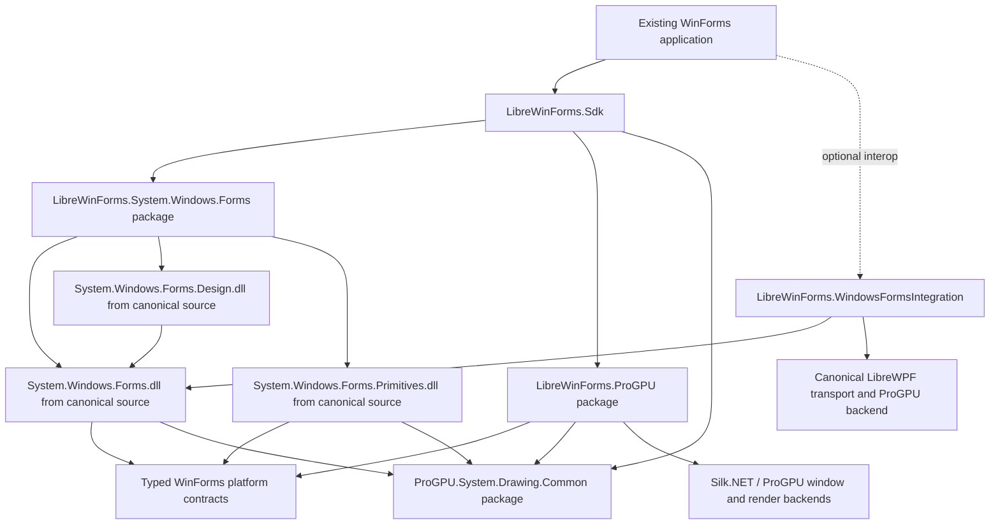

# Source-First Cross-Platform LibreWinForms Plan

## Decision

`src/LibreWinForms.Portable` has been removed after its consumers, tests, and useful typed host contracts moved to the source-first runtime. It must not return as a second WinForms-shaped object model.

The portable product must be built from the canonical WinForms sources already present in this repository:

- `src/System.Windows.Forms` produces the runtime assembly `System.Windows.Forms`;
- `src/System.Windows.Forms.Primitives` produces `System.Windows.Forms.Primitives`;
- the supporting Accessibility and private Windows assemblies are built from their canonical projects where they remain necessary;
- ProGPU's `System.Drawing.*` implementation supplies the portable drawing API and implementation;
- a new typed `LibreWinForms.ProGPU` backend supplies non-Windows windowing, input, composition, and local-OS services;
- `LibreWinForms.*` remains the public package branding, while framework assembly and namespace identities remain compatible with .NET WinForms.

This is the LibreWPF model applied to WinForms: modify the real managed framework implementation at explicit platform seams and package those assemblies. Do not grow a second WinForms-shaped object model.

The deletion was a cutover result, not the first migration step. The historical checkpoints below document how the canonical graph reached that gate.

## Current source-first status: 2026-09-01

The production SDK now uses source-built `System.Windows.Forms` and `System.Windows.Forms.Design`, ProGPU `System.Drawing.*`, the typed `LibreWinForms.ProGPU` backend, and source-built canonical `WindowsFormsIntegration`. The retired Portable runtime, package, tests, and SDK selection path are absent and checked by the migration ledger. Normal development can consume the coordinated NuGet closure; repository development can select the exact ProGPU submodule with project references.

The coordinated ProGPU source pin now includes arbitrary EMF/WMF bitmap-pattern ROP3, exact GPU-only presentation into non-bindable raw swapchain views, and the specification-correct source-less WMF failure rule. Ordinary consumers still resolve the immutable NuGet closure; only explicit source-development mode follows the submodule. Local qualification covers the full System.Drawing Debug/Release suite, ProGPU and headless Release lanes, ApiCompat, release documentation, and the complete 102-case System.Drawing ShortRun distribution. Hosted Linux, macOS, and Windows CI remains the cross-platform authority for the pushed ProGPU #140 and LibreWinForms #27 heads.

The latest real-consumer qualification uses LibreWinForms `c956e43a45514aff8c96a00d372b2395828e3211`, ProGPU `d2e603f35986f2b131b2dc20913be38480bffd07`, and LibreWPF `4f94820b789b4d786aaf9042688672e6e15371a0`. SharpDevelop's complete Search and Replace smoke succeeds in both modes, verifies shortcuts, observes one identical live owner handle through WPF and WinForms, closes the UI, and exits cleanly. The work repaired five reusable platform boundaries rather than adding compatibility members:

1. WPF publishes typed portable window ownership before root attachment and startup callbacks, and a stopped nested dispatcher frame no longer drains lower-priority work.
2. Portable check and radio buttons retain canonical managed state without `BM_SETCHECK`.
3. portable control-style changes use the existing typed `WindowStyle` abstraction rather than direct USER32 access.
4. transparent child backgrounds compose through managed parent painting instead of HDC translation.
5. classic buttons, checks, radio buttons, menu/caption glyphs, and scroll arrows render through managed ProGPU `Graphics` rather than native `DrawFrameControl`.

The ProGPU-backed canonical build has 0 errors at the reviewed 608-warning baseline. The focused SharpDevelop regressions pass 3/3. Follow-on LibreWinForms commit `d2ac2d27255f8c8db79b9e73c70b3c2fe0daaa06` removes the remaining HDC/native `DrawFrameControl` call from flat checked-box painting, reuses the managed ProGPU menu-check renderer, and avoids an unused brush allocation; its focused pixel contract passes 1/1. Renderer checkpoint `a039e7f2900609f2cc1e98aee94c9cbe544aa125` removes the next common HDC dependencies from tiled control backgrounds and simple or per-side borders. Its two focused contracts pass 2/2. Typed-screen-feedback checkpoint `19c0b29cfc9c0b6053b31279fbf69dbd342b3e65` removes portable desktop-HDC access from reversible frames, lines, and filled rectangles and raises the complete canonical lifecycle suite to 119/119. ProGPU overlay checkpoint `502b76a43f9557acfcbce6f3de507e247b9db0b1` implements that typed capability with retained compositor visuals across the live Silk window inventory. Direct-consumer checkpoint `a46b43fe6ebc436f893ae85b0be537506533c9e6` routes `SplitContainer`, legacy `Splitter`, and `DataGridView` resize feedback through the same screen overlay, and makes canonical rectangle client/screen conversion managed on portable builds. Coordinate checkpoint `da74f79e266c53c6ee23603600b8ac8bf35b9c39` removes generic control-to-control, PropertyGrid accessibility, top-level accessibility-bound, and default-button cursor conversion from portable USER32 paths. Pointer-hit checkpoint `4a76d90045169599ad54f9c7898b3ce079ccd6c4` removes stock-control mouse-up dependence on `WindowFromPoint`. Child-hit checkpoint `67f32b6201ab3525e6bbe0d6677a640bb58bc27c` implements public `Control.GetChildAtPoint` over the logical tree. Typed-adorner checkpoint `5f18e9f9d` adds independently replaceable retained ProGPU layers, and canonical checkpoint `64de5ffb7` renders `ErrorProvider` icons through that service without native child windows, USER32 icon metrics, or UIAutomationCore probing. Popup checkpoint `41cd7c03f` adds independent, undecorated, topmost, input-transparent retained ProGPU surfaces, and canonical checkpoint `69d37a992` routes the explicit `ToolTip.Show`/`Hide` overloads, `Popup`, `Draw`, duration timer, and active-state teardown through them. Automatic-hover checkpoint `82a4db6f9` then uses canonical control mouse events and typed initial/auto-pop timers to drive the same retained popup without native tooltip subclassing. Keyboard checkpoint `5f7ff4ce4` reconnects the upstream focus state machine and optimal placement to the retained popup, using managed control rectangles instead of lazily creating a COMCTL32 ToolTip handle. ErrorProvider checkpoint `a1a778a05` adds retained-icon hover hit testing and independent typed initial/auto-pop state, preserving blink suppression while canonical ToolTip renders the text and cleaning every layer on error removal. Teardown checkpoint `4e9492164` removes live popup, timer, and adorner state before the typed owner handle is released; the regression closes both an automatic ToolTip owner and an ErrorProvider owner and observes zero remaining typed handles. Recreation checkpoint `7383bd753` binds ToolTip presentation to the exact owner form, closes the old session before handle release, and rebuilds retained ErrorProvider icons on each new typed owner. The complete lifecycle suite is now 130/130. Remaining work is qualification and hardening—hosted OS matrices, overlapping-control input coverage, external-desktop adapters, RTL/DPI and visual fidelity baselines, performance gates, and release/package provenance—not restoration of the deleted compatibility runtime.

### Managed tiled-background and border checkpoint

Canonical `ControlPaint.DrawBackgroundImage` retains upstream texture-brush tiling on every platform, but the portable branch no longer performs the Win32-only `GetHdc`/`ReleaseHdc` viewport-origin repair after the managed fill. Native Windows keeps that repair unchanged. Canonical control painting now proves that a four-color tile repeats across the target through ProGPU without acquiring an HDC.

Portable `ControlPaint.DrawBorderSimple` and the general per-side `DrawBorder` overload now use managed ProGPU `Graphics` pens for solid, dotted, dashed, inset, and outset paths. The native branch retains its GDI pen and endpoint behavior. Portable non-`Graphics` device contexts fail explicitly instead of falling through to a native handle. Pixel evidence covers the public simple solid border, four independently colored solid sides, and mixed inset/outset sides, including ProGPU's centered-stroke edge coverage.

The exact ProGPU-backed source build completes with 0 errors. This scratch restore emitted 609 existing warnings rather than the reviewed exact-head 608-warning baseline; no new diagnostic points to the renderer change, so hosted CI remains the authority for the exact warning count. The focused renderer contracts pass 2/2 and the complete canonical lifecycle gate passes 118/118. Hosted Linux/macOS/Windows and immutable-package qualification are pending until the checkpoint can be pushed.

### Typed reversible-screen-feedback checkpoint

Canonical `ControlPaint.DrawReversibleFrame`, `DrawReversibleLine`, and `FillReversibleRectangle` are used by PropertyGrid splitter feedback, DataGridView resize/insertion feedback, and designers. Their portable branches no longer acquire the Win32 desktop DC or issue XOR GDI operations. They send screen-space geometry, a typed exact ARGB value, and frame style through `ILibreReversibleDrawingService`; `LibrePlatformServices` obtains that optional capability from the registered paint backend. Native Windows keeps the original raster-operation implementation unchanged.

The contract intentionally describes repeated-operation removal without prescribing XOR. A compositor can retain one topmost overlay and toggle an identical request without reading back the framebuffer. Hosts without that capability receive `UnsupportedLibreReversibleDrawingService` and fail with a specific `PlatformNotSupportedException`, rather than reaching USER32/GDI from Linux or macOS.

ProGPU checkpoint `502b76a43f9557acfcbce6f3de507e247b9db0b1` implements the typed service. `SilkWindowService` owns a strongly typed live-window inventory and an ordered store of exact frame, line, and fill records. Repeating the same kind, geometry, ARGB value, and style removes that record. Each window owns a separate retained topmost `DrawingVisual` above canonical retained layers and transient `CreateGraphics` commands; updates cross the owning dispatcher, translate screen geometry into that window's coordinates, clip to its surface, and rebuild after window movement, resizing, or presentation-scale changes. Dark backgrounds select light feedback and light backgrounds select dark feedback; filled feedback uses a managed 50-percent hatch. No framebuffer readback, native HDC, registry enumeration, reflection, or fake WinForms-shaped object is involved.

Direct-consumer checkpoint `a46b43fe6ebc436f893ae85b0be537506533c9e6` removes the remaining portable halftone-brush/`PatBlt` resize paths from canonical `SplitContainer`, legacy `Splitter`, and `DataGridView`. Those controls convert their client geometry to screen coordinates and call the same public `ControlPaint.FillReversibleRectangle` contract, so two identical draw calls retain the WinForms toggle behavior. Portable `Control.RectangleToScreen` and `RectangleToClient` now share the already-managed point conversion instead of calling `MapWindowPoints`; nested scrolling and rectangle-size preservation are covered by the lifecycle gate. The upstream USER32/GDI branches remain byte-for-byte isolated under the native build.

Coordinate checkpoint `da74f79e266c53c6ee23603600b8ac8bf35b9c39` then routes canonical `WindowsFormsUtils.TranslatePoint` through those managed point methods on portable builds. This covers composite controls such as `NumericUpDown`, PropertyGrid child routing, and ToolStrip ownership without creating fake child HWNDs. PropertyGrid accessibility hit testing and grid-entry bounds, top-level accessibility client bounds, and the form default-button cursor target use the same canonical conversions instead of direct `ScreenToClient`, `ClientToScreen`, or `MapWindowPoints` calls. A typed pointer test enters the real `NumericUpDown` edit child and proves that its parent receives the exact translated mouse location without loading USER32.

Pointer-hit checkpoint `4a76d90045169599ad54f9c7898b3ce079ccd6c4` centralizes the canonical “pointer is still directly over this control” decision. Native Windows retains `WindowFromPoint`; portable builds convert the client point through the managed top-level coordinate path and use the same logical-control hit test that dispatched the typed input. `Button`, `CheckBox`, `RadioButton`, `TextBoxBase`, `ListBox`, and both `UpDownBase` children no longer load USER32 while completing mouse-up behavior. Focused contracts prove exact single-click delivery for the real `NumericUpDown` edit child and representative button, check-box, radio-button, and text-box controls, including checked-state changes.

Child-hit checkpoint `67f32b6201ab3525e6bbe0d6677a640bb58bc27c` gives the unchanged public `Control.GetChildAtPoint` API a managed portable implementation. It walks direct logical children in canonical z-order, applies the original `Invisible`, `Disabled`, and `Transparent` skip flags, and retains the upstream side effect of creating the queried parent handle. Windows continues to call `ChildWindowFromPointEx`. The focused gate covers overlapping front/back children and every skip category without synthesizing HWND-shaped objects.

This compositor implementation deliberately covers the application's own Silk top-level windows. It cannot invert pixels belonging to another process or an external native owner because those surfaces are outside the ProGPU scene. Cross-application drag outlines or external-desktop feedback therefore remain an explicit local-OS overlay-adapter capability rather than an overclaimed compositor feature.

The platform contract compiles with 0 warnings and 0 errors. A dependency-reusing portable Forms compile with analyzers disabled completes with 607 existing compiler warnings and 0 errors. Exact analyzer-count and hosted OS authority remain CI work because the full analyzer rebuild became resource-starved in the restricted ARM scratch environment after the platform assembly completed. A scratch native-branch compile could not be qualified because its restored graph contains the ProGPU drawing references rather than the repository Windows `System.Drawing.Common`; hosted CI remains authoritative for that build. The exact request-transport contract passes 1/1 and the complete canonical lifecycle suite passes 123/123.

The ProGPU completion has a clean analyzer-enabled .NET 10 source-graph build at 0 warnings and 0 errors. Three focused tests prove exact toggle removal, distinct operation identity, and preservation of the reversible visual above transient graphics. The complete ProGPU adapter suite passes 49 tests with only the two pre-existing real-AppKit and real-Wayland environment cases skipped, and the complete canonical lifecycle suite now passes 123/123 after the child-hit checkpoint. The exact ProGPU `System.Drawing.Common` API gate remains at 0 missing types, 0 missing members, and 13 reviewed non-breaking shape diagnostics. This checkpoint makes no zero-allocation claim: toggles intentionally snapshot the small live-window and active-operation sets, and a drag/resize frame-time benchmark should establish the optimization baseline after hosted visual behavior is qualified. Hosted Linux/macOS/Windows presentation evidence and visual baselines remain pending until this scratch checkpoint can reach GitHub; the restricted environment currently cannot resolve `github.com`.

### Current ErrorProvider adorner and ToolTip popup cutover

Portable `ErrorProvider.ErrorWindow` no longer creates its native child window for icon presentation. Canonical `ToolTip` and ErrorProvider tooltip text still have a related but distinct requirement: content can extend beyond the owner window, must not activate, follows owner placement and DPI, supports automatic and explicit timing, and preserves `Popup`/`Draw` event semantics.

The cutover deliberately uses two narrow contracts:

1. The implemented `ILibreAdornerService` is keyed by a typed owner handle and opaque `LibreAdornerId`. It returns a normal ProGPU-backed `System.Drawing.Graphics` recorder; disposal atomically replaces one retained drawing and `Remove` is idempotent. ProGPU places its adorner root above canonical and transient control layers and below reversible screen feedback. `ErrorProvider` keeps its canonical item collection, alignment, padding, blink phases, timer, and icon drawing while the portable branch computes managed owner coordinates and commits the icon recording. Native Windows keeps the original HWND, region, tooltip-child, HDC, and accessibility notification branches.
2. The implemented `ILibrePopupSurfaceService` carries typed owner, screen-space bounds, DPI scale, input transparency, explicit dismissal policy, and an opaque popup identity. ProGPU creates an undecorated topmost Silk popup, marks it as a backend popup, applies GLFW 3.4 mouse pass-through, and records content through the same retained adorner path without activating the window. Canonical explicit `ToolTip.Show`/`Hide` keeps measurement, title/icon policy, work-area placement, `Popup` cancellation and size override, owner-draw `Draw`, duration timers, owner deactivation, and `Active` teardown. Automatic canonical ToolTips hook the real control mouse events and use the typed Forms timer for `InitialDelay` and `AutoPopDelay`; clearing the extender property or losing hover removes the timer, popup, and hooks. Keyboard ToolTips retain the upstream focus state machine, initial/reshow/auto-pop timers, neighboring-control placement, and RTL ordering while portable control and top-container rectangles come from managed coordinate conversion. Native Windows keeps its common-control path unchanged.
3. Share popup placement, work-area constraining, owner movement/DPI refresh, dispatcher affinity, and teardown between `ToolTip`, combo/list dropdowns, context menus, and future ErrorProvider tooltip text. Do not share their managed state machines or replace them with a generic WinForms-shaped popup object.
4. Use explicit unsupported defaults. An unavailable adorner or popup host must throw a capability-specific `PlatformNotSupportedException` at the operation boundary; it must not fall back to USER32, silently suppress the error icon, fabricate HWND values, or discover a backend through reflection.
5. Current headless evidence proves ErrorProvider add/update/remove, alignment/padding changes, stable logical identity, owner selection, retained drawing commands, and no native DLL load. It also proves explicit ToolTip coordinates, `Popup` sizing, owner-draw commands, nonactivation, input transparency, typed duration dismissal, idempotent hide, and `Active` teardown. The automatic-hover case proves canonical pointer dispatch, initial-delay timing, retained default ProGPU drawing, auto-pop timer replacement, and extender-property cleanup. The keyboard case proves real Tab focus, upstream initial/auto-pop state, non-overlapping optimal placement, retained drawing, and absence of the former COMCTL32 handle creation. ErrorProvider hover coverage proves visible-icon hit testing, initial/auto-pop timing, `ToolTipShown` blink suppression, retained text rendering, and immediate popup/timer/adorner cleanup when the error is removed. Owner teardown closes live automatic and ErrorProvider popups before typed-handle release and leaves zero popups, adorners, timers, or handles. Repeated owner recreation closes each old popup and rebinds ErrorProvider drawing and later ToolTip/ErrorProvider hover to the replacement handles. Platform coverage passes 52/52, the ProGPU adapter passes 52 cases with two existing real-OS environment skips, and canonical lifecycle passes 130/130. Remaining headless gates include ErrorProvider blink-phase timing, overlapping-child hit routing, owner move/resize and accessibility bounds; ToolTip title/icon pixels, RTL, and reshow delay. Hosted Windows, macOS, X11, and Wayland lanes must then prove real presentation, work-area edge placement, DPI transitions, pointer pass-through, and popup dismissal. ProGPU visual baselines must cover default icon alpha, text/background/border, RTL, and 1x/2x output; frame-time and warmed-allocation gates cover blink and hover steady state.

Retained ErrorProvider icons and hover text, the non-activating popup service, and explicit, automatic-hover, and keyboard ToolTip presentation are implemented. The immediate state-machine cutover, headless owner teardown, and repeated handle recreation are complete. The next bounded work is qualification: overlapping-child pointer routing, owner move/DPI behavior, RTL and pixel baselines, and warmed hover/blink performance.

## 2026-08-22 implementation checkpoint

The repository now has a shadow source-first build graph rather than only a design proposal:

- `external/ProGPU` is a real submodule pinned to a reviewed ProGPU source revision for this migration;
- `LibreWinFormsReferenceMode=Project` selects source projects for coordinated work, while the default package mode remains available for ordinary development;
- `LibreWinFormsUseProGpuSystemDrawing=true` builds the canonical `System.Windows.Forms.Primitives` and `System.Windows.Forms` projects against ProGPU's `System.Drawing.Common`, backend, scene, vector, and text projects;
- the opt-in restore graph excludes the repository's Microsoft drawing project, compiler resolution removes any stale Microsoft drawing reference, and the project-mode output gate copies the current submodule binary then rejects either a non-ProGPU strong-name token or a stale hash;
- the canonical sources use public `IDeviceContext`/`Graphics` APIs or explicit typed portable seams instead of private implementation probes;
- `packaging/LibreWinForms.System.Windows.Forms` now packs canonical implementation and reference assemblies under the existing package brand, declares ProGPU drawing as a dependency rather than embedding it, and is consumed from a fresh isolated NuGet cache by an ordinary `Form` subclass with warnings treated as errors;
- the ProGPU-backed build no longer inherits the upstream Windows-only assembly annotation, while the default Windows build retains it; and
- CI has a source-first shadow lane, and `eng/librewinforms-source-first.sh` keeps the canonical, ProGPU API/quality, and legacy comparison lanes visible together. The same lane packs, inspects, consumes, and uploads the canonical shadow package.

### Exact package-mode checkpoint

Checkpoint `f861b756c19306b92343cbbcfef02ae379b4ae2c` pins ProGPU commit `2806e8bb0ad107cd1190c7de357a2c9338dcca11` and makes the installed source-first SDK usable without project references. ProGPU now exposes an exact `drawing-runtime` pack group containing the ten packages required by `ProGPU.System.Drawing.Common`; every internal dependency must use the same source-first version, and the verifier rejects an incomplete or skewed closure. This is intentionally separate from the ordinary public-preview NuGet lane until the published ProGPU drawing package matches the pinned source's API and `10.0.0.0` assembly identity.

`LibreWinForms.System.Windows.Forms` packages the canonical `System.Windows.Forms`, primitives, core, Accessibility, platform, and GDI+ implementation/reference assets. `LibreWinForms.ProGPU` packages the typed platform backend as its own `LibreWinForms.*` product and declares, rather than embeds, the canonical runtime and exact ProGPU drawing closure. The SDK selects both packages by default in NuGet/package mode. Compatibility is explicit through `LibreWinFormsUseCanonicalRuntime=false` and the transitional `LibreWinForms.Compatibility.System.Windows.Forms` package.

The source-first package gate now uses an empty NuGet cache to prove all of the following in one run:

- the ten-package ProGPU closure is complete and internally version-aligned;
- canonical and backend packages contain matching `lib` and `ref` assets and no embedded dependency assemblies;
- `System.Private.Windows.GdiPlus` is present as a canonical support assembly;
- the resolved dependency manifest contains only the source-first canonical/backend/drawing versions and drawing assembly identity `10.0.0.0`;
- restored drawing and backend payload hashes match the packages built from the pinned submodule; and
- freshly installed SDK consumers build and run in both project and package modes with the typed `ProGpuPlatform.Register()` bootstrap.

This closes the reproducible package-graph prerequisite for cutover. It does not yet close the deletion gate: the default SDK and release workflow must select the canonical packages, real visible `Application.Run(new Form())` smokes must pass on Windows, Linux, and macOS, SharpDevelop must pass against that same package graph, and the remaining Portable package/host consumers must be removed or migrated before deleting `src/LibreWinForms.Portable`.

### First visible canonical package checkpoint

`packaging/LibreWinForms.Sdk.SourceFirstVisibleSmoke` is an unchanged-shape SDK consumer that creates a normal `Form` and `Button`, enters `Application.Run`, requires a real shown and painted lifecycle, closes through the dispatcher, and has a bounded watchdog. `eng/librewinforms-source-first-visible-smoke.sh` restores it from a fresh cache using only the downloaded source-first package closure; Linux uses Xvfb while macOS and Windows use their hosted desktop session. The CI matrix depends on the canonical package-producing job, so every OS consumes the exact same artifact rather than rebuilding a different graph.

The initial local Linux run found and fixed three genuine canonical cutover blockers: portable UI cues still sent USER32 messages, classic button colors performed Win32 nearest-palette conversion, and portable visual styles did not obtain the ProGPU recorder from `PaintEventArgs`. The repaired portable branches are managed and typed, while the native Windows branches remain unchanged. Canonical lifecycle coverage is 69/69, including hidden/show keyboard and focus cues plus themed button painting, and the isolated Xvfb package consumer now shows, paints, and closes successfully. Hosted Ubuntu/macOS/Windows results remain a deletion prerequisite, not an assumed parity claim.

The verified source checkpoint `e181da7e32123d85807b32c93793a9b2b0dfcc31` pins ProGPU commit `bd1c836d04af5613c50f3d4dc846aabb38ff1574`, which extends the exact latest-main merge `142b1af7ca339e17cc0bf5dbee9fc2c20eacd6ef` with cross-font visible format-control representatives, mnemonic decoration, whole-line `LineLimit`, and slash-aware `EllipsisPath` behavior. The merge has exact parents `02096ecf9c99ba09d678dd7da3ad2bb6bc3457ac` (the advanced formatted-text source slice) and `ad05be151a8e844ccf0abe496a12b29124568e6b` (the current ProGPU `main`, versioned `0.1.0-preview.57`); every one of the 23 files brought in from that `main` advance was blob-hash verified against GitHub. Exact hosted validation passes the platform contracts (20/20), ProGPU host contracts (8/8), canonical lifecycle/retained-paint/input plus owned/nested-modal, multi-monitor, logical presentation-scale, and per-monitor-V2 DPI integration (7/7), and the complete ProGPU drawing quality suite (150/150). The hosted Linux lane provisions Mesa's software Vulkan adapter because those quality cases execute the production typed WebGPU recording/readback path. The canonical ProGPU-backed build remains at its reviewed 613-warning/zero-error baseline. Both the ordinary package-mode lane and the canonical source-first package/fresh-cache consumer lane pass. The canonical hosted package contains implementation/reference assets, declares `ProGPU.System.Drawing.Common` as a normal dependency, and does not embed ProGPU assemblies; the packed `System.Windows.Forms.dll` SHA-256 is `1ffde29684867c56440ca8c15a2a67a7e186184a65a44bbed86e09310f68e5ee`, the packed `LibreWinForms.Platform.dll` SHA-256 is `fe9e9f9c7d245d6628d855c72a4213dad35098b9d0d79cdeca6389af2c2f1c03`, and uploaded `canonical-source-first-package` artifact `9560747151` has SHA-256 digest `7882603226617485acf6bf43a8f38666f452b6a982ab45d696b431f65e3abc04`.

The current `CreateGraphics` source checkpoint `b9235eec56bf1a17b8d30e217f59c04e56ea9f76` pins ProGPU commit `4c958e64638d717417ce14e86ecbfc84786306c5`. Canonical portable `Control.CreateGraphics()` no longer calls `Graphics.FromHwnd`: it computes the control origin and ancestor-intersected client clip, then requests a normal `System.Drawing.Graphics` recorder through the typed paint service. A window recorder owns an isolated ProGPU `DrawingContext`, carries the target `WgpuContext` explicitly instead of relying on ambient thread state, and commits its retained commands exactly once when disposed. Worker-thread creation does not synchronously marshal to the UI thread; completion posts the finished command list for presentation. Presentation of those transient commands does not raise `OnPaint`, while the next ordinary invalidation clears and rebuilds the retained control tree, matching WinForms' nonpersistent `CreateGraphics` contract. Unparented logical controls receive a detached recorder for measurement and nonvisible drawing rather than a fake window object. Exact hosted workflow `32846039585` passes platform 20/20, ProGPU host 9/9, canonical lifecycle 8/8, ProGPU drawing 151/151, the unchanged 421-diagnostic API baseline with no breaking changes, the 613-warning/zero-error canonical ProGPU build, the 30-warning/zero-error source-project legacy comparison build, the ordinary package lane, and canonical pack/fresh-cache consumption. The hosted packed `System.Windows.Forms.dll` SHA-256 is `ea7d84f23b17b7a5774fb271a0c02bfb16d8d40be559402564e497444f2a0fc0`, the packed `LibreWinForms.Platform.dll` SHA-256 is `f772b8f59567ca2742240b2dda07a5aeb699655c23657aacba554b9f2cacafe6`, and canonical package artifact `9562683351` has SHA-256 digest `ceba0c0f602d5d41ee92fe0b7a368c4a6d3c935a02134b5d09a4192a6746182d`. ProGPU exact-head job `97794466158` passes the same 421-diagnostic gate, all 151 drawing tests, allocation gates, and benchmark capture; evidence artifact `9562334850` has SHA-256 digest `36bfe80243a65ecd1f8b97973b4244124917e7031863b529039a31aef7add557`.

Exact synchronous-presentation source checkpoint `8728faed9d712edf466d710d3b7b7499acca5145` makes the existing portable `Control.Update()` route behaviorally meaningful. `ILibrePaintService.Present` and `ILibreWindow.PresentPendingPaint` now state that already-pending paint is processed on the owning dispatcher before returning and that a clean window is not implicitly invalidated. The ProGPU backend uses synchronous dispatcher marshaling when required and calls Silk.NET rendering immediately, with three bounded attempts for transient surface loss or timeout while preserving a queued retry if the surface remains unavailable. Ordinary `Invalidate` remains asynchronous and coalesced. The canonical headless gate proves that form and child paint callbacks finish before `Update()` returns and that a second clean `Update()` does not repaint; a direct ProGPU host case proves worker-thread completion on the dispatcher. Exact hosted workflow `32849867345` passes the default canonical build at zero warnings/errors, the ProGPU canonical build at 613 warnings/zero errors, platform 20/20, backend 10/10, lifecycle 8/8, drawing 151/151, the unchanged 421-diagnostic API gate with no breaking changes, the frozen comparison build at 30 warnings/zero errors, the ordinary package lane, and canonical pack/fresh-cache consumption. The hosted packed `System.Windows.Forms.dll` SHA-256 is `2d6f1fd654b4b8326c0a6c47c749e5d05189bfcbe5d06a1a7f093764b80105cc`, the packed `LibreWinForms.Platform.dll` SHA-256 is `ca9f7ab36b941fe5e52ad720b1504ac8e5326d338480bdbe115cd024347259a4`, and canonical package artifact `9564165940` has SHA-256 digest `541e09a24d71df943b8aa970b5d565072d9746a519d8e0935d4750d239d88ca2`.

Retained-control-layer source checkpoint `73f4716a80ba5bc6cc99bce9ae75c84b62d9f996` replaces the single flat ProGPU paint recording with a typed `ILibreRetainedPaintFrame` contract and a stable `DrawingVisual` per live canonical WinForms handle. Canonical `Control` still owns visible-tree traversal, back-to-front z-order, ancestor clipping, and real background/foreground `OnPaint` calls. Each frame reports every visible layer's window-space bounds and clip; ProGPU reuses clean recordings, replaces only control layers intersecting the coalesced dirty rectangle, updates visual geometry without repainting clean siblings, and removes layers omitted from the current tree. A separate topmost transient visual retains `Control.CreateGraphics()` output and is cleared by the next canonical invalidation. Flat paint-frame implementations retain the prior complete-tree fallback. The headless integration gate now proves an initial form/two-child paint creates three layers, then a dirty-child update re-records only the form and that child while the distant sibling receives no `OnPaint`; existing exact translated-command assertions pass after layer flattening. The exact local source-first gate passes default canonical 0/0, ProGPU canonical 613 warnings/0 errors, platform 20/20, backend 10/10, lifecycle 9/9, drawing 151/151, the unchanged 421-diagnostic API baseline with no breaks, and the frozen 30-warning/0-error comparison lane. This is control-layer-granular retention; command- or pixel-granular patching inside one large custom control remains a later optimization and is not claimed by this checkpoint. Exact hosted workflow `32855510276` passes both the canonical source/submodule job `97826380616` and normal package job `97826380769`; hosted counts are platform 20/20, backend 10/10, lifecycle 9/9, drawing 151/151, and the unchanged 421-diagnostic API baseline with no breaks. Packed `System.Windows.Forms.dll` SHA-256 is `ff2112513d2be9caf0e798e6584a28f643f9a3e523916c832d5f6d71334b6f8d`; packed `LibreWinForms.Platform.dll` SHA-256 is `10a59cdbedd6c628e317869f96371a97586724cf8cd2ccdd4ef9e7d6f124f0bf`. Canonical package artifact `9566372153` has SHA-256 digest `e753b80e223be0c8f8bcdec2e828e5b1624c88fe700eba0f5ab79acc11eb538e`; exact-head docs workflow `32855510261` passes with artifact `9565988585` digest `961791b1b1eda7c7c5532d02b0bd26c92dec1c3ca92efa803bc20b5d835107fd`.

Typed-window-icon checkpoint `f32db1b602e75b9af93200742ab322d39e89db28` removes the portable no-op from canonical `Form.UpdateWindowIcon`. `LibreWindowIcon` is an immutable, validated, tightly packed RGBA8 snapshot, and `ILibreWindow.SetIcons` defines explicit synchronous consumption and empty-list reset semantics without exposing `HICON`, ProGPU, or Silk.NET types. Canonical `Form` preserves the upstream `Icon`, `ShowIcon`, fixed-dialog default-icon, handle-creation, and DPI-update decisions; it converts ProGPU `Icon` bitmaps from BGRA to RGBA, supplies both the original and DPI-scaled small image, and avoids the upstream USER32 style refresh when `ShowIcon` is cleared on a portable window. The Silk.NET backend copies the snapshots into `RawImage` buffers and calls its native multi-icon API. Platform tests prove dimension/length validation and immutable ownership. The headless canonical lifecycle case proves icon delivery during handle creation, exact RGBA channel order, clear on `ShowIcon=false`, restore on `ShowIcon=true`, and absence of a USER32 call. Exact hosted workflow `32862333418` passes both jobs with platform 22/22, backend 10/10, lifecycle 10/10, drawing 151/151, source-first package validation, and fresh-cache consumption. Packed `System.Windows.Forms.dll` SHA-256 is `8fe4168813af4d08471ffbf863216da26c808653b297477c422fd8a70aacf72d`; packed `LibreWinForms.Platform.dll` SHA-256 is `6b876251c9862eba7cbbb72fdb444a40d19e37069ae1611b93b7fc38aa81fac6`. Canonical package artifact `9569081563` has SHA-256 digest `be1d314a94ec76629fb6758015850a78aab56efffde1cb47e8ab25504309a72a`; exact-head docs artifact `9568666282` has digest `f166ab271526b7ab0ad1095499a658f278674cb0f6aab593e5872610c533a773`. This closes top-level `Form.Icon` transport; tray icons, cursors, and other native icon consumers remain separate seams.

Typed-window-title checkpoint `0912c8419e7f7601a54827bc4a8999de6bbaa53c` makes live canonical `Form.Text` updates reach the platform after handle creation. `ILibreWindow.Title` carries only a non-null managed string; Silk.NET maps it directly to `IWindow.Title`, while `NativeWindow` keeps the operation limited to a real top-level portable window so logical child-control text does not overwrite the caption. Canonical `Control.WindowText` retains the upstream managed text cache and sends changed top-level values through the typed contract. Canonical `Form.WindowText` preserves the native Windows style-refresh branch but skips that USER32-dependent caption-style update in portable builds, where the platform window already owns caption rendering. The headless lifecycle case proves initial title creation plus live nonempty, empty, and restored values; the empty/nonempty transitions would fail on Linux if they still entered USER32. Exact hosted workflow `32865091504` passes platform 22/22, backend 10/10, lifecycle 11/11, drawing 151/151, both package lanes, and fresh-cache consumption with the unchanged 421-diagnostic API baseline. Packed `System.Windows.Forms.dll` SHA-256 is `c48d529b789f6e86d8c0b709374e372e8b968c6c8fe937780a8a09f088a0df90`; packed `LibreWinForms.Platform.dll` SHA-256 is `760bfb8a88a6a4dde132c391bf2c166237ffc2a39aa0a928a6d8f7d2e776c31b`. Canonical artifact `9570160526` has digest `6a5682ddedeb1660f931b7e55588d07a938c582731e661f5bce5f3a2c93eb0a0`; exact-head docs artifact `9569744391` has digest `4c17478981543c810b83c8457702532d67a3f43e72296f86526ba3d1c230f138`. This reuses the complete canonical `Text` property rather than adding another compatibility declaration.

Typed-window-state checkpoint `b764e53e066866948447210403a8caa0eb08aae2` connects the complete canonical `Form.WindowState` property to the existing backend-neutral `LibreWindowState` model in both directions. `LibreWindowCreateOptions.InitialState` carries pre-handle minimized or maximized state into Silk.NET `WindowOptions`, including hidden windows; later canonical changes assign `ILibreWindow.State` without calling USER32 `ShowWindow`. Silk.NET's typed `StateChanged` event reports user- or platform-driven minimize, maximize, restore, or fullscreen transitions through `ILibreWindowEvents`. Canonical `Form` updates its existing managed state and size-lock/layout-suspension bookkeeping directly rather than polling `WINDOWPLACEMENT`; backend fullscreen maps to `FormWindowState.Maximized` because WinForms exposes no fullscreen enum value. The Windows branches remain unchanged. Exact hosted workflow `32868838664` passes platform 22/22, backend 10/10, lifecycle 12/12, drawing 151/151, the unchanged 421-diagnostic API baseline with no breaks, both package lanes, and fresh-cache consumption. Packed `System.Windows.Forms.dll` SHA-256 is `c06a3b485c447a5a642f8d570160bf5a212e9bfbf54a3502383364254de4f8b8`; packed `LibreWinForms.Platform.dll` SHA-256 is `20f3df8fa3b0c8746620beb5cb036a141c1c7aa8c225f08fa494e0e4912be5da`. Canonical artifact `9571704330` has digest `8cbd0a854fb039dccd6a70d72c5815fc61cf513272062c866b0097d884426236`; exact-head docs artifact `9571201982` has digest `47bcb15059360da9b77d931e70895fbb43f4968975448107abdeeb0827e9c7ba`. Real display-server button-driven state transitions remain part of the cross-platform smoke gate.

Typed-topmost checkpoint `ffa72a7a4684ae3e2c644c655675d1a6c6d4e5d4` routes canonical `Form.TopMost` through the same source-first architecture. Portable `CreateParams` preserves pre-handle topmost state so `NativeWindow` translates it into the existing `LibreWindowOptions.TopMost` creation flag; live changes use `ILibreWindow.TopMost` mapped directly to Silk.NET. Portable builds therefore avoid USER32 `SetWindowPos`, while the native Windows code path stays in its existing branch. Exact hosted workflow `32872221383` passes platform 22/22, backend 10/10, lifecycle 13/13, drawing 151/151, the unchanged 421-diagnostic API baseline with no breaks, both package lanes, and fresh-cache consumption. Packed `System.Windows.Forms.dll` SHA-256 is `fecab5cb1e8e08a03e705d18fa924e6a5261bb197159aeca3596ee7770b6042e`; packed `LibreWinForms.Platform.dll` SHA-256 is `1247f602de03b0061fc530f6d631b867177ace7af8230f3dbdcc25d83605bad7`. Canonical artifact `9572859947` has digest `4a3bc4b27265057d8f8fdf1778c97ca83dc7f670572cc757c4b7165892cd7598`; exact-head docs artifact `9572489661` has digest `84ff35018a127fc2decf87d9760fc1292bd1d4e057c90753b9015c0ecf0959b4`. Real window-manager stacking behavior remains part of the cross-platform display-server smoke gate.

Typed-window-border checkpoint `51ce8e5a679676bb263c935c27261ff0c091e699` makes canonical `FormBorderStyle` functional at creation and after handle creation. `LibreWindowBorder` represents hidden, fixed, and resizable modes without leaking Silk.NET. Portable `NativeWindow` caches canonical style and extended-style values for both top-level and logical child handles, allowing upstream `UpdateStylesCore` to retain its comparison/event/invalidation flow without USER32 `GetWindowLong`, `SetWindowLong`, or frame `SetWindowPos`. Initial top-level options no longer force decoration; live style changes assign `ILibreWindow.Border`, mapped to Silk.NET `WindowBorder`. Portable `Form.OnStyleChanged` skips the native system-menu refresh, while Windows retains it. Exact hosted workflow `32876535344` passes default canonical 0 warnings/0 errors, ProGPU canonical 613 warnings/0 errors, platform 22/22, backend 10/10, lifecycle 14/14, drawing 151/151, the unchanged 421-diagnostic API baseline with no breaks, comparison 30 warnings/0 errors, both package modes, and fresh-cache consumption. Its package job passed on targeted attempt 2 after the first attempt failed before build on a transient nested-submodule network checkout. Packed `System.Windows.Forms.dll` SHA-256 is `29c9e9494fb89aa0f6250a87746f327d3f8e6cb6c099717cfe47785b74b75ad3`; packed `LibreWinForms.Platform.dll` SHA-256 is `7c543378c33142f806e67faef2640bc726172c1a64e447c0f4047669667bdb6e`. Canonical artifact `9574415752` has digest `6524c9b1893a04bf87050c32f9a15bb7b0c93f7aa43ae98cf427ce5c37677d57`; exact-head docs artifact `9574098632` has digest `6e4da6b1b07c34b6a78586f1a61b7a6eae71781a78ac79be13b8964e3904df97`. Control-box and help-button presentation remains separate capability debt.

Typed-taskbar checkpoint `2fae3aa8626e992b4f3d1563835e6b4ec29c96eb` routes canonical `Form.ShowInTaskbar` through explicit creation and live `ILibreWindow` state. Portable creation composes the managed request with canonical `WS_EX_TOOLWINDOW`; live property changes retain the same portable handle and call ProGPU `SilkWindowController.SetShowInTaskbar` instead of recreating the handle or synthesizing WinForms' hidden Win32 owner. Extended-style updates also reapply the composed state, so tool-window borders suppress taskbar exposure and returning to a normal border restores the requested value. Native Windows keeps upstream recreation and taskbar-owner behavior. Exact hosted workflow `32883552219` passes default canonical 0 warnings/0 errors, ProGPU canonical 613 warnings/0 errors, platform 22/22, backend 10/10, lifecycle 15/15, drawing 151/151, the unchanged 421-diagnostic API baseline with no breaks, comparison 30 warnings/0 errors, both package modes, and fresh-cache consumption. Packed `System.Windows.Forms.dll` SHA-256 is `9b3e935cd5336ad5196ec1252719bb62c40716d276d3a05e8bbc14dfd11e2050`; packed `LibreWinForms.Platform.dll` SHA-256 is `22fdb07b3c3fa891ec62b14dbebb8f4ca41e22186d7ba32d68dab7c6447dd251`. Canonical artifact `9577056317` has digest `1919b9d19b091ef7d882681707d74786a2caace55b610ec417d566d1f4f8c75e`; exact-head docs artifact `9576699545` has digest `77e2ba37822b5731835be663818c9492b1893e63c56a7f59f034f5f08fba03de`. ProGPU implements taskbar integration on Win32 and X11. Cocoa and Wayland currently advertise no taskbar capability, so real Dock/shell behavior stays in the cross-platform smoke and capability backlog.

Typed-caption-capability checkpoint `5a946413b37c2fa061f7bfbf371c4654e96cb078` connects canonical `Form.MinimizeBox` and `Form.MaximizeBox` to creation and live `ILibreWindow.CanMinimize`/`CanMaximize` state. Portable canonical style changes retain the same handle and flow through ProGPU `SilkWindowController.SetCanMinimize`/`SetCanMaximize`, which update native Win32, Cocoa, and X11 chrome. `LibreWindowBorder` also synchronizes controller decoration and resize state, preventing a caption update from re-enabling resizing on a fixed window. Windows retains the upstream branch. The headless case proves initial false/false, independent live enablement, live disablement, and stable handle identity. Exact hosted workflow `32886419913` passes attempt 1 with default canonical 0 warnings/0 errors, ProGPU canonical 613 warnings/0 errors, platform 22/22, backend 10/10, lifecycle 16/16, drawing 151/151, the unchanged 55-missing-type/319-missing-member/47-other (`421` total) ProGPU API baseline with no breaks, comparison 30 warnings/0 errors, both package modes, and fresh-cache consumption. Packed `System.Windows.Forms.dll` SHA-256 is `aa63005c9660780f3ef8e0414335812e2a151c80d95b1da24685180173c2a43e`; packed `LibreWinForms.Platform.dll` SHA-256 is `925cba36ba42a8525596d5588828c9808ef1ec09d60d0ea64dbf3fa3b71cfd3e`; the nupkg SHA-256 is `a396a8c41be26a6181878db2441a47580cbcd25a721110d3d056782fb609dbab`. Canonical artifact `9578128420` has digest `283704d2d12a071b9c79b4c8084ede9198c25e21e6196e026a326cf510170751`; exact-head docs artifact `9577743913` has digest `68a5a04c82ce223900e8d26c84bfd9aa7e5cc1a91d1d40163b2b245df71b9d5c`. Wayland exposes no minimize/maximize capability today; `HelpButton` remains a separate platform seam.

Typed-size-constraint checkpoint `bb935baffc85c0ab1fc17fef8a1053341b724d3f` routes canonical `Form.MinimumSize` and `Form.MaximumSize` through `LibreWindowCreateOptions` and atomic live `ILibreWindow.SetSizeConstraints` updates. The contract uses managed coordinates, treats zero maximum dimensions as unbounded, and lets ProGPU convert limits to the current native coordinate scale before calling its existing `SilkWindowController.SetSizeConstraints` operation. Limits are reapplied after presentation-scale changes. Canonical managed constraint reconciliation and size clamping remain upstream source behavior; the portable-only live minimum-size path no longer calls USER32 `SetWindowPos`. The headless lifecycle case proves initial limits, independent live minimum and maximum updates, the unbounded reset, and stable handle identity. Exact hosted workflow `32891634230` and docs workflow `32891635130` pass attempt 1 with default canonical 0 warnings/0 errors, ProGPU canonical 613 warnings/0 errors, platform 22/22, backend 10/10, lifecycle 17/17, drawing 151/151, the unchanged 55-missing-type/319-missing-member/47-other (`421` total) ProGPU API baseline with no breaks, comparison 30 warnings/0 errors, both package modes, and fresh-cache consumption. Packed `System.Windows.Forms.dll` SHA-256 is `dc0abb730456ed113f1aa5da026d2a5ed99da1b390e7e82299e38ed9419947db`; packed `LibreWinForms.Platform.dll` SHA-256 is `9f0d467b11e93606320708781c46bd8c3dc0dbb2821848cc6fee31d7ce9cb366`; the nupkg SHA-256 is `2f4f3add9f0b8c63b4052dbc71d8c035cd5530e6db9214762b496486f2a87e6b`. Canonical artifact `9579992782` has digest `33b43c6fa60a69c4c4831ca5cf3f1379dcf10a6e9cd948a7306c871362b5af01`; package artifact `9579753421` has digest `9497e1d944f56b6b307c5e5a8bafc4db3a5339787bb10441650bfb548939b021`; exact-head docs artifact `9579648363` has digest `484ccc5c4b7741546b5960bcaddac062db4fc99e732adc1dd9c0d7f871af2796`.

Typed-control-box checkpoint `e6424dca90eb1cd6a23ddcf458545619acf06ebf` pins ProGPU `b5214a7ac0230db4c47e3a2870a5a7b91fe28af0`, adds `ILibreWindow.CanClose`, and maps canonical `WS_SYSMENU` state to native close/system-menu capability without adding another `Form` property. ProGPU advertises and implements this capability for Win32, Cocoa, and X11 while Wayland remains explicit unsupported debt. LibreWinForms treats the control box as the canonical master for close, minimize, and maximize, so changes made to `MinimizeBox` or `MaximizeBox` while `ControlBox` is false remain suppressed and are restored when the control box returns. Initial and live style changes retain the same handle; the Windows build remains on its upstream path. Exact hosted LibreWinForms workflow `32897959321` passes attempt 1 with default canonical 0 warnings/0 errors, ProGPU canonical 613 warnings/0 errors, platform 22/22, backend 10/10, lifecycle 18/18, drawing 151/151, the unchanged 55-missing-type/319-missing-member/47-other (`421` total) API baseline with no breaks, comparison 30 warnings/0 errors, both package modes, and fresh-cache consumption. The nupkg SHA-256 is `288fc52b45d13c3dfe4b1aaff472c554d10e0d588201c6327bb3926c6a4d0a1f`; packed `System.Windows.Forms.dll` SHA-256 is `b545f9361472a2c5c23fb486dedbb8c9989b82c7c66f7e61f719d69de638ee7b`; packed `LibreWinForms.Platform.dll` SHA-256 is `61b15400997c72aa8c7175e46d57c8db06f8f0720aa131f04589047dae75982c`. Canonical artifact `9582270864` has digest `855e7659dd900e612149a925b700ff72d53c40afc58b36f3775d101934f914d1`; exact ProGPU workflow `32898038506` passes all 26 jobs and its evidence artifact `9582134639` has digest `0a89fb024c9d4c704b26c436f4739e521cb61a798613f88bd6ec615269f2bc87`.

Typed-opacity checkpoint `ff9fca5d51e9eba390bb3c9b48c75db1a8c4cd22` keeps canonical `Form.Opacity`, `AllowTransparency`, clamping, metadata, and native Windows behavior in the upstream source, and adds only backend-neutral whole-window opacity state to `LibreWindowCreateOptions` and `ILibreWindow`. ProGPU commit `0304d87ef14cf6b29d524303562be44dc5ff15cf` adds `NativeWindowFeatures.Opacity` and a typed controller/platform operation; exact merge `d92d4b0666d5dedf9b34490ccd01408837546b17` incorporates ProGPU `main` `9b1c2bd943b8f88ae42e45e5c45c4e9f870f467c` (preview 59). GLFW applies the value on Win32, Cocoa, and X11; Wayland advertises no opacity capability and accepts only the opaque default. Canonical creation and live changes carry finite values from zero to one, with the upstream `NaN` property state translated to transparent native state just as the Windows byte conversion does; disabling `AllowTransparency` resets the managed and platform values to one without recreating the handle. Exact hosted LibreWinForms workflow `32903900016` passes attempt 1 with default canonical 0 warnings/0 errors, ProGPU canonical 613 warnings/0 errors, platform 22/22, backend 10/10, lifecycle 19/19, drawing 151/151, the unchanged 55-missing-type/319-missing-member/47-other (`421` total) API baseline with no breaks, comparison 30 warnings/0 errors, both package modes, and fresh-cache consumption. The canonical artifact `9584342498` has digest `1a441f7be905a1ea523408d92bd0b903cf4d7f6c7e73a87d34ddca4c7323034f`; exact ProGPU workflow `32903880775` passes all 26 jobs and evidence artifact `9584236544` has digest `eb8aa6e84deb7c5ab3b550a75a69198ce67b61ad2e249288e1767d793ca76f69`. `TransparencyKey` color-key behavior, `ToolStripDropDown` popup opacity, and real display-server visual verification remain separate explicit debt; this slice makes none of those claims.

The current typed z-order slice keeps canonical `Control.BringToFront()` and `SendToBack()` as the only public APIs. Child controls continue to reorder the canonical `ControlCollection`; because portable child handles are logical and the retained frame already consumes collection order, `UpdateChildZOrder` stops before USER32 only on the portable build. Top-level controls call a narrow imperative `ILibreWindow.SetZOrder` operation instead of `SetWindowPos`. ProGPU commit `aee8b1b7b0e6b31fbc011430483506bd580fc98e` adds `NativeWindowFeatures.ZOrder`, controller validation, and typed Win32, Cocoa, and X11 implementations; Wayland and the generic GLFW fallback advertise no support. The Win32 implementation deliberately preserves the canonical `SWP_NOMOVE | SWP_NOSIZE` flag semantics. The lifecycle case covers managed child front/back indices, absence of backend dispatch for child changes, top-level front/back dispatch, and handle stability. Exact local validation passes default canonical 0 warnings/0 errors, ProGPU canonical 613 warnings/0 errors, platform 22/22, backend 10/10, lifecycle 20/20, drawing 151/151, the unchanged 55-missing-type/319-missing-member/47-other (`421` total) API baseline with no breaks, comparison 30 warnings/0 errors, canonical package inspection, and fresh-cache consumption; the focused ProGPU capability matrix passes 5/5. Packed `System.Windows.Forms.dll` SHA-256 is `5155e1270bac3a2f81aa1dfba5b4d5e196c626a20ef595e45137cc86c454fede`; packed `LibreWinForms.Platform.dll` SHA-256 is `a7fa5042ec95899405bcb798e74e112fcf4e7b83e3c556ccb57ede7eefd9cb0d`. Real-compositor stacking and focus/activation differences remain explicit cross-platform smoke debt; exact hosted evidence is pending.

Release validation completed with zero errors for the default canonical `System.Windows.Forms` build, the ProGPU-backed canonical primitives build, and the ProGPU-backed canonical `System.Windows.Forms` build. The final canonical output's `System.Drawing.Common.dll` is byte-identical to the submodule build and the generated dependency manifest identifies `ProGPU.System.Drawing.Common`; build success alone is not accepted as payload evidence. ProGPU's pinned .NET 10.0.11 API gate passes its reviewed baseline at 55 missing types, 319 missing members, 47 other shape diagnostics, and 421 total diagnostics. The remaining count is tracked debt, not a parity claim. `Font`, `FontFamily`, and the complete managed font-collection group now use exact typed ProGPU catalog resolution, owned private file/memory faces, parsed OpenType metrics, canonical overload/base/interface shapes, independent snapshots, and explicit fallback identity rather than fabricated requested names over unrelated files. Warmed family metrics allocate zero bytes and the isolated ARM64 ShortRun median is 8.368 ns per read; HFONT/HDC/LOGFONT and native GDI pointer surfaces remain explicit Windows-adapter debt. Canonical image-recoloring paths now receive official `ColorMap`/`ImageAttributes` shapes and actually applied, defensively snapshotted remap/matrix state instead of silently ignored state; managed resolution, tag, frame, bounds, complete pixel/image-format identities, palette, property metadata, typed scan0 construction, caller-owned `LockBits`, packed/indexed/high-depth row conversion, functional `ConvertFormat` palette/alpha-threshold/dithering behavior, truthful managed codec discovery, owned encoder parameters, and functional PNG/BMP/JPEG saves with typed JPEG quality selection are present without GPU initialization, together with deterministic fixed and CPU-only optimal palette generation. The shared affine `Drawing2D.Matrix` contract now covers official composition, parallelogram, pivot, shear, inverse, point/vector, array/span, cloning, and lifecycle behavior while retaining the typed `Matrix3x2` renderer seam. The `Blend`, `ColorBlend`, and `LinearGradientBrush` group includes public ownership semantics, aspect-ratio-scaled angle construction, transforms, gamma/spread mapping, custom stops, and renderable falloff functions through the typed ProGPU vector brush. `HatchBrush` and all 53 official `HatchStyle` values now lower to immutable two-color 8x8 tile masks shared by managed composition, production WGSL, native scene construction, and archive serialization; lifecycle, negative-coordinate sampling, geometry/pixel parity, ownership, allocation, and performance gates cover the clean-room typed implementation, whose ARM64 ShortRun creation median is 12.172 ns at 64 B/op. The sealed `TextureBrush` group now includes every official constructor, independent image/attribute/clone ownership, mutable wrap and transform state, cropped and recolored snapshots, and exact tile/mirror/clamp pixels. Rectangle, ellipse, path, polygon, closed-curve, rounded-rectangle, and region fills share typed retained texture commands and clips with explicitly composed brush and graphics transforms; the four-tile record/release ShortRun median is 556.757 ns at 96 B/op. `GraphicsPath`, `PathData`, `PathPointType`, and `GraphicsPathIterator` now provide retained point/type construction, span export and iteration, shaped text outlines, cardinal curves, deep clone/composition, markers, analytic bounds, transforms, fill and outline hit-testing, widening, perspective/bilinear warping, reversal, and adaptive flattening without reflection or native GDI+ handles. Stroke expansion and path deformation are renderer-neutral typed `ProGPU.Vector` geometry with cap, join, miter, dash, homography, bilinear subdivision, transform, and flatness behavior. The canonical `Graphics` primitive group now adds 56 exact managed arc, Bézier, closed-curve, curve-range, rectangle/span, polygon fill-mode, pie, rounded-rectangle, and fill overloads. They lower through typed retained `GraphicsPath`/`ProGPU.Vector.PathGeometry` commands, preserve fill rules and validation, and remove transient arrays from span paths. Five focused command, fill-rule, pixel, validation, and warmed-allocation tests cover the slice; the ARM64 ShortRun `RecordCurveSpan` median is 209.644 ns at 792 B/op. The formatted-text group adds 16 exact string/span draw and measurement members and replaces prefix-width range approximation with shaped UTF-16 cluster regions across wrapped lines, alignment, clipping, and `NoClip`. Five focused span, cluster-range, validation-order, and allocation cases pass in-process; the ARM64 in-process ShortRun `MeasureSpan` median is 10.709 µs at 6,712 B/op. Text outlines reuse ProGPU's OpenType shaping, fallback, bidi/wrapping, style matching, and cached TrueType/CFF geometry through typed `ProGPU.Text.TextOutlineGeometry`; every performance-sensitive subsystem has allocation and BenchmarkDotNet gates.

The advanced formatted-text slices carry `StringFormat` direction, tab-stop, trailing-space, native-digit, no-font-fallback, visible format-control, mnemonic, line-limit, and path-trimming state through the same typed ProGPU text and retained-scene paths. Twelve additional focused cases raise the complete local drawing suite to 150/150 and the formatted-text focused class to 17/17. `DisplayFormatControl` proves that the preserved default ignorable records an outlined representative glyph: the typed shaper retains `.notdef` when it has geometry and otherwise selects an outlined square, dotted-circle, replacement, or question-mark glyph from the same face. `HotkeyPrefix.Show` records one brush-, transform-, clip-, face-, and cluster-aware underline and `Hide` only performs ampersand unescaping. A clipped default layout admits a partially visible final line, while `LineLimit` uses exact OpenType line metrics to retain only complete lines and report visible `charactersFitted`/`linesFilled` rather than shaping all source text and merely clipping it. `EllipsisPath` preserves as much of the final forward- or backslash-delimited segment as possible, then spends the remaining shaped width budget on the leading path; retained-tail mnemonics are remapped to their displayed cluster. The local API gate remains at the reviewed 55 missing types, 319 missing members, 47 other diagnostics, and 421 total with no stale or breaking suppressions. The post-LineLimit ARM64 .NET 10 in-process ShortRun recorded `MeasureSpan` at a 24.748 microsecond mean and 5.93 KB/op and `MeasureAdvancedFormatSpan` at a 7.525 microsecond mean and 4.96 KB/op; `MeasureEllipsisPathSpan` recorded an 88.79 microsecond mean and 70.02 KB/op under a 96 KB focused ceiling; the preceding mnemonic checkpoint recorded `RecordMnemonicString` at a 3.021 microsecond median and 2.02 KB/op. These three-iteration results are coarse managed-layout regression guards. Wrapped/vertical path trimming, vertical mnemonic decoration, and representative vertical/RTL pixel baselines remain explicit follow-up work.

This checkpoint intentionally does not delete `src/LibreWinForms.Portable`. The shadow package proves canonical payload and dependency selection, but the production SDK still selects the compatibility package. Runtime cutover still requires the remaining HDC/HRGN and native-handle adapters, retained dirty-region/backing-store semantics, production SDK replacement, multi-dispatcher and real-platform modal coverage, representative control and input coverage, and SharpDevelop runtime gates. The compatibility lane is now a comparison and fallback lane; new generally useful APIs should land in canonical WinForms or ProGPU instead of expanding it.

The next runtime checkpoint has started with `src/LibreWinForms.Platform`, a small source-built contract assembly. It establishes a single-registration service set for dispatcher, timer, opaque typed handles, windows, normalized input, monitors, and paint scheduling. Its managed handle registry enforces kind/type-safe lookup and explicit release without exposing backend-native handles. The assembly contains no WinForms-shaped controls, runtime reflection, or ProGPU/Silk implementation types. Its runtime and reference assemblies are now required, hash-checked assets of the canonical source-first package.

`src/LibreWinForms.ProGPU` supplies the first concrete backend foundation. It includes an owning-thread dispatcher with nested loops and synchronous/asynchronous marshaling, dispatcher-delivered timers, typed Silk.NET top-level windows, ProGPU `SilkWindowController` integration, keyboard/text/pointer/focus normalization, close cancellation, explicit handle release, and dispatcher-safe coalesced paint scheduling. Silk keys are translated explicitly to the backend-neutral `LibreKey` contract instead of leaking Silk enum integers, and pointer/wheel events carry the current normalized keyboard modifiers. Each Silk window now owns a `WgpuContext`, `Compositor`, and retained `ContainerVisual` with stable per-control `DrawingVisual` children; it records typed paint layers and host-owned transient `CreateGraphics` sessions, acquires/reconfigures the WebGPU surface, and presents with bounded retry for transient surface loss/timeouts. The window contract now explicitly selects either 96-DPI logical managed coordinates with compositor scaling or managed device-pixel coordinates with a one-to-one compositor. DPI/content scale and framebuffer pixel scale are separate typed values: on Windows/X11 a 2x content scale can coexist with a 1x framebuffer ratio, while macOS/Wayland commonly report 2x for both. Logical conversion uses `framebufferScale / dpiScale`; device-pixel conversion uses only `framebufferScale`; font/layout autoscaling uses only DPI. The ProGPU adapter derives the live framebuffer ratio from window and framebuffer dimensions and obtains content DPI from the nearest typed GLFW monitor, with the existing native window fallback where supported. This prevents both Windows double-scaling and macOS under-scaling. Checked conversions reject invalid independent scales and coordinate modes. Headless tests cover registration, handle type/kind/lifetime rules, concurrent allocation, monitor selection, both Windows-style and macOS-style coordinate conversion, dispatch ordering, cross-thread send, cross-thread detached graphics creation, timer affinity, concrete service composition, and typed monitor mapping. Silk monitor enumeration uses the public windowing API, while the typed GLFW binding supplies monitor content scale and work area where GLFW is active. Scale falls back to the video-mode/bounds ratio and work area falls back to bounds when those backend calls are unavailable; compositor color depth remains explicitly reported as 32 bits. Framebuffer resize and monitor movement now distinguish content-DPI changes from framebuffer-only changes, preserve the selected logical or device-pixel size contract, notify canonical WinForms in stable order, and schedule a fresh retained frame. Real display-server presentation/input/monitor smokes on every target OS remain open.

The canonical lifecycle now selects those contracts under `LIBREWINFORMS_PORTABLE`. Canonical `Application.ThreadContext` and `WindowsFormsSynchronizationContext` use the registered dispatcher; `NativeWindow` maps top-level forms and logical child controls to opaque typed handles; and canonical `Control`/`Form` retain their public lifecycle while routing create, visibility, initial and live window titles, initial/live/platform-driven window state, initial/live topmost, imperative top-level z-order, border, taskbar state, atomic size constraints, logical bounds in both directions, close, marshaled callbacks, invalidation/present scheduling, and destruction through the backend. Portable thread-affinity checks and managed window text no longer query KERNEL32/USER32. Portable bounds, logical child z-order, and style updates no longer query USER32 window-manager tracking/style state; canonical `MinimumSize`/`MaximumSize` reconciliation remains managed, while ProGPU applies converted native limits at the typed window boundary. Portable initialization no longer enters eager USER32/GDI DPI, message-registration, comctl32, or window-style paths.

Canonical ownership and modality now cross the same typed boundary. `ILibreWindow.Owner` maps only live opaque window handles to ProGPU's existing `SilkWindowController.SetParent`; invalid or self ownership is rejected without private-field discovery. A separate platform `Enabled` state lets `Application.ThreadWindows` suppress same-dispatcher owner and sibling input during modal loops without mutating the public managed `Control.Enabled` value. Nested modal loops snapshot and restore their immediate window set in order, cancel capture, preserve `DialogResult` and `Form.Modal`, derive implicit ownership from the active real top-level `Form`, and restore activation when each dialog exits. The portable path does not create a hidden Win32 taskbar-owner window or call `GetWindowLong`. Because themed common-control parts are not yet implemented, portable visual-style support reports false and the size grip follows the truthful classic managed path, drawn through ProGPU `Graphics` instead of an HDC.

Canonical `Screen` and the monitor-derived `SystemInformation` properties now use `ILibreMonitorService` in portable builds rather than USER32/GDI calls or fabricated `HMONITOR` values. The shared selection algorithm implements largest rectangular overlap and nearest-distance fallback, including points, negative coordinates, and empty-inventory failure. `AllScreens`, `PrimaryScreen`, working areas, device names, color depths, point/rectangle/control lookup, primary size, virtual desktop union, monitor count, and display-format comparison are connected. `Form.CenterToParent` and `CenterToScreen` use real managed owner bounds and the selected work area without `GetWindowLong`/`GetWindowRect`. A two-monitor canonical test covers a left-hand secondary monitor, distinct work areas/scales/color depths, system information, lookup, and both centering paths. The GLFW adapter now supplies real work area and content scale when available. Dynamic inventory change notification, non-GLFW work-area adapters, real monitor color-depth reporting, and a topology-aware mapping between native global monitor coordinates and device-pixel `Screen` coordinates on mixed-scale desktops remain work. Logical presentation mode deliberately keeps `DeviceDpi` at 96; opt-in `Application.SetHighDpiMode(PerMonitorV2)` selects device-pixel window/client coordinates instead.

### Mixed-scale global coordinate topology

[GLFW's window guide](https://www.glfw.org/docs/latest/window.html) deliberately distinguishes window/monitor screen-coordinate units from framebuffer pixels, and its [platform caveats](https://www.glfw.org/docs/latest/intro_guide.html#compat_guide) make those units platform-dependent: Windows and X11 keep screen coordinates one-to-one with pixels even when content DPI is greater than 1; Cocoa uses points and a separate backing-pixel scale; Wayland does not provide ordinary global window positioning. Therefore a correct global `Screen` device-pixel topology cannot be reconstructed by multiplying every monitor origin and size by its DPI. Doing that independently creates overlaps or gaps whenever adjacent monitors have different scales.

The proposed fix is a narrow typed desktop-coordinate adapter, not another WinForms object model:

1. keep the raw Silk/GLFW monitor rectangle for native window placement and nearest-native-monitor lookup;
2. obtain authoritative local display data from the OS adapter: Win32 physical desktop rectangles, or AppKit/[CoreGraphics global bounds](https://developer.apple.com/documentation/coregraphics/cgdisplaybounds%28_%3A%29) paired with backing mode/pixel extent; use compositor data where Wayland exposes it;
3. correlate native and local-pixel data by stable backend monitor identity and expose the pair through the monitor contract;
4. make the global-coordinate policy explicit per backend. Windows/X11 can retain native physical coordinates; Cocoa must preserve its authoritative point topology and apply backing conversion only to monitor-local offsets/sizes because no unique Windows-style global pixel origin exists; Wayland must report unsupported global placement where the compositor withholds it;
5. route canonical `Screen`, `SystemInformation.VirtualScreen`, startup placement, centering, and `Control.MousePosition` through that policy, while continuing to map client sizes and pointer coordinates with the live window framebuffer ratio; and
6. gate the implementation with left/right/above/negative-origin mixed-scale layouts plus real Windows, macOS, X11, and Wayland display-server smokes.

Until those local-OS pixel rectangles exist, the implementation keeps the internally consistent GLFW screen-coordinate topology and does not fabricate a pixel topology from DPI. This is an explicit remaining cutover gate: local window/client scaling is now correct, but mixed-scale global `Screen` device-pixel parity is not yet claimed.

A typed `ILibrePaintFrame` carries the normal `System.Drawing.Graphics` API without exposing ProGPU or Silk types. Canonical `Control` repaints the logical control tree back-to-front into a fresh retained frame, preserves per-control transforms and clips, and routes `OnPaintBackground`/`OnPaint` through the original `PaintEventArgs` and error-handling path. Portable opaque background fill uses ProGPU Graphics instead of the canonical GDI fast path. ProGPU `Graphics.FromProGpuDrawingContext` accepts explicit finite surface bounds so `VisibleClipBounds` behaves normally without an HDC or intermediate bitmap. ProGPU also resolves its packaged RID-specific `wgpu_native` asset before system-name fallback, preventing application startup from depending on an external loader-path override.

The GPU-independent headless integration gate calls unchanged `Application.Run(form)` and verifies ordered `HandleCreated`, `VisibleChanged`, asynchronously marshaled `Shown`, form and child layout, form bounds, full-client invalidation, synchronous pending-paint completion from `Update()`, no repaint from a clean `Update()`, both canonical Paint callbacks, clip and visible-surface bounds, exact retained solid-fill rectangles/RGBA values for the form and translated child, close cancellation/retry, `FormClosed`, and `HandleDestroyed` behavior, dispatcher termination, disposal, and zero leaked handles. It also verifies that canonical child `CreateGraphics()` exposes local visible bounds, records at the translated window location, commits on disposal, and does not commit a clip-only session; a separate nested-control case proves ancestor clipping without native HWND graphics. A retained-layer case paints a form and two separated children, then invalidates one child and proves that canonical `OnPaint` re-records the form and dirty child while the clean sibling recording remains intact. A typed-icon case verifies exact RGBA snapshots, original/small image delivery at handle creation, and `ShowIcon` clear/restore behavior without USER32. The gate drives normalized focus, pointer move/down/up/wheel, key down/text/key up, and focus loss through the real top-level `NativeWindow`; verifies logical child hit testing and client coordinates; and observes canonical `GotFocus`, mouse, click, wheel, `KeyDown`, `KeyPress`, `KeyUp`, and `LostFocus` events with portable `Focused`, `ContainsFocus`, `Capture`, `MouseButtons`, `MousePosition`, and `ModifierKeys` state. `ContainerControl.ActiveControl` focus activation now has a managed portable path rather than falling back to USER32. A second unchanged-API scenario covers non-modal and nested-modal ownership. A third validates monitor/screen/system-information and centering across two monitors. A fourth drives a 1x-to-2x logical presentation-scale change through the typed host, verifies full-surface invalidation, and proves that logical form bounds and virtualized 96-DPI `DeviceDpi` remain stable rather than double-scaling. A fifth opts into canonical `PerMonitorV2`, starts on a 2x monitor, verifies 192-DPI form/control autoscaling and device-pixel bounds, then drives a live 2x-to-1x transition and verifies `DpiChangedBeforeParent`, `Form.DpiChanged` with its suggested rectangle, `DpiChangedAfterParent`, 96-DPI bounds, and one repaint invalidation. The portable DPI path no longer exports unused `HFONT`/`HICON` handles or calls Win32 non-client geometry while doing this; those operations stay on the Windows build or await typed platform contracts. This proves the main-form lifecycle, initial canonical input crossing, same-dispatcher owned/nested-modal behavior, both logical and per-monitor-V2 scale routing, canonical retained control layers, top-level form-icon transport, transient context-backed drawing, and dispatcher-synchronous pending-paint delivery on Linux without requiring a display adapter. Real framebuffer pixel validation remains part of the display-server presentation gate. Multi-dispatcher ownership, dynamic monitor inventory propagation, mixed-scale global monitor topology, system-aware/per-monitor-V1 semantics, sub-control dirty-command patching, tray-icon/cursor transport, real display presentation, representative stock-control rendering/input, keyboard command/dialog preprocessing, mnemonics/tab traversal, double-click/context-menu behavior, IME, and platform input/modal smokes are still required before Phase 3/4 exit.

The initial canonical crossing inventory makes the size of the next substitution explicit. `Control`, `Form`, `Application`, `Application.ThreadContext`, `Application.ComponentThreadContext`, and `NativeWindow` currently contain 246 direct `PInvoke`/User32/Kernel32 references (127, 73, 14, 14, 8, and 10 respectively). These counts are an implementation-routing inventory, not a claim that every occurrence needs a new service. Managed behavior stays in canonical source; related native operations are grouped at the focused service boundaries above.

## Historical pre-cutover problem: why the package was incomplete despite having the full source

The repository contained the upstream WinForms source tree, but the former portable package did not compile that tree. The retired `src/LibreWinForms.Portable` project compiled only its own `src/**/*.cs` files into an assembly named `System.Windows.Forms`. That compatibility source was approximately 26,000 lines and independently recreated part of the public object model.

The canonical project at `src/System.Windows.Forms/System.Windows.Forms.csproj` was a different build graph. It included the complete upstream managed implementation, but still assumed Windows in important dependencies and execution paths. The source-first implementation described by the later checkpoints replaced those portable assumptions through typed seams and removed the reduced runtime.

This explains the apparent contradiction:

1. The full source exists in the checkout.
2. The portable NuGet package builds another, much smaller source set.
3. Consumers see only the smaller assembly's API.
4. Adding missing properties to that compatibility assembly treats symptoms and increases the future deletion cost.

The companion [API compatibility gap analysis](api-compatibility-gap-analysis.md) records the measured consequences and proposed API-level fixes.

The canonical contract is modern .NET WinForms, currently measured against .NET 10, and must not be conflated with all of .NET Framework 4.x. Modern upstream intentionally retains classic `DataGrid`, `MainMenu`/`ContextMenu`, `ToolBar`, and `StatusBar` only as obsolete binary-compatibility stubs. If a declared consumer requires a functional legacy family, add an explicit migration wave that imports the complete last functional Microsoft-managed subsystem with pinned provenance, preserves `System.Windows.Forms` identity, replaces only native mechanisms at typed seams, and gates it against a separate pinned .NET Framework contract and behavior suite. Do not make modern upstream stubs appear functional through isolated property bodies.

## Non-negotiable constraints

1. `System.Windows.Forms` and `WindowsFormsIntegration` remain runtime API identities. Consumers should not have to rename framework namespaces.
2. Public packages use `LibreWinForms.*` branding.
3. Upstream managed source is authoritative. Portable changes should be small platform substitutions that can be reviewed during upstream synchronization.
4. Runtime reflection, private-field scans, duck typing, and fake WinForms-shaped bridge objects are not product architecture.
5. Platform operations use narrow, typed contracts.
6. ProGPU `System.Drawing.*` is the portable drawing implementation. The Win32 GDI/GDI+ implementation remains available only to the Windows adapter when needed.
7. Standalone WinForms must not depend on WPF. WPF is involved only when an application explicitly uses `WindowsFormsIntegration`.
8. The Windows implementation must remain functional and should continue to use native Win32 semantics where that is the most compatible backend.
9. SharpDevelop is the initial integration driver, but no SharpDevelop-specific behavior belongs in the framework runtime.

## Target package and project graph



The drawing and backend arrows must not create a framework/backend assembly cycle. Use a small contract assembly or canonical-assembly contracts plus a registration point. The selected arrangement must permit the canonical WinForms assemblies to build without referencing the concrete ProGPU host.

### Proposed repository layout

```text
src/
  System.Windows.Forms/                 canonical upstream source plus portable seams
  System.Windows.Forms.Primitives/      canonical upstream source plus portable seams
  System.Private.Windows.Core/          shared or conditionally portable foundation
  System.Private.Windows.GdiPlus/       Windows-only implementation after portable decoupling
  LibreWinForms.Interop/                neutral typed contracts and DTOs, if a separate assembly is needed
  LibreWinForms.ProGPU/                 Silk.NET/ProGPU/local-OS backend
packaging/
  LibreWinForms.System.Windows.Forms/   package canonical outputs without changing assembly identities
  LibreWinForms.WindowsFormsIntegration/
  LibreWinForms.Sdk/
src/test/unit/
  System.Windows.Forms/                 canonical managed and API tests
  LibreWinForms.ProGPU.Tests/           backend contract and platform tests
src/test/integration/
  LibreWinForms.SdkSmoke/               unchanged-app and package-cache tests
```

`LibreWinForms.Interop` is optional as a physical assembly. It is justified only if it is needed to avoid a dependency cycle or to share backend-neutral handle/event DTOs. It must not contain public control substitutes.

## Assembly and package rules

| Concern | Required result |
| --- | --- |
| Package identity | `LibreWinForms.System.Windows.Forms` |
| Primary runtime assembly | canonical `System.Windows.Forms.dll` |
| Namespace identity | `System.Windows.Forms` |
| Reference assembly | generated from the canonical public surface |
| Strong name and version | compatible and verified against the selected .NET WinForms contract |
| Portable drawing | `ProGPU.System.Drawing.Common` and its `System.Drawing` facade strategy |
| Platform implementation | `LibreWinForms.ProGPU`, selected by SDK bootstrap or explicit host registration |
| Windows implementation | typed Win32 adapter using existing native paths |
| WPF interop | optional package, never required by standalone WinForms |

The packaging project should collect canonical project outputs. Do not turn the canonical project into another compatibility-package project, because keeping upstream build files close to upstream makes synchronization safer.

## Platform architecture

### Preserve the managed WinForms model

The following logic should continue to come from the canonical source wherever possible:

- control collections, layout, anchoring, docking, scaling, and validation;
- events, focus negotiation, command keys, mnemonics, and dialog behavior;
- data binding, currency management, component models, and property descriptors;
- `ToolStrip`, menus, `DataGridView`, tree/list models, and common control behavior;
- application contexts, form ownership, modal state, and thread contexts;
- designer, CodeDOM, resource, serialization, and design-time contracts;
- accessibility object models and automation peers above the OS provider seam.

Only operations that cross into a window system, OS service, or drawing implementation should be abstracted.

### Typed service families

Use focused interfaces rather than one unbounded platform object. LibreWPF's service model is a useful pattern, but WinForms contracts should reflect WinForms semantics.

| Service family | Responsibilities |
| --- | --- |
| application/thread | message loop, nested modal loop, work wake-up, thread context, shutdown |
| windowing | top-level creation, bounds, state, ownership, activation, visibility, decorations |
| handles | native/opaque handle allocation, typed lookup, lifetime, parent/owner relationships |
| input | keyboard, text/IME, pointer, wheel, focus, capture, command routing |
| dispatcher/timer | posts, sends, idle notification, WinForms timers, synchronization context |
| monitor/system | monitors, work areas, DPI, theme, colors, metrics, power/session settings |
| painting | invalidation, clip, paint scheduling, backing surfaces, present/composition |
| graphics | `CreateGraphics`, buffered graphics, text, image, region, cursor/icon interop |
| popup/menu | popup placement, menu loops, tooltips, context menus, capture dismissal |
| clipboard/dialog | clipboard formats, message/file/folder/color/font dialogs |
| drag/drop | typed data-object exchange, effects, enter/over/drop, local OS bridge |
| printing | printer enumeration, settings, print targets, preview, platform fallback |
| accessibility | UI Automation/AT-SPI/NSAccessibility provider connection |
| launcher | URI/file/process launch with explicit result and error semantics |

Contract implementations may be split by operating system, but the canonical managed code should select services through a stable registration/lookup mechanism. Unsupported capabilities should fail at the operation boundary with a documented exception or result; they must not remove the public API.

### Handle semantics

WinForms exposes `IntPtr Handle` and assumes handle identity in many internal algorithms. On Windows, the value remains the actual HWND. On non-Windows:

- allocate an opaque, process-local token for every object that requires WinForms handle identity;
- resolve it through a typed registry to a window, logical child, menu, or graphics target;
- never pass the token to Win32 APIs;
- distinguish opaque tokens from real native handles in internal types;
- preserve create/destroy ordering and handle-recreation notifications;
- expose actual Silk/native handles only through backend-internal typed structures.

Top-level forms and independent popups receive real platform windows or surfaces. Most child controls remain managed logical nodes rendered into a composited ProGPU surface. This matches WinForms' managed control model without requiring each child to masquerade as a native HWND on every OS.

### ProGPU `System.Drawing.*`

For the portable build:

1. Replace `System.Windows.Forms.Primitives`' direct reference to the repository `System.Drawing.Common` project with the source/project form of ProGPU `System.Drawing.Common`.
2. Remove the portable dependency on `System.Private.Windows.GdiPlus` after auditing and replacing every call site. Keep it in the Windows graph when native GDI+ behavior is required.
3. Route `Control.CreateGraphics`, paint-event `Graphics`, `BufferedGraphics`, `TextRenderer`, `ControlPaint`, image lists, icons/cursors, regions, and printing surfaces through ProGPU drawing primitives.
4. Ensure the SDK removes conflicting platform `System.Drawing.Common` references and resolves a single facade/type identity.
5. Add API compatibility gates for ProGPU `System.Drawing.Common`; WinForms compilation must not be used as the only drawing-coverage test.
6. Put missing generally useful drawing behavior in ProGPU, not private copies inside WinForms.

The portable graph must fail the build when both Microsoft/Win32 and ProGPU implementations of the same `System.Drawing` identity can be selected.

### WindowsFormsIntegration

The current portable `WindowsFormsIntegration` project combines WPF hosting, application hosting, input translation, and extensive control-specific drawing. Split those responsibilities:

- generic WinForms lifecycle, window, input, and painting behavior moves to canonical WinForms seams plus `LibreWinForms.ProGPU`;
- the WPF `WindowsFormsHost` behavior is based on the canonical LibreWPF `WindowsFormsIntegration` source and references the canonical WinForms assemblies;
- a small typed interop contract coordinates focus, airspace/surface composition, drag/drop, and property mapping;
- standalone WinForms applications never construct a WPF host;
- per-control drawing in `WindowsFormsHost` is removed as canonical controls gain their own normal paint paths.

This work requires a coordinated LibreWPF change, but the LibreWinForms package must not retain a duplicate framework implementation merely to avoid that coordination.

## Migration map for `src/LibreWinForms.Portable`

| Current content | Disposition |
| --- | --- |
| `LibreWinForms.System.Windows.Forms/src` | Delete after cutover. Port only useful typed seams and verified behavior; do not copy the compatibility object model. |
| application/thread/timer/dispatcher host interfaces | Rework into the typed canonical platform contract layer. Remove WPF-specific assumptions. |
| paint, drag/drop, coordinate, dialog, and window host interfaces | Split into focused backend-neutral contracts; implement in `LibreWinForms.ProGPU`. |
| `LibreWinForms.WindowsFormsIntegration` | Replace with canonical WFI source plus a thin typed LibreWPF/WinForms interop adapter. |
| `LibreWinForms.Sdk` | Move to `packaging/LibreWinForms.Sdk` and retarget it to canonical transport, ProGPU backend, and ProGPU drawing. |
| `LibreWinForms.System.Windows.Forms.Tests` | Move API/managed behavior tests to canonical unit suites; move backend tests to `LibreWinForms.ProGPU.Tests`. |
| `LibreWinForms.SdkSmoke` | Move to `src/test/integration/LibreWinForms.SdkSmoke`. Keep its unchanged-app and SharpDevelop scenarios. |
| portable `Directory.Build.*` files | Delete when their remaining settings have moved to normal repository infrastructure. |

Every migrated test must first be classified as one of:

- a standard WinForms contract test that should pass against canonical source;
- a backend-neutral platform contract test;
- a ProGPU/Silk.NET implementation test;
- a WPF interop test;
- a compatibility-only behavior that should be deleted rather than preserved.

## Staged execution plan

### Phase 0: freeze the compatibility lane and establish gates

- Declare this document the target architecture.
- Permit only critical fixes in `src/LibreWinForms.Portable`; do not add new public API implementations there.
- Check in the official `System.Windows.Forms` and `System.Drawing.Common` reference contracts used by ApiCompat, or make their acquisition deterministic.
- Run ApiCompat on every relevant build and publish machine-readable reports.
- Inventory Win32, COM/OLE, GDI/GDI+, User32, common-control, and registry call sites in canonical projects.
- Classify each call site as managed logic, portable service, Windows adapter, or unsupported capability.
- Record upstream commit provenance for every canonical source subtree.

Exit: no new compatibility surface can merge without an explicit exception, and the baseline reports are reproducible in CI.

### Phase 1: create the shadow source-first graph

- Add `LibreWinForms.ProGPU` and the minimal typed contract project, if required.
- Add a canonical-output packaging project for `LibreWinForms.System.Windows.Forms`.
- Move the SDK and smoke project out of `src/LibreWinForms.Portable` without yet switching production consumers.
- Add a validation graph, similar to LibreWPF's managed transport graph, with deterministic restore/build order.
- Build both the existing compatibility lane and the new source-first lane in CI.
- Ensure the source-first package contains the canonical assembly, reference assembly, symbols, and XML documentation.

Exit: the shadow package can be packed and inspected, even if some portable runtime operations still throw at typed boundaries.

Current status: `LibreWinForms.Sdk` now lives at `src/LibreWinForms.Sdk`, and the installed source-first SDK smoke lives under `packaging`. The compatibility SDK smoke remains under `src/LibreWinForms.Portable` only as comparison coverage until its consumers move; this phase does not authorize deleting the rest of the Portable tree.

### Phase 2: make the canonical assembly graph compile cross-platform

- Condition the XP theme manifest and other Windows-only build assets.
- Remove unconditional Win32 build dependencies from the portable configuration.
- Introduce the ProGPU drawing references and single-facade resolution.
- Make `System.Private.Windows.Core` and `System.Windows.Forms.Primitives` compile with portable service contracts.
- Isolate CsWin32-generated code into Windows-only items or adapters.
- Preserve the complete canonical public surface and generated reference assembly.
- Use explicit `#if` only at adapter/build edges; avoid spreading OS checks through managed control logic.

Exit: canonical `System.Windows.Forms` and its supporting graph compile and pass API shape checks on Windows, Linux, and macOS build agents.

### Phase 3: application, handle, window, and loop foundation

Current status: the unchanged main-form run/show/bounds/invalidate/close/shutdown path and same-dispatcher non-modal ownership plus nested modal loops are implemented and headless-tested through canonical source. Production Silk execution, multi-dispatcher ownership, modal focus/activation platform matrices, idle/exception coverage, and full operating-system validation remain open.

- Port `Application`, `ApplicationContext`, `ThreadContext`, `WindowsFormsSynchronizationContext`, `NativeWindow`, `Control`, `ContainerControl`, and `Form` through typed services.
- Implement opaque non-Windows handle allocation and lifecycle.
- Implement the Silk.NET top-level window host and ProGPU surface ownership.
- Implement dispatcher wake-up, idle, timers, nested modal loops, shutdown, and exception flow.
- Keep the existing Win32 behavior behind the Windows adapter.

Exit: an unchanged application can call `Application.Run(new Form())`, show/close owned and modal forms, and terminate cleanly on all three desktop operating systems.

### Phase 4: rendering and input foundation

Current status: canonical full-client and rectangular invalidation translate logical child coordinates to the top-level window and reach the typed paint scheduler; `Update()` synchronously flushes already-pending paint on the owning dispatcher without invalidating a clean window. The backend now owns a real ProGPU/WebGPU window surface and canonical `PaintEventArgs.Graphics` records form and logical-child painting into stable retained control layers with scale-aware presentation. Coalesced dirty rectangles replace only intersecting control recordings, while every frame refreshes visible-layer bounds, ancestor clips, z-order, and membership. Canonical `Control.CreateGraphics()` uses an ancestor-clipped, host-owned ProGPU recording session; disposal commits into a separate transient layer without `OnPaint`, and the next invalidation clears it. Canonical `Form.Icon` now supplies validated original and DPI-scaled RGBA8 images through the typed Silk.NET window contract, including `ShowIcon` clear/restore semantics. The GPU-independent headless gate checks exact form, child-paint, transient-graphics, and icon RGBA values plus clean-sibling retention. A backend-neutral `LibreKey` contract and managed canonical dispatcher now cover initial focus, logical-tree pointer hit testing, capture/button/modifier state, move/down/up/click/wheel events, and key down/text/key up events. Typed monitor enumeration/selection, GLFW work-area/content-scale queries, canonical `Screen`, monitor-derived `SystemInformation`, form centering, framebuffer-resize repaint, and logical presentation-scale transitions are connected and headless-tested. Dynamic monitor inventory changes, canonical device-pixel DPI autoscaling, remaining system metrics, nonrectangular region invalidation, sub-control command/pixel patching, tray-icon/cursor transport, stock-control HDC substitutions, real display-server/pixel/input smokes, and the advanced input cases below remain open.

- Connect invalidation, layout-to-paint scheduling, clipping, backing stores, and presentation.
- Keep `PaintEventArgs.Graphics`, `CreateGraphics`, and synchronous `Update()` presentation on ProGPU `System.Drawing`; extend the retained surface with region-aware dirty preservation.
- Port text measurement/rendering, images, icons, cursors, regions, double buffering, and transparency behavior.
- Extend the initial keyboard/text/pointer/wheel/focus/capture bridge with IME composition, horizontal wheel, double-click/context-menu behavior, capture-loss cleanup, and real backend event smokes.
- Route command keys, dialog keys, tab navigation, mnemonics, and UI cues through portable-safe canonical preprocessing.
- Implement monitor, DPI, scaling, theme, and system metric services.
- Add golden-image tests only where semantic tests cannot express the requirement.

Exit: representative canonical controls render and accept input in a standalone WinForms window without WPF.

### Phase 5: controls and OS service waves

Port by dependency wave, not by copying current compatibility implementations:

1. base controls, labels, buttons, text, scrolling, panels, and containers;
2. menus, `ToolStrip`, context menus, popups, tooltips, and combo/list dropdowns;
3. tree/list/tab/image-list and common-control managed models;
4. data binding, grids, `DataGridView`, and property browsing;
5. clipboard, dialogs, launcher, drag/drop, and data formats;
6. printing and print preview;
7. accessibility providers for Windows UIA, Linux AT-SPI, and macOS accessibility.

Each wave must add contract tests, ProGPU backend tests, and unchanged application smokes before the next wave becomes release-critical.

Exit: the documented supported control and service matrix passes on all target systems, and unsupported operations preserve API presence with explicit behavior.

### Phase 6: designer, resources, and optional WPF interop

- Enable canonical ResX, CodeDOM, design host, serialization, toolbox, selection, and property-grid source.
- Preserve current SharpDevelop designer scenarios as regression tests against the canonical assembly.
- Replace the current portable WFI assembly with the canonical LibreWPF WFI source and thin interop adapter.
- Validate focus traversal, scaling, drag/drop, property mapping, and composition across WPF/WinForms boundaries.
- Remove control-specific WPF rendering fallbacks as canonical WinForms painting becomes authoritative.

Exit: SharpDevelop builds, launches, loads/saves a real WinForms design surface, edits resources, and exercises hosted WinForms controls through canonical assemblies.

Current canonical consumer evidence: SharpDevelop's complete executable graph builds against canonical `System.Windows.Forms`, `System.Windows.Forms.Design`, canonical `WindowsFormsIntegration`, and ProGPU drawing. Startup reaches the real WPF application loop after `ProGpuPlatform.Register()` and creates its ProGPU surfaces. The remaining Linux ARM64 launch blocker is a cold software-Vulkan first-frame submission: the UI thread blocks in `wgpuQueueSubmit` while lavapipe compiles in LLVM, with no completion during a 378-second bounded probe. The dispatcher and forced-splash hypotheses were disproved and their experimental changes were removed.

Required rendering follow-up before this phase exits:

1. add ProGPU diagnostics that identify and time pipeline creation, first queue submission, and presentation separately;
2. reproduce the specific SharpDevelop pipeline in a bounded ProGPU qualification harness and retain the generated shader as diagnostic evidence;
3. measure cold and warm llvmpipe/lavapipe startup, with a reusable Mesa shader-cache directory that is separate from the smoke's isolated application `HOME`;
4. fix or split the pathological pipeline rather than increasing the watchdog indefinitely; and
5. qualify any GL/GLES alternative with the native display/surface handle path before exposing it. The pinned wgpu-native 0.19 GL instance mask currently aborts while creating the existing GLFW/X11 surface, so it is not an available fallback.

### Phase 7: SDK and package cutover

- Change `LibreWinForms.Sdk` to select the canonical transport package, `LibreWinForms.ProGPU`, and ProGPU drawing.
- Remove all SDK references to projects under `src/LibreWinForms.Portable`.
- Generate or include a bootstrap that registers exactly one backend before WinForms application startup.
- Validate direct package references as well as SDK-based consumption.
- Test from an empty NuGet cache and inspect `project.assets.json` for drawing or framework conflicts.
- Publish a preview whose release notes explicitly identify the source-first runtime transition.

Exit: current smoke applications and SharpDevelop consume no compatibility assembly while retaining the expected package names and runtime type identities.

Current status: the SDK defaults to canonical package mode, selects `System.Windows.Forms`, `LibreWinForms.ProGPU`, and the ProGPU drawing assembly, and generates the typed ProGPU bootstrap. Project mode remains available for submodule/source development. Compatibility now requires an explicit false setting and a separately named transitional package, eliminating the ambiguous package identity that previously blocked production cutover.

### Phase 8: delete `src/LibreWinForms.Portable`

Delete the entire directory in one focused change only after all deletion gates below pass. The same change should remove obsolete aliases, suppression files, build conditions, workflow branches, and documentation that describes the compatibility assembly as the active runtime.

Exit: repository builds, tests, packs, and runs without the directory in a clean checkout.

### Phase 9: harden upstream synchronization

- Keep portable changes concentrated in named partials, adapters, and narrowly edited call sites.
- Add an upstream synchronization report that distinguishes source imports from LibreWinForms modifications.
- Rebase ApiCompat contracts for each supported .NET release deliberately.
- Run Windows-native regression suites as well as cross-platform suites on every source update.
- Track temporary unsupported operations as capability issues, never by deleting public members.

## Deletion gates

All gates are required before removing `src/LibreWinForms.Portable`:

- [x] The shadow `LibreWinForms.System.Windows.Forms` package contains the byte-verified `System.Windows.Forms.dll` produced from `src/System.Windows.Forms` canonical source. Production SDK selection remains gated below.
- [ ] No build, package, workflow, test, or application project references `src/LibreWinForms.Portable`.
- [ ] No duplicate public `System.Windows.Forms` type definitions remain outside canonical sources.
- [ ] ApiCompat reports zero missing types and members against the selected official WinForms contract.
- [ ] API shape diagnostics are zero or have reviewed, time-bounded exceptions.
- [ ] ProGPU `System.Drawing.Common` passes its independent public API and WinForms-required behavior gates.
- [ ] A fresh-cache SDK smoke builds and runs an unchanged `Application.Run(new Form())` application.
  The installed-SDK gate now restores, builds, and runs an isolated canonical consumer, but its headless program initializes WinForms, draws, and constructs a form without entering a visible `Application.Run` loop. The deletion gate therefore remains open.
- [ ] Windows, Linux, and macOS CI exercise window lifecycle, painting, input, timers, popups, dialogs, and shutdown.
- [ ] The Windows adapter passes upstream/native regression coverage.
- [ ] Standalone WinForms has no runtime dependency on LibreWPF.
- [ ] Optional `WindowsFormsIntegration` uses canonical WinForms and canonical LibreWPF assemblies.
- [ ] SharpDevelop build, workbench, FormsDesigner, ResX, menu/popup, property grid, and shutdown gates pass.
  The canonical executable graph builds and reaches `Application.Run`, but the Linux software-Vulkan first frame currently exceeds the bounded runtime gate inside ProGPU/wgpu-native shader compilation. Portable deletion must not hide or bypass this renderer gate.
- [ ] Reflection/private-field/duck-probe audits pass.
- [ ] Assembly name, public key, version, type forwarding, and facade resolution tests pass.
- [ ] `rg -n "LibreWinForms\.Portable" --glob '!docs/**' .` returns no product references.
- [ ] All retained portable tests have a named destination and run from that destination.

## CI lanes

| Lane | Purpose |
| --- | --- |
| canonical build | build the real WinForms graph on Windows, Linux, and macOS |
| API compatibility | compare WinForms and ProGPU drawing outputs to official contracts |
| Windows regression | protect existing native Win32/GDI behavior |
| ProGPU backend | headless contract tests plus platform window/render/input tests |
| package identity | inspect assemblies, reference assemblies, strong names, and dependency closure |
| fresh-cache SDK | prove no local artifacts or framework references mask package errors |
| unchanged samples | compile and run ordinary `System.Windows.Forms` source |
| SharpDevelop | integration, designer, resources, menus, hosting, and clean shutdown |
| architecture audit | reject duplicate framework types, runtime reflection, and unapproved native calls |

## Proposed first implementation slice

The first pull request should establish structure rather than attempt to port every control:

1. Add `packaging/LibreWinForms.System.Windows.Forms` that packs canonical build outputs under the existing package identity.
2. Add the portable build property/configuration to the canonical graph.
3. Add a minimal typed platform registry and contracts for dispatcher, timer, window, handle, input, monitor, and paint services.
4. Add `src/LibreWinForms.ProGPU` with bootstrap and deliberately incomplete implementations that fail at typed operation boundaries.
5. Reference ProGPU `System.Drawing.Common` in the portable configuration and detect facade conflicts.
6. Make the canonical graph compile far enough to produce a complete reference assembly and ApiCompat report.
7. Move `LibreWinForms.Sdk` and the SDK smoke to their target directories without switching the default runtime.
8. Add the dual-lane CI graph and artifact inspection.

This slice creates the route to the destination while leaving the existing SharpDevelop lane available for comparison. The second slice should implement `Application`/`Form` lifecycle and show an empty standalone form; only then should control rendering migration begin.

## Implementation checkpoint: source and drawing gates

The first implementation checkpoint establishes these repository-owned paths:

- `external/ProGPU` tracks ProGPU `main` as an explicit submodule;
- `LibreWinFormsReferenceMode=Project` resolves drawing and ProGPU interop projects through `LibreWinFormsProGpuSourceRoot`, which selects the submodule by default and retains the historical sibling-checkout fallback;
- normal SDK consumers still default to `LibreWinFormsReferenceMode=Package`;
- `System.Windows.Forms.Primitives` has an opt-in `LibreWinFormsUseProGpuSystemDrawing=true` project edge that removes the repository Win32 `System.Drawing.Common` and `System.Private.Windows.GdiPlus` references and selects the ProGPU drawing project;
- `eng/librewinforms-source-first.sh` builds the canonical WinForms graph, runs the ProGPU drawing API/quality gate, and builds the current comparison lane from submodule source; and
- CI runs this source/submodule validation separately from the immutable package lane.

The canonical graph currently builds successfully on Linux with its existing Windows drawing dependency. The ProGPU substitution remains opt-in until the pinned drawing contract is sufficiently complete to compile the canonical consumers. This is an explicit, measurable dependency rather than a reason to add more compatibility controls.

## Current stock-cursor checkpoint

The current slice reuses canonical `Cursor`, `Cursors`, `Control.Cursor`, ambient inheritance, `UseWaitCursor`, hover hit testing, and capture state instead of adding portable lookalike properties. Portable construction gives all 28 built-in cursor properties exact semantic identities without loading USER32 resources. `Default` intentionally shares Arrow identity, while final backend fallbacks such as UpArrow-to-Arrow do not collapse distinct WinForms cursor equality.

`ILibreWindow.SetCursor` carries only `LibreCursorShape`. The Silk.NET backend applies supported `StandardCursor` values to every mouse after input initialization and falls back to Arrow only at that final platform boundary. Canonical cursor changes resolve from the captured control or deepest hovered logical child. The expanded headless lifecycle gate drives every built-in shape through the real canonical property and proves live changes, parent inheritance, `UseWaitCursor`, hover, and capture dispatch without USER32. Exact local validation passes default canonical 0 warnings/0 errors, ProGPU canonical 613 warnings/0 errors, platform 22/22, backend 10/10, lifecycle 21/21, drawing 151/151, the unchanged 421-diagnostic API baseline with no breaks, comparison 0 warnings/0 errors, canonical pack inspection, and fresh-cache consumption with warnings treated as errors. The local packed `System.Windows.Forms.dll` SHA-256 is `c58ddb2d1d501cb2f79d70e254b91b601d3aac8bc1320935d0eeb33b2468b2f4`; the local packed `LibreWinForms.Platform.dll` SHA-256 is `9ffb4239a0a015af3bd781c617186ef0a6d50a96d4d426aa6e4f2afd72cef060`.

Exact hosted validation for implementation commit `cfa48eb833b5e57fce65c47ceafb169c922fc708` passes attempt 1 in build workflow `32914918043` and docs workflow `32914918035`. Hosted counts are platform 22/22, backend 10/10, lifecycle 21/21, drawing 151/151, the unchanged 421-diagnostic API baseline with no breaks, default canonical 0 warnings/0 errors, ProGPU canonical 613 warnings/0 errors, comparison 30 warnings/0 errors, both package modes, and fresh-cache consumption. Hosted packed hashes are `e8b3db84a3a65ec6e30f16b7f3644222ab399602edcaca3a2079b62e9442b3fb` for `System.Windows.Forms.dll` and `18e24dfce606350a05eaeeee3ccef245ce9bd56147262eb26123cbffc0308a22` for `LibreWinForms.Platform.dll`. Canonical artifact `9588053445`, immutable-package artifact `9587915476`, and docs artifact `9587800733` have digests `8defd113223c294fb98aa9b2700b3732693e2b8198c1f3cc8bfe2b2a7e851e18`, `c600cfb3cb2f1e4a5e026c1f0682a4cc6c94ce33204ca4e3439444363127ef0d`, and `0a032a5f91f1765ac524deb1547f43399553db90ee9c68a0cc8bbde04a23d6ea` respectively.

Custom `.cur` decoding/rendering, `Cursor.Current`, `Clip`, `Position`, hide/show balancing, cursor drawing, and native-handle interop remain explicit separate seams rather than being represented by fake handles.

The preceding z-order checkpoint also has exact hosted evidence: build workflow `32910212351` and docs workflow `32910212353` pass attempt 1. Hosted packed hashes are `2ca5df5af36304109f2cef3939a3c351209b9aa732b7730d707f07c8145ef1e8` for `System.Windows.Forms.dll` and `ae8f29065a6eecf55ef267b2e464d4ad4d63370afdefc3492f76d905dab68587` for `LibreWinForms.Platform.dll`; canonical artifact `9586449728` has digest `df16e97a77cfd8d7ff85d2ab65b4458ce998882b994a8278549cd5514dee35e4`, package artifact `9586461285` has digest `36f42f287e847d8e7b49748fa6a4388fdabc23c140e64f8ef60060b8629136ae`, and docs artifact `9586257065` has digest `32a25f00fc8924db8b751c600c27c286ca804443e2e5a33b6afc39d56a10855e`.

## Current managed child-parenting checkpoint

Portable child handles are stable logical registry identities, not native child windows. Canonical `ControlCollection` and `ParentInternal` already own hierarchy, layout, painting, hit testing, input routing, and child z-order. The portable `SetParentHandle` path therefore no longer calls USER32 `GetParent`, `SetParent`, or the WinForms parking-window machinery for logical handles; it deliberately performs no platform operation. The native Windows branch remains unchanged.

The expanded canonical lifecycle gate creates a child handle before its top-level form handle, shows the form, moves the child live between two created parents, removes it, and reattaches it. It proves stable handle identity, exact canonical collection and `ParentChanged` behavior, and new-tree hit testing through cursor dispatch. Exact local validation passes default canonical 0 warnings/0 errors, ProGPU canonical 613 warnings/0 errors, platform 22/22, backend 10/10, lifecycle 22/22, drawing 151/151, the unchanged 421-diagnostic API baseline with no breaks, comparison 30 warnings/0 errors, canonical pack inspection, and fresh-cache consumption with warnings treated as errors. Local packed `System.Windows.Forms.dll` SHA-256 is `ae09fe59fd2bb79ca11242f80d224f51cfe9e8e08725b2c185f667e4a5c68c32`; local packed `LibreWinForms.Platform.dll` SHA-256 is `115b46c29e87e753120f1c02c2fd66bf52ab04bd1011449d35881cb532ccc6f1`. This checkpoint adds no duplicate public API and requires no ProGPU contract because no OS window relationship exists. Native hosted controls, ActiveX, MDI, foreign HWND parenting, and top-level owner relationships remain separate explicit platform work.

Exact hosted validation for implementation commit `7641f03a4201c88f089146dd6ede9c4772c1d924` passes attempt 1 in build workflow `32918214789` and docs workflow `32918214875`, with the same 22/10/22/151 test counts, unchanged 421-diagnostic API baseline with no breaks, canonical build baselines, both package modes, and fresh-cache consumption. Hosted packed hashes are `72f64a28773851a7bdc3754d0c82316b4873707d21ced8ea896b1071356341f3` for `System.Windows.Forms.dll` and `153a17a5878448adbbed8468d9137ad6168bcd253206e6fbdf0af7c62f1b5cab` for `LibreWinForms.Platform.dll`. Canonical artifact `9589107043`, immutable-package artifact `9588976390`, and docs artifact `9588906012` have digests `8c678392208822c825cf0887c76c7c359afba12dfc7f59d3ff14964f5693be43`, `499905ebdd775906ea82f15697215f3b2c3896fd8a34def732eb02057491f600`, and `af0621fa743eb0541768396f0ef3c12e51d6b4f22e2dcbc5e71bb282494c2827` respectively.

## Current portable base/Form handle-recreation checkpoint

The canonical base recreation path no longer treats portable process-local handles as HWNDs. `Control.RecreateHandleCore` retains the upstream recreate flag, `HandleDestroyed`/`HandleCreated` ordering, created-state restoration, and focus restoration, but destroys and recreates only the requested logical handle instead of calling USER32 parent lookup or parking descendant handles. The canonical managed tree remains authoritative and descendant logical handles remain stable. `Form.RecreateHandleCore` uses the same path to replace its real top-level platform window through the existing typed service, preserves non-manual `StartPosition`, and avoids native window-placement and owner enumeration. The native Windows paths are unchanged.

The expanded lifecycle gate recreates a focused child control and its form in sequence. It proves changed identities only for each target, stable ancestor and descendant identities, canonical event state during both notifications, retained child focus, retained form geometry/start position/visibility, and exactly two typed platform-window creations. Exact local validation passes default canonical 0 warnings/0 errors, ProGPU canonical 613 warnings/0 errors, platform 22/22, backend 10/10, lifecycle 23/23, drawing 151/151, the unchanged 55-missing-type/319-missing-member/47-other (`421` total) ProGPU API baseline with no breaks, comparison 30 warnings/0 errors, canonical pack inspection, and fresh-cache consumption with warnings treated as errors. Packed `System.Windows.Forms.dll` SHA-256 is `2e74bf07ca8ab44172f4d3945ee1beaa90bd73fb10775578e777edac18524179`; packed `LibreWinForms.Platform.dll` SHA-256 is `bea6be217c8fd60d33a16a2088225c2b1a6c94ef471967759d0b13fb231f7688`. This is intentionally a base `Control` and `Form` checkpoint, not a claim that every derived override is portable: native common controls, ActiveX, MDI, foreign HWND hosting, and any derived recreation code that performs USER32 work outside the base call remain separately inventoried migration work. No ProGPU change is required for this slice because the existing typed window lifecycle is sufficient.

Exact hosted validation for implementation commit `5225f255ddf6ca4bea9caf67b14f2c7949df0e10` passes attempt 1 in build workflow `32921086928` and docs workflow `32921086983`, with the same 22/10/23/151 test counts, unchanged 421-diagnostic API baseline with no breaks, canonical build baselines, comparison 30 warnings/0 errors, both package modes, and fresh-cache consumption. Hosted packed hashes are `d190b209a24afee6943d515de5749a74c88b8b16f36fbb5b0d3946f2c5cd1140` for `System.Windows.Forms.dll` and `85594efe4bb1c85e9f0c41da35ed22bb8fb07edcfab09733074faa68779d3ef7` for `LibreWinForms.Platform.dll`. Canonical artifact `9590041161`, immutable-package artifact `9590216181`, and docs artifact `9589848397` have digests `541a73eafdca473cec0a2474cf7194fbf2719c1f83b51f83cce1ad7fc89a0b22`, `dc169a7643dfdf31b8164817aced063832419ee9a22ffcee5e2e25739cf9de90`, and `8550089fc217fbaa47683358ad394730dc95137fa4819ffa366390a7517c9e37` respectively.

## Current ProGPU preview 60 dependency checkpoint

The source-first development graph now pins ProGPU merge commit `7d38d49082501458ce8867f7d58b232613f4c965`, which incorporates latest `main` commit `812ab6dc49b6630471c21a837409f1152f6110bd` (preview 60) into the System.Drawing API/quality feature branch. The merge preserves the repository submodule path for exact source validation while the ordinary consumer graph continues to use immutable NuGet packages. Before advancing the LibreWinForms pin, the merged ProGPU head passed the independent API gate with 55 missing types, 319 missing members, 47 other diagnostics (`421` total), no breaking changes, all 151 System.Drawing tests, and all 26 System.Drawing BenchmarkDotNet short-run cases. This dependency refresh changes neither the public WinForms surface nor the measured drawing debt; the full LibreWinForms source-first and package gates remain mandatory at the pinned commit.

Exact hosted ProGPU workflow `32923590735` passes all 27 jobs at that merge; System.Drawing evidence artifact `9590783525` has digest `1a8e94c36939e6948ce62561cd187caf6e42d895d96d468f950210e6a2c9c95e`. Exact LibreWinForms pin commit `70bc325dd573584b86624184d20d755691528415` passes build workflow `32924229543` and docs workflow `32924229553` with the same 22/10/23/151 test counts, unchanged 421-diagnostic API baseline with no breaks, canonical build baselines, comparison 30 warnings/0 errors, both package modes, and fresh-cache consumption. Hosted packed hashes are `db930f43db7c44907d555d157e2b4408ffecdee81b9d02fdb9b1d5301b58c960` for `System.Windows.Forms.dll` and `6ae29c2ed354afba810ed084a5e4bb9f80675f632ce8ad195d84a7a7b067f174` for `LibreWinForms.Platform.dll`; canonical artifact `9591130823` has digest `79d9d411a63e4102e527cf5c9c5c99c62f9f3695bad7bd4eec05df704bae6289`.

## Current ProGPU designer-converter checkpoint

The development graph now advances its ProGPU pin to `be0d3d246e3ef0c074942052ae675a3f80b02992`. ProGPU supplies official-shape `ImageFormatConverter` and `MarginsConverter` implementations and attaches them to the existing drawing/printing models through `TypeConverterAttribute`, allowing SharpDevelop-style designer and resource serialization to use canonical `TypeDescriptor` paths. Named image formats, custom GUID formats, culture-specific margin text, complete `InstanceDescriptor` values, property-dictionary recreation, malformed input, and negative margin validation have direct behavior coverage. The fixed public metadata descriptors required by `InstanceDescriptor` are cached; no assembly scanning, private-field reflection, fake drawing types, or backend discovery is introduced. Local ProGPU validation passes 156/156 tests, lowers the independent API baseline from 421 to 419 diagnostics (53 missing types, 319 missing members, 47 other) with no breaks or stale suppressions, and adds two short-run benchmarks: 10.28 ns/zero allocation for image-format name conversion and 26.88 ns/88 B for invariant margin serialization on ARM64. The complete local LibreWinForms source-first gate passes platform 22/22, backend 10/10, lifecycle 23/23, and drawing 156/156 tests; canonical default and source/ProGPU builds retain their 0/0 and 613/0 warning/error baselines, and the frozen portable comparison remains at 30 warnings/0 errors. Fresh-cache package consumption also passes with warnings treated as errors; the locally packed binaries have SHA-256 `d148725af91081ae19b9a46e8f91a9426bbe6dcb3ba37e9973b1c310517ac035` for `System.Windows.Forms.dll` and `33f7990db35dd89df7150e8e17421a026fd450ace71e013bcf04afaaadce0387` for `LibreWinForms.Platform.dll`.

Exact hosted validation makes this the reviewed replacement for the preview 60 checkpoint. ProGPU workflow `32925830301` passes all 27 jobs at the exact pin; System.Drawing evidence artifact `9591573785` has digest `83ccfc2341d60741efce89e666dd9d57e29695c049da4513e9dfac12cd596285` and records x64 short-run means of 9.807 ns/0 B and 37.536 ns/88 B. Exact LibreWinForms commit `b25c9406d83cb43c283211a0b9090ec42349013f` passes build workflow `32926749260` and docs workflow `32926749246` with the same local test/API/build baselines, both package modes, and fresh-cache consumption. Hosted packed hashes are `8e51598000b4a0b76a5dfe386c0a70de70472227efdbf656d621b9885082de75` for `System.Windows.Forms.dll` and `88c97518c3c0fcaa20e9fa39146db17504e1f30611d0d5093e222b9ac26b21b8` for `LibreWinForms.Platform.dll`; canonical artifact `9591979513` has digest `1011669dfbef68a666ee5db1563ba39e04e614dd7126cc4e74991abcbbb28a0e`.

## Current ProGPU image-resource converter checkpoint

The development graph now advances its ProGPU pin to `4635bbc824cd716a993c1c071c603bd4c6c0eb04`. Public .NET 10 metadata and documentation plus isolated `System.Drawing.Common` 10.0.10 black-box probes define the clean-room contract; no upstream implementation source was inspected or copied. Official-shape `ImageConverter` and `IconConverter` types are attached to the existing `Image` and `Icon` models and support the component-model byte-array resource path, managed PNG/ICO round trips, expandable properties, display/null behavior, and unsupported-value failures without Win32, GDI+, runtime assembly scans, private reflection, or fake drawing objects. Local ProGPU validation passes 160/160 tests and lowers the independent API baseline from 419 to 417 diagnostics (51 missing types, 319 missing members, 47 other) with no breaks or stale suppressions. The focused ARM64 ShortRun records 3.716 microseconds/1,768 B for 8-by-8 PNG serialization and 4.044 microseconds/1,752 B for deserialization; the three-iteration standard deviations are 0.289 and 0.368 microseconds, so these are coarse regression baselines rather than improvement claims. Complete local LibreWinForms validation passes platform 22/22, backend 10/10, lifecycle 23/23, and drawing 160/160 tests; default canonical 0 warnings/0 errors, ProGPU canonical 613 warnings/0 errors, and portable comparison 30 warnings/0 errors; both package modes; and fresh-cache consumption with warnings as errors. Locally packed SHA-256 hashes are `b205451974af3e28aa70c4409df5401e0de6b704b45ed6753ebfb0ea51046a67` for `System.Windows.Forms.dll` and `6db07ecb2302f93a2e243e40c0e88ffddca8dd7ac32ba4d320a82685750b75c6` for `LibreWinForms.Platform.dll`.

Exact coordinated hosted validation makes this the reviewed replacement for the prior design-time converter checkpoint. ProGPU workflow `32928725309` passes all 27 jobs at the exact pin; System.Drawing evidence artifact `9592557160` has digest `ff73fdaa1e1d8aefe807ad71da1845f41a54505da1c80171202e29b2b33c1bac`, confirms the 417-diagnostic API baseline and 160/160 tests, and records x64 short-run means of 5.404 microseconds/1,768 B and 3.466 microseconds/1,752 B for PNG serialization and deserialization. Exact LibreWinForms commit `35dc047ec80f7ff362353f6b704edd0bcb5106d7` passes build workflow `32929487411` and docs workflow `32929487468` with the same local test/API/build baselines, both package modes, and fresh-cache consumption. Hosted packed hashes are `5ac3b30284a8664e03700cfecb8102496c9dcd7e1651caa9090cf78c4c5323bd` for `System.Windows.Forms.dll` and `c779405aef5c152ea15363080078f47bdf7069cc665dc152a24946fea5cd6f30` for `LibreWinForms.Platform.dll`; canonical artifact `9592873987` has digest `2cc175f4828aa2b0ee55f14ffe84a6e7cd888502a62e2817f29f0fc2ba678d95`.

## Current ProGPU font-converter checkpoint

The development graph now advances its ProGPU pin to `d7129e2ef40737b2c068310ed8e458561e8908e8`. Public .NET 10 metadata and documentation plus isolated `System.Drawing.Common` 10.0.10 black-box probes define the clean-room contract; no upstream implementation source was inspected or copied. The complete `FontConverter` group includes its nested `FontNameConverter` and `FontUnitConverter`, attaches the official component-model converters to `Font` and its `Name`/`Unit` properties, and provides culture-aware size/unit/style text, constructor descriptors, immutable designer recreation, typed installed-family values, custom family names, and the exact non-`Display` standard unit set. The implementation uses the existing ProGPU font catalog without GDI+, Win32, runtime assembly scans, private reflection, or fake font objects. Local ProGPU validation passes 164/164 tests and lowers the independent API baseline from 417 to 416 diagnostics (50 missing types, 319 missing members, 47 other) with no breaks or stale suppressions. The focused ARM64 ShortRun records 105.653 ns/352 B for invariant font serialization with a 21.801 ns three-iteration standard deviation, so it is a coarse regression baseline rather than an improvement claim. Complete local LibreWinForms validation passes platform 22/22, backend 10/10, lifecycle 23/23, and drawing 164/164 tests; default canonical 0 warnings/0 errors, ProGPU canonical 613 warnings/0 errors, and comparison 30 warnings/0 errors; both package modes; and fresh-cache source-package consumption with warnings treated as errors. Locally packed SHA-256 hashes are `ddf496e8723f5e7004da87f5de6e24614f3377d4234ab82f182a4b9e3f39cae6` for `System.Windows.Forms.dll` and `460398acb0dd7e495b567d1ba78ede9eaf0af91e7341ce993372a4974b50eaa5` for `LibreWinForms.Platform.dll`.

Exact coordinated hosted validation makes the font group the reviewed replacement for the image-resource converter checkpoint. ProGPU workflow `32931213767` passes all 27 jobs at the exact pin; System.Drawing evidence artifact `9593379700` has digest `b02856d9547e46bc3c5fd49799fc2f250b439f1c6e141ff03f3add6ea87c4a18`, confirms the 416-diagnostic API baseline and 164/164 tests, and records an x64 ShortRun mean of 151.93 ns/368 B for invariant font serialization with a 0.204 ns three-iteration standard deviation. Exact LibreWinForms commit `2783e9cbb94ff885478f1ebfc4641df695ca2d18` passes build workflow `32932031847` and docs workflow `32932031839` with the same test/API/build baselines, both package modes, and fresh-cache consumption. Hosted packed hashes are `a8c6e87ba628e59a99fb9164ddf55946fc76a5ee159d35cc054ed7b9656b69bf` for `System.Windows.Forms.dll` and `80fd2b959be201cc17a3e3b3040825fc65054dc5825eae8d736e7c034a7bd222` for `LibreWinForms.Platform.dll`; canonical artifact `9593735643` has digest `6f14124f5c24eb46b9e7bd77a138636475d160f7cc81b5b1551c9cbe7c310689`.

## Current ProGPU graphics-flush checkpoint

The development graph now advances its exact ProGPU pin to merge `600bf89f7aaabd26fdf5139f9000f5bb7f24699c`, which retains graphics-flush implementation `03fa6eab9b5225cf2f06669f51d0925431570288` on latest `main` `fd8b07bc6b1d620090ad3bf28fc67972036e7b11` (preview 61). ProGPU supplies the official `Drawing2D.FlushIntention` identity and both `Graphics.Flush` overloads through a typed retained-batch callback. Bitmap graphics materialize balanced commands and preserve logical clip state; hosted graphics require the callback to consume each balanced batch synchronously; `Sync` waits on the explicit `WgpuContext`; raw recorder-only graphics fail at the missing submission boundary. The implementation does not import an HDC, call GDI+, scan private state, or add a WinForms-shaped compatibility object.

`SilkWindowService` consumes the callback on its owning dispatcher. `Flush` commits the transient retained batch before return, and `Sync` additionally presents pending work before ProGPU performs the device wait. The canonical headless host uses the same typed contract, so the lifecycle gate proves that two intermediate flushes make two commits, retain clip/drawing continuity, and are not replayed by final disposal. The complete local source-first shadow gate passes ProGPU ApiCompat at 49 missing types, 317 missing members, 47 other diagnostics (`413` total) with no breaks, drawing 170/170, platform 22/22, backend 10/10, lifecycle 24/24, default canonical 0 warnings/0 errors, ProGPU canonical 613 warnings/0 errors, and the frozen portable comparison at 30 warnings/0 errors. `GraphicsFlushBenchmarks.RecordAndFlushRectangle` measures 155.858 ns mean, 155.881 ns median, 2.573 ns standard deviation, and 40 B on ARM64/.NET 10.0.11; the focused test enforces a 64 B upper allocation bound. Package and hosted evidence remain required before this checkpoint replaces the font-converter checkpoint as the reviewed release baseline.

## Current ProGPU graphics-state checkpoint

The development graph now advances its exact ProGPU pin to `8758d938ab2fb9d10fefe366c549f4a862f596aa`, retaining the graphics-flush boundary on preview 61 and completing the next source-compatible `Graphics` group. The official `Drawing2D.CompositingMode` type and state lower `SourceCopy` to balanced typed `GpuBlendMode.Src` scopes. Rendering origin shifts retained hatch coordinates for fills and pens; text contrast is validated and retained without a false GDI rasterizer dependency; `TransformElements` directly exposes the existing `Matrix3x2` value; append/prepend transform overloads and rectangle visibility use the shared affine and region implementations. Save/restore and intermediate host/bitmap flushes preserve the state.

The focused state suite passes 8/8 with production source-copy and hatch-origin pixels, balanced source-copy batches across two hosted flushes, and zero managed allocation across 1,024 warmed `TransformElements` round trips. The complete drawing suite passes 178/178. ApiCompat removes one missing-type and fourteen missing-member suppressions, reaching 48 missing types, 303 missing members, 47 other diagnostics (`398` total) with no breaks or stale suppressions. Downstream, the ProGPU adapter rebuilds at 0 warnings/0 errors and passes 10/10 tests; canonical `System.Windows.Forms` rebuilds with 613 known compatibility warnings/0 errors and passes 24/24 lifecycle tests. The public package lane remains intact, the submodule remains the development graph, and the frozen portable comparison remains in place until the documented cutover gates pass. Hosted evidence remains pending for the commit that advances this pin.

## Current ProGPU point/source-rectangle image checkpoint

The development graph advances its exact ProGPU pin to `875da5b2d717b9e09f0428cb5e70271dcc8d8788`. Eleven official `Graphics.DrawImage` members now route through the existing typed retained texture, source-unit conversion, sampling, image-remap/color-matrix, and callback path. Point and integer placement preserve source dimensions; unscaled/clipped drawing restricts matching source and destination extents without stretching; point-anchored source rectangles crop at their converted pixel size; float-source rectangle overloads honor attributes and cancellation before retaining resources. Destination point arrays remain a separate affine/perspective renderer task and are not faked with axis-aligned bounds.

Five focused production tests and the complete 183/183 drawing suite pass. ApiCompat reaches 48 missing types, 292 missing members, 47 other diagnostics (`387` total) with no breaks or stale suppressions. Downstream adapter build/tests remain 0 warnings/0 errors and 10/10; canonical `System.Windows.Forms` remains 613 known compatibility warnings/0 errors and 24/24 lifecycle tests. The package lane and frozen portable comparison are unchanged; hosted evidence remains pending for this exact pin.

## Current ProGPU coordinate-space checkpoint

The development graph advances its exact ProGPU pin to `4aa5ca5dc4fda0d11acb54daed1207f60e559780`. `Drawing2D.CoordinateSpace` and all array/span `Graphics.TransformPoints` overloads now use the same world, page-unit/page-scale, and explicit host base transforms as production retained drawing. This provides typed world/page/device conversion for bitmap and LibreWinForms-hosted graphics without querying a native device context. Caller-owned storage is mutated in place, same-space conversions preserve it, and invalid or non-invertible boundaries fail explicitly.

Five focused tests cover exact identity, all six directed conversions, array/span mutation, validation/disposal, and zero allocation across 1,024 warmed span conversions. The complete drawing suite passes 188/188; ApiCompat reaches 47 missing types, 288 missing members, 47 other diagnostics (`382` total) with no breaks or stale suppressions. Downstream adapter build/tests remain 0 warnings/0 errors and 10/10; canonical `System.Windows.Forms` remains 613 known compatibility warnings/0 errors and 24/24 lifecycle tests. NuGet support and the frozen portable comparison are unchanged. Hosted evidence remains pending for this exact pin.

## Current ProGPU graphics-container checkpoint

The development graph advances its exact ProGPU pin to `e970da334d4782761ed5523f7ac9a03915ca2526`. The official sealed `Drawing2D.GraphicsContainer` and all four `Graphics.BeginContainer`/`EndContainer` members share a typed ordered state stack with `Graphics.Save`/`Restore`. Public world/page/clip/quality state resets inside a container while the parent transform and clip remain effective through compact hidden `Matrix3x2` state and enclosing retained geometry-clip scopes. Rectangle containers map source units into destination coordinates and compose the explicit LibreWinForms host transform. Ending, restoring across, or disposing nested scopes invalidates tokens and balances the recorder without HDC, GDI+, runtime reflection, or private-state scans.

Twelve focused tests cover exact shape/defaults, state restoration, nested and rectangle mappings, inherited-clip pixels, token ownership/invalidation, invalid units, recorder balance, and a 256-byte-per-round-trip upper allocation bound across 1,024 warmed transitions. The complete drawing suite passes 200/200; ApiCompat reaches 46 missing types, 284 missing members, 47 other diagnostics (`377` total) with no breaks or stale suppressions. Downstream adapter build/tests remain 0 warnings/0 errors and 10/10; canonical `System.Windows.Forms` remains 613 known compatibility warnings/0 errors and 24/24 lifecycle tests. NuGet support and the frozen portable comparison are unchanged. Hosted evidence remains pending for this exact pin.

## Current ProGPU image-convenience checkpoint

The development graph advances its exact ProGPU pin to `ab95514d1ad3ea0a033d6be0517a247aeddff300`. The official `Image.GetThumbnailImageAbort`, `Image.GetThumbnailImage`, and coordinate `Graphics.DrawIcon` API now routes through typed retained bitmap and icon paths. Thumbnail creation records the existing high-quality bitmap resize, retains source ownership through deferred rendering, and preserves the current managed callback behavior. Non-bitmap image storage fails explicitly rather than producing fabricated pixels. Coordinate icon drawing uses the icon's native dimensions and existing unscaled image command. No HDC, GDI+, screen capture, native handle, runtime reflection, private-field scan, or WinForms-shaped compatibility object is introduced. Destination-point-array drawing remains separate affine/perspective renderer work and is not approximated.

Ten focused cases cover scaled thumbnail pixels, callback behavior, dimension validation, unsupported storage, icon pixels and placement, validation-before-recording, and a 4,608-byte-per-operation allocation ceiling across 32 warmed creations. The complete drawing suite passes 210/210; ApiCompat reaches 45 missing types, 282 missing members, 47 other diagnostics (`374` total) with no breaks or stale suppressions. The ARM64/.NET 10.0.11 ShortRun records a 170.455 microsecond median, 192.464 microsecond mean, 38.656 microsecond standard deviation, and 7.77 KB allocated; the three measured iterations and denied process-priority elevation make it coarse local evidence. Downstream adapter build/tests remain 0 warnings/0 errors and 10/10; canonical `System.Windows.Forms` remains 613 known compatibility warnings/0 errors and 24/24 lifecycle tests. NuGet support and the frozen portable comparison are unchanged. Hosted evidence remains pending for this exact pin.

## Current ProGPU drawing-identity checkpoint

The development graph advances its exact ProGPU pin to `051503be319348c917d31e075e1061941b849f5d`. Exact `Drawing2D.QualityMode`, `StringUnit`, and `Drawing2D.PenType` identities now compile from the ProGPU `System.Drawing.Common` source, and `Pen.PenType` reports each supported managed brush kind through direct typed matches. `PathGradient` retains its official enum value while `PathGradientBrush` remains explicit debt. The official `Pen.Transform` contract changes the pen tip and ignores translation, so it remains suppressed until ProGPU stroke widening, rendering, and hit testing share a typed anisotropic tip transform; path geometry will not be moved as a false substitute.

Five focused tests cover numeric identity, supported brush mapping, and zero allocation across 4,096 warmed getter reads. The complete drawing suite passes 215/215; ApiCompat reaches 42 missing types, 281 missing members, 47 other diagnostics (`370` total) with no breaks or stale suppressions. Downstream adapter build/tests remain 0 warnings/0 errors and 10/10; canonical `System.Windows.Forms` remains 613 known compatibility warnings/0 errors and 24/24 lifecycle tests. NuGet support and the frozen portable comparison remain unchanged. Hosted evidence is pending for this exact pin.

## Current ProGPU brush-base checkpoint

The development graph advances its exact ProGPU pin to `80848433b35cf866e29e8cb27e03b5e8eb041fc7`. `Brush` now has the official `MarshalByRefObject`, `ICloneable`, abstract `Clone`, and protected disposal inheritance shape. The ProGPU-specific lowering method no longer leaks into the public `System.Drawing` API: it is an internal virtual renderer seam with a clear unsupported default, while built-in brushes keep their typed implementations. `SolidBrush` gains independent cloning and post-disposal rejection, and protected native-brush injection names the required Windows adapter instead of storing an untyped handle.

Four focused tests cover clone ownership, disposal, third-party derived hooks, renderer adaptation, and the native-handle boundary. The complete drawing suite passes 219/219; ApiCompat reaches 42 missing types, 278 missing members, 44 other diagnostics (`364` total) with no breaks or stale suppressions. The benchmark consumer compiles at 0 warnings/errors. Downstream adapter build/tests remain 0 warnings/0 errors and 10/10; canonical `System.Windows.Forms` remains 613 known compatibility warnings/0 errors and 24/24 lifecycle tests. NuGet support and the frozen portable comparison remain unchanged. Hosted evidence is pending for this exact pin; the broad local headless graph is separately blocked by an absent `microsoft-ui-xaml` theme checkout after the changed drawing assembly compiles.

## Current ProGPU pen-ownership checkpoint

The development graph advances its exact ProGPU pin to `a14af58a7542ea8f1b4976fde5c7e217c35f8d1b`. `Pen` now has the official sealed `MarshalByRefObject`, `ICloneable`, and `IDisposable` shape, and its ProGPU lowering method is internal. Constructor and setter brushes are snapshotted; the public getter returns an independent clone; pen cloning duplicates owned brush and dash state; normal disposal is idempotent and makes the pen unusable. Cached known-color brushes and pens reject mutation/disposal while their clones remain mutable. Rendering consumes the owned brush through a typed internal seam, avoiding per-draw defensive-clone allocation. Compound arrays, custom caps, and anisotropic pen-tip transforms remain explicit typed-renderer work rather than API-only storage.

Six focused tests cover ownership, immutability, cloning, disposal, non-solid brushes, and exactly zero allocation across 100,000 warmed cached scalar read groups. The complete drawing suite passes 225/225; ApiCompat reaches 42 missing types, 278 missing members, 43 other diagnostics (`363` total) with no breaks or stale suppressions. The ARM64/.NET 10.0.11 ShortRun measures 2.271 ns and 0 B per cached `Color`/`PenType`/`Width` operation. The complete local source-first shadow gate passes default canonical 0 warnings/0 errors, ProGPU canonical 613 known warnings/0 errors, platform 22/22, adapter 10/10, lifecycle 24/24, and frozen portable comparison 30 warnings/0 errors. NuGet support remains the normal consumer graph; the source submodule remains the coordinated plan graph. Hosted evidence is pending for this exact pin.

## Current ProGPU stock-icon checkpoint

The development graph advances its exact ProGPU pin to `aa586804f0105c0db1f90130c0922030d78e85e2`. The source-built drawing assembly now exposes all 93 official `StockIconId` identities, the complete `StockIconOptions` flags, and both `SystemIcons.GetStockIcon` request forms. Requested icons are uncached caller-owned instances, static system icons remain cached, explicit sizes and portable option sizes are honored, every identifier produces visible pixels, and link/selected options affect output. Direct transfer of the owned managed bitmap into `Icon` removes the previous PNG encode/decode round trip.

The cross-platform implementation is intentionally a deterministic semantic glyph catalog. It does not claim native shell-theme fidelity: a future typed local-OS provider must supply Windows shell artwork, Linux/macOS theme mapping, and authoritative shell metrics without leaking `HICON` or OS handles into canonical managed WinForms. Until that provider exists, `ShellIconSize` resolves to the portable 32×32 logical default. This keeps the normal ProGPU/WinForms path free of Win32 shell calls, runtime reflection, private probes, and compatibility-object substitutes.

Nine focused tests cover enum/flag identity, sizes, ownership, all 93 identifiers, overlays, validation, caching, and warmed allocation. The complete drawing suite passes 234/234; ApiCompat reaches 41 missing types, 189 missing members, 43 other diagnostics (`273` total) with no breaks or stale suppressions. The ARM64/.NET 10.0.11 ShortRun records a 1.490 microsecond median/13.97 KB for a plain 32×32 folder and a 2.884 microsecond median/14.65 KB for a selected link document. The complete source-first shadow gate passes default canonical 0 warnings/0 errors, ProGPU canonical 613 known warnings/0 errors, platform 22/22, adapter 10/10, lifecycle 24/24, and frozen comparison 30 warnings/0 errors. NuGet remains the normal consumer mode; the source submodule remains the coordinated development graph. Hosted evidence is pending for this exact pin.

## Current ProGPU printer-settings collection checkpoint

The development graph advances its exact ProGPU pin to `c75f75822603497004312a705b9be703ea6d8db7`. `PrinterSettings.StringCollection`, `PaperSizeCollection`, `PaperSourceCollection`, and `PrinterResolutionCollection` now use their official direct-object, inheritable, mutable collection shapes. Public array constructors snapshot caller storage; virtual indexers, counts, additions, typed/non-generic copying, and enumeration preserve ordinary managed collection semantics. The string collection also supplies generic enumeration. Repeated indexed reads remain allocation-free.

`InstalledPrinters` now returns isolated portable snapshots so one caller cannot modify process-global state. The empty fallback is an explicit missing local-OS enumeration provider, not fabricated printer inventory. A typed printing service must eventually supply printer names, capabilities, defaults, notifications, and native job/handle integration for Windows, Linux, and macOS while leaving this managed collection model unchanged.

Six focused tests cover shape, ownership, mutation, copying, enumeration, validation, snapshot isolation, and exactly zero allocation across 100,000 warmed reads. The complete drawing suite passes 240/240; ApiCompat reaches 41 missing types, 173 missing members, 23 other diagnostics (`237` total) with no breaks or stale suppressions. The ARM64/.NET 10.0.11 ShortRun records a 0.965 ns median and 0 B per indexed width read. The full source-first shadow gate passes default canonical 0 warnings/0 errors, ProGPU canonical 613 known warnings/0 errors, platform 22/22, adapter 10/10, lifecycle 24/24, and frozen comparison 30 warnings/0 errors. NuGet remains normal consumer mode; the source submodule remains the coordinated development graph. Hosted evidence is pending for this exact pin.

## Current ProGPU image-attributes checkpoint

The development graph advances its exact ProGPU pin to `dc6fef1f304ac9cf02d82fce029cb65ede91485e`. `ColorChannelFlag` and all 29 missing `ImageAttributes` methods now have their official surface. Typed state covers the five real adjustment categories, including default fallback, brush-specific remapping, color keys, paired color/gray matrices, gamma, threshold, reversible no-op, and managed CMYK separation. Inputs are snapshotted, clones own independent category state, and disposal is enforced. `Graphics.DrawImage` resolves bitmap state while `TextureBrush` resolves brush state.

The existing exact-remap CPU path and default-matrix GPU effect remain fast paths. Advanced combinations use one explicit managed snapshot because color keys, gamma, threshold, gray-specific matrices, and channel separations cannot be represented by the current single-matrix shader. Output color-profile methods have official API shape but fail explicitly until a typed host color-management adapter exists; ProGPU does not accept and ignore an ICC file. Windows differential fixtures for native multi-effect order/rounding and `ColorChannelLast` remain a documented follow-up.

Six focused tests cover identity, categories, snapshots, clone/no-op/disposal, pixels, validation, the ICC boundary, and bounded allocation. The complete drawing suite passes 246/246; ApiCompat reaches 40 missing types, 144 missing members, 23 other diagnostics (`207` total) with no breaks or stale suppressions. The ARM64/.NET 10.0.11 ShortRun records a 120.910 microsecond median and 16.39 KB for a 64×64 gamma-plus-threshold adjustment. The full source-first shadow gate passes default canonical 0 warnings/0 errors, ProGPU canonical 613 known warnings/0 errors, platform 22/22, adapter 10/10, lifecycle 24/24, and frozen comparison 30 warnings/0 errors. Canonical package inspection and fresh-cache consumption with warnings treated as errors also pass; local packed SHA-256 values are `caa5b6eef06c7fcd8d2cbc6d8ed6384881256ddeae8ff3186327b0c0ca3e1b24` for `System.Windows.Forms.dll` and `87d78f4c047bdb13edb1e70c9051c0c2ef0687850843705b4c1c6e1dba578d87` for `LibreWinForms.Platform.dll`. NuGet remains normal consumer mode; the source submodule remains the coordinated development graph. Hosted evidence is pending for this exact pin.

## Current ProGPU page device-selection checkpoint

The development graph advances its exact ProGPU pin to `519e3acb001bf9a25b4b323a5b3d874fe28e90ba`. The public `PageSettings(PrinterSettings)` constructor plus `PaperSource` and `PrinterResolution` properties now preserve associated settings, independent mutable selection state, clone ownership, portable reset behavior, official custom-bin mapping, and validated resolution kinds. Real printer discovery and capability validation remain behind the typed local-OS printing-service boundary; the managed model does not fabricate a device or leak a native handle.

Three focused tests cover association, ownership, defaults, validation, reset, and exactly zero allocation across 100,000 warmed read groups. The complete drawing suite passes 249/249; ApiCompat reaches 40 missing types, 138 missing members, 23 other diagnostics (`201` total) with no breaks or stale suppressions. The ARM64/.NET 10.0.11 focused run records a 0.615 ns median, 0.0044 ns standard deviation, and 0 B for alternating page device-selection reads. The full source-first shadow gate passes default canonical 0 warnings/0 errors, ProGPU canonical 613 known warnings/0 errors, platform 22/22, adapter 10/10, lifecycle 24/24, and frozen comparison 30 warnings/0 errors. Canonical package inspection and fresh-cache consumption with warnings treated as errors also pass; local packed SHA-256 values are `f728541b9999ea0a7ebab1e62e9e834ca0afc206a09c25d314b268c097c90253` for `System.Windows.Forms.dll` and `d9e62b37ba24a67e29f0c58ad034dcebc12ff037bd0108a45441cfcedb3994f6` for `LibreWinForms.Platform.dll`. NuGet remains normal consumer mode; the source submodule remains the coordinated development graph. Hosted evidence is pending for this exact pin.

## Current ProGPU managed printing-shape checkpoint

The development graph advances its exact ProGPU pin to `6f2ac26341fa3ffe3a44d8dcc7f9ae7e7f3da055`. Canonical managed inheritance and extensibility replace another set of hand-recreated differences: `PrintDocument` uses `Component`, query-page arguments use `PrintEventArgs` and remain inheritable, preview antialiasing is virtual, and the legacy protected exception constructor is present. Component disposal, print-action inheritance, null page-settings reset, and derived controller dispatch now behave through the real managed types. Native enumeration, capabilities, job submission, and handles remain at the typed local-OS printing-service boundary.

Two focused tests cover metadata and behavior; the complete drawing suite passes 251/251. ApiCompat reaches 40 missing types, 137 missing members, 17 other diagnostics (`194` total) with no breaks or stale suppressions. This managed-shape slice adds no renderer or print-loop hot-path work; existing preview pixels and page-selection allocation/benchmark gates remain authoritative. The full source-first shadow gate passes default canonical 0 warnings/0 errors, ProGPU canonical 613 known warnings/0 errors, platform 22/22, adapter 10/10, lifecycle 24/24, and frozen comparison 30 warnings/0 errors. Canonical package inspection and fresh-cache consumption with warnings treated as errors also pass; local packed SHA-256 values are `fab26f254dd0d820f8834d1aaf1bc3e9ad54f23e8d693562f14188a2fd96a693` for `System.Windows.Forms.dll` and `c5c63187211cf21e0f78826b1ceb4054b2e27fb103c15da52620ae5d26b69034` for `LibreWinForms.Platform.dll`. NuGet remains normal consumer mode; the source submodule remains the coordinated development graph. Hosted evidence is pending for this exact pin.

## Current ProGPU destination-point image checkpoint

The development graph advances its exact ProGPU pin to `152b3eee8b7e865815eebdebc40993e14ce7480a`. All ten official `Graphics.DrawImage(Image, Point[]/PointF[], ...)` members now use a typed retained texture mapping. Three points derive the fourth parallelogram corner and use affine weights. Four points compute normalized homogeneous weights from the diagonal intersection; the texture shader carries `uv * q` and `q` through the existing vertex ABI and divides in the fragment stage, preserving one continuous projective mapping across both triangles. Mapped commands retain their vertices/weights through immutable pictures and compose translated context append through the existing transform seam. Type-disjoint scalar slots keep `RenderCommand` within its existing 576-byte budget instead of adding a quad payload to every retained command.

Managed GPU rendering supports both affine and perspective mappings. The current native image wire carries only `Matrix3x2`, so equal-weight parallelograms lower exactly to a unit destination rectangle plus affine transform while genuine projective quads fail transactionally as unsupported. Native replay never substitutes the axis-aligned bounds. All shared native texture pipelines now provide projective-q at shader location 7 from the existing 56-byte `vector_vertex`; a local GCC build passes all 9 native test binaries, exported-symbol verification, WebGPU pipeline creation, and the Vulkan sample without changing the native vertex ABI. Source rectangles, current graphics transforms, interpolation modes, exact managed image adjustments, callback data, and cancellation remain functional. Null, length, finite-coordinate, convexity, and degeneracy checks fail before recording.

Twelve focused tests and two deeper native compiler tests cover pixels, the shared diagonal, retention/translation, attributes/callbacks, invalid input, exact affine native lowering, fail-closed native perspective, and zero managed allocation across 1,000 warmed recordings. The complete drawing suite passes 258/258. ApiCompat reaches 40 missing types, 127 missing members, 17 other diagnostics (`184` total) with no breaks or stale suppressions. The ARM64/.NET 10.0.11 ShortRun measured a 116.578 ns median (119.490 ns mean, 7.541 ns standard deviation) with zero managed allocation. The full source-first shadow gate passes default canonical 0 warnings/0 errors, ProGPU canonical 613 known warnings/0 errors, platform 22/22, adapter 10/10, lifecycle 24/24, and frozen comparison 30 warnings/0 errors. Canonical package inspection and fresh-cache consumption with warnings treated as errors also pass; local packed SHA-256 values are `a17ad38e206977be40c704feff74e2a53528bee246abb7d37ec096b7bc8c8239` for `System.Windows.Forms.dll` and `aee015a141ab4ac678d94154c5572d2eb920fa9250093be058a870b2d7f0faad` for `LibreWinForms.Platform.dll`. NuGet remains the normal consumer mode; the source submodule remains the coordinated development graph. Hosted evidence is pending for this exact pin.

## Current ProGPU imaging-effects checkpoint

The development graph advances its exact ProGPU pin to `5706326f1aec7b56d9914801bd3b7b3772e58a5e`. All 23 upstream `System.Drawing.Imaging.Effects` public types and `Bitmap.ApplyEffect` now exist under their official runtime identities. The source-first rule is applied at the correct seam: managed contracts and constants come from the vendored WinForms source, while GDI+ effect pointers are replaced by typed ProGPU bitmap execution.

Pointwise effects share one straight-RGBA pass and preserve premultiplied backing semantics. Blur and sharpen use pooled separable moving-window passes; CPU-owned images do not initialize a GPU, and texture-owned images use one explicit synchronized readback/writeback. Rectangle clipping, input ownership, constructor validation, disposal, representative pixels, and zero warmed allocation are gated. The complete drawing suite passes 275/275. ApiCompat reaches 17 missing types, 126 missing members, 17 other diagnostics (`160` total) with no breaks or stale suppressions. Local 256×256 ShortRun medians are 774.835 microseconds for pointwise inversion and 1.230 milliseconds for radius-eight blur, both with zero managed allocation. The full source-first shadow gate passes default canonical 0 warnings/0 errors, ProGPU canonical 613 known warnings/0 errors, platform 22/22, adapter 10/10, lifecycle 24/24, and frozen comparison 30 warnings/0 errors. Canonical package inspection and fresh-cache consumption with warnings treated as errors pass; packed SHA-256 values are `7a70e79ef55f5f62c96628c93e70ef113bb73ea0b151f9a234a1a048abc65f64` for `System.Windows.Forms.dll` and `896b95d386a1695e36cadca0bcb361b9f22bd19284d9315ecc73b1a684bc16a3` for `LibreWinForms.Platform.dll`. NuGet remains normal consumer mode and this exact source submodule remains the coordinated development graph. Hosted evidence is pending.

Follow-up pin `08864ab39cc2f31ba6f5d73784ce4e019302bd12` completes both effect-aware `Graphics.DrawImage` members. The caller's bitmap remains unchanged while an owned effected snapshot flows through typed crop, affine destination mapping, ordinary graphics transforms, optional image adjustments, and retained texture lifetime. Invalid source rectangles fail before recording. Twenty focused cases and 278/278 drawing tests pass; ApiCompat reaches 17 missing types, 124 missing members, 17 other diagnostics (`158` total). A 64×64 retained inversion draw has a local 282.715 microsecond median and 17,200 B allocation for the owned snapshot and retained-resource state. The exact downstream shadow gate passes default canonical 0 warnings/0 errors, ProGPU canonical 613 known warnings/0 errors, platform 22/22, adapter 10/10, lifecycle 24/24, drawing 278/278, and frozen comparison 30 warnings/0 errors. Canonical package inspection and fresh-cache consumption with warnings treated as errors pass; packed SHA-256 values are `33f76faf8ed7e44139cc7c3a43272612470c6d0fe483f7ed598fc6810feb4c80` for `System.Windows.Forms.dll` and `70d0bfde8f93f37d8d8fcd627c0fce34e331b34442043a6154b5432a94ee289f` for `LibreWinForms.Platform.dll`. NuGet remains normal consumer mode and the exact source submodule remains the coordinated development graph. Hosted evidence is pending for this pin.

Latest-main device-cache pin `d55d274b181eb5022362546d9954ffc2bb0564dc` has exact parents `62ca614f357309c7ec2c82416c2fb6f7a91801ac` (the cached-bitmap slice) and `00cf870709bce3f5e316967e5c270442b209af41` (ProGPU preview 62 `main`). It completes `System.Drawing.Imaging.CachedBitmap` and `Graphics.DrawCachedBitmap` with an immutable target-device snapshot, translation-only public transform validation, explicit cross-device failure, typed deferred texture leases, and one retained texture across repeated draws. Six focused cases and 284/284 drawing tests pass; ApiCompat reaches 16 missing types, 123 missing members, 17 other diagnostics (`156` total). The local ARM64/.NET 10.0.11 ShortRun measured ordinary 64×64 bitmap recording at a 225.040 ns median and cached recording at a 169.996 ns median, with 96 B allocated by each record/release cycle and a focused 128-byte ceiling. The exact downstream shadow gate passes default canonical 0 warnings/0 errors, ProGPU canonical 613 known warnings/0 errors, platform 22/22, adapter 10/10, lifecycle 24/24, drawing 284/284, and frozen comparison 30 warnings/0 errors. Canonical package inspection and fresh-cache consumption with warnings treated as errors pass; packed SHA-256 values are `652fef25d9b2ec36c1bce267ebe9424e130adae03cf5c09e7bfd525a4fcc74fd` for `System.Windows.Forms.dll` and `3d9472b8e6526bb8f3a5f240e898425ad787e689689946bb862a92cc71c691a7` for `LibreWinForms.Platform.dll`. NuGet remains normal consumer mode and the exact source submodule remains the coordinated development graph. Hosted evidence is pending for this pin.

Managed-metadata pin `5e6dec9c6df7abe02d408b30ad0c262761f5b6b2` continues directly from that latest-main merge and restores the missing `BitmapSuffixInSameAssemblyAttribute`, `System.Drawing.Design.CategoryNameCollection`, and `System.Drawing.Imaging.ColorMode` identities while correcting `BitmapSuffixInSatelliteAssemblyAttribute` to its official inheritable shape. The group is wholly managed and stays in ProGPU's canonical `System.Drawing.Common` surface; it adds no API or shim to frozen `src/LibreWinForms.Portable` and needs no renderer or OS seam. Four focused cases and 288/288 drawing tests pass, and ApiCompat reaches 13 missing types, 123 missing members, 16 other diagnostics (`152` total) with no breaks or stale suppressions. The exact downstream shadow gate passes default canonical 0 warnings/0 errors, ProGPU canonical 613 known warnings/0 errors, platform 22/22, adapter 10/10, lifecycle 24/24, and drawing 288/288. The frozen comparison lane passes with 31 warnings/0 errors; the additional warning is its copied `CategoryNameCollection` conflicting with the restored canonical type, which is explicit migration evidence rather than a reason to add another shim. Canonical package inspection and fresh-cache consumption with warnings treated as errors pass; packed SHA-256 values are `4914fd94505b295299b9828ab22ea57b9d2cf85cd09235bf1f3a2b5b3de623d3` for `System.Windows.Forms.dll` and `10ab8ff52bc6da4813e0711758572bbcb7564a2c4692b293a53f3d266d74df5d` for `LibreWinForms.Platform.dll`. NuGet remains the normal consumer graph and the exact submodule remains coordinated source-development mode.

Managed-identity pin `56a1c4a7686756fcbff17d5bd9dce40f7bdd4918` then restores the complete `CopyPixelOperation` enum and the official inheritable `ToolboxBitmapAttribute` shape in canonical ProGPU `System.Drawing.Common`. It deliberately does not add a fake screen-copy implementation: `Graphics.CopyFromScreen` remains a typed local-OS capture boundary. Two focused cases and 290/290 drawing tests pass, and ApiCompat reaches 12 missing types, 123 missing members, 15 other diagnostics (`150` total) with no breaks or stale suppressions. The exact downstream shadow gate passes default canonical 0 warnings/0 errors, ProGPU canonical 613 known warnings/0 errors, platform 22/22, adapter 10/10, lifecycle 24/24, drawing 290/290, and frozen comparison 31 warnings/0 errors. Canonical package inspection and fresh-cache warnings-as-errors consumption pass; packed SHA-256 values are `741c60586b53c46726da446c8308dde1af439ec9f45331bc750659c1115ba977` for `System.Windows.Forms.dll` and `902f88bb558b31697a52812dd74ee584c56c3e70f1469a3ea321ff607e40221c` for `LibreWinForms.Platform.dll`. No compatibility declaration is added to frozen Portable, NuGet remains normal consumer mode, and the exact submodule remains coordinated source-development mode.

## Current ProGPU pen-transform and typed-LOGFONT checkpoint

Pen-transform pin `243dc04a7b11fdddcae5582991bc2058c46dc19b` restores all eleven official `Pen.Transform` members with shared typed anisotropic widening for production rendering, `GraphicsPath.Widen`, bounds, and outline hit testing. Translation does not move the stroke centerline, singular transforms emit no fabricated geometry, and the warmed transformation state path allocates zero bytes. Eight focused cases and 298/298 drawing tests pass; ApiCompat reaches 12 missing types, 112 missing members, 15 other diagnostics (`139` total). The local ARM64/.NET 10.0.11 ShortRun records a 1.678 microsecond median and 7.16 KB for anisotropic clone-and-widen.

Typed-LOGFONT pin `15ef710022bb42f2dfb6019feb45259b4e98df43` then restores the exact 92-byte Unicode `System.Drawing.Interop.LOGFONT` and all eight `Font` conversion members. Managed conversion carries logical face, vertical prefix, charset, height, weight, and style without reflection or a fake HDC. Boxed canonical values remain supported; arbitrary lookalike layouts fail explicitly and HDC-aware selection remains a typed Windows adapter boundary. LibreWinForms now source-reuses the unchanged canonical `FontExtensions.cs` instead of compiling a ProGPU-only `ToLogicalFont` throw. Nine focused cases and 307/307 drawing tests pass; ApiCompat reaches 11 missing types, 104 missing members, 15 other diagnostics (`130` total) with no breaks or stale suppressions. The complete local source-first gate passes default canonical 0 warnings/0 errors, ProGPU canonical 613 reviewed warnings/0 errors, platform 22/22, adapter 10/10, lifecycle 24/24, and frozen comparison 31 warnings/0 errors. Canonical package inspection and a fresh-cache `preview.62` NuGet consumer with warnings treated as errors pass; packed SHA-256 values are `77717ae778a8880c99032083c25e251c4dbfc9d580cab35251e6f61f25d3d87b` for `System.Windows.Forms.dll` and `39f63182b2ace5e16bb8ff95517757d85ce1b424fa6e0a1af64949579d178b5c` for `LibreWinForms.Platform.dll`. NuGet remains normal consumer mode and Portable remains frozen until the cutover gates pass.

## Current ProGPU custom-cap and compound-pen checkpoint

The development graph advances its exact ProGPU pin to `31fd804c4fbf74771360fb13289999f8e30a02ad`. The source-built drawing assembly now provides the official `CustomLineCap`, `AdjustableArrowCap`, and all six `Pen.CompoundArray`/custom-cap accessors with defensive state/geometry ownership and upstream-compatible validation. Compound fractions lower to typed offset stroke bands with nondecreasing ordering, per-run stroked metadata, bounded joins, and dash lengths preserved in full-width units. Generic fill/stroke caps and adjustable arrows use endpoint-local retained geometry shared by production rendering, `GraphicsPath.Widen`, bounds, and outline hit testing. Cap stroke curves tighten flattening tolerance as final scale increases. Nonfinite public scalar state remains source-compatible but is skipped explicitly when it cannot describe finite renderer geometry.

Twelve focused cases cover ownership, cloning, disposal/state contracts, compound validation, production center gaps, generic and adjustable fill/stroke caps, endpoint orientation/inset, bounds, outline hit testing, and allocation. The complete drawing suite passes 319/319. ApiCompat removes two missing-type and six missing-member suppressions, reaching 9 missing types, 98 missing members, 15 other diagnostics (`122` total) with no breaks or stale suppressions. The ARM64/.NET 10.0.11 ShortRun records a 3.757 microsecond median (3.488 microsecond mean, 0.594 microsecond standard deviation) and 9.27 KB for a four-point clone-and-widen with two compound bands and a filled end arrow. A focused 8-12 KB allocation window and zero bytes across 10,000 warmed cap-state mutations independently guard the path. Alternate-fill nested-cap normalization and Windows GDI+ acute/self-intersecting compound-offset image differentials remain explicit quality follow-ups; the implementation does not conceal them behind GDI+, reflection, or an opaque native handle.

The complete exact-pin source-first gate passes default canonical 0 warnings/0 errors, ProGPU canonical 613 reviewed warnings/0 errors, platform 22/22, adapter 10/10, lifecycle 24/24, drawing 319/319, and the frozen Portable comparison at 31 warnings/0 errors. The canonical package contains the source-built assemblies rather than embedding ProGPU dependencies, and an isolated fresh-cache consumer restores ordinary `preview.62` NuGet dependencies and builds with warnings treated as errors. Packed SHA-256 values are `07e64c0ba9850ce01959c17677df69589fcde8a7014164928f817fdcdb9b96c8` for `System.Windows.Forms.dll` and `e503523ff9153e20053939cbcbf2f65d534470d3f7181ff6ea64860b52c6cf9f` for `LibreWinForms.Platform.dll`. NuGet remains the normal consumer graph, the submodule remains the coordinated source-development graph, and Portable remains frozen until the documented cutover gates pass.

## Current ProGPU path-gradient checkpoint

The development graph advances its exact ProGPU pin to `02ee6a5db2c035562fe96a06f8812bf252b3f303`. The source-built drawing assembly now supplies the complete official .NET 10 `Drawing2D.PathGradientBrush` surface with defensive state ownership, cloning, transforms, blend and preset-color curves, focus scales, wrap behavior, and direct `PenType.PathGradient` classification. System.Drawing lowers it to a typed retained ProGPU material shared by fills, ordinary pen brushes, text, portable pictures, managed composition, and native compilation. The common WGSL intersects each fragment's center ray with the retained polygon boundary and interpolates its surround colors instead of substituting a bounding ellipse. Managed and standalone C++ validators require finite, monotonic, pointer-free pages and cap shader work at 128 boundary points.

Eight focused managed cases cover array/span/path constructors, upstream-compatible defaults and state, deep ownership, transforms, curve creation, typed graphics and pen retention, validation, disposal, and bounded allocation. A headless GPU test samples a square diagonal where an ellipse approximation would be blue and verifies the retained polygon remains purple. Portable-picture round trips, native compiler snapshots, and the C++ semantic suite also pass. The complete drawing suite passes 327/327. ApiCompat removes the final ordinary managed renderer-type suppression and reaches 8 missing types, 98 missing members, 15 other diagnostics (`121` total) with no breaks or stale suppressions. The ARM64/.NET 10.0.11 ShortRun measures a 3.807 microsecond median (3.706 microsecond mean, 0.366 microsecond standard deviation) with 6.34 KB allocated for maximum-boundary lowering. Concave/self-intersecting and multi-figure Windows differentials remain explicit quality follow-ups.

The complete exact-pin source-first gate passes default canonical 0 warnings/0 errors, ProGPU canonical 613 reviewed warnings/0 errors, platform 22/22, adapter 10/10, lifecycle 24/24, drawing 327/327, and frozen Portable comparison 31 warnings/0 errors. The canonical package keeps source-built WinForms assemblies separate from its ordinary immutable `ProGPU.System.Drawing.Common 0.1.0-preview.62` dependency; isolated fresh-cache consumption passes with warnings treated as errors. Packed SHA-256 values are `67f361e5b9097f31f3351e1bfe6929d297e418924588302e99f2d19d76b0b17e` for `System.Windows.Forms.dll` and `30f5558b1b635abe70b8546481564429d911c0e2da96f061eea4c220dacf07e0` for `LibreWinForms.Platform.dll`. NuGet remains the normal consumer graph, the submodule remains coordinated source-development mode, and Portable remains frozen until the documented cutover gates pass.

## Current ProGPU portable metafile parser/enumerator checkpoint

The coordinated development graph advances its exact ProGPU pin to `a6ac4c6ad90803a8b940e2cb24d1149a4fb38bc7`. The source-built drawing assembly retains the eight restored .NET 10 metafile identities and every official `Metafile` member, then adds all 36 official `Graphics.EnumerateMetafile` overloads. File and stream decoding owns and transactionally parses bounded placeable WMF, standard WMF, EMF, and initial embedded EMF+ records. Enumeration pins that snapshot, exposes callback-lifetime payload pointers without per-record copies, preserves outer/inner source order, stops on `false`, and validates each point, rectangle, parallelogram, source-unit, image-attributes, callback, and object-lifetime boundary. Raw handles and HDC-backed recording remain explicit Windows adapter boundaries rather than fake portable objects.

Sixteen focused cases and both 343/343 Debug and Release drawing suites pass. ApiCompat removes the 36 enumeration suppressions after the parser's eight missing-type and 44 `Metafile` member removals, reaching 0 missing types, 18 missing members, 15 other diagnostics (`33` total) with no breaks or stale suppressions. The ARM64/.NET 10.0.11 ShortRun walks 4,098 records at a 1.593 microsecond median (1.495 microsecond mean, 0.177 microsecond standard deviation) with zero managed allocation. Typed `PlayRecord` rendering, destination mapping, complete multi-comment EMF+ assembly, and portable recording remain follow-up work, so no pixel-parity claim is made.

The complete local exact-pin source-first shadow gate passes default canonical 0 warnings/0 errors, ProGPU canonical 613 reviewed warnings/0 errors, platform 22/22, adapter 10/10, lifecycle 24/24, drawing 343/343, ApiCompat 33 with no breaks, and frozen Portable comparison 31 warnings/0 errors. Canonical package inspection and isolated fresh-cache consumption against ordinary `preview.62` dependencies pass with warnings treated as errors. Packed SHA-256 values are `90b56cc045da4ac0cf4e3b1bdb3b1d445b61f692d6ec0c7ce7fc5986643109e0` for `System.Windows.Forms.dll` and `f8b0847c70086996a5b2004135eee1df6619ab87b4967ce830f48074ebe1ba25` for `LibreWinForms.Platform.dll`. The exact submodule remains coordinated source-development mode, ordinary immutable `ProGPU.System.Drawing.Common 0.1.0-preview.62` remains normal consumer mode, and frozen Portable remains unchanged until the documented cutover gates pass. Hosted validation is pending for this pin.

## Current ProGPU type-scoped bitmap resource checkpoint

The coordinated development graph advances its exact ProGPU pin to `01872c4ea57103b2f0689062289d8d17f7cdf165`. `Bitmap(Type, string)` now performs its official case-sensitive, namespace-relative manifest lookup in the assembly containing the supplied type and decodes the result through ProGPU's existing managed image pipeline. The bitmap owns its decoded pixels and releases the resource stream before construction returns. The implementation follows this explicit typed API contract without runtime assembly enumeration, private-state inspection, duck typing, or a native GDI resource handle.

Three focused cases use an explicitly named embedded PNG to verify lookup, dimensions, representative pixels, stream independence, and null, empty, and missing-resource failures. Both complete 346/346 Debug and Release drawing suites pass. ApiCompat removes only the matching constructor suppression and reaches 0 missing types, 17 missing members, 15 other diagnostics (`32` total) with no breaks or stale suppressions. Native HBITMAP/HICON imports and shell resource extraction remain typed local-OS adapter work.

The complete local exact-pin source-first shadow gate passes default canonical 0 warnings/0 errors, ProGPU canonical 613 reviewed warnings/0 errors, platform 22/22, adapter 10/10, lifecycle 24/24, drawing 346/346, ApiCompat 32 with no breaks, and frozen Portable comparison 31 warnings/0 errors. Canonical package inspection and isolated fresh-cache consumption against ordinary immutable `ProGPU.System.Drawing.Common 0.1.0-preview.62` pass with warnings treated as errors. Packed SHA-256 values are `f4cd89cd317b98e075c77b6acdad6561f80027642f2a9ba732a86e221c9fb638` for `System.Windows.Forms.dll` and `113a769f6f22e9ece7b9b2c3b4431e2711f5509505576db65ebd9f64668669ac` for `LibreWinForms.Platform.dll`. The source submodule remains coordinated development mode, normal consumers remain on immutable NuGet packages, and Portable stays frozen until the documented cutover gates pass. Hosted validation is pending for this exact pin.

## Current ProGPU cumulative graphics-context checkpoint

The coordinated development graph advances its exact ProGPU pin to `aa12433ac7d92e0ce17c967a80e05d9940e32a4d`. All three official `Graphics.GetContextInfo` members now expose cumulative saved transform and clip state. The implementation preserves the coordinate transform active when a clip is assigned, returns an independently owned finite `Region` or `null` for an infinite clip, and retains the obsolete `object[]` compatibility adapter. Returned state remains valid across later `Restore` operations, and the warmed offset-only query allocates zero bytes across 10,000 reads.

Six focused cases cover default, transformed, clipped, ordered clip/transform, restore-lifetime, obsolete-adapter, disposal, and allocation behavior. Both complete 352/352 Debug and Release drawing suites pass. ApiCompat removes only the three matching suppressions and reaches 0 missing types, 14 missing members, 15 other diagnostics (`29` total), with no breaks or stale suppressions. LibreWinForms removes the temporary `LIBREWINFORMS_PROGPU_DRAWING` bypass in canonical `DrawingEventArgs`; its unchanged state-integrity check now exercises the real ProGPU API.

The complete local exact-pin source-first shadow gate passes default canonical 0 warnings/0 errors, ProGPU canonical 613 reviewed warnings/0 errors, platform 22/22, adapter 10/10, lifecycle 24/24, drawing 352/352, ApiCompat 29 with no breaks, and frozen Portable comparison 31 warnings/0 errors. Canonical package inspection and isolated fresh-cache consumption against ordinary immutable `ProGPU.System.Drawing.Common 0.1.0-preview.62` pass with warnings treated as errors. Packed SHA-256 values are `a111e5ca891b1569023e1fdb78b8bda5b44af3b1db2043e523d5ae1673f585fa` for `System.Windows.Forms.dll` and `18bcd7e38e7fd1311613898d13e4775afb8ae9283b191d4596743a1406db6a6f` for `LibreWinForms.Platform.dll`. The source submodule remains coordinated development mode, normal consumers remain on immutable NuGet packages, and Portable stays frozen until the documented cutover gates pass. Hosted validation is pending for this exact pin.

## Current ProGPU managed icon-extraction checkpoint

The coordinated development graph advances its exact ProGPU pin to `c597b6a1c92c242004f6e30b6e61f49328b9bac0`. `Icon.ExtractAssociatedIcon` and both `Icon.ExtractIcon` overloads now use a bounded managed ICO/PE resource parser rather than the Windows shell or a fabricated `HICON`. Positive identifiers select zero-based PE icon-group indices, negative identifiers select numeric group-resource IDs, and requested sizes choose the closest source frame before the existing ProGPU image pipeline performs any required resampling. Associated ordinary images use the managed bitmap decoder. Returned icons own their pixels independently of the source file. OS file associations and shell-generated thumbnails remain typed local-OS capability debt rather than a portable parity claim.

Five focused cases cover multi-frame ICO and synthetic PE resources, Boolean and integer requested sizes, closest-frame resampling, group index and negative resource-ID lookup, associated icons, source deletion, null/empty/missing/invalid/size failures, absent IDs, and out-of-range RVAs. Both complete 357/357 Debug and Release drawing suites pass. ApiCompat removes only the three matching suppressions and reaches 0 missing types, 11 missing members, 15 other diagnostics (`26` total), with no breaks or stale suppressions.

The complete local exact-pin source-first shadow gate passes default canonical 0 warnings/0 errors, ProGPU canonical 613 reviewed warnings/0 errors, platform 22/22, adapter 10/10, lifecycle 24/24, drawing 357/357, ApiCompat 26 with no breaks, and frozen Portable comparison 31 warnings/0 errors. Canonical package inspection and isolated fresh-cache consumption against immutable `ProGPU.System.Drawing.Common 0.1.0-preview.62` pass with warnings treated as errors. Packed SHA-256 values are `cdd13160aa4d555a8ae24e06afd936d57e909ef4367240b124486042768a42d6` for `System.Windows.Forms.dll` and `28ab19a23ae49b14e8a14ac1038aaced93784576c7f4e4bf0192499a7d7fd41d` for `LibreWinForms.Platform.dll`. The source submodule remains coordinated development mode, normal consumers remain on immutable NuGet packages, and Portable stays frozen until the documented cutover gates pass. Hosted validation is pending for this exact pin.

## Current ProGPU managed serialization/base-shape checkpoint

The coordinated development graph advances its exact ProGPU pin to `f1465be135063bfc1cd2b242c4efd68a52cf006a`, including managed serialization product commit `f226b0d4f867b3e0e25bb1887a54ead2498ac02f`. `Graphics` and `Icon` now expose their canonical `MarshalByRefObject` bases, and `Icon` and `Image` expose their serializable `ISerializable` shapes. Icon snapshots use the official `IconData`/`IconSize` entries, bitmap snapshots use the official `Data` entry and managed encoder pipeline, and metafiles serialize their already-owned validated source rather than attempting native handle transport. Concrete private serialization constructors rebuild independent resources. The implementation uses direct typed state and owned buffers; it does not scan fields, probe lookalike objects, import HDC/HICON/GDI+ pointers, or add WinForms-shaped shims. The exact pin also performs sixteen full warmup walks before measuring the pre-existing metafile enumeration allocation gate, allowing tiered JIT/PGO to settle on hosted Linux without weakening its 4,096-byte ceiling.

Five focused cases verify exact base/interface/attribute shape, canonical entry names and data signatures, representative pixels and metafile headers, round trips after buffer mutation and original disposal, and null validation. Both complete 362/362 Debug and Release drawing suites pass. ApiCompat removes only the two managed base-type suppressions and reaches 0 missing types, 11 missing members, 13 other diagnostics (`24` total), with no breaks or stale suppressions. Native `IGraphics`, `IImage`, `IIcon`, pointer, HDC, and HICON identities remain typed adapter debt rather than empty interfaces introduced to lower a count.

The complete local exact-pin source-first shadow gate passes default canonical 0 warnings/0 errors, ProGPU canonical 613 reviewed warnings/0 errors, platform 22/22, adapter 10/10, lifecycle 24/24, drawing 362/362, ApiCompat 24 with no breaks, and frozen Portable comparison 31 warnings/0 errors. Canonical package inspection and isolated fresh-cache consumption against immutable `ProGPU.System.Drawing.Common 0.1.0-preview.62` pass with warnings treated as errors. Packed SHA-256 values are `fa6ddf7b0adcdebc72247eb973543dbf8a99b0f87f3d1a80d697400dc9acf9eb` for `System.Windows.Forms.dll` and `a2791fa36ba2167c5dd23de9fe000274fe53919d4c18b74feff067bf389fde63` for `LibreWinForms.Platform.dll`. The source submodule remains coordinated development mode, normal consumers remain on immutable NuGet packages, and Portable stays frozen until the documented cutover gates pass. Hosted validation is pending for this exact pin.

## Current typed desktop-capture checkpoint

The coordinated development graph advances its exact ProGPU pin to `ac048af6261a943df6a37ed60eb701083186f026`. ProGPU restores all four canonical `Graphics.CopyFromScreen` overloads through `ProGPU.SystemDrawing.IDesktopCaptureService`, a narrow process-scoped capability that fills caller-owned, exact-length RGBA8 storage for one device-pixel rectangle. Registration has one disposable owner and rejects ambiguous providers. `Graphics` owns the returned pixels, records an unscaled retained image, supports `SourceCopy` with the official `CaptureBlt` and `NoMirrorBitmap` modifiers, and keeps destination/pattern-dependent raster operations explicitly unsupported until they have an honest typed backend contract. A missing provider throws at the local-OS capability boundary. No HDC, reflection, private-field scan, duck typing, or synthetic app-only desktop image enters the portable path.

LibreWinForms adds the renderer-neutral `ILibreDesktopCaptureService` to `LibrePlatformServices` and a typed `ProGpuDesktopCaptureService` bridge. Existing six-service construction remains source compatible and selects an explicit unsupported singleton. Hosts with a real Win32, CoreGraphics, X11, or portal capture implementation use the new overload; Silk.NET alone is not misrepresented as a whole-desktop capture API. Disposal releases the process registration and its platform service. Two downstream cases prove coordinate/pixel transport, registration lifetime, platform-service disposal, and the honest default failure. The source-first gate floors rise to 23 platform and 12 adapter cases so this coverage cannot silently disappear.

Five focused ProGPU cases cover all overloads, coordinates and representative pixels, provider-buffer independence, single-owner registration, validation order, unsupported raster operations, disposal, and warmed allocation. Both complete 367/367 Debug and Release drawing suites pass. ApiCompat removes exactly four member suppressions and reaches 0 missing types, 7 missing members, 13 other diagnostics (`20` total), with no breaks or stale suppressions. The 2026-08-27 ARM64/.NET 10.0.11 ShortRun for a 64-by-64 typed capture plus destination materialization measured a 578.0 microsecond median and 33.25 KB/op; its three iterations had high timing variance, so the focused 65,536-byte ceiling across sixteen warmed 16-by-16 operations is the stable gate.

The complete local exact-pin source-first shadow gate passes default canonical 0 warnings/0 errors, ProGPU canonical 613 reviewed warnings/0 errors, platform 23/23, adapter 12/12, lifecycle 24/24, drawing 367/367, ApiCompat 20 with no breaks, and frozen Portable comparison 31 warnings/0 errors. Canonical package inspection and isolated fresh-cache consumption against immutable `ProGPU.System.Drawing.Common 0.1.0-preview.62` pass with warnings treated as errors. Packed SHA-256 values are `04b8bbf6ed1b235b6e9a0b33307bfb20dec5be070c2d7c6346e5ed49c0676ffe` for `System.Windows.Forms.dll` and `b8340b112dadb8a79fd321ae8543325f56830a9b68ca3369cb78e551052ce49b` for `LibreWinForms.Platform.dll`. The source submodule remains coordinated development mode, normal consumers remain on immutable NuGet packages, and Portable stays frozen until the documented cutover gates pass. Hosted validation is pending for this exact pin.

## Current typed native-image import checkpoint

The coordinated development graph advances its exact ProGPU pin to `ede071d837be155763ccd8180caae0d77d2c2c43`. ProGPU restores the official `Bitmap.FromHicon(IntPtr)` and `Bitmap.FromResource(IntPtr, string)` members and makes the already-present `Icon.FromHandle(IntPtr)` image path functional. `ProGPU.SystemDrawing.INativeImageImportService` receives the original icon/module handle and resource name, then synchronously writes exactly one positive, exact-length RGBA8 image into a guarded destination. The destination copies provider storage, rejects missing, duplicate, late, or malformed writes, and becomes inactive when the import returns or fails. The resulting bitmap owns its pixels without retaining an HICON, module, resource pointer, provider buffer, or renderer-native handle. Missing providers remain an explicit local-OS boundary; exporting a live `Icon.Handle` remains separate typed Windows-adapter debt.

Five focused cases cover both restored bitmap members plus `Icon.FromHandle`, exact handle/name transport, dimensions and representative pixels, mutation after the synchronous provider write, destination lifetime, missing/duplicate/invalid writes, single-owner registration, validation order, missing capability, and warmed allocation. Both complete 372/372 Debug and Release drawing suites pass. ApiCompat removes exactly two member suppressions and reaches 0 missing types, 5 missing members, 13 other diagnostics (`18` total), with no breaks or stale suppressions. The 2026-08-27 ARM64/.NET 10.0.11 64-by-64 filling-provider ShortRun measured a 648.615 ns median and 16.43 KB/op; it deliberately excludes OS/GDI handle-decoding latency, while the focused gate permits at most 32,768 bytes across sixteen warmed 16-by-16 imports.

The complete local exact-pin source-first shadow gate passes default canonical 0 warnings/0 errors, ProGPU canonical 613 reviewed warnings/0 errors, platform 23/23, adapter 12/12, lifecycle 24/24, drawing 372/372, ApiCompat 18 with no breaks, and frozen Portable comparison 31 warnings/0 errors. Canonical package inspection and isolated fresh-cache consumption against immutable `ProGPU.System.Drawing.Common 0.1.0-preview.62` pass with warnings treated as errors. Packed SHA-256 values are `1ad761c2cbebaf6e8ef7e8db5076182c03e550847f148b868bdee1376824916c` for `System.Windows.Forms.dll` and `f9a301102072ec216998a6a48481800fa090e16bf556be24100788ef959e816c` for `LibreWinForms.Platform.dll`. The source submodule remains coordinated development mode, normal consumers remain on immutable NuGet packages, and Portable stays frozen until the documented cutover gates pass. Hosted validation is pending for this exact pin.

## Current typed native font/graphics interop checkpoint

The coordinated development graph advances its exact ProGPU pin to `d76476604db79a7e539ac748f395dbbec8d653d2`. ProGPU restores `Font.FromHdc(IntPtr)`, `Graphics.FromHdcInternal(IntPtr)`, `Graphics.FromHwndInternal(IntPtr)`, and `Graphics.GetHalftonePalette()`, and replaces the prior placeholder behavior of the already-present public HDC/HWND entries. Independent process-scoped `INativeFontInteropService` and `INativeGraphicsInteropService` registrations receive exact HDC, optional device, and HWND values and return caller-owned typed products; a zero HDC is rejected before lookup while a zero HWND is transported unchanged for its official desktop meaning. A host can construct returned graphics through `FromProGpuDrawingContext` with explicit bounds, finite 2D transform, target device, flush callback, and exactly-once completion. Missing capabilities and null products fail explicitly, and native palette handles retain host ownership rules. No raw handle is treated as a portable recorder, font, palette, or ProGPU resource.

LibreWinForms adds renderer-neutral `ILibreNativeFontInteropService` and `ILibreNativeGraphicsInteropService` contracts to `LibrePlatformServices`. `ProGpuNativeDrawingInteropService` bridges both contracts into ProGPU with independent registrations and deduplicated platform-service disposal. Existing constructors and `ProGpuPlatform.CreateServices()` remain source compatible through explicit unsupported singletons; a new overload accepts real Win32/local-OS providers. The old fake `Graphics.FromHwnd(IntPtr.Zero)` test-recorder path is removed, and portable callers/tests use the explicit `FromProGpuDrawingContext` path. One new platform case and two adapter cases raise enforced floors to 24 and 14; the adapter cases prove exact transport, bounds/transform preservation, registration lifetime, single disposal when one provider implements both contracts, and honest defaults.

Five focused ProGPU cases, 32 affected ProGPU compatibility cases, 61 affected headless GDI-shim cases, and both complete 377/377 Debug and Release drawing suites pass. ApiCompat removes exactly four member suppressions and reaches 0 missing types, 1 missing member, 13 other diagnostics (`14` total), with no breaks or stale suppressions. The ARM64/.NET 10.0.11 state-changing no-inline palette-dispatch ShortRun measured a 0.634 ns median, 0.609 ns mean, 0.074 ns standard deviation, and zero managed allocation. Because it is close to harness resolution, this is nonallocation evidence rather than a portable latency claim; the focused gate independently requires exactly zero bytes across 10,000 warmed dispatches. `Graphics.AddMetafileComment(byte[])` is the sole remaining missing member and stays coupled to the portable metafile-recording checkpoint rather than becoming an API-only method on ordinary graphics.

The complete local exact-pin source-first shadow gate passes default canonical 0 warnings/0 errors, ProGPU canonical 613 reviewed warnings/0 errors, platform 24/24, adapter 14/14, lifecycle 24/24, drawing 377/377, ApiCompat 14 with no breaks, and frozen Portable comparison 31 warnings/0 errors. Canonical package inspection and isolated fresh-cache consumption against immutable `ProGPU.System.Drawing.Common 0.1.0-preview.62` pass with warnings treated as errors. Packed SHA-256 values are `2a6cc81d706be5898c0b06989beda0c8a21b52935acef1ea5f71946ce9c49824` for `System.Windows.Forms.dll` and `63557d72f634d369f6ac5d870bbd9723315eb44d7c9349aea6bfa9e989feed6b` for `LibreWinForms.Platform.dll`. The source submodule remains coordinated development mode, normal consumers remain on immutable NuGet packages, and Portable stays frozen until the documented cutover gates pass. Hosted validation is pending for this exact pin.

## Current portable metafile-comment recording checkpoint

The coordinated development graph advances its exact ProGPU pin to `0e8089e7f04d4497b78df11663b813f332de0f1e`. ProGPU removes the final `System.Drawing.Common` missing-member suppression by implementing the canonical `Graphics.AddMetafileComment(byte[])` API as part of an actual recording lifecycle. `ProGPU.SystemDrawing.PortableMetafile.Create(Stream, Rectangle)` creates an HDC-free EMF+ target over a caller-owned writable stream. `Graphics.FromImage` acquires its one exclusive recorder, comment input is copied synchronously into ordered aligned EMF+ records, and graphics disposal builds an outer EMF transport, validates the complete owned bytes through the normal bounded parser, writes and flushes the target, and publishes the immutable `Metafile`. The stream remains open. Header access before completion, read-only streams, invalid/overflowing bounds, duplicate recorders, disposed owners, and use outside the active session fail explicitly.

This initial portable encoder supports comment records only. If ordinary retained drawing commands are present, finalization aborts before writing rather than returning a metafile that silently lost drawing content. Typed vector/image drawing-record encoders, playback, and official HDC constructors remain separate checkpoints. The path uses managed buffers and typed records; it introduces no GDI+, HDC substitution, reflection, private-state scan, duck typing, or fake compatibility object.

Five new recorder cases raise the complete ProGPU drawing suites to 382/382 in both Debug and Release. They reparse emitted bytes, verify exact payload ownership after caller mutation, cover non-seekable output and zero-length comments, enforce exclusive and disposed lifetimes, validate targets and bounds, and prove unsupported drawing produces no output. ApiCompat now reports 0 missing types, 0 missing members, 13 reviewed shape diagnostics, and 13 total, with no breaks or stale suppressions. The ARM64/.NET 10.0.11 ShortRun for creation, 256 owned 64-byte comments, EMF+/EMF encoding, validation, and publication measured an 11.346 microsecond median, 11.348 microsecond mean, 0.406 microsecond standard deviation, and 150.72 KB allocated for the complete 19 KB document and typed parser tables.

LibreWinForms pins that source checkpoint in commit `3bd16c603`. The complete local exact-pin source-first shadow gate passes default canonical 0 warnings/0 errors, ProGPU canonical 613 reviewed warnings/0 errors, platform 24/24, adapter 14/14, lifecycle 24/24, drawing 382/382, ApiCompat 13 with no breaks, and frozen Portable comparison 31 warnings/0 errors. Canonical package inspection and isolated fresh-cache consumption against immutable `ProGPU.System.Drawing.Common 0.1.0-preview.62` pass with warnings treated as errors. Packed SHA-256 values are `c9f1bbe4287882ac3a9038c0a8b28968438adbaf855ce61baf45de6992c562ee` for `System.Windows.Forms.dll` and `5914c9f5e71c8b59a98baf8677ac1df7456cb7f28ae18efe4d8de8ac5de4761e` for `LibreWinForms.Platform.dll`. The source submodule remains coordinated development mode, normal consumers remain on immutable NuGet packages, and `src/LibreWinForms.Portable` stays frozen until the documented cutover gates pass. Hosted validation is pending for this exact pin.

## Current transactional EMF vector-playback checkpoint

The coordinated development graph advances its exact ProGPU pin to `300501ee386ebf32829b5a2ff0c22195fde08dfc`. The canonical ProGPU `System.Drawing.Common` implementation now gives ordinary `Graphics.DrawImage(Metafile, ...)` calls a bounded, typed EMF vector path. Point, rectangle, source-rectangle, and three-point affine overloads compose metafile source bounds, caller destination mapping, and the host graphics transform. The player implements `MM_TEXT` and `MM_ANISOTROPIC` window/viewport state, set/modify world transforms, typed save/relative restore including clip state, background mode, the supported `R2_COPYPEN` raster operation, polygon fill mode, rectangular clip intersection, move/line, rectangle, ellipse, polygon/polyline, poly-polygon/poly-polyline, and solid/null cosmetic pens and brushes with stock or dynamic object selection. Structural EMF/EMF+ and comment records are nonvisual. Projective four-point mapping, image attributes, paths, text, DIB images, WMF drawing records, and nonstructural EMF+ records fail explicitly and remain later behavior tranches.

Playback records into a temporary typed `DrawingContext` and appends it only after the complete validated record walk succeeds. Unsupported or malformed input reports the record type and byte offset without publishing earlier temporary drawing commands. The implementation follows Microsoft Open Specifications and uses existing ProGPU `Graphics`, pen, brush, transform, clip, and retained-command contracts; it introduces no GDI+, HDC substitution, reflection, private-field scan, duck typing, opaque renderer payload, or LibreWinForms compatibility object.

The focused metafile suite is 28/28 and both complete ProGPU drawing suites are 389/389 in Debug and Release. In addition to production bitmap pixels, affine mapping, objects, state composition, nonvisual records, explicit boundaries, and transaction rollback, the cases now verify Windows-compatible EMF record counts that exclude the header and saved clip plus poly-polygon rendering. The canonical LibreWinForms `milkmateya01.emf` fixture renders end to end into a 200-by-284 bitmap with 7,581 opaque pixels; its record inventory is fully covered by this tranche. ApiCompat remains at 0 missing types, 0 missing members, 13 reviewed shape diagnostics, and 13 total because the additions close behavior rather than public shape. The first-tranche ARM64/.NET 10.0.11 ShortRun for 256 filled rectangles measured a 154.013 microsecond median, 163.161 microsecond mean, 32.602 microsecond standard deviation, and 305.26 KB allocated for transactional lowering, retained-command append, and cleanup. That coarse allocation result remains the first optimization baseline, not a zero-allocation claim.

LibreWinForms pin commit `33bb5df93a349d66441ecfe62c77836a40bccd07` passes the complete local exact-pin validation set: default canonical 0 warnings/0 errors, ProGPU canonical 613 reviewed warnings/0 errors, platform 24/24, adapter 14/14, lifecycle 24/24, drawing 389/389, ApiCompat 13 with no breaks, and frozen Portable comparison 31 warnings/0 errors. One first-process drawing run reported a 3,176-byte outlier in the pre-existing warmed pen-transform zero-allocation assertion; the same binary passed that case five consecutive isolated runs and then the complete 389/389 rerun, without changing implementation or weakening the assertion. Canonical package inspection and isolated fresh-cache warnings-as-errors consumption of `LibreWinForms.System.Windows.Forms 0.1.0-source-first-emf-assets` against immutable `ProGPU.System.Drawing.Common 0.1.0-preview.62` pass. Packed SHA-256 values are `31b71612a3e18bf641a6cec03efada40ec3f37a322aa4e5d210cd104d624260b` for `System.Windows.Forms.dll` and `ffec80f2c7b715b8eb51d8ccfcf6c594fa81d3a6956443def49f0cde95447b57` for `LibreWinForms.Platform.dll`. NuGet remains normal immutable consumer mode and `src/LibreWinForms.Portable` remains frozen; this checkpoint improves ProGPU behavior beneath canonical `System.Windows.Forms` rather than expanding the legacy compatibility implementation. Hosted validation is pending for this exact pin.

## Current bounded WMF vector-playback checkpoint

The coordinated development graph advances its exact ProGPU pin to `b60df99eca2d2e783ae74f83574e890b6125c216`. A separate typed WMF player now decodes the 16-bit parameter layouts and lowest-free object-table semantics defined by MS-WMF instead of treating WMF records as EMF-shaped data. The bounded family covers background mode/color, `R2_COPYPEN`, `META_SETRELABS` no-op semantics, polygon fill mode, text-alignment state, window origin/extent, move, selection/deletion with slot reuse, solid/null pens and brushes, polygons, polylines, and counterclockwise elliptical arcs. Unsupported or malformed functions still report their type and byte offset and abort the temporary retained command stream before publication.

This is the complete function inventory used by the canonical `src/test/unit/System.Windows.Forms/bitmaps/telescope_01.wmf` integration driver. It renders end to end into a 200-by-267 bitmap with 6,048 opaque pixels. Two new behavioral cases raise the focused metafile suite to 30/30 and the complete ProGPU drawing suites to 391/391 in Debug and Release; they verify state, lowest-free object-slot reuse, pen/brush selection, polygon/polyline/arc output, and rollback after an unsupported WMF function. ApiCompat remains 0 missing types, 0 missing members, 13 reviewed shape diagnostics, and 13 total. The ARM64/.NET 10.0.11 ShortRun for 256 WMF four-point polygons measured a 373.387 microsecond median, 345.537 microsecond mean, 87.265 microsecond standard deviation, and 477.6 KB allocated. That high-variance three-iteration result is an initial optimization baseline, not a throughput or zero-allocation claim.

LibreWinForms pin commit `8953d03be785bbe2fbeff11557a5101cb170419d` passes the complete local exact-pin source-first gate: default canonical 0 warnings/0 errors, ProGPU canonical 613 reviewed warnings/0 errors, platform 24/24, adapter 14/14, lifecycle 24/24, drawing 391/391, ApiCompat 13 with no breaks, and frozen Portable comparison 31 warnings/0 errors. Canonical package inspection and isolated fresh-cache warnings-as-errors consumption of `LibreWinForms.System.Windows.Forms 0.1.0-source-first-wmf-playback` against immutable `ProGPU.System.Drawing.Common 0.1.0-preview.62` pass. Packed SHA-256 values are `9f93c19ad97770e7124b0318ada6cc8af6bbecc608825a6e9a8f2e7e4fcf49e3` for `System.Windows.Forms.dll` and `beb84b144e0326353afe9c40d4423abdb1a5ad91baf828b7430a8b66a118730a` for `LibreWinForms.Platform.dll`. `src/LibreWinForms.Portable` remains frozen, and normal consumers remain on immutable ProGPU NuGet packages. Hosted validation is pending for this exact pin.

## Current managed portable ImageList checkpoint

LibreWinForms source commit `8a6462380` removes the canonical portable `ImageList.Draw` and image-extraction dependency on `Graphics.GetHdc` and the Windows common-controls `ImageList_DrawEx` path. The portable build keeps the upstream `System.Windows.Forms.ImageList` and `ImageCollection` public identities and managed source model, maps flattened strip indices to their original frames, draws through ordinary ProGPU `Graphics.DrawImage`, and materializes owned frame copies only when replacement or removal requires flattening a strip. Clear, replacement, removal, and disposal release only images owned by the list; caller-owned inputs remain caller-owned. The ordinary Windows/default conditional branch remains the upstream HIMAGELIST implementation.

This tranche does not invent a portable HIMAGELIST. Accessing `ImageList.Handle` in the portable build throws an explicit `PlatformNotSupportedException` naming the required Windows common-controls adapter, while `HandleCreated` remains false during managed use. Classic serialized `ImageListStreamer` import/export is also outside this bounded tranche and remains a separate designer/resource checkpoint. A canonical lifecycle case verifies keyed add, indexed access, strip flattening, extraction, direct drawing, replacement, removal, clear, exact pixels, and the explicit native-handle boundary. The ProGPU-backed clean canonical build succeeds with the reviewed 614-warning/zero-error baseline, the focused lifecycle suite passes 25/25, the ordinary default canonical build remains at zero warnings/errors, and `git diff --check` passes. Complete exact-pin, package, and hosted validation remain pending for the evidence follow-up.

## Current typed portable visual-style background and metric checkpoint

LibreWinForms source commit `05153349d` introduces `ILibreVisualStyleService`, a narrow platform contract for visual-style availability, element definition, managed `Graphics` background drawing, and caller-owned managed `Region` production. Canonical portable `VisualStyleRenderer.DrawBackground` now sends exact class, part, state, bounds, and optional clip values through that service instead of acquiring an HDC. `GetBackgroundRegion` returns the service's managed region instead of round-tripping through HRGN, and the portable static initializer no longer subscribes to Windows-only `SystemEvents` because there is no native HTHEME cache to invalidate. `Application.EnableVisualStyles` preserves the application opt-in without a Windows activation context, and portable `VisualStyleState` is managed. `VisualStyleRenderer.Handle` remains an explicit Windows UxTheme-adapter boundary rather than a fake HTHEME.

Follow-up source commit `2a9eac90c` adds the first typed metric/property family without leaking UxTheme property IDs. Explicit platform enums cover minimum/true/draw sizes, border/fill/text/accent colors, and progress chunk/spacing integers. `VisualStyleRenderer` now maps the corresponding canonical enums explicitly and delegates background content rectangles, part sizes, colors, integers, and partial-transparency queries. Unsupported properties fail locally instead of receiving fabricated defaults. `ProGpuVisualStyleService` supplies stable baseline dimensions and colors, clipped retained fills/borders, opaque-background semantics, and caller-owned rectangular regions; a local-OS theme integration can replace it without changing canonical WinForms.

`Application.ComCtlSupportsVisualStyles` intentionally remains false, so canonical controls continue managed/classic painting until typed edge, text, parent-background, remaining margin/property, and handle-specific sizing behavior is available. LibreWinForms evidence head `0d96a4167` passes the complete exact-pin shadow gate against ProGPU `b60df99eca2d2e783ae74f83574e890b6125c216`: default canonical 0 warnings/0 errors, ProGPU canonical 614 reviewed warnings/0 errors, platform 25/25, adapter 16/16, lifecycle 26/26, drawing 391/391, ApiCompat 0 missing types/0 missing members/13 reviewed diagnostics with no breaks, and frozen Portable comparison 31 warnings/0 errors. Canonical package inspection and isolated fresh-cache warnings-as-errors consumption of `LibreWinForms.System.Windows.Forms 0.1.0-source-first-visual-style-metrics` against immutable `ProGPU.System.Drawing.Common 0.1.0-preview.62` pass. Packed SHA-256 values are `8ff7945083ec4c0f0b303b82f34c116b64e9e449fc98cbacb0cc08ea09e152ec` for `System.Windows.Forms.dll` and `29b32f8437281d1d45266f629c54b6d37c1a241a3ec66c97237a5209c6ad9854` for `LibreWinForms.Platform.dll`. Exact evidence head `8a9bceae96d64ee9adf0cc38c947a83ed5f87d6a` passes hosted build workflow `33095407045` and docs workflow `33095407048`. Canonical artifact `9656529102`, immutable-package artifact `9656286914`, and docs artifact `9656147775` have digests `2d3eb99e145c052b731051c76260743a6a7faa625e9fef5fd1c8db203cd32cdc`, `6f19a02c2b453f616f1bb081a26b465d76f5c57c3e866ee10655de4b31095518`, and `7bacb34ae72402115c01d186bef1354142aba1c470c86a92b8b3208e92e1bba0` respectively.

## Current typed portable visual-style edge checkpoint

Canonical portable `VisualStyleRenderer.DrawEdge` now validates the original WinForms enums and maps them to explicit platform-owned edge, style, and effect enums. `ILibreVisualStyleService.DrawEdge` receives managed `Graphics`, exact class/part/state and bounds, and returns adjusted content bounds without acquiring an HDC. The ProGPU baseline renders leading, trailing, diagonal, and optional interior edges with managed pens and brushes; TrackBarRenderer's existing unchanged calls therefore cross the typed platform seam. Focused validation passes platform 25/25, ProGPU adapter 17/17, canonical lifecycle 26/26, and canonical ProGPU compilation at the established 614 reviewed warnings/0 errors.

The following managed parent-background slice removes `DrawThemeParentBackground` from the portable path without inventing a platform object for managed control-tree behavior. `VisualStyleRenderer.DrawParentBackground` delegates to the real child control, which translates and clips the managed `Graphics` recorder into parent coordinates and invokes the real parent's background and foreground paint callbacks. It works before either control creates a handle, while the Windows build retains the original HWND/HDC route. The coordinate-marker integration gate raises canonical lifecycle coverage to 27/27.

Portable `VisualStyleRenderer.DrawText` now maps supported `TextFormatFlags` to a typed platform text-format enum and calls the visual-style service with managed `Graphics`; it does not acquire an HDC or forward raw `DT_*` values. The ProGPU renderer maps horizontal/vertical alignment, wrapping, clipping, RTL, ellipsis, mnemonic, and padding behavior to `StringFormat`, uses the retained glyph path with the shared default system font, and selects themed or disabled text color. Flags without faithful portable behavior fail explicitly. Focused ProGPU adapter coverage reaches 18/18 and canonical lifecycle remains 27/27 at the 614-warning/0-error reviewed build baseline.

## Current canonical managed visual-style enablement checkpoint

Portable `Application.RenderWithVisualStyles` now reflects the typed managed renderer independently of `Application.ComCtlSupportsVisualStyles`. The latter intentionally remains false because it guards native comctl32 behavior in controls such as ListView; this prevents a managed theme service from pretending that common-controls version 6 is loaded. Canonical Button, CheckBox, RadioButton, ComboBox, TrackBar, UpDown, and PropertyGrid call sites select their managed `Graphics` routes in portable builds, while Windows retains the original per-HWND/HDC paths. A typed `ILibreSystemSettingsService` supplies `SystemInformation.HighContrast`, removing the USER32 `SystemParametersInfo` dependency uncovered by the renderer smoke and allowing hosts to provide real OS accessibility state.

Focused validation passes the default native canonical build at 0 warnings/0 errors, ProGPU canonical at 614 reviewed warnings/0 errors, platform 26/26, ProGPU adapter 18/18, and lifecycle 28/28. The lifecycle smoke proves that five representative canonical renderer families advertise and use portable visual styles together without comctl32 or USER32. Remaining public theme property families stay explicit capability debt, but they no longer prevent supported canonical managed renderer paths from operating.

LibreWinForms implementation head `577647e1f252e4beeed9404c806df5b0050cd3f7` passes the complete local exact-pin source-first gate against ProGPU `b60df99eca2d2e783ae74f83574e890b6125c216`: default canonical 0 warnings/0 errors, ProGPU canonical 614 reviewed warnings/0 errors, platform 26/26, adapter 18/18, lifecycle 28/28, drawing 391/391, ApiCompat 0 missing types/0 missing members/13 reviewed diagnostics with no breaks, and frozen Portable comparison 31 warnings/0 errors. Package `LibreWinForms.System.Windows.Forms 0.1.0-source-first-managed-visual-styles` passes canonical asset inspection and isolated fresh-cache warnings-as-errors consumption against immutable `ProGPU.System.Drawing.Common 0.1.0-preview.62`. Packed SHA-256 values are `a706533ce95bacd594812105dbf63fd576a5ca6f6003ebc008c38973ca380c55` for `System.Windows.Forms.dll` and `330a350c1979eace5955dd4c27d7fdb0b23823fcee8a7914bad5bb445b90a730` for `LibreWinForms.Platform.dll`. The exact implementation head also passes hosted build workflow `33099554755` and docs workflow `33099554763`. Hosted CI-package artifact `9658188921`, canonical source-first package artifact `9658113619`, and docs artifact `9657828859` have digests `478865b92da657eeaf08994b163d6ebe0bbbf146921cde7f440692c3c0b08437`, `6ac7ab93eb6f2e5cb70f36767db0ef57a946074b9eb34c28fe5b42cb514371fd`, and `44ff4be2b20c86412d973c2f69507a25d4bb7df1a770ba10f94be806560298d3` respectively. `src/LibreWinForms.Portable` remains frozen and comparison-only; normal consumers remain on immutable ProGPU packages until the documented cutover gates are met.

The next geometric-property slice routes canonical portable `VisualStyleRenderer.GetMargins` and `GetPoint` through explicit `LibreVisualStyleMarginProperty` and `LibreVisualStylePointProperty` enums. A renderer-neutral `LibreVisualStyleMargins` value carries four sides without making the platform assembly depend on WinForms `Padding`; the canonical boundary reconstructs the official public value. ProGPU supplies stable sizing/content/caption insets, zero offset/shadow-offset baselines, and minimum-size points derived from the same typed part-size service. The Windows branch retains `GetThemeMargins` and `GetThemePosition`. Exact transport and returned values are covered in canonical lifecycle behavior, while focused platform 26/26, adapter 18/18, lifecycle 28/28, and default canonical 0-warning/0-error validation pass. No Portable source or public `System.Windows.Forms` signature changes.

The Boolean-property slice maps every canonical `BooleanProperty` member to `LibreVisualStyleBooleanProperty` and removes `GetThemeBool` from the portable path. The ProGPU baseline reports only its implemented renderer capabilities: background fill, transparent glyph composition, uniform sizing, and source growth/shrink are enabled; native composition, mirroring, border-only, glyph-only, autosize, integral sizing, sizing-bar, and whole-background transparency are disabled. A local-OS theme service can replace those values without exposing raw `TMT_*` IDs. Focused platform 26/26, adapter 18/18, and canonical lifecycle 28/28 pass with exact `BackgroundFill` transport; Windows retains its original UxTheme call.

The enum-property slice similarly maps all fifteen canonical `EnumProperty` members to `LibreVisualStyleEnumProperty`. The service returns the official integer result required by the public API, but selection is typed and never receives a raw UxTheme identifier. The ProGPU baseline declares a stretched border/fill background and stable zero-valued solid, rectangular, leading/top, no-effect, and no-glyph defaults for the remaining families. Focused platform 26/26, adapter 18/18, and lifecycle 28/28 pass with exact `BackgroundType` transport. Windows continues to call `GetThemeEnumValue` unchanged.

The filename/string property slice removes the portable calls to UxTheme's fixed UTF-16 output buffers. All eight canonical `FilenameProperty` selectors and the canonical theme text selector map to platform enums and return owned managed strings. The ProGPU baseline intentionally returns empty values because its renderer uses managed retained primitives rather than external theme bitmap files or theme-authored control text; a richer host theme can return real asset names or text through the same contract. Platform 26/26, adapter 18/18, canonical ProGPU compilation at 614 reviewed warnings/0 errors, and lifecycle 28/28 pass, with the lifecycle host returning nonempty marker strings to prove exact delegation. Windows keeps its original `GetThemeFilename` and `GetThemeString` buffers.

The font-property slice replaces the portable `GetFont` branch that always returned `null`. `LibreVisualStyleFontProperty` distinguishes text and glyph fonts, and the service returns a caller-owned `Font` or `null` only when the theme truly has no font. ProGPU clones `SystemFonts.DefaultFont`, preserving the shared system object when callers follow the public method's disposal pattern. The lifecycle host returns an owned 10-point marker font and the canonical assertion verifies its value. Platform 26/26, adapter 18/18, and lifecycle 28/28 pass; Windows retains its LOGFONT/UxTheme conversion path.

Both portable `VisualStyleRenderer.GetTextExtent` overloads now use the typed `ILibreVisualStyleService.MeasureText` seam with managed `Graphics`; they no longer acquire an HDC or call UxTheme. The optional layout bounds, exact text, and the same explicitly mapped formatting used by `DrawText` reach the backend. ProGPU measures with the shared default font, honors wrapping, padding, and horizontal/vertical placement, and returns an integer bounding rectangle. The lifecycle host returns a distinctive marker rectangle while recording bounds, text, and format, proving canonical transport independently of the concrete renderer. Platform 26/26, adapter 18/18, lifecycle 28/28, and the canonical ProGPU source build at 614 reviewed warnings/0 errors pass. Windows retains the original `GetThemeTextExtent` path.

The portable `HitTestBackground` paths now distinguish managed and native region contracts explicitly. The `IDeviceContext` overload without a region and the `Graphics`/`Region` overload map every public option into platform-owned flags and call a typed service with managed bounds and points. ProGPU rejects points outside the themed bounds or optional managed region and returns stable client, edge, and corner classifications for requested resizing zones. A zero region handle on the legacy `IntPtr` overload is treated as no region; a nonzero HRGN fails with an explicit portable exception directing callers to the managed `Region` overload. It is not wrapped, scanned, or represented by a fake handle. Platform 26/26, adapter 18/18, lifecycle 28/28, and canonical ProGPU compilation at 614 reviewed warnings/0 errors pass; Windows retains `HitTestThemeBackground`.

Portable `VisualStyleRenderer.GetTextMetrics` now reconstructs the unchanged public `TextMetrics` value from a renderer-neutral `LibreVisualStyleTextMetrics` record instead of unconditionally acquiring an HDC. Platform-owned character-set and pitch/family enums keep WinForms and Win32 types out of the service interface, and the canonical boundary maps every supported value explicitly. ProGPU derives height, ascent, descent, leading, average/maximum character widths, weight, style, DPI aspect, character markers, pitch, and character set from the actual default font, its typed OpenType family metrics, and managed `Graphics` DPI. The lifecycle host uses distinctive values to prove field and enum transport. Platform 26/26, adapter 18/18, lifecycle 28/28, and canonical ProGPU compilation at 614 reviewed warnings/0 errors pass; Windows retains `GetThemeTextMetrics`.

Portable `GetBackgroundExtent` now completes the typed content/extent metric pair. It preserves the upstream negative-size early return, then delegates exact class, part, state, and content bounds to `ILibreVisualStyleService` without acquiring an HDC. The ProGPU baseline applies the inverse three-pixel outset of its content rectangle, while the lifecycle service returns a distinctive rectangle to prove canonical delegation. Platform 26/26, adapter 18/18, lifecycle 28/28, and canonical ProGPU compilation at 614 reviewed warnings/0 errors pass. Windows retains `GetThemeBackgroundExtent`.

Exact source checkpoint `172ad22961ca62ac35d05f8764b8dcc9a711418b` completes the managed `VisualStyleRenderer` tranche and passes the full local `eng/librewinforms-source-first.sh` gate: default canonical 0 warnings/0 errors, ProGPU canonical 614 reviewed warnings/0 errors, platform 26/26, ProGPU adapter 18/18, canonical lifecycle 28/28, ProGPU drawing 391/391, ApiCompat 0 missing types/0 missing members/13 other reviewed diagnostics with no breaks, and the frozen Portable comparison at 31 warnings/0 errors. Hosted build workflow `33110675166` and docs workflow `33110675213` also pass at the exact commit. The only native-only `VisualStyleRenderer` product boundaries left are exporting a real HTHEME and accepting a nonzero HRGN; neither is represented by a fake portable handle.

Canonical package checkpoint `0.1.0-source-first-managed-visual-styles-complete` was then built from that implementation and validated through an isolated fresh local feed with warnings treated as errors. The package contains the source-built canonical assemblies, declares the normal ProGPU drawing dependency rather than embedding ProGPU binaries, and produces SHA-256 `ebb1ea4429c602226e2f156fb99dc9e16669427931c5aebccd9e0dab9fd1898f` for `System.Windows.Forms.dll`, `46c11dd658d3c03bb487c27d9cfbc4d276365d892d924e87509a6f710c14edf1` for `LibreWinForms.Platform.dll`, and `deec04cffea8a793e98b0f91f1fa9ead28955ad4af2105241ed41a8022e3745f` for the `.nupkg`. This confirms the completed managed visual-style behavior is consumable through the intended canonical package graph while `src/LibreWinForms.Portable` remains frozen.

Exact source checkpoint `1eb818bf0394d594bc35d0210f7932f4d758765d` moves the public managed `TextRenderer` draw and measure paths off screen/device HDCs. Canonical `TextFormatFlags` map explicitly to the renderer-neutral `LibreTextFormat`; `ILibreTextRendererService` carries managed `Graphics`, font, bounds, colors, and constraints; and `ProGpuTextRendererService` implements drawing, constrained wrapping, alignment, trimming, mnemonics, padding, background color, and headless measurement through ProGPU `System.Drawing`. `TextBoxControl` is supported for the canonical button/group-box/text-box/combo-box call paths. GDI-only flags that do not yet have defined portable semantics fail explicitly. A non-`Graphics` `IDeviceContext` is also an explicit native-adapter boundary and is rejected without calling `GetHdc`; portable static initialization no longer queries USER32 for font-smoothing quality.

The complete exact-source gate passes ordinary canonical 0 warnings/0 errors, ProGPU canonical 614 reviewed warnings/0 errors, platform 27/27, ProGPU adapter 20/20, canonical lifecycle 29/29, ProGPU drawing 391/391, ApiCompat 0 missing types/0 missing members/13 other reviewed diagnostics with no breaks, and frozen Portable comparison 31 warnings/0 errors. The new tests cover contract publication and rejection, managed rendering and background color, constrained and headless measurement, canonical flag transport, distinctive results, and the no-HDC native-context boundary. The minimum-count gate is raised to those new platform, adapter, and lifecycle totals; no runtime code is added to `src/LibreWinForms.Portable`.

Canonical package checkpoint `0.1.0-source-first-managed-text-renderer` was built after that implementation and validated from an isolated fresh package cache with consumer warnings treated as errors. The packaged `System.Windows.Forms.dll` SHA-256 is `8b1392d2d2085f3b86b58cf08e92a07a468e9076b1486c62f29f1f0bbbb383dd`, the packaged `LibreWinForms.Platform.dll` SHA-256 is `8c4ef62bbbb65f97bd66d190611240514cd27d2633c9134c2be0135568893477`, and the `.nupkg` SHA-256 is `f66d746fe02b03afcbbb6bae4c656560047daad95b7e430f7ef36689d993d864`. The package continues to use the normal ProGPU dependency graph and contains the canonical source-built WinForms identity rather than the frozen compatibility implementation.

Exact source checkpoint `0ca5f21920c086798664ba3e54333894f9e37c9e` removes the remaining public `ControlPaint.DrawStringDisabled(IDeviceContext, ...)` HDC acquisition from the portable path. Its two-pass light/dark disabled effect now calls the canonical managed `TextRenderer` seam, while high-contrast rendering uses the same service with the canonical system color. Windows retains the upstream font-quality, device-context scope, and HDC helper path unchanged. The lifecycle test proves both managed passes and exact bounds/format transport, and proves that a non-`Graphics` context is rejected without invoking `GetHdc`.

The exact local source-first gate passes default canonical 0 warnings/0 errors, ProGPU canonical 614 reviewed warnings/0 errors, platform 27/27, ProGPU adapter 20/20, canonical lifecycle 30/30, ProGPU drawing 391/391, ApiCompat 0 missing types/0 missing members/13 other reviewed diagnostics with no breaks, and frozen Portable comparison 31 warnings/0 errors. This is another canonical implementation fix with no runtime additions to `src/LibreWinForms.Portable`.

Exact source checkpoint `fe43da56770fe0e91f33bae5bb1fac433a6e8062` makes canonical `ContainerControl.CurrentAutoScaleDimensions` work in `AutoScaleMode.Font` without asking ProGPU `Font` to export an `HFONT`. The portable branch measures the same 52-character alphabet through the typed managed `TextRenderer`, preserves the upstream intentional rounded average-character width, and takes height from the real managed font line metrics. Every portable internal call to `GetCurrentAutoScaleDimensions` uses this path; the native build retains the original compatible DC, selected HFONT, `TEXTMETRIC`, and `GetTextExtentPoint32` algorithm. A canonical lifecycle case verifies the returned dimensions, one typed measurement, exact flags, and no control-handle creation.

The exact full local gate passes default canonical 0 warnings/0 errors, ProGPU canonical 614 reviewed warnings/0 errors, platform 27/27, ProGPU adapter 20/20, canonical lifecycle 31/31, ProGPU drawing 391/391, ApiCompat 0 missing types/0 missing members/13 other reviewed diagnostics with no breaks, and frozen Portable comparison 31 warnings/0 errors. This fixes a real canonical property behavior that the compatibility implementation could never make source-identical; no Portable runtime source is changed.

## Proposed fixes for the missing-property problem

The permanent fix is not to manually add thousands of properties to the compatibility source. Apply these fixes in order:

1. Pack the canonical reference and implementation assemblies so the complete upstream public surface exists automatically.
2. Convert Windows-dependent property implementations to call typed platform services while leaving their signatures, attributes, defaults, and serialization metadata intact.
3. Use explicit unsupported behavior only when the underlying operation is not implemented; never omit the property or type.
4. Run API comparison against the official contract at build time, not as a release-time report.
5. Add behavior tests for high-risk properties: handle creation, parent/owner, bounds, DPI, font, colors, cursor, visibility, enabled state, data binding, layout, accessibility, and designer serialization.
6. Close missing ProGPU drawing APIs in ProGPU so canonical WinForms code can stay unchanged.
7. Delete compatibility implementations after their behavioral tests pass against canonical source.

## Current canonical empty-label layout checkpoint

Exact source checkpoint `20f7db7f9b4af19a39cd59f2167ba6665e5a230f` makes the empty-text branch of canonical `Label.GetPreferredSize` portable without exporting an `HFONT` or creating a screen HDC. The portable branch measures the same upstream compatibility character (`"0"`) through canonical `TextRenderer` with `SingleLine | NoPadding`, then preserves the existing WinForms width reset, border calculation, padding, and three-pixel compatible-text-rendering height buffer. The ordinary Windows branch retains the upstream cached HFONT and screen-HDC implementation unchanged.

The canonical lifecycle case exercises the public `Label.GetPreferredSize(Size.Empty)` path and verifies its exact default preferred size, one typed text-service measurement, exact format transport, and no control-handle creation. The complete exact-commit local gate passes default canonical 0 warnings/0 errors, ProGPU canonical 614 reviewed warnings/0 errors, platform 27/27, ProGPU adapter 20/20, canonical lifecycle 32/32, ProGPU drawing 391/391, ApiCompat 0 missing types/0 missing members/13 other reviewed diagnostics with no breaks, and frozen Portable comparison 31 warnings/0 errors. Hosted build workflow `33122821484` and docs workflow `33122821464` also pass at the exact implementation commit. No runtime source under `src/LibreWinForms.Portable` changed.

## Current canonical `ComboBox.PreferredHeight` checkpoint

Exact source checkpoint `a939daec8fea2931e61f8ab56069e1a027439827` makes canonical `ComboBox.PreferredHeight` usable without USER32 or GDI handles. The portable `GetComboHeight()` branch measures the same upstream compatibility character (`"0"`) through canonical `TextRenderer` with `SingleLine | NoPadding`; the Windows branch retains the original cached-HFONT and screen-HDC calculation. `SystemInformation.BorderSize`, `FixedFrameBorderSize`, and `Border3DSize` now read a narrow typed `ILibreSystemSettingsService` on portable builds, with stable WinForms-compatible baseline values when no host is registered. Portable static initialization also leaves the native dark-edit HBRUSH empty because only the native window procedure consumes it; it does not invent a fake handle.

The public lifecycle case verifies the canonical preferred-height formula, two managed measurements across cache invalidation, exact text constraints and flags, and no control-handle creation. The complete local source-first gate passes default canonical 0 warnings/0 errors, ProGPU canonical 614 reviewed warnings/0 errors, platform 27/27, ProGPU adapter 20/20, canonical lifecycle 33/33, ProGPU drawing 391/391, ApiCompat 0 missing types/0 missing members/13 other reviewed diagnostics with no breaks, and the unchanged frozen Portable comparison. Hosted build workflow `33124383204` and docs workflow `33124383210` pass at the exact implementation commit. No runtime source under `src/LibreWinForms.Portable` changed.

## Current canonical `MonthCalendar` default-size checkpoint

Exact source checkpoint `952f2c44c4e523bad8a0887202a390485bba1397` removes the last screen-HDC/HFONT dependency from canonical default control sizing. The portable `MonthCalendar.GetMinReqRect()` path measures the same localized short-date Today string through canonical `TextRenderer` with `SingleLine | NoPadding`, then preserves the upstream comctl32 height constants, row/column arithmetic, default single-month size, and DPI-scaled padding. The Windows branch retains the original GDI measurement and native common-control queries.

The public construction test verifies canonical `MonthCalendar.Size` relative to `SingleMonthSize`, the exact localized managed measurement and flags, and no handle creation. The complete exact-commit local gate passes default canonical 0 warnings/0 errors, ProGPU canonical 614 reviewed warnings/0 errors, platform 27/27, ProGPU adapter 20/20, canonical lifecycle 34/34, ProGPU drawing 391/391, ApiCompat 0 missing types/0 missing members/13 other reviewed diagnostics with no breaks, and frozen Portable comparison 31 warnings/0 errors. Hosted build workflow `33125908123` and docs workflow `33125908105` pass at the same implementation commit. No runtime source under `src/LibreWinForms.Portable` changed.

## Current canonical button preferred-size checkpoint

Exact source checkpoint `580246edeeded54b1586ec7e8a0618c89866f10c` removes screen device contexts from canonical `Button`, `CheckBox`, and `RadioButton` preferred-size adapters. A shared portable adapter helper supplies a one-pixel managed ProGPU bitmap/graphics surface to the unchanged layout calculation, including visual-style glyph sizing. Normal text continues through the typed canonical `TextRenderer`; `UseCompatibleTextRendering` now measures through ProGPU `Graphics.MeasureString` on an in-memory surface instead of `GdiCache.GetScreenDCGraphics()`. Windows retains the upstream cached screen-HDC and GDI+ screen-graphics paths.

The public lifecycle case verifies nonempty preferred sizes for all three control families, both text-rendering modes, exact typed measurement routing for normal text, and no handle creation. The complete exact-commit local gate passes default canonical 0 warnings/0 errors, ProGPU canonical 614 reviewed warnings/0 errors, platform 27/27, ProGPU adapter 20/20, canonical lifecycle 35/35, ProGPU drawing 391/391, ApiCompat 0 missing types/0 missing members/13 other reviewed diagnostics with no breaks, and frozen Portable comparison 31 warnings/0 errors. Hosted build workflow `33127623507` and docs workflow `33127623497` pass at the same implementation commit. No runtime source under `src/LibreWinForms.Portable` changed.

## Current canonical scroll-bar system-metrics checkpoint

Exact source checkpoint `d079635876fbc82970042cedd82006c66000020e` expands the typed `ILibreSystemSettingsService` with vertical/horizontal scroll-bar thickness and arrow dimensions. Portable `SystemInformation` now obtains those four public metrics from the host, scales their DPI-specific variants from the 96-DPI host baseline, and retains stable 17-pixel defaults for headless/unregistered environments. Windows retains every original `GetSystemMetrics` and `GetSystemMetricsForDpi` path.

This single system-settings tranche also repairs canonical `VScrollBar.Size` and `HScrollBar.Size` during construction because their upstream `DefaultSize` properties consume those metrics. The public lifecycle case verifies all four `SystemInformation` getters, all four 192-DPI results, both canonical default sizes, and no handle creation. The complete exact-commit local gate passes default canonical 0 warnings/0 errors, ProGPU canonical 614 reviewed warnings/0 errors, platform 27/27, ProGPU adapter 20/20, canonical lifecycle 36/36, ProGPU drawing 391/391, ApiCompat 0 missing types/0 missing members/13 other reviewed diagnostics with no breaks, and frozen Portable comparison 31 warnings/0 errors. Hosted build workflow `33129119580` and docs workflow `33129119576` pass at the same implementation commit. No runtime source under `src/LibreWinForms.Portable` changed.

## Current canonical managed layout-graphics and `DataGridView` checkpoint

Exact source checkpoint `eba186310f5fb1f13d078ac97ad709c3acf4b15b` removes all nine direct `GdiCache.GetScreenDCGraphics()` acquisitions from canonical `DataGridView` cell layout. A reusable `LayoutGraphicsScope` owns a one-pixel ProGPU bitmap and `Graphics` on portable builds, including exception-safe construction and deterministic graphics/bitmap disposal; Windows wraps the original cached screen-graphics scope. The unchanged upstream preferred-size, content-bound, error-icon, wrapped editing, combo drop-button, mouse-hit, and tooltip calculations receive the scope's managed `Graphics`. Compatible-text `Label` and button layout use the same seam, while the button path that explicitly requires an HDC retains its original native Windows branch.

The prerequisite system-settings slice adds typed vertical/horizontal scroll-thumb dimensions and drag threshold size. This allows canonical `DataGridView` static initialization and combo-cell content calculation to consume `SystemInformation.DragSize` and `HorizontalScrollBarThumbWidth` without USER32. Stable defaults are 17 pixels for both thumbs and 4 by 4 pixels for the drag threshold; hosts can publish local-OS values. Native builds retain the original `GetSystemMetrics` calls.

Public lifecycle coverage constructs a canonical grid with text and combo columns, autosizes its column and row, calculates both cells' content bounds, observes managed text measurement, and proves that no handle is created. A separate compatible-label case covers the reusable layout surface. The complete exact-commit local gate passes default canonical 0 warnings/0 errors, ProGPU canonical 614 reviewed warnings/0 errors, platform 27/27, ProGPU adapter 20/20, canonical lifecycle 38/38, ProGPU drawing 391/391, ApiCompat 0 missing types/0 missing members/13 other reviewed diagnostics with no breaks, and frozen Portable comparison 31 warnings/0 errors. Direct screen-graphics acquisition is now absent from the `DataGridView`, Label, and button compatible-layout paths; the remaining canonical occurrence outside the platform-neutral scope is `ProfessionalColorTable`, which belongs to the ToolStrip color-settings tranche. No runtime source under `src/LibreWinForms.Portable` changed.

## Current canonical managed paint, color-settings, and theme-metadata checkpoint

Exact source checkpoint `8a84aa59c9cc427f92baf345666ae975b5689619` removes the final direct `GdiCache.GetScreenDCGraphics()` consumer outside the native half of `LayoutGraphicsScope`. `ProfessionalColorTable` now performs its managed color calculations on the reusable in-memory ProGPU surface. Portable canonical `GroupBox` painting measures and draws non-compatible text through managed `TextRenderer` and `ControlPaint`, and draws its classic border with `Graphics`/`Pen`; portable `LinkLabel` layout no longer exports an `HFONT`, and its disabled and no-link nearest-color calculations use `Graphics.FindNearestColor`. The corresponding Windows branches retain the original HDC, GDI, and HFONT paths.

The same tranche replaces nested static Windows dependencies found by the public paint tests. `ILibreSystemSettingsService.SettingsChanged` is the typed invalidation signal used by portable `ProfessionalColors`, `ToolStripManager`, and `DisplayInformation` instead of `SystemEvents`. `ILibreVisualStyleService.ThemeFilename` and `ColorScheme` supply canonical `VisualStyleInformation` without UxTheme; the ProGPU baseline publishes `progpu.theme` and `NormalColor`, while an unsupported host publishes empty metadata. These are platform-contract additions only: the public `System.Windows.Forms` surface and assembly identity remain upstream-owned.

Pinned ProGPU checkpoint `efbc9f30f35b1ecf4a6dc6a0938fcc2acfe1ffa2` aligns `ImageAnimator` null-image behavior and annotations with canonical WinForms: `CanAnimate(null)` returns false, and null `Animate`, `StopAnimate`, and `UpdateFrames` calls are no-ops. This removes five nullable warnings from the canonical ProGPU build without changing the binary API surface. Focused lifecycle tests prove that `ProfessionalColors`, classic `GroupBox`, and disabled `LinkLabel` execute without a screen HDC or native font handle, and platform/backend tests cover the new typed events and metadata.

The complete exact-commit local gate passes default canonical 0 warnings/0 errors, ProGPU canonical 609 reviewed warnings/0 errors, platform 27/27, ProGPU adapter 20/20, canonical lifecycle 40/40, ProGPU drawing 392/392, ApiCompat 0 missing types/0 missing members/13 other reviewed diagnostics with no breaks, and frozen Portable comparison 31 warnings/0 errors. No runtime source under `src/LibreWinForms.Portable` changed.

The next bounded source-first tranche is the remaining visual/system-settings notification surface. `Screen`, `ProgressBar`, `DateTimePicker`, `MonthCalendar`, `RichTextBox`, `ToolStripTextBox`, `PropertyGridView`, `ToolStrip`, `UpDownBase`, and `DataGridView` still contain `SystemEvents` subscriptions whose portable behavior should move to typed host events according to the setting family they consume. The remaining `VisualStyleInformation` documentation and system properties should similarly use typed theme metadata/settings rather than UxTheme. Native subscriptions and UxTheme calls remain unchanged on Windows; portable work must not emulate native handles.

Exact source checkpoint `1e2ad2c319c76795db03ceac7e655694da935e6b` completes the `VisualStyleInformation` portion of that follow-up. `ILibreVisualStyleService` now publishes the theme size, display/documentation metadata, flat-menu capability, and minimum color depth. Portable canonical `Size`, `DisplayName`, `Company`, `Author`, `Copyright`, `Url`, `Version`, `Description`, `SupportsFlatMenus`, and `MinimumColorDepth` consume those typed values; Windows retains `GetCurrentThemeName`, `GetThemeDocumentationProperty`, `GetThemeSysBool`, and `GetThemeSysInt`. ProGPU supplies a stable managed-theme baseline and unsupported hosts supply empty/false/zero values.

The canonical lifecycle case reads every public property through the registered headless service after `Application.EnableVisualStyles()`. The complete exact-commit local gate passes default canonical 0 warnings/0 errors, ProGPU canonical 609 reviewed warnings/0 errors, platform 27/27, ProGPU adapter 20/20, canonical lifecycle 41/41, ProGPU drawing 392/392, ApiCompat 0 missing types/0 missing members/13 other reviewed diagnostics with no breaks, and frozen Portable comparison 31 warnings/0 errors. The remaining work in this tranche is the grouped `SystemEvents` consumer migration; no runtime source under `src/LibreWinForms.Portable` changed.

## Current categorized system-settings notification checkpoint

Exact source checkpoint `24b6fc861ae3670a6839c5895f2ccb8c94935ee5` completes the portable `SystemEvents` consumer migration without changing the native subscriptions. `ILibreSystemSettingsService.SettingsChanged` now carries `LibreSystemSettingsChangedEventArgs` with explicit accessibility, color, general, locale, visual-style, window, and display categories. The contract rejects empty or unknown categories, supports combined flags, and keeps notification policy renderer- and operating-system-neutral.

Canonical portable consumers subscribe only to the categories that affect their upstream behavior. `ProgressBar` and `RichTextBox` invalidate for accessibility/color/visual-style changes; `DateTimePicker`, `MonthCalendar`, and `UpDownBase` refresh locale-dependent state; `ToolStrip`, `ToolStripTextBox`, and `ToolStripManager` react to window/font changes; `DataGridView` retains its upstream auto-size/editing-control response for the relevant color, locale, general, window, and visual-style families; and `PropertyGridView`, `ProfessionalColors`, and `DisplayInformation` invalidate only their applicable caches. `Screen` and `VisualStyleRenderer` occurrences remain confined to native branches or separate native-only behavior, so the source text still contains `SystemEvents` while the portable consumer paths do not depend on it.

The lifecycle audit also exposed two nested USER32 reads. Portable `SystemInformation.MenuAccessKeysUnderlined` now reads the typed settings service, and portable `WindowsFormsUtils.LastCursorPoint` uses the existing canonical `Control.MousePosition` path instead of `GetMessagePos`; their native branches remain unchanged. A public `ToolStrip` lifecycle case proves that color changes do not reset the font, window changes do, and destroying/unhooking the control stops notifications.

The complete exact-commit local gate passes default canonical 0 warnings/0 errors, ProGPU canonical 609 reviewed warnings/0 errors, platform 27/27, ProGPU adapter 20/20, canonical lifecycle 42/42, ProGPU drawing 392/392, ApiCompat 0 missing types/0 missing members/13 other reviewed diagnostics with no breaks, and frozen Portable comparison 31 warnings/0 errors. No runtime source under `src/LibreWinForms.Portable` changed; it remains a frozen comparison lane pending replacement by the source-built package graph.

The next bounded system-settings tranche should migrate a coherent family of remaining `SystemInformation` SPI-backed values—rather than isolated properties—through the same typed contract, with public canonical consumers driving tests. This preserves upstream declarations and Windows behavior while reducing portable USER32 assumptions at a reusable boundary.

## Current canonical input-settings checkpoint

Exact source checkpoint `943950df12c2581325509d8ff8a04f8813617b3d` moves the first coherent SPI-backed family into `ILibreSystemSettingsService`: mouse-wheel scroll lines, keyboard delay/preference/speed, mouse hover size/time, mouse speed, and snap-to-default-button preference. Portable canonical `SystemInformation.MouseWheelScrollLines`, `KeyboardDelay`, `IsKeyboardPreferred`, `KeyboardSpeed`, `MouseHoverSize`, `MouseHoverTime`, `MouseSpeed`, and `IsSnapToDefaultEnabled` now read those typed values; the already-typed `MenuAccessKeysUnderlined` completes the input-preference group. Every Windows property retains its original `SystemParametersInfo` branch.

The default service publishes stable WinForms-compatible baselines for an unregistered or unsupported host, while a real backend can publish local desktop preferences without exposing USER32 constants or handles. The public lifecycle case injects distinctive values through the headless service, reads all nine canonical properties, and proves the reads create neither a platform window nor a managed handle.

The complete exact-commit local gate passes default canonical 0 warnings/0 errors, ProGPU canonical 609 reviewed warnings/0 errors, platform 27/27, ProGPU adapter 20/20, canonical lifecycle 43/43, ProGPU drawing 392/392, ApiCompat 0 missing types/0 missing members/13 other reviewed diagnostics with no breaks, and frozen Portable comparison 31 warnings/0 errors. Exact hosted build workflow `33139007022` and docs workflow `33139007037` also pass at the implementation commit. No runtime source under `src/LibreWinForms.Portable` changed.

The next bounded SPI family is menu and UI-effect policy: alignment, delay, animation, fade, hot tracking, smooth scrolling, selection/tool-tip effects, and the global UI-effects switch. Moving that group together will make both the public properties and their canonical control consumers portable while retaining the upstream Windows calls.

## Current canonical UI-effects settings checkpoint

Exact source checkpoint `2ae2a9629e2ac120fbbf6b2d38c241aa4fe644b6` completes that grouped policy tranche. `ILibreSystemSettingsService` now publishes full-window drag, drop-shadow and flat-menu policy, popup alignment and delay, menu/combo/minimize animations, title-bar gradients, hot tracking, list-box smooth scrolling, selection and tool-tip effects, and the master UI-effects switch. Portable canonical `SystemInformation` reads all 15 values from the typed host service; every Windows property retains its original `SystemParametersInfo` branch and semantics.

The default service provides deterministic desktop-style baselines without inventing native settings handles. The public lifecycle test injects a deliberately mixed policy through the headless host and verifies `DragFullWindows`, `IsDropShadowEnabled`, `IsFlatMenuEnabled`, `PopupMenuAlignment`, `IsMenuFadeEnabled`, `MenuShowDelay`, `IsComboBoxAnimationEnabled`, `IsTitleBarGradientEnabled`, `IsHotTrackingEnabled`, `IsListBoxSmoothScrollingEnabled`, `IsMenuAnimationEnabled`, `IsSelectionFadeEnabled`, `IsToolTipAnimationEnabled`, `UIEffectsEnabled`, and `IsMinimizeRestoreAnimationEnabled`. It also proves that reading the complete group creates no platform window or managed handle.

The complete exact-commit local gate passes default canonical 0 warnings/0 errors, ProGPU canonical 609 reviewed warnings/0 errors, platform 27/27, ProGPU adapter 20/20, canonical lifecycle 44/44, ProGPU drawing 392/392, ApiCompat 0 missing types/0 missing members/13 other reviewed diagnostics with no breaks, and frozen Portable comparison 31 warnings/0 errors. Exact hosted build workflow `33140114976` and docs workflow `33140114968` pass at the implementation commit. No runtime source under `src/LibreWinForms.Portable` changed.

The next bounded SPI group is desktop rendering and icon layout: font smoothing enabled/contrast/type, icon grid spacing, and icon-title wrapping. It should follow the same source-first rule, with canonical public properties and consumers backed by typed host data while Windows retains its upstream native queries.

## Current canonical rendering and icon-layout settings checkpoint

Exact implementation checkpoint `de7cd00c6620217407dff9d801f50a6ac11378c9` moves that complete group into `ILibreSystemSettingsService`: font-smoothing enablement, contrast, and type; horizontal and vertical icon spacing; and icon-title wrapping. Portable canonical `SystemInformation.IsFontSmoothingEnabled`, `FontSmoothingContrast`, `FontSmoothingType`, `IconHorizontalSpacing`, `IconVerticalSpacing`, and `IsIconTitleWrappingEnabled` now read the typed host values. `IconSpacingSize` derives from the same two spacing values, so the seven public properties cannot drift. Windows retains the original `SystemParametersInfo` and `GetSystemMetrics` branches.

The default service publishes stable desktop-style baselines of enabled smoothing, contrast 1400, smoothing type 2, 75-pixel horizontal and vertical spacing, and enabled title wrapping. The public lifecycle test injects deliberately different values, verifies all seven canonical getters including the derived size, and proves that the reads create neither a platform window nor a managed handle. Platform contract tests cover the same typed transport.

The complete exact-implementation local gate passes native canonical 0 warnings/0 errors, ProGPU canonical 609 reviewed warnings/0 errors, platform 27/27, ProGPU adapter 20/20, canonical lifecycle 45/45, ProGPU drawing 392/392, ApiCompat 0 missing types/0 missing members/13 other reviewed diagnostics with no breaks, and frozen Portable comparison 31 warnings/0 errors. The first hosted run exposed a pre-existing order dependency in ProGPU's warmed font-metric allocation assertion: it warmed only `GetLineSpacing` before measuring four getters. ProGPU checkpoint `12cfdec01c76ecb344bc98664a95dc2fc44621de` warms every measured getter, passes the focused allocation gate repeatedly and the complete 392/392 drawing suite locally, and passes hosted API, quality/allocation, benchmark, and evidence job `98753296752` in workflow `33141554640`. LibreWinForms pin checkpoint `d7c412d395290fb52960d7bcaab7208954baf27d` advances only that test-quality fix; canonical job `98753331074` in workflow `33141566240` passes the full hosted source-first gate, pack, and isolated package consumption. The independent macOS package-matrix job is queued for a runner at the time of this report update.

No runtime source under `src/LibreWinForms.Portable` changed. The next bounded settings family should cover active-window tracking, tracking delay, border multiplier, and caret width through the same typed contract, provided the canonical consumer audit confirms they form the next coherent host-policy boundary.

## Current canonical window-tracking and caret settings checkpoint

Exact source checkpoint `32ef5ab587598f6a477ff2cf80afa64e8994db82` moves that four-property family into `ILibreSystemSettingsService`. Portable canonical `SystemInformation.IsActiveWindowTrackingEnabled`, `ActiveWindowTrackingDelay`, `BorderMultiplierFactor`, and `CaretWidth` now read typed host data, while Windows retains its original `SystemParametersInfo` branches. Unregistered hosts receive deterministic baselines of disabled tracking, a 500-millisecond delay, and one-pixel border multiplier and caret width.

The public lifecycle case supplies enabled tracking, a 525-millisecond delay, multiplier 3, and caret width 5, then proves all four getters create neither a platform window nor a managed handle. Platform contract tests verify the same transport. The complete exact-pin local gate passes native canonical 0 warnings/0 errors, ProGPU canonical 609 reviewed warnings/0 errors, platform 27/27, ProGPU adapter 20/20, canonical lifecycle 46/46, ProGPU drawing 392/392, ApiCompat 0 missing types/0 missing members/13 other reviewed diagnostics with no breaks, and frozen Portable comparison 31 warnings/0 errors.

That full gate exposed a tiered-compilation order dependency in ProGPU's existing matrix batch-transform allocation test: a single warm-up call could cross the compilation threshold inside the measured 64-call loop. ProGPU checkpoint `7f00f6806f76fcdc2cfeafdd1063359dc2ebd372` warms the exact transform path for 128 calls before measurement without changing the measured loop or its zero-byte assertion. Five fresh focused processes, the complete 392/392 local suite, and hosted System.Drawing API/quality job `98758654734` in workflow `33143260638` pass. An unrelated macOS MotionMark retained-recording budget failed in that broader ProGPU workflow while the Ubuntu full suite passed; it is not a System.Drawing or LibreWinForms failure. Exact LibreWinForms workflow `33144032251` passes canonical source-first job `98761040831`, including pack and isolated consumption, and independent package job `98761040652`; documentation job `98761040604` also passes.

No runtime source under `src/LibreWinForms.Portable` changed. The next coherent metric family is horizontal/vertical focus-border thickness and horizontal/vertical resize-border thickness. Those four canonical getters should use the same typed service on portable builds while native `GetSystemMetrics` behavior remains unchanged.

## Current canonical focus and resize metrics checkpoint

Exact source checkpoint `f2746afbb4648aaf6c3ea0e9abb2a05b7753d46f` routes `SystemInformation.VerticalFocusThickness`, `HorizontalFocusThickness`, `VerticalResizeBorderThickness`, and `HorizontalResizeBorderThickness` through `ILibreSystemSettingsService` on portable builds. The public declarations and their upstream `System.Windows.Forms` identity remain unchanged, and Windows retains the original `GetSystemMetrics` branches. Unregistered hosts receive deterministic focus thicknesses of one pixel and resize-border thicknesses of eight pixels.

The lifecycle case injects distinctive values for all four public getters and constructs the real canonical `PrintPreviewControl`. Its upstream private horizontal and vertical scrollbar subclasses consume the supplied focus offsets, proving that this is control behavior rather than an isolated property facade. The case also proves that neither the getters nor preview construction create a platform window or managed handle. The complete exact-commit local gate passes native canonical 0 warnings/0 errors, ProGPU canonical 609 reviewed warnings/0 errors, platform 27/27, ProGPU adapter 20/20, canonical lifecycle 47/47, ProGPU drawing 392/392, ApiCompat 0 missing types/0 missing members/13 other reviewed diagnostics with no breaks, and frozen Portable comparison 31 warnings/0 errors.

Hosted build workflow `33145334373` passes canonical source/ProGPU validation, canonical package production and isolated consumption in job `98764966765`, and the independent package lane in job `98764966605`; documentation workflow `33145334383` and job `98764966754` also pass. ProGPU workflow `33143260638` is green after isolated macOS rerun job `98765013122` passed on attempt 2; its System.Drawing API, quality, allocation, and benchmark job `98758654734` had already passed on the first attempt. No runtime source under `src/LibreWinForms.Portable` changed.

The next coherent settings boundary is pointer/caret timing and capability: double-click size and time, mouse presence, button count and swap state, wheel presence, and caret blink time. These canonical values have real ToolStrip, DataGridView, and PropertyGrid consumers and should be host-supplied without changing their public API or the native Windows branches.

## Current canonical pointer and timing settings checkpoint

Exact source checkpoint `d242c35d7c2bd26d576eb95120f9ec74db34c5fd` moves seven host values into `ILibreSystemSettingsService`: mouse presence, swapped-button state, button count, double-click size and time, wheel presence, and caret blink time. Portable canonical `SystemInformation` uses them for eight public properties because `MouseWheelPresent` intentionally remains the upstream alias of `NativeMouseWheelSupport`. Native Windows retains every original `GetSystemMetrics`, `GetDoubleClickTime`, and `GetCaretBlinkTime` branch.

The typed default service supplies deterministic desktop-style baselines, while the lifecycle host publishes deliberately distinctive values. Public-path coverage verifies all eight canonical getters and proves that the reads create neither a platform window nor a managed handle. This repairs values already consumed by canonical ToolStrip, DataGridView, and PropertyGrid code; it does not add parallel WinForms-shaped members. The complete exact-commit local gate passes native canonical 0 warnings/0 errors, ProGPU canonical 609 reviewed warnings/0 errors, platform 27/27, ProGPU adapter 20/20, canonical lifecycle 48/48, ProGPU drawing 392/392, ApiCompat 0 missing types/0 missing members/13 other reviewed diagnostics with no breaks, and frozen Portable comparison 31 warnings/0 errors.

Hosted build workflow `33146782554` passes canonical source/ProGPU validation, canonical package production and isolated consumption in job `98769463881`, and independent package job `98769464050`; documentation workflow `33146782558` and job `98769463961` also pass. No runtime source under `src/LibreWinForms.Portable` changed.

The next bounded non-client metric group should route `CaptionHeight`, `MenuHeight`, and `MinWindowTrackSize` through the same typed service. ComponentEditorForm, ToolStripDropDownMenu, and Form already consume those canonical properties, so portable hosts need real values while Windows keeps its upstream system-metric calls.

## Current canonical non-client metrics checkpoint

Exact source checkpoint `14e88f41e826fb0d7fe0512407beca56a7777634` routes `SystemInformation.CaptionHeight`, `MenuHeight`, and `MinWindowTrackSize` through `ILibreSystemSettingsService` on portable builds. Native Windows keeps the original `GetSystemMetrics` branches. The default host supplies deterministic desktop-style baselines of 23 pixels, 19 pixels, and 112×27 pixels respectively.

The lifecycle case verifies all three public canonical getters, then constructs the real public `System.Windows.Forms.Design.ComponentEditorForm`. Changing the headless host caption height from 29 to 39 leaves the form width unchanged and increases its autoscaled height, proving that upstream design-time layout consumes the typed metric. Both editor forms remain handle-free and create no platform windows. The complete exact-commit local gate passes native canonical 0 warnings/0 errors, ProGPU canonical 609 reviewed warnings/0 errors, platform 27/27, ProGPU adapter 20/20, canonical lifecycle 49/49, ProGPU drawing 392/392, ApiCompat 0 missing types/0 missing members/13 other reviewed diagnostics with no breaks, and frozen Portable comparison 31 warnings/0 errors.

Hosted build workflow `33148414902` passes canonical source/ProGPU validation, canonical package production and isolated consumption in job `98774542995`, and independent package job `98774542737`; documentation workflow `33148414794` and job `98774542536` also pass. No runtime source under `src/LibreWinForms.Portable` changed.

The next bounded size-metric family should cover `CursorSize`, `IconSize`, and `SmallIconSize`. Canonical `Cursor.Size` and MDI icon rendering already consume two of these values, so typed host dimensions remove another common portable `GetSystemMetrics` dependency while preserving native branches.

## Current canonical cursor and icon metrics checkpoint

Exact source checkpoint `74436490f10713174263677bbc0207b2a5b63fb1` routes `SystemInformation.CursorSize`, `IconSize`, and `SmallIconSize` through `ILibreSystemSettingsService` on portable builds. Native Windows retains the original `GetSystemMetrics` calls, while the default portable host supplies stable 32×32 cursor/icon and 16×16 small-icon dimensions.

Contract and public-path tests inject three deliberately distinct sizes, verify exact transport through the canonical getters, and prove the reads create neither a platform window nor a logical handle. The properties feed upstream `Cursor.Size` caching and MDI small-icon rendering without introducing a second WinForms-shaped implementation. The complete exact-commit local gate passes native canonical 0 warnings/0 errors, ProGPU canonical 609 reviewed warnings/0 errors, platform 27/27, ProGPU adapter 20/20, canonical lifecycle 50/50, ProGPU drawing 392/392, ApiCompat 0 missing types/0 missing members/13 other reviewed diagnostics with no breaks, and frozen Portable comparison 31 warnings/0 errors.

Hosted build workflow `33149591150` passes canonical source/ProGPU validation, canonical package production and isolated consumption in job `98778231129`, and independent package job `98778230972`; documentation workflow `33149591143` and job `98778231191` also pass. No runtime source under `src/LibreWinForms.Portable` changed.

The next coherent geometry group should cover the remaining window-size metrics, beginning with minimum/maximum tracking, normal minimum size, frame size, caption-button size, and maximized-window size. These public canonical properties must stop calling USER32 on portable hosts even where some current consumers remain native-only.

## Current canonical window geometry checkpoint

Exact source checkpoint `8fb4b731528c85191f6c80c77356dffdfa4f178a` routes `SystemInformation.MinimumWindowSize`, `CaptionButtonSize`, `FrameBorderSize`, `MaxWindowTrackSize`, and `PrimaryMonitorMaximizedWindowSize` through `ILibreSystemSettingsService` on portable builds. Native Windows retains every original `GetSystemMetrics` branch. The default portable service provides deterministic desktop baselines, while a real host can publish dimensions from its local window system without exposing Silk.NET or operating-system types to canonical WinForms.

Platform-contract and public-path tests inject five deliberately distinct sizes and verify exact transport through the unchanged canonical getters. The public lifecycle case also proves that reading the metrics creates neither a platform window nor a logical handle. The complete exact-commit local gate passes native canonical 0 warnings/0 errors, ProGPU canonical 609 reviewed warnings/0 errors, platform 27/27, ProGPU adapter 20/20, canonical lifecycle 51/51, ProGPU drawing 392/392, ApiCompat 0 missing types/0 missing members/13 other reviewed diagnostics with no breaks, and frozen Portable comparison 31 warnings/0 errors.

Hosted build workflow `33150870155` passes canonical source/ProGPU validation, canonical package production and isolated consumption in job `98782286494`, and independent package job `98782286686`; documentation workflow `33150870098` and job `98782286396` also pass. No runtime source under `src/LibreWinForms.Portable` changed.

The next bounded geometry group should cover the remaining menu, tool-window, and minimized-window dimensions: `ToolWindowCaptionHeight`, `ToolWindowCaptionButtonSize`, `MenuButtonSize`, `MinimizedWindowSpacingSize`, and `MinimizedWindowSize`. This keeps the work on one typed settings seam while preserving all native Windows metric calls.

## Current canonical window chrome and minimized metrics checkpoint

Exact source checkpoint `39b6cee37b93c8e5033e2e3fe76854df7b166a7f` routes `SystemInformation.ToolWindowCaptionHeight`, `ToolWindowCaptionButtonSize`, `MenuButtonSize`, `MinimizedWindowSpacingSize`, and `MinimizedWindowSize` through `ILibreSystemSettingsService` on portable builds. Native Windows retains the original `GetSystemMetrics` branches. Contract and public-path tests inject five distinct values and prove that the unchanged canonical getters create neither a platform window nor a logical handle.

The complete exact-commit local gate passes native canonical 0 warnings/0 errors, ProGPU canonical 609 reviewed warnings/0 errors, platform 27/27, ProGPU adapter 20/20, canonical lifecycle 52/52, ProGPU drawing 392/392, ApiCompat 0 missing types/0 missing members/13 other reviewed diagnostics with no breaks, and frozen Portable comparison 31 warnings/0 errors. No runtime source under `src/LibreWinForms.Portable` changed.

The first full run exposed two order-dependent ProGPU allocation gates whose single warm-up call did not consistently complete tiered JIT work before measurement. ProGPU checkpoints `d1cff9a194f7eb5d2472f05b8f099635b82757c0` and `f779258271df016ab70c462041ba38c81aef1e51` replace only those warm-ups with 1,024 iterations; both 10,000-call measured regions and their zero-byte assertions are unchanged. The focused tests pass in five separate local processes, the drawing suite passes 392/392, and ProGPU workflow `33153209564` passes System.Drawing job `98789900926` plus the 3,751-test Ubuntu job `98789900944`. LibreWinForms pin checkpoint `097ab252e76a5dd448c1de8bb6409398f35693cb` passes canonical source validation and canonical package consumption in job `98789876496` of workflow `33153225556`; documentation workflow `33153225574` and job `98789875703` also pass. Independent macOS package job `98789876464` is queued for a runner at the time of this update.

The next bounded settings group should cover the remaining portable capability and arrangement metrics, including minimized-window arrangement, menu alignment, legacy input/locale flags, network/session/boot state, show-sounds, and menu-check size. These remain implementation seams behind complete upstream declarations, not reasons to add compatibility properties.

## Current canonical capability metrics checkpoint

Exact source checkpoint `50958946f0494d3aaa782d42af4e0c61fbb2123b` routes twelve remaining `SystemInformation` values through `ILibreSystemSettingsService`: `KanjiWindowHeight`, `DebugOS`, `RightAlignedMenus`, `PenWindows`, `DbcsEnabled`, `Secure`, `Network`, `TerminalServerSession`, `BootMode`, `ShowSounds`, `MenuCheckSize`, and `MidEastEnabled`. `LibreBootMode` keeps the platform contract independent of the WinForms enum and is mapped explicitly at the canonical boundary. Every native Windows metric branch remains unchanged.

Contract and public-path tests verify all twelve host values, including a false network value and `FailSafeWithNetwork`, and prove the reads create neither a platform window nor a logical handle. Porting the last portable size getter also allows the shared `GetSize` helper to be compiled only for native Windows, preserving the ProGPU canonical warning baseline. The complete local gate passes native canonical 0 warnings/0 errors, ProGPU canonical 609 reviewed warnings/0 errors, platform 27/27, adapter 20/20, lifecycle 53/53, drawing 392/392, ApiCompat 0 missing types/0 missing members/13 reviewed non-breaking differences, and frozen Portable comparison 31 warnings/0 errors.

Hosted workflow `33155019264` passes canonical source validation, canonical package production and isolated consumption in job `98795627342`, plus independent package job `98795627028`. Documentation workflow `33155019249` and job `98795627012` also pass. No runtime source under `src/LibreWinForms.Portable` changed.

The remaining direct `SM_ARRANGE` reads should be replaced next with a backend-neutral minimized-window arrangement value and explicit mapping to canonical `ArrangeStartingPosition` and `ArrangeDirection`.

## Current canonical minimized-window arrangement checkpoint

Exact source checkpoint `9afd09243fb29a3a6df22e5f71c213c35455d7fe` replaces the final portable `SM_ARRANGE` read with backend-neutral `LibreMinimizedWindowStartPosition` and `LibreMinimizedWindowDirection` values plus a separate hide flag. Canonical `ArrangeStartingPosition` and `ArrangeDirection` remain unchanged and receive explicit enum mappings at the source boundary; native Windows retains the original masked `GetSystemMetrics(SM_ARRANGE)` behavior.

The platform and public lifecycle tests inject `TopRight`, `Up`, and hide, verify the exact public flag combinations, and prove the reads create neither a window nor a logical handle. The complete local gate passes native canonical 0 warnings/0 errors, ProGPU canonical 609 reviewed warnings/0 errors, platform 27/27, adapter 20/20, lifecycle 54/54, drawing 392/392, ApiCompat 0 missing types/0 missing members/13 reviewed non-breaking differences, and frozen Portable comparison 31 warnings/0 errors. Hosted workflow `33156291346` passes canonical source validation and isolated canonical package consumption in job `98799731632` plus independent package job `98799731407`; docs workflow `33156291424` and job `98799732045` also pass.

## Current canonical late display metrics checkpoint

Exact source checkpoint `a99e26943e6f37efa7311abfdcd0b4f3ad148b36` routes the remaining late `SystemInformation` display reads through typed host data on portable builds: `ScreenOrientation`, `SizingBorderWidth`, `SmallCaptionButtonSize`, and `MenuBarButtonSize`. `GetBorderSizeForDpi` now scales the typed border rather than retaining a reachable `GetSystemMetricsForDpi` path, and locked-terminal-session detection uses an explicit host value instead of opening a Windows desktop. Native Windows keeps the upstream display-settings, non-client-metrics, and desktop APIs.

The public-path test verifies distinctive orientation and sizes, including 192-DPI border scaling, without creating a window or handle. The complete local gate passes native canonical 0 warnings/0 errors, ProGPU canonical 609 reviewed warnings/0 errors, platform 27/27, adapter 20/20, lifecycle 55/55, drawing 392/392, ApiCompat 0 missing types/0 missing members/13 reviewed non-breaking differences, and frozen Portable comparison 31 warnings/0 errors. Hosted workflow `33157252468` passes canonical source validation and isolated canonical package consumption in job `98802871268` plus independent package job `98802871070`; docs workflow `33157252452` and job `98802870989` also pass.

## Current canonical power-status checkpoint

Exact source checkpoint `918098c53fc75a92b14c200a4c109132773c2b4b` adds the narrow `ILibrePowerStatusService` and an atomic `LibrePowerStatusSnapshot`. Portable canonical `PowerStatus` refreshes from that typed service and explicitly maps backend-neutral line and battery flags; native Windows retains `GetSystemPowerStatus` and its original `SYSTEM_POWER_STATUS` storage. The default service reports documented unknown/unavailable values until a local-OS adapter supplies real power data.

Contract and public lifecycle coverage verify online, low-and-charging, lifetime, percentage, and remaining-time values without native calls, windows, or handles. The complete local gate passes native canonical 0 warnings/0 errors, ProGPU canonical 609 reviewed warnings/0 errors, platform 28/28, adapter 20/20, lifecycle 56/56, drawing 392/392, ApiCompat 0 missing types/0 missing members/13 reviewed non-breaking differences, and frozen Portable comparison 31 warnings/0 errors. Hosted workflow `33158024870` passes canonical source validation and isolated canonical package consumption in job `98805395030` plus independent package job `98805395356`; docs workflow `33158025104` and job `98805395768` also pass.

## Current canonical menu-font checkpoint

Exact source checkpoint `4bd67a8c017b364578ea68a475fa15e99c6287b1` connects `SystemInformation.MenuFont` and `GetMenuFontForDpi` to `ILibreSystemSettingsService.GetMenuFont` for portable builds. The typed host owns local font selection, returns a caller-owned ProGPU `System.Drawing.Font`, and receives the explicit DPI requested by the public API. Native Windows retains upstream `NONCLIENTMETRICS` and `LOGFONT` conversion, while the separate native-ProGPU configuration keeps its existing managed fallback.

Contract and lifecycle tests prove distinct default- and 192-DPI fonts flow through the unchanged canonical APIs without window or handle creation. The complete local gate passes native canonical 0 warnings/0 errors, ProGPU canonical 609 reviewed warnings/0 errors, platform 28/28, adapter 20/20, lifecycle 57/57, drawing 392/392, ApiCompat 0 missing types/0 missing members/13 reviewed non-breaking differences, and frozen Portable comparison 31 warnings/0 errors. Hosted build workflow `33158835096` passes canonical source validation and isolated canonical package consumption in job `98808069184` plus independent package job `98808069381`; docs workflow `33158835106` and job `98808069135` also pass.

## Current canonical timer checkpoint

Exact source checkpoint `1a582fd38a122c8437e96a2b8d0edeb682ad7689` routes portable canonical `System.Windows.Forms.Timer` through `ILibreTimerService`. The managed component retains the upstream public API, validation, event, and component-lifetime behavior. On portable builds it owns a repeating typed timer registration and safely replaces that registration when `Interval` changes; native Windows retains the upstream message-only window plus `SetTimer`/`KillTimer` implementation.

The public lifecycle test proves start, tick delivery, interval-driven restart, stop, and disposal without creating a platform window or logical handle. The complete exact-commit local gate passes native canonical 0 warnings/0 errors, ProGPU canonical 609 reviewed warnings/0 errors, platform 28/28, adapter 20/20, lifecycle 58/58, drawing 392/392, ApiCompat 0 missing types/0 missing members/13 reviewed non-breaking differences, and frozen Portable comparison 31 warnings/0 errors. Hosted build workflow `33160330948` passes canonical source validation and isolated canonical package consumption in job `98812966804` plus independent package job `98812967110`; docs workflow `33160330876` and job `98812966788` also pass.

No runtime source under `src/LibreWinForms.Portable` changed in any of these five checkpoints. With `SystemInformation`, `PowerStatus`, menu fonts, and canonical timers now bounded, the ensuing direct-call audit moved into canonical control behavior.

## Current canonical `UserControl` focus checkpoint

Exact source checkpoint `eea569fd40fc31c0365827d35e74faf42aa1f314` removes the portable `UserControl.OnMouseDown` dependency on USER32 `GetFocus` and `IsChild`. Its private focus-inside check now reuses canonical `Control.ContainsFocus`, which already evaluates the managed portable focus tree. The native Windows branch retains the original handle queries unchanged.

The public lifecycle test gives a real child control focus, raises mouse-down on its containing `UserControl`, and proves the child remains focused without transferring focus to the container or entering USER32. The complete local gate passes native canonical 0 warnings/0 errors, ProGPU canonical 609 reviewed warnings/0 errors, platform 28/28, adapter 20/20, lifecycle 59/59, drawing 392/392, ApiCompat 0 missing types/0 missing members/13 reviewed non-breaking differences, and frozen Portable comparison 31 warnings/0 errors. Hosted build workflow `33161841191` passes canonical source validation and isolated canonical package consumption in job `98817907967` plus independent package job `98817907835`; docs workflow `33161841334` and job `98817908435` also pass.

No runtime source under `src/LibreWinForms.Portable` changed. The next larger source-first target remains the direct `MessageBox` USER32 dependency and the modal-dialog contract it requires; this must be a typed real platform capability rather than a compatibility-object emulation or a fabricated default result.

## Current canonical `MessageBox` checkpoint

Exact source checkpoint `4db8ddc6b31b6a382311ef746a6130e87e4a2bc4` replaces the portable canonical `MessageBox.ShowCore` call to USER32 with `ILibreMessageBoxService` and a backend-neutral request/result model. The public `System.Windows.Forms.MessageBox` declarations, overload validation, modal-loop entry/exit, owner resolution, option semantics, and `DialogResult` identity remain in the upstream-derived source. The native Windows branch retains the original HWND, visual-style, Shell help, and `PInvoke.MessageBox` path unchanged.

The ProGPU host supplies `ManagedLibreMessageBoxService`, which creates a real typed Silk window and uses the existing dispatcher, handle registry, monitor inventory, ProGPU paint service, and ProGPU text renderer. It centers against a typed owner or monitor, constrains the tool window, paints text/buttons/vector status icons, honors right alignment and RTL reading, and handles pointer selection plus Enter, Space, Escape, arrow, and Tab navigation. Close behavior follows the button set: OK/Cancel-capable dialogs produce their canonical close result, while sets without a cancel result reject an uncommitted close. Hosts that omit the capability fail explicitly, and `ShowHelp` currently fails with `PlatformNotSupportedException` until a typed local-OS help launcher exists; neither path fabricates a success result or native handle.

Platform tests exercise the real managed session, painting, RTL keyboard navigation, cancel and rejected-close behavior, help failure, wrong-thread failure, and service publication. The canonical lifecycle test passes a real `Form` owner through the opaque registry, proves that owner is disabled during the service call and re-enabled afterward, and verifies exact option/result mapping. The complete local gate passes native canonical 0 warnings/0 errors, ProGPU canonical 609 reviewed warnings/0 errors, platform 32/32, adapter 20/20, lifecycle 60/60, drawing 392/392, ApiCompat 0 missing types/0 missing members/13 reviewed non-breaking differences, and frozen Portable comparison 31 warnings/0 errors.

Hosted build workflow `33163995772` passes canonical source validation, package production, and isolated canonical consumption in job `98824932534`, plus independent package job `98824932866`. Documentation workflow `33163995746` and job `98824932350` also pass. No compatibility declaration or runtime file under `src/LibreWinForms.Portable` changed.

The next dialog tranche should port `CommonDialog` as a family rather than adding per-type compatibility objects. File and folder selection should use typed local-OS adapter requests/results because filesystem pickers are desktop services; color and font selection can use reusable managed typed windows over the same dispatcher/painting/text contracts. Help launching, localization, accessibility, and native-platform enhancements should remain explicit capabilities, while Windows keeps the upstream common-dialog and COM branches.

## Current canonical `CommonDialog`/`ColorDialog` checkpoint

Exact source checkpoint `5fd7f6465d509e5ad503fb461ee0df5e2d5c4af9` establishes the portable `CommonDialog` base path and delivers the first functional dialog in that family. Portable `ShowDialog` retains the canonical interactivity and reentrancy checks, resolves a real top-level owner, and brackets `RunDialog` with the canonical modal loop without creating a fallback `NativeWindow`, registering a Windows message, or subclassing an owner WNDPROC. Native Windows retains the complete upstream temporary-owner, common-dialog help-message, theming, and subclass restoration path.

Canonical `ColorDialog` maps its existing color, 16 custom colors, `AllowFullOpen`, `AnyColor`, `FullOpen`, `ShowHelp`, and `SolidColorOnly` state to `ILibreColorDialogService`. Accepted results are validated and copied into canonical state; cancellation leaves every property unchanged. Help is a typed callback to the existing `HelpRequest` event. `ManagedLibreColorDialogService` creates a real Silk tool window, centers it through the typed owner/monitor inventory, paints through ProGPU `System.Drawing` and text rendering, and returns owned snapshots. It supplies a 48-color palette, 16 custom slots, an expandable six-digit RGB editor, custom-color insertion, pointer interaction, Tab/Shift+Tab focus traversal, arrow navigation, Enter/Space activation, Escape cancellation, and explicit dispatcher/options validation.

Platform coverage exercises publication, missing-capability failure, painting, keyboard and pointer selection, expansion, hexadecimal editing, custom-color ownership, Help, cancellation, validation, and wrong-thread rejection. Canonical public-path cases prove owner disable/re-enable, exact flag/color transport, Help delivery, accepted-state copyback, cancel-state preservation, and the absence of a fake unowned window. ProGPU registration is asserted to use the managed service. The complete local gate passes native canonical 0 warnings/0 errors, ProGPU canonical 609 reviewed warnings/0 errors, platform 38/38, adapter 20/20, lifecycle 62/62, drawing 392/392, ApiCompat 0 missing types/0 missing members/13 reviewed non-breaking differences, and frozen Portable comparison 31 warnings/0 errors.

Hosted build workflow `33166957221` passes canonical source validation, package production, and isolated canonical consumption in job `98834547776`, plus independent package job `98834547975`. Documentation workflow `33166957204` and job `98834547510` also pass. No compatibility declaration or runtime file under `src/LibreWinForms.Portable` changed.

The next bounded family member is canonical `FontDialog`: its managed request/result must preserve installed-family selection, style, point-size limits, effects/color, Apply and Help callbacks, ownership, and cancel semantics over the same typed window/paint/text foundation. File/folder selection remains a separate local-OS adapter tranche. The managed dialog strings and accessibility semantics also need an explicit localization/accessibility service before this family can claim production parity across locales and assistive technologies.

## Current canonical `FontDialog` checkpoint

Exact source checkpoint `e7f59c359bea81b78bc64b3174cfa245f916d718` replaces the portable canonical `FontDialog.RunDialog` failure with `ILibreFontDialogService` and explicit request, selection, result, option, callback, and installed-font catalog contracts. The existing `System.Windows.Forms.FontDialog` remains the public implementation: family, size, style, GDI character-set/vertical state, color, size bounds, every existing option, `Apply`, `HelpRequest`, owner, accept, and cancel state cross one typed boundary. Apply copies the current selection into canonical state before raising the existing event. A later Cancel therefore preserves the last applied state, while Cancel without Apply leaves the caller's state unchanged. Native Windows retains the complete upstream `CHOOSEFONT`, `LOGFONT`, hook, color-combo, DPI-awareness, and GDI conversion path.

The ProGPU host registers `ManagedLibreFontDialogService` and `ProGpuFontCatalog`. The catalog reads real installed and host-registered families and face metadata from `ProGPU.Text.FontManager`, including available regular/bold/italic combinations, fixed-pitch data, vector outlines, vertical-family convention, and symbol character maps. Its read-only snapshot is initialized once rather than rescanning or loading faces for every dialog. This makes `FixedPitchOnly`, `AllowVectorFonts`, `AllowVerticalFonts`, `ScriptsOnly`, and simulation-disabled style lists metadata-driven; there are no name heuristics, private-field probes, fabricated font objects, or native font handles.

The managed service creates a real owner-aware Silk tool window through the existing typed dispatcher, handle, monitor, paint, and text services. It provides installed-family, available-style, and bounded point-size lists; underline and strikeout effects; optional exact-color selection that retains colors outside the built-in palette; a live ProGPU `System.Drawing.Font` preview; Apply, Help, OK, and Cancel commands; pointer selection; type-to-select family search; Tab/Shift+Tab focus traversal; list arrows, paging, Home/End, Enter/Space activation, and Escape cancellation. It validates dispatcher access, option values, size limits, required installed fonts, and empty filtered catalogs before window creation. Missing hosts fail explicitly through `UnsupportedLibreFontDialogService`.

Focused tests cover typed service publication and missing-capability rejection, family/style/size/effect/color selection, exact non-palette color and hidden-effect retention, fixed-pitch filtering, Apply/Help delivery, cancellation, required-font failure, wrong-thread failure, and real ProGPU catalog metadata. Canonical public-path cases prove exact option/owner transport, modal owner disable/re-enable, final accepted state, callback ordering, and Apply-then-Cancel semantics without a fallback owner window. The complete local gate passes native canonical 0 warnings/0 errors, ProGPU canonical 608 reviewed warnings/0 errors, platform 43/43, adapter 21/21, lifecycle 64/64, drawing 392/392, ApiCompat 0 missing types/0 missing members/13 reviewed non-breaking differences, and frozen Portable comparison 31 warnings/0 errors.

The canonical source-first package and isolated warnings-as-errors fresh-cache consumer pass locally. The packed `System.Windows.Forms.dll` SHA-256 is `6c5f8382a66a4becbda7515db7e09d9e735efd2b16d693b4eae3743461e3cfc4`; packed `LibreWinForms.Platform.dll` SHA-256 is `03f0e282c02a2720316121b1c48da3a9ff38a7cd5faf54f66e76dc624fc8a556`. The package declares `ProGPU.System.Drawing.Common` and does not embed ProGPU assemblies. Hosted build workflow `33170915675` passes canonical source validation, package production, and isolated canonical consumption in job `98847579134`, plus the ordinary package lane in job `98847579241`. Canonical package artifact `9685816540` has SHA-256 digest `59702098d78df84151503f9882960e123206042403fc4a8c6365ef771d2ee438`; ordinary package artifact `9685668277` has digest `1e5841d778ed98a9d899d9317b35b7972ef3db5a3f5ccc89b4d26322815d2055`. Documentation workflow `33170915747` and job `98847579576` pass; docs artifact `9685553084` has digest `25bbba7dcf033254566a2e2101708956fc62b9ee122e530bdcc69f061d2723e3`.

No compatibility declaration or runtime file under `src/LibreWinForms.Portable` changed. The managed picker deliberately has no Win32 Script combo: `AllowScriptChange` and the incoming GDI character set are transported and retained, but changing character sets remains explicit behavior debt for a future typed Unicode/script model. English labels and complete assistive-technology semantics also remain localization/accessibility debt. The next dialog tranche should implement canonical file and folder selection through typed local-OS desktop adapters rather than treating filesystem/shell pickers as a renderer responsibility.

## Current canonical file/folder dialog checkpoint

Exact source checkpoint `a78ae6421a18f1fbeb3876ea1fced50a6e20ef24` keeps the upstream-derived `OpenFileDialog`, `SaveFileDialog`, and `FolderBrowserDialog` as the public implementations and replaces only their portable shell-picker dependency with `ILibreFileDialogService`. A backend-neutral request carries the dialog kind, opaque logical owner, title/description, initial paths, default extension, client GUID, filter and filter index, custom places, root folder, and the existing option flags. Accepted candidates pass through the canonical file-name processing, extension, prompt, validation, and `FileOk` paths before canonical state is committed. Cancel or validation rejection preserves the prior state; a cancelled `FileOk` reopens the one-shot desktop chooser so the public event retains its keep-open behavior. Native Windows retains the upstream Vista COM and legacy common-dialog branches unchanged.

The ProGPU host now publishes an explicit Linux `ZenityLibreFileDialogService`. It invokes `zenity` without a shell by using a tokenized `ProcessStartInfo.ArgumentList`, redirects owned output, distinguishes cancel from process failure, parses multiple selection with a unit separator, supports open/save/folder modes and filters, and repeats the chooser after a Help callback. It requires dispatcher access and never passes a Libre logical handle to an external process as though it were a native window handle. Missing executables, malformed accepted output, wrong-thread calls, and non-Linux use fail explicitly instead of fabricating a selection. Hosts can supply a different typed implementation without changing canonical WinForms source.

Contract, adapter, and canonical public-path tests cover capability publication, owned request/result snapshots, tokenized arguments, multiple selection, filters, initial paths, Help retry, save/folder modes, exact cancel and failure handling, owner modal lifetime, `FileOk` rejection/reopen, extension processing, and accepted/cancelled state transitions. The complete local gate passes native canonical 0 warnings/0 errors, ProGPU canonical 608 reviewed warnings/0 errors, platform 44/44, adapter 25/25, lifecycle 68/68, drawing 392/392, ApiCompat 0 missing types/0 missing members/13 reviewed non-breaking differences, and frozen Portable comparison 31 warnings/0 errors. The canonical package and isolated warnings-as-errors fresh-cache consumer pass with `System.Windows.Forms.dll` SHA-256 `7e0851f18559aadce860977b0acb43e594029c3ef94f1fbeeed0222418f1c8d1` and `LibreWinForms.Platform.dll` SHA-256 `4df77e36474e8e1b8bbe9447ed21db7eb3a41b79786113edc642bc3b966d8580`. Exact-head build workflow `33174882187` passes canonical source/submodule validation, package production, and isolated consumption in job `98860802095`, plus the ordinary package lane in job `98860802376`. Canonical package artifact `9687391580` has digest `b0e24e6c114d36f998741c5a27e4f1218f1008a4fb411956e1c9ef4a45d8ebbb`; ordinary package artifact `9687229703` has digest `4a8dd6d0dcc151ab5f780f2d5a6214db82cc0b65020f8e86774c3233721c2d95`. Docs workflow `33174882214` and job `98860802556` pass; docs artifact `9687134613` has digest `2e5e12d63d1ac6505c84fa664f1fca9106652c0a251df5cae434092df705bf8f`.

No compatibility declaration or runtime file under `src/LibreWinForms.Portable` changed. At this initial checkpoint Zenity could not expose the read-only checkbox, return a changed filter index, preserve preview/pinned/client state, reproduce custom-place and known-folder semantics exactly, or bind an opaque Libre owner to the desktop chooser. Zenity also treats overwrite confirmation internally, and a rejected `FileOk` opens a new chooser instance rather than retaining the same native instance. The next checkpoint implements the proposed typed XDG Desktop Portal path while retaining Zenity for explicit fallback cases.

## XDG Desktop Portal file-chooser follow-up

Exact source checkpoint `7348865338c2142d93434245a059fc0b167da0f1` makes the XDG Desktop Portal the preferred Linux file/folder chooser and retains Zenity only as a narrow fallback. `Tmds.DBus.Generator` consumes checked-in `org.freedesktop.portal.FileChooser` and `org.freedesktop.portal.Request` introspection XML at compile time; `Tmds.DBus.Protocol` performs the session-bus transport. No runtime proxy generation, reflection, dynamic dispatch, private-state scan, compatibility-shaped object, or fake native handle is used. The transport queries the portal version, requires FileChooser version 3 for folder selection, creates an unpredictable `handle_token`, derives the specification-defined request path from the D-Bus unique sender, subscribes to `Response` before invoking `OpenFile` or `SaveFile`, verifies the returned request identity, and closes an unexpected returned request rather than leaving an orphaned chooser.

The typed codec maps modal, multiple, directory, filters/current filter, initial folder/file/name, and an optional read-only checkbox choice. It accepts only successful local `file:` URIs, preserves the prior canonical snapshot on response code 1, rejects response errors and invalid/multiple single-select results, and returns changed filter/read-only state through the existing `ILibreFileDialogService` result. X11 ownership is formatted only from a resolved backend-native XID as `x11:<hex>`. A raw Wayland `wl_surface` is never serialized as a portal identifier: Wayland remains deliberately unparented until a concrete `xdg_foreign` exporter supplies the required `wayland:<exported-handle>`. Null owners remain unparented, and stale/non-window logical owners fail explicitly inside the ProGPU backend.

Fallback selection is intentionally strict. Only `PlatformNotSupportedException`—missing session bus/portal, an unsupported portal version/feature, or an unavailable generated method—selects Zenity. Portal cancellation and real protocol/response errors never open a second chooser. The portal API cannot request a Help action or initially visible hidden files, so those options use Zenity; the Zenity adapter now emits its supported `--show-hidden` flag. Both services retain dispatcher affinity and owned snapshots, and disposal owns the D-Bus connection exactly once.

Focused ProGPU coverage rises from 25 to 34 cases and verifies canonical-to-portal mapping, local URI conversion, filter/read-only return state, save cancellation, dispatcher enforcement, response/error validation, X11 formatting, the raw-Wayland prohibition, typed D-Bus option/result encoding, strict fallback policy, and disposal. The complete exact-implementation local gate passes native canonical 0 warnings/0 errors, ProGPU canonical 608 reviewed warnings/0 errors, platform 44/44, adapter 34/34, lifecycle 68/68, drawing 392/392, ApiCompat 0 missing types/0 missing members/13 reviewed non-breaking differences with no breaks, and frozen Portable comparison 31 warnings/0 errors. Canonical packing and the isolated fresh-cache warnings-as-errors consumer pass with `System.Windows.Forms.dll` SHA-256 `8b804a5eca028cd1a43295e32018d3801b19cf0dd326af8fb2ab1e31eacd1b87` and `LibreWinForms.Platform.dll` SHA-256 `ed43be0383bf69231a2d9b7ae11947d290249cf35fb66cdfd2d9f9a6b540828e`.

Parent-lifetime follow-up `c631ec6343035b32f4fa4d2df15333c2fe437cbd` replaces the provider's bare parent string with `IXdgPortalParentWindowLease`. `IXdgPortalWaylandParentExporter` can now return a request-scoped `wayland:<exported-handle>` whose protocol export stays alive through the synchronous portal response and is released exactly once afterward; invalid/empty exported identifiers are released and rejected. The explicit unsupported exporter keeps the default safely unparented until a real xdg-foreign implementation is registered. The focused floor rises to 36 cases, passes three isolated runs, and also replaces thread-pool-based affinity checks with deterministic dedicated-thread tests.

Concrete Wayland follow-up `f418a7ea139dc7f9c8f9197d64d3f261d817d55c` implements that exporter with the official `zxdg_exporter_v2`/`zxdg_exported_v2` protocol over `libwayland-client`. Each display/thread session owns a dedicated `wl_event_queue`, registry, and exporter proxy, so obtaining a portal parent never dispatches Silk/GLFW's default queue. Static `UnmanagedCallersOnly` listeners and typed protocol state receive the exported handle without runtime reflection, generated-at-runtime proxies, raw-surface serialization, or a fake native identity. The exported object remains alive for the complete portal request and is destroyed with its lease; registry, queue, and wrapper proxies are released when the owned provider is disposed. Missing libraries, missing protocol globals, invalid native kinds, and empty handles return the existing honest unparented capability result.

The Linux default ProGPU host now owns and disposes `LibWaylandXdgForeignPortalParentExporter`; injected exporters retain caller ownership. Deterministic protocol doubles prove kind/display/surface mapping, handle transport, invalid/unavailable behavior, request-scoped destruction, and exactly-once service/provider/exporter disposal. The adapter floor is 39 executed deterministic cases plus one opt-in compositor smoke. With `GDK_BACKEND=wayland` and `LIBREWINFORMS_RUN_WAYLAND_XDG_FOREIGN_SMOKE=1`, GTK4 supplies a real Wayland toplevel solely as a test host and the exporter produces a nonempty `wayland:` identity end to end. The machine's packaged GLFW is X11-only, so product operation still correctly depends on Silk returning `NativeWindowKind.Wayland` when built with a Wayland-capable GLFW.

Exact implementation head `7bdc5e3e1a43f950483fd8c783ef925acf198d45` passes the complete local source-first gate: native canonical 0 warnings/0 errors, ProGPU canonical 608 reviewed warnings/0 errors, platform 44/44, adapter 39 executed plus one opt-in smoke, lifecycle 68/68, drawing 392/392, ApiCompat 0 missing types/0 missing members/13 reviewed non-breaking differences with no breaks, and frozen Portable comparison 31 warnings/0 errors. Package `0.1.0-source-first-wayland-parent` passes canonical asset inspection and isolated fresh-cache warnings-as-errors consumption; packed hashes are `baf53d8f90e3204820fe57e8a10e43078b104ba684387d54b5babe91c7addf1d` for `System.Windows.Forms.dll` and `c397477df2c42d775f178b3c9e1cc1cb66c850e667eb1c4b81b9f2a9935c86cb` for `LibreWinForms.Platform.dll`.

Hosted build workflow `33184562185` passes canonical source/submodule validation and isolated package consumption in job `98894087180`, plus the ordinary package lane in job `98894087012`. Canonical artifact `9691446970` has digest `2244118248b3794b235b321d47788416b7512db7ed2e1a0b3e29db7ed8f57961`; ordinary package artifact `9691296840` has digest `f61d0e326c56fc5e2f2c20b1d70582867191ef97b46590d8ec5abf3ec1ac38ad`. Documentation workflow `33184562060`, job `98894086670`, and docs artifact `9691125310` with digest `41903e41a58da7d0370aac996fa2cb36fe5ec416306dd5b35a95f77698cc5878` pass. This changes no canonical public API and no runtime source under `src/LibreWinForms.Portable`.

## AppKit file/folder dialog follow-up

Exact source checkpoint `fd3edd3e413a739cffa447c5501d535f8f45e1d7` registers `MacOsAppKitFileDialogService` as the default macOS implementation behind the same canonical `ILibreFileDialogService` seam. A managed, testable request mapper selects `NSOpenPanel` for files/folders and `NSSavePanel` for saves, carrying title/message, initial directory/name, the active extension filter, multiple selection, hidden files, alias resolution, new-folder capability, and the opaque canonical owner. Accepted file URLs become owned managed paths; Cancel retains the original selected paths, filter index, and read-only state. Non-extension wildcard filters and the WinForms Help callback fail explicitly because AppKit panels cannot represent them through this bounded adapter.

Only the final transport enters Objective-C. Source-generated `LibraryImport` calls resolve classes and selectors after loading AppKit; an autorelease pool bounds native temporary objects. The transport verifies the macOS main thread, uses `runModal` for an unowned panel, and resolves a live ProGPU Cocoa handle to `NSWindow` for an owner-attached sheet. A statically described Objective-C block with an `UnmanagedCallersOnly` completion callback stops the nested `NSApplication` modal loop; there is no runtime reflection, selector-name probing of managed objects, dynamic proxy, private-field scan, fake Cocoa object, or conversion of a logical `LibreHandle` into a native pointer.

Five deterministic cases cover open/save/folder mapping, active-filter normalization and deduplication, owner transport, accepted and cancelled snapshots, read-only retention, unsupported wildcard/Help behavior, unavailable-platform handling, dispatcher affinity, and result-shape validation. The adapter floor rises to 44 executed cases plus the opt-in Wayland smoke. The production project also cross-builds locally for `osx-arm64` with 0 warnings/0 errors. Dedicated hosted job `98903668322` builds and runs the focused AppKit cases on macOS 15; it is compile/managed-contract evidence, not an automated claim that a user accepted a visible panel.

The complete local source-first gate passes native canonical 0 warnings/0 errors, ProGPU canonical 608 reviewed warnings/0 errors, platform 44/44, adapter 44 executed plus one opt-in smoke, lifecycle 68/68, drawing 392/392, ApiCompat 0 missing types/0 missing members/13 reviewed non-breaking differences, and frozen Portable comparison 31 warnings/0 errors. Exact hosted build workflow `33187347102` passes canonical/package job `98903667953`, ordinary package job `98903668292`, and the new AppKit job. Canonical artifact `9692603019` has digest `61b2f360dbec866adb4725f2ff22be58a58df3a3c936ac5205ba90a32c06a444`; ordinary artifact `9692342557` has digest `1dcbfdd3e1aa30f8977ca8850485039849fd4d5e1b4cfce8926a7196ca0d8cb6`. The hosted canonical package contains `System.Windows.Forms.dll` SHA-256 `c147ffb8d0867369b5a5c343d8f0859bc9bfb269e09e3082e35ebc84028075b9` and `LibreWinForms.Platform.dll` SHA-256 `ba990770154a867ca701051ddfde88df9680137377b16ad7ecadc3b06c98fc73`. Docs workflow `33187347104`, job `98903668158`, and artifact `9692252544` with digest `f5e247e9ff9bb675bd9315fd7dedb1a79807e249683383404e544fe036082d3b` pass.

Modern-filter follow-up `6809bd847b0ddc40f9c5875e8510e29207baef14` replaces deprecated AppKit filename-extension transport with Uniform Type Identifiers. Extension filters become `UTType` instances through `typeWithFilenameExtension:` and are supplied through `setAllowedContentTypes:`; normalized extension-only semantics and explicit failure for unrepresentable wildcard patterns remain unchanged. A macOS-only contract test loads AppKit and Uniform Type Identifiers and verifies the required classes plus class/instance selectors through the Objective-C runtime. This checks the actual native binding surface without opening or auto-accepting a chooser.

Exact hosted build workflow `33188867631` passes the AppKit macOS 15 lane 6/6 with no skips in job `98908885188`, the full canonical source/ProGPU and isolated package-consumer lane in job `98908885441`, and the ordinary NuGet/package lane in job `98908885550`. Canonical artifact `9693193076` has digest `e47650dccb6225d8c1abe7861bb5d46c0808870af89e75370947eff5f58a649d`; ordinary artifact `9693049880` has digest `48d617c67b6ae15600b50e9dda68a0c69232d73706aaddedf6b38f07bb9bd9dc`. The exact hosted canonical package contains `System.Windows.Forms.dll` SHA-256 `a322280fc58abf131d694ed8b06cd15120b66f5e4ccea9d930e10fa8f16db999` and `LibreWinForms.Platform.dll` SHA-256 `6b20e11f4ab3f909324c639b16e8146fad5c7dc15ea9b953a282b29bfb080cac`. Docs workflow `33188867623`, job `98908885559`, and artifact `9692862449` with digest `f7a77fedcea23b6ccf354159f2441823f71799332893802fceabcb640685e678` pass.

The exact parent-lifetime checkpoint is independently green in hosted build workflow `33180535252`: canonical source/submodule validation and isolated package consumption pass in job `98880318695`, and the ordinary package lane passes in job `98880318889`. Canonical artifact `9689822901` has digest `5ea76411ed726dc2111fb430463a6a122011b3b2819216dd0b4564c3150b54e3`; ordinary package artifact `9689570085` has digest `3132427ff36299d0584ba33eed048f58fb50d26b7936a7539787212a5627b997`. Documentation workflow `33180535321` and job `98880318823` pass; docs artifact `9689487144` has digest `7441c486ed4117227b517903407ba7ad949ef4d57e4566fbc075be0f0af0c3bb`.

Exact hosted build workflow `33177624130` passes canonical source/submodule validation, canonical package production, and isolated consumption in job `98870242098`, plus the ordinary package lane in job `98870242310`. Canonical artifact `9688633805` has digest `be760d5d86deadacafa51b70159c84f45fd5dc486f4a04d92aee9d1a04494302`; ordinary package artifact `9688413557` has digest `048579278fdef91192fac09e43b308d5aff13a7a12886d38a219ef3e531b1b38`. Documentation workflow `33177624015` and job `98870241822` pass; docs artifact `9688277769` has digest `7f35e00593c6c869f54d159ba8082123bd2be0b703da4c49980d1ad53be00d71`. Normal NuGet mode remains unchanged: the portal packages belong to the non-packable ProGPU backend source project and are absent from the canonical package consumer graph. The ProGPU submodule remains pinned at `f779258271df016ab70c462041ba38c81aef1e51`.

This is still bounded desktop-integration coverage, not complete shell parity. A full chooser interaction smoke still needs controlled acceptance/cancellation through a real portal UI on both X11 and Wayland; the portal does not reproduce custom-place/known-folder, client GUID, pinned/recent, preview, and every overwrite/create-prompt semantic; and a rejected canonical `FileOk` still starts another one-shot portal request. AppKit still needs a controlled visible-panel smoke, security-scoped/sandbox validation, and typed accessory support for Help, read-only, live filter switching, preview, and custom places. Those are platform-adapter tasks behind the existing canonical API, not reasons to restore the reduced Portable runtime.

## Source-first SDK relocation and installed-consumer checkpoint

Exact implementation checkpoint `30ed556495bafb0d8c1b15b52f5dd8e1b73e30b4` moves the SDK project and its `Sdk`/`targets` payload from `src/LibreWinForms.Portable` to `src/LibreWinForms.Sdk`. A local packaging-only `Directory.Build` boundary keeps that SDK package independent of the upstream WinForms Arcade restore graph; this preserves the restricted-feed normal package lane instead of depending on cached internal .NET packages. `eng/librewinforms-pack.sh`, the comparison smoke imports, and documentation assertions now resolve the new location, and the architecture check rejects restoring the SDK project under the frozen Portable tree.

The consumer contract now defaults to canonical package mode: `LibreWinFormsUseCanonicalRuntime` defaults to true, `LibreWinFormsReferenceMode` defaults to `Package`, and the packaged SDK carries the exact runtime, backend, and ProGPU versions it was released with. Source development uses project mode with a source root. Explicit compatibility mode sets `LibreWinFormsUseCanonicalRuntime=false`, selects `LibreWinForms.Compatibility.System.Windows.Forms`, and temporarily retains the WindowsFormsIntegration bootstrap.

The package gate installs the version-parameterized `LibreWinForms.Sdk` into a disposable consumer directory and an empty NuGet cache. Keeping `NuGet.config` beside that project is intentional because NuGet resolves an MSBuild SDK before ordinary project evaluation. The gate verifies typed ProGPU registration, rejects official Windows drawing, byte-compares the drawing assembly with the submodule build, and runs canonical `Form`/`Button` construction. A `0.1.0-preview.9001` rehearsal proved that runtime, backend, SDK, and all ten ProGPU packages can use ordinary release versions and that a default SDK consumer resolves the embedded exact closure without opt-in properties.

Exact-head hosted workflow `33197186003` passes canonical/source validation and both isolated consumers in job `98937214000`, the ordinary NuGet/package lane in job `98937213675`, and the macOS AppKit lane in job `98937213984`. Totals are platform 44/44, ProGPU adapter 46/46, lifecycle 68/68, and ProGPU drawing 392/392. Drawing ApiCompat reports 0 missing types, 0 missing members, and 13 reviewed other differences; the canonical ProGPU build has 608 reviewed warnings and 0 errors, while the frozen Portable comparison has 31 warnings and 0 errors. Hosted package hashes are `c41fdfb2baede469b51afca3ebe749e02a87bfdf38c6c616ed5d8ffdd5383cc8` for `System.Windows.Forms.dll`, `925944ae6cbc225473475f97f45b9ed83fd4dfadd29a096307d059df49b5fc9c` for `LibreWinForms.Platform.dll`, and `b609a1d17d30682ab4af673969e91fe41f528b7c65ae7b4ba3f608d4adec8e25` for the exact ProGPU drawing payload in the installed-SDK output. Canonical artifact `9696607448` has digest `09b9c30cd3631b94a95552abdb53cc64b81b71f1fc2f4bd94e75a278121f1ff6`; ordinary package artifact `9696296232` has digest `0bcc50600035fde3ce751376de074c0f926363845fb3dff3f2eacc5fcb2d2192`. Exact-head docs workflow `33197186002` and job `98937213910` pass with artifact `9696227564`, digest `7c0c9beedec860fe18f85be91b14923bea8128cc364041016237bceb09162abc`.

The production/default SDK and release graph now select the canonical runtime/backend closure, and hosted visible installed-SDK smokes exercise unchanged `Application.Run(new Form())` on Windows, Linux, and macOS. Phase 7 remains open because the frozen comparison implementation and transitional WindowsFormsIntegration/SharpDevelop bridge still live under `src/LibreWinForms.Portable`; those must move to canonical WFI source and typed platform seams before deletion.

### Transitional WindowsFormsIntegration package-ID handoff

The canonical package ID and the old integration ABI are now deliberately separated across repositories. [LibreWPF draft PR #120](https://github.com/wieslawsoltes/LibreWPF/pull/120) makes its existing `LibreWinForms.WindowsFormsIntegration` bridge resolve `LibreWinForms.Compatibility.System.Windows.Forms`, follows that configurable package ID when copying runtime assets, and rejects a hard-coded canonical package reference through both static and MSBuild-evaluated gates. [SharpDevelop draft PR #2](https://github.com/wieslawsoltes/SharpDevelop/pull/2) updates the stacked public-preview consumer assertion and fails if that transitional bridge restores beside `LibreWinForms.System.Windows.Forms`.

This handoff prevents NuGet from unifying two different `System.Windows.Forms` implementations under the canonical package name. It does not make the compatibility bridge canonical and does not close the Portable deletion gate. The replacement must build the real LibreWPF `src/Microsoft.DotNet.Wpf/src/WindowsFormsIntegration` managed source against the canonical LibreWinForms implementation/reference assemblies, retain the runtime identity `WindowsFormsIntegration`, package it as `LibreWinForms.WindowsFormsIntegration`, and move only cross-platform HWND/HDC/input/painting operations behind typed LibreWPF/LibreWinForms seams. After that package passes the mixed-desktop and SharpDevelop gates, LibreWPF and SharpDevelop must switch back to `LibreWinForms.System.Windows.Forms`, and the compatibility package assertion becomes a rejection assertion.

### Canonical WindowsFormsIntegration and SharpDevelop cutover checkpoint

[LibreWPF PR #121](https://github.com/wieslawsoltes/LibreWPF/pull/121) implements the replacement package from the real WPF `WindowsFormsIntegration` source and binds it to canonical LibreWinForms. Its deterministic pack gate validates the exact Forms/Design/ProGPU/CodeDom closure, prevents stale incremental design outputs, and fails if the LibreWinForms source checkout disagrees with the pinned gitlink. [SharpDevelop PR #2](https://github.com/wieslawsoltes/SharpDevelop/pull/2) consumes that closure in a canonical lane, selects `LibreWinForms.ProGPU` in the executable graph, registers `ProGpuPlatform` before the first WinForms call, and replaces Portable-only designer instrumentation with public WinForms designer/component-model APIs.

This makes the remaining `src/LibreWinForms.Portable` dependency inventory mechanical and reviewable. Outside that directory and its frozen compatibility tests, product/release references are limited to:

| Remaining reference group | Removal action | Required proof |
| --- | --- | --- |
| `eng/librewinforms-pack.sh`, package list/smoke, preview bundle, and release metadata | **Completed at `e711f56f6`:** compatibility packaging is rejected; canonical WFI and its typed dependency closure come from the exact LibreWPF source handoff. | Passed locally: the fresh-cache release bundle contains canonical Forms, Design, backend, SDK, WFI, ten drawing packages, and the two WFI interop packages at exact versions. |
| `packaging/LibreWinForms.Sdk.CompatibilitySmoke` | Remove the compatibility smoke project; promote its still-relevant unchanged-app assertions into the canonical SDK smoke. | Canonical SDK smoke covers the retained API/behavior vectors without a second runtime. |
| `src/test/compatibility/LibreWinForms.Portable.Tests` and the comparison portion of `eng/librewinforms-source-first.sh` | Delete the frozen implementation tests after mapping any unique behavior vectors to canonical lifecycle/API tests. | A checked manifest shows every retained vector's canonical test owner; CI has no Portable project reference. |
| documentation verifier, CI/release workflow assertions, README compatibility package row | Invert presence assertions into rejection checks, then remove transitional documentation. | Repository-wide search outside historical release notes reports no Portable path or compatibility package ID. |

Deletion should be one final commit after those substitutions, not a source move: remove `src/LibreWinForms.Portable`, the frozen compatibility test project, and the compatibility smoke; then run the canonical build, package/fresh-cache gates, installed visible smokes, canonical LibreWPF WFI gate, and SharpDevelop canonical gate. A failure must be fixed in canonical source or a typed platform adapter. Restoring compatibility declarations is not an allowed rollback path.

### Typed input-language and drawing-identity checkpoint

LibreWinForms checkpoint `b765d6a67fb121ef8d09f6ee70b65aef6d8fda64` routes canonical `InputLanguage` through a typed `ILibreInputLanguageService` while preserving the native Windows HKL/registry implementation. The backend-neutral inventory supplies opaque tokens, BCP 47 tags, layout IDs, names, current/default selection, and activation. The default ProGPU registration exposes only a registration-time culture snapshot; it does not invent installed layouts or claim an operating-system switch. Real Linux/macOS inventory, switching, change notification, and IME composition belong in typed host adapters behind this contract.

Checkpoint `53dbe1b87a983896c7ebb6406b85f1f88a58d2ca` closes a related source-gate ambiguity by explicitly targeting net10 for every ProGPU-backed canonical build and test. This makes the intended single `System.Drawing.Common` identity independent of whichever preview SDK supplies upstream `NetCurrent`. The exact local net10 checkpoint passes platform 47/47, canonical lifecycle 70/70, the platform build with 0 warnings/0 errors, and the canonical ProGPU build at 608 reviewed warnings/0 errors. The normal NuGet consumer lane remains separate, the ProGPU submodule remains the source-development provider, and no frozen Portable runtime source changed.

### Canonical-only SDK checkpoint

LibreWinForms checkpoint `580ea8d9745537a671c667b9d953c8a3e52fd4c0` completes the first item from the Portable deletion inventory. `LibreWinForms.Sdk` now accepts only canonical source `Project` mode or canonical `Package` mode. Its targets contain no compatibility Forms package, compatibility WFI package/bootstrap, drawing-reference substitution, or `LocalArtifacts` branch. An explicit compatibility-runtime or local-artifact request fails, and the source-first package gate exercises those negative contracts alongside successful fresh-cache project- and package-mode consumers.

The frozen comparison program has been detached from SDK imports and remains available to transitional source/package tests until its unique vectors are mapped to canonical owners. At this historical checkpoint the release metadata and unmerged cross-repository handoff still referenced compatibility packages; the subsequent production-package checkpoint below removes that dependency. The complete fresh-output local pack gate succeeded with one canonical Forms provider and the exact ten-package ProGPU drawing closure. Packed hashes were `175835514a329ed998833fee245d9c70d7b9b382484543b77be4090ab007da12` for Forms, `2641168aade20a6cc19a1d4c8a537c975a8ace7db234e482cd34dbe2a033ddd5` for Design, `5352fc52a5942c9443579c81464df45b0b21d58614bdecb71542244b257e9d3d` for Platform, and `4898c8d43f2595b22ef74b7448d31ede392f6ba444b30b022737ff95a630e710` for the ProGPU backend. No frozen Portable runtime source changed.

### Canonical production package and WFI checkpoint

LibreWinForms `e711f56f65f26bf239d2b4a4e4f97c0b9cbcb1b0` completes the release/package item in the deletion inventory. The public bundle no longer produces `LibreWinForms.Compatibility.System.Windows.Forms`. CI and release build canonical WFI from LibreWPF `f2630222356566e7b62accab3c1686cccad15257` against the current LibreWinForms source and pinned ProGPU `d73cef34b92dfc71b40288dbc004d6f23c3b6fa8`; the handoff avoids circular mutual gitlinks by requiring explicit source roots and exact expected commits. Runtime identities remain `System.Windows.Forms` and `WindowsFormsIntegration`, while public packages remain `LibreWinForms.*`.

The release allowlist now contains four LibreWinForms packages, the ten-package ProGPU drawing runtime, and WFI's two exact source-built dependencies (`LibreWPF.Interop` and `ProGPU.DirectX`). The local fresh-output rehearsal passed source- and package-mode SDK consumers, negative compatibility/local-artifact selection, manifest generation, and exact bundle entries. The separate fresh-cache mixed-desktop smoke constructed `WindowsFormsHost`, attached a real canonical WinForms `Panel` containing a `Button`, verified all runtime assembly identities, and exited without the compatibility runtime.

Canonical WinForms is not yet byte reproducible across independent CI builds at the same revision: repeated builds emitted different PE hashes while the generated API contract documents were identical. The production handoff therefore fails closed on exact LibreWPF, LibreWinForms, and ProGPU provenance; exact target/dependency identities; canonical package rejection rules; and hashes of five deterministic managed-contract documents. It does not mislabel incidental PE equality as source provenance. A future deterministic-build repair may strengthen this gate, but deletion no longer depends on it.

The deletion sequence is now complete in the repository: the frozen comparison tests were inventoried, every still-relevant vector moved to a named canonical lifecycle/API/platform owner, `packaging/LibreWinForms.Sdk.CompatibilitySmoke` was removed, and both `src/LibreWinForms.Portable` and the compatibility test project were deleted. The repository-wide ledger gate rejects the return of any of the three retired roots and permits the old package identity/path only in historical documentation or explicit rejection assertions. Canonical LibreWinForms, LibreWPF WFI, and SharpDevelop consumer validation remain the release qualification work.

The checked historical inventory is `eng/librewinforms-portable-vector-manifest.tsv`, enforced by `eng/librewinforms-verify-portable-vector-manifest.sh` in both source-first and documentation gates. It records all 26 former `*BehaviorTests.cs` files exactly once. The first twenty-three migrated vectors advanced the inventory to 26 covered, 0 awaiting migration, and 0 approved for retirement. The verifier now validates that terminal count and every canonical owner without requiring the deleted sources; it also prevents any tracked compatibility tree or unapproved live identity/path reference from returning.

The complete source-first gate passes with the retired roots physically absent: native canonical Forms 0 warnings/0 errors, ProGPU canonical Forms 608 reviewed warnings/0 errors, platform 50/50, ProGPU adapter 44 executed plus two expected real-OS opt-in skips, canonical lifecycle 107/107, drawing 392/392, and drawing ApiCompat at 0 missing types/0 missing members/13 reviewed non-breaking differences. The final step of that same script validates the historical ledger at 26/0/0. Package-mode SDK, canonical WFI, and SharpDevelop integration remain separate consumer qualification gates rather than reasons to restore the reduced implementation.

`ApplicationIdleHostBehaviorTests.cs` is the first such move. Its audit found that canonical `PortableThreadContext.EnsureReadyForIdle()` was still empty, so canonical `Application.Idle` did not request a typed dispatcher turn. The canonical thread context now owns one per-thread pending flag and posts one callback through `ILibreDispatcher`; dispatch clears the flag before invoking the current subscriber set. A canonical lifecycle test preserves the original coalescing and subscriber-removal vectors, and the complete suite passes 71/71. No Portable runtime source or native Windows thread-context behavior changed.

`KeyboardRoutingBehaviorTests.cs` is the second move. The audit found that typed platform input bypassed the canonical message-filter and preprocessing stages, while simply adding preprocessing exposed base `Control.IsInputKey` and `IsInputChar` calls to USER32's unavailable `WM_GETDLGCODE` path. Portable key and text dispatch now runs `IMessageFilter` and `PreProcessControlMessageInternal` before ordinary event dispatch. The portable base-control policy uses managed dialog routing without USER32; derived controls keep their typed input overrides. Canonical evidence covers command-key parent bubbling, modifiers, filter addition/removal, ordinary key/text delivery, and a 72/72 lifecycle suite.

`FormOwnerKeysBehaviorTests.cs` is the third move. Its portable-only fake host is not part of the target architecture; the canonical test instead covers real `Form.Show(owner)`, `Owner`/`OwnedForms`, platform owner handles, deferred `Shown`, owner-close reason, and initial/live `TopMost`. The same test owns the shortcut vectors through source-built upstream `KeysConverter` and `TypeDescriptor`, including parsing, invariant formatting, modifier ordering, `Enum[]`, empty input, and invalid combinations. Nullable owner semantics remain those of canonical WinForms rather than the reduced fake. The focused case passes and the source-first lifecycle floor is now 73.

`HexEditorInputScrollDtoBehaviorTests.cs` is the fourth move and its owner is the unchanged source-first SDK consumer, not an internal implementation test. The consumer now checks canonical `KeyEventArgs` modifiers, low-word values, undefined-key normalization, and `SuppressKeyPress`/`Handled` coupling, plus vertical and default-horizontal `ScrollEventArgs` construction. Audit corrected the frozen vector's `0x5D` assumption: upstream defines it as `Keys.Apps`, while its own unit suite uses `0xFF` for an undefined low word. The source-built project-mode consumer passes with the upstream-corrected vector; the broader HexEditor control contract is owned by the sixteenth move below.

`ControlCollectionBehaviorTests.cs` is the fifth move. Three canonical lifecycle tests now own authoritative add/remove/reparent/order behavior, non-generic `IList`, tab-page synchronization, cycle rejection, canonical negative-size semantics, root invalidation events, visual-property events, descendant disposal/logical-handle cleanup, and deferred `ISupportInitialize` validation. The migration fixed portable construction and cleanup leaks in `TabControl`, `TextBoxBase`, `TrackBar`, and `Control.FromChildHandle`. It also discarded four reduced-runtime deviations after checking upstream source/tests: WinForms has no writable collection indexer, preserves negative control sizes, does not raise a managed child `Invalidated` event for `Invalidate(true)`, and does not invalidate base `Control` merely because `Text` changed. The complete canonical lifecycle suite passes 76/76.

`DispatcherInvocationBehaviorTests.cs` is the sixth move. The canonical `Control` implementation already queued `Invoke` and `BeginInvoke` through `ILibreDispatcher`, but portable `EndInvoke` still selected its drain-or-wait path with Win32 thread APIs and its wait loop still inspected a Win32 thread handle. Those last native dependencies now use typed dispatcher ownership and a managed wait/disposal loop. Canonical lifecycle evidence covers off-thread `InvokeRequired`, synchronous marshaling, asynchronous arguments/results, upstream `Invoke<T>(Func<T>)`, same-thread `BeginInvoke` draining, exception propagation, and disposal of queued work. The reduced runtime's fake application host and non-upstream generic `Action<T>` overloads are intentionally excluded. The complete canonical lifecycle suite passes 77/77.

`DragDropHostBehaviorTests.cs` is the seventh move. Canonical portable `Control.DoDragDrop` and `AllowDrop` now use a narrow `ILibreDragDropService` with typed data, session, target, coordinate, action, and effect values. The source-built `DataObject` uses the upstream managed `DataStore` on portable builds instead of constructing COM adapters through `OLE32.dll`; native Windows composition remains intact and direct portable COM calls fail explicitly. Canonical lifecycle evidence owns handle-time target registration and cleanup, exact `DataObject` data/formats, disallowed-child parent fallback, key state and coordinates, effect masking, Enter/Over/Leave/Drop order, cancellation, query-continue, and feedback. ProGPU deliberately publishes `UnsupportedLibreDragDropService` until real Silk.NET/local-OS shell adapters are implemented, so external file/text ingress is not overclaimed. The complete canonical lifecycle floor is 78.

`ApplicationThreadLifecycleBehaviorTests.cs` is the eighth move. The fake thread-application host is replaced by a typed `ILibreThreadDispatcherProvider` that gives each canonical portable `ThreadContext` an owning dispatcher scope and releases it at teardown. `Control`, `NativeWindow`, `WindowsFormsSynchronizationContext`, idle dispatch, invocation, and `ExitThread` use the captured scope rather than the process-wide primary dispatcher. Canonical evidence runs two concurrent contexts and a no-form loop, verifies owning-thread callback dispatch, loop isolation, exact-once context disposal, and public thread/application exit events. ProGPU deliberately throws `PlatformNotSupportedException` for a second UI-thread scope until Silk.NET window creation and rendering can be safely scoped per thread; single-thread ProGPU behavior remains unchanged. The complete canonical lifecycle floor is 79.

`CursorBehaviorTests.cs` is the ninth move. Canonical portable `Cursor` now retains the upstream public surface while replacing only file/stream image loading and drawing at the platform seam. A bounded managed CUR parser selects PNG or uncompressed 32-bpp DIB frames, validates directory/payload/dimension limits, preserves DIB row order, explicit or restored alpha, and AND-mask transparency, and renders through ProGPU `Graphics.DrawImage`. Canonical evidence covers both constructors, exact representative pixels, clipping, malformed bounds, truncated masks, unsupported bit depth/compression, and harmless disposal of shared stock cursors. The Windows build retains the original OLE/GDI path and passes with 0 warnings/0 errors. The complete canonical lifecycle floor is 80.

`DataGridViewCompatibilityBehaviorTests.cs` is the tenth move. Canonical lifecycle evidence now owns `MaskedTextBox` mask formatting and typed validation, custom DataGridView cell ownership/value metadata and upstream `IDataGridViewEditingControl` creation, `DataTable` binding under a real `BindingContext`, and cell painting through managed ProGPU `System.Drawing` with a valid canonical advanced-border style. The audit rejects two reduced-runtime shortcuts: arbitrary `TextBox` editing controls and a null `DataGridViewAdvancedBorderStyle` are not valid upstream contracts. It also fixes a real portable seam leak: DataGridView current-cell selection called USER32 through `Control.AreCommonNavigationalKeysDown()`. Portable `Control` now records normalized key-down/up state per UI thread and clears it on focus loss; native Windows keeps its original `GetKeyboardState` path. The focused cases pass and the complete canonical lifecycle floor is 84.

`DataGridViewInteractionBehaviorTests.cs` is the eleventh move. Canonical lifecycle evidence now owns handle-driven header/cell geometry, clipped and uncut rectangles, typed hit-test metadata and equality, exact current-cell validation/removal semantics, layered read-only rules, editing-panel ownership, text commit/cancel/current-cell switching, combo-box typed items/selection, and pointer selection through the registered platform input path. The reduced runtime's eager geometry, unconditional same-address foreign-cell failure, direct editor parenting/disposal, fake key-event injection, forced WFI-host editing, and source-string checks are not upstream contracts and are intentionally excluded. The migration closes native leaks at reusable canonical seams: portable update batching keeps the managed redraw counter and invalidates at completion; ComboBox logical-handle, drop-down, auto-complete, items, selected index, and edit selection remain managed without USER32/OLE/shell state; TextBox length, selection, modified state, and auto-complete teardown remain managed; DataGridView scrolling invalidates managed rectangles without HRGN export or native scrolling; scrollbar range/value updates remain managed without `SetScrollInfo`; cursor-clip reset is managed and nonempty confinement names the missing typed service; and DataGridView disposal does not reposition an editor after column teardown begins. Native Windows paths remain unchanged. The focused vector and complete canonical lifecycle floor are 88.

`DataGridViewLookupSortBehaviorTests.cs` is the twelfth move. Canonical lifecycle evidence now owns case-insensitive named-column lookup, missing-name behavior, typed column indexing and ownership, stable ascending/descending row identity, canonical null order, permanent last placement of the new-row placeholder, refreshed row indexes, sort metadata/events, and invalid direction or foreign-column rejection. The reduced runtime's `IndexOf(string)` helper is not an upstream API, and exact invalidation counts are not a public sorting guarantee, so both are excluded. The upstream managed implementation already satisfies the retained contract without a new platform seam. The complete canonical lifecycle floor is 91.

`DataGridViewNewRowBehaviorTests.cs` is the thirteenth move. Canonical lifecycle evidence now owns placeholder creation, toggling and event timing, supported row-add/insert paths, shared-row unsharing, clear-time detachment and recreation, column-shape synchronization, detached row/cell state, and guarded placeholder removal. Writable row/column indexers, insertion after the uncommitted placeholder, forced detached-column index reset, placeholder identity reuse, and resurrection of detached rows after columns are re-added are reduced-runtime behaviors rather than upstream contracts and are excluded. The canonical managed implementation requires no new platform seam. The complete canonical lifecycle floor is 96.

`ScrollableControlBehaviorTests.cs` is the fourteenth move. Canonical lifecycle evidence now owns handle-backed scroll metrics and visibility, validated direct axis values, programmatic two-axis offsets, padding-aware display extents, displayed child coordinates, recursive and selected-bound scaling, and embedded editor placement. Reduced-runtime clamping, synthetic programmatic scroll events, logical child locations after handle-backed scrolling, away-from-zero scale rounding, and simplified TextBox height are not upstream contracts. Portable `ScrollProperties` keeps state without USER32 scrollbar synchronization, and portable `ScrollableControl` invalidates the managed surface and updates handle-created child bounds instead of calling `ScrollWindowEx`; native Windows is unchanged. The complete canonical lifecycle floor is 101.

`TreeViewBehaviorTests.cs` is the fifteenth move. Its reduced-runtime-only public `TreeNodeLayout`, layout enumerator, `TryGetNodeLayout`, `TryToggleExpansionAt`, and synthetic input helpers are not WinForms contracts and are not copied. An internal portable TreeView model now supplies the behavior that the Windows common control normally owns while canonical public APIs remain unchanged: image-aware `TreeNode.Bounds`, `HitTest`, `GetNodeAt`, item height and indent, expansion/collapse events and cancellation, selection/visibility/top-node scrolling, visible-order keyboard navigation, check events, and retained ProGPU painting. Label measurement flows through the typed `TextRenderer` platform service. Canonical lifecycle evidence covers these contracts at a 106-test floor, and the unchanged native common-control branch builds with 0 warnings/0 errors.

`HexEditorContractBehaviorTests.cs` is the sixteenth move and remains owned by an unchanged source-first SDK consumer. The public canonical package now proves stock cursor identity and conversion, asymmetric double-buffer styles, upstream command/input-key ordering with a selective Delete command, context-menu ownership/disposal, typed close-event reasons, ToolStrip combo selection/style/item order, shared drop-down collections, overflow and border validation, and file-dialog configuration. Reduced-only `PortableCursorKind` assertions and the fake runtime's reversed preprocessing assumption are excluded. This migration repaired canonical popup visibility on portable builds by retaining managed Opening/Opened/Closing/Closed, cancellation, owner, capture, and cleanup behavior without USER32 foreground/reparent/topmost/DPI calls. It also repaired Linux/macOS embedded icon names by normalizing both path separators, restoring `System.Windows.Forms.ScrollButtonUp` and `ScrollButtonDown`. A typed-headless canonical lifecycle test owns empty-menu cancellation plus real nonempty show/close, event order, idempotence, and `ItemClicked`/`CloseCalled` reasons at a 107-test floor, keeping GPU-window qualification out of the nonvisual package smoke. The canonical SDK consumer builds at the established warning baseline and runs successfully through ProGPU drawing; native Win32 branches remain source-preserved.

`FormsDesignerOptionsBehaviorTests.cs` is the seventeenth move. The audit uses SharpDevelop's real `SharpDevelopDesignerOptions` and `SharpDevelopDesignerOptionService` source as the consumer contract. Canonical `DesignerOptions` already supports the 8x8 defaults, getter-only overrides, and 2..200 grid clamping. Canonical `WindowsFormsDesignerOptionService.Options.Properties` also preserves SharpDevelop's exact descriptor-based `SetValue(service, value)` calls through the upstream `DesignerOptions` page. Existing upstream Design tests retain the default, clamp, and page-shape coverage, while an isolated freshly packed SDK project-mode consumer executes the complete SharpDevelop path cross-platform. The reduced service's direct forwarding properties and its incompatible `WindowsFormsDesigner` page are fake surface area and are intentionally excluded; no runtime source change was necessary.

`FormsDesignerSnapLineBehaviorTests.cs` is the eighteenth move. Canonical upstream tests already own `SnapLine` construction, orientation, matching and formatting plus designer-specific snap-line counts. The unchanged SDK consumer adds the frozen enum, adjustment, filter, exact edge/margin/padding offset and priority, and public override contracts on Linux without CA1416 suppression. The parent padding case now hosts the designed panel on a real canonical parent: the reduced layer's standalone-parent expectation does not match upstream `ParentControlDesigner`'s design-surface coordinate model. This migration repaired two source-first boundaries. Portable Design uses managed canonical coordinate conversion rather than USER32 `MapWindowPoints`, with the native branch preserved, and the Design project now selects ProGPU drawing explicitly and carries the typed `System.Drawing.Common`/Backend/Scene/Text project closure. This prevents incremental or isolated builds from retaining a Microsoft-drawing, Windows-annotated Design binary while Forms itself is portable.

`FormsDesignerMenuCommandBehaviorTests.cs` is the nineteenth move. The unchanged SDK consumer hosts real components and designers on canonical `DesignSurface` and proves root/global/local verb merging, case-insensitive local precedence, selected-child and multi-selection filtering, inherited-read-only suppression, stable caches until selection or type refresh, exact and virtual command lookup, registered-command and verb invocation, and disposal. `AddVerb` and `RemoveVerb` retain and mutate the active root collection exactly as upstream `MenuCommandService` does; the reduced layer's expectation that those operations replace the cache object is intentionally excluded. Running the vector uncovered a separate portable closure mismatch before behavior executed: Design's direct `IPersistComponentSettings` and `ConfigurationManager` use was resolving the net11 facade while consumers restored the declared net10 support package. Portable Design now references `System.Configuration.ConfigurationManager` explicitly, so its compiled dependency matches the canonical package closure without altering upstream menu-command code or the native composition.

`FormsDesignerTypedServiceBehaviorTests.cs` is the twentieth move. The two `IPortable*` contracts were transitional public aliases added after upstream, not required platform seams. Canonical `DesignerHost.DisposeHost` already removes its fixed `DesignSurface` services; existing upstream tests and the unchanged SDK consumer own repeated disposal and null surface lookup for `IDesignerHost`, both loader-host forms, `IContainer`, and `IComponentChangeService`. A captured disposed `DesignerHost` still has its inherited `IContainer` identity, so the reduced test's contrary assertion is not promoted. ToolStrip keyboard handling remains the upstream internal `ToolStripKeyboardHandlingService`, registered only under its canonical internal type. Its focused tests now bootstrap ProGPU only in the portable composition and execute canonical registration, missing-selection no-op, vertical navigation between owned drop-down items, and no-op behavior for an orphan item. The public alias source files, service registrations, unshipped API entries, and alias-specific mock expectations are removed without reflection or a replacement compatibility surface.

`FormsDesignerEventBindingBehaviorTests.cs` is the twenty-first move. Canonical `EventBindingServiceTests` run on the ProGPU composition and use real `DesignSurface`, `DesignerHost`, change service, `CodeDomComponentSerializationService`, and `UndoEngine` instances. They cover parent-provider fallback, local registration/removal precedence, stable handler naming, exact property/event notification ordering, transaction commit, unchanged-value reuse, reset, and CodeDom-backed undo/redo, plus the pre-mutation checkout, `ComponentChanging`, and `UseMethod` failure paths. The audited canonical `EventBindingService.EventPropertyDescriptor` remains byte-identical to current `dotnet/winforms` main. Portable's compensating rollback after later `FreeMethod` or `ComponentChanged` failures is not an upstream contract or a platform seam and is therefore excluded instead of being copied into canonical source.

`FormsDesignerLayoutBehaviorTests.cs` is the twenty-second move. A canonical `DesignerLayoutContractTests` case runs entirely on the ProGPU-registering test thread and exercises the real upstream owners: `ParentControlDesigner` grid midpoint/minimum-cell behavior, `SelectionUIHandler` move/commit/cancel, `DesignSurface` selection, `ToolboxItem` component creation, the sixteen `CommandSet`/`ControlCommandSet` move and resize command IDs, and typed `BehaviorServiceAdornerCollection`/`Adorner`/`Glyph` state. The reduced `PortableDesignerLayoutService`, public `IPortableWinFormsAdornerSource`, relative/group layout rules, and synthetic input/source-shape assertions are not canonical contracts and are not copied. Compatibility `WindowsFormsHost` renderer-cache and allocation assertions belong to canonical WFI integration/performance ownership in LibreWPF and `LibreWinForms.CanonicalWfiSmoke`, so they disappear with the compatibility host. The canonical `BehaviorService` overlay still reaches registered Win32 messages and an HWND-backed adorner window; that ingress remains a named platform-adapter seam rather than being hidden behind a fake adorner source.

`ReportingDesignerBehaviorTests.cs` is the twenty-third and final frozen-vector move. A canonical thread-affine Design test owns selection-rule values; loader dirty, flush, dependency, error, property-provider, and idle-reload behavior; descriptor filtering through `TypeDescriptor`; explicit in-memory CodeDom stores; manager cleanup; wait cursors; ProGPU border/grab-handle painting; and real collection/alignment editor services. Audit excludes the reduced runtime's synthetic input/paint methods, public portable cursor kind, PropertyGrid row DTO, fake idle raiser, implicit recursive control graph, formatter-backed stream format, and repeated-dispose exact-once assertion. It preserves modern upstream behavior for `ReloadOptions.NoFlush`, failed-load unload calls, descriptor refresh, explicit serialization membership, and `SerializationStore.Save(Stream)` platform failure. The runtime pass closes reusable canonical gaps in portable cursor state, icon metrics, ListBox managed synchronization, PropertyGrid redraw freezing, form snap settings, Label color selection, ToolStrip retained painting, standard-button borders, and `ControlPaint.DrawBorder3D`, while leaving native Windows branches unchanged. With the ledger at 26/0/0, the reduced runtime, compatibility tests, and SDK compatibility smoke are removed; the checked rejection rules make that retirement durable while canonical consumer qualification proceeds.

## ProGPU detached custom fill-cap parity checkpoint

The coordinated source graph advances ProGPU from `d2e603f35986f2b131b2dc20913be38480bffd07` to local continuation `4391b137fa460778b2ea1b7516de200e73acaad5`. `CustomLineCap` no longer throws an implementation-only `NotImplementedException` when a closed fill path does not intersect its local attachment axis. The retained ProGPU widening path already preserves the authored coordinates and transforms them by the endpoint tangent, pen width, width scale, and base inset, so offset fill geometry is a supported custom-cap shape rather than a native-platform boundary. Open fill geometry continues to fail before state is captured.

The replacement regression draws a horizontal path with an offset triangular end cap and verifies the transparent gap, painted transformed geometry, and widened right bound. The full `System.Drawing.Common` suite passes 392/392; all 12 custom-cap and compound-pen quality/allocation cases pass; the drawing and benchmark projects build with 0 warnings and 0 errors; and ApiCompat remains at 0 missing types, 0 missing members, and the same 13 reviewed platform-annotation differences. An in-process BenchmarkDotNet dry smoke for `WidenCompoundArrowPenClone` records 6.842 ms and 9.27 KB for its single cold iteration; the established multi-iteration checkpoint remains the performance baseline, while the focused allocation gate continues to enforce the 8-12 KB range.

This pin changes only coordinated source-development mode. Ordinary consumers still resolve the immutable ProGPU NuGet closure. The commit is based on the exact reviewed ProGPU continuation because the current sandbox cannot resolve GitHub to fetch or publish; the cached `origin/main` is older and is not presented as proof of current remote `main`. Hosted PR and downstream qualification therefore remain pending for this exact pin.

### ProGPU overlapping bitmap self-draw checkpoint

ProGPU continuation `c796ca047be3407c037f9e26130b9b4b5e67816b` removes another behavior-only restriction: canonical `Graphics.DrawImage` can now use its target bitmap as the source. Before retaining the source, the recorder balances its clip and source-copy state, flushes prior target commands into an owned bitmap clone, restores the state, and transfers that clone's same-device texture lease into the deferred command context. The draw therefore samples a stable snapshot rather than the active render target, and later self-draws observe earlier self-draw results in order.

The regression performs two overlapping copies in opposite directions with nearest-neighbor sampling and `CompositingMode.SourceCopy`; exact final pixels prove sequential snapshot semantics and state restoration. The complete drawing suite rises to 393/393, drawing tests and benchmarks build with 0 warnings/0 errors, and ApiCompat remains at 0 missing types, 0 missing members, and 13 reviewed differences. A dedicated 64x64 in-process ShortRun reports a 703.071 microsecond mean, 851.876 microsecond median, 323.506 microsecond standard deviation, and 17.28 KB allocated. Its three high-variance measurements are a coarse flush/readback checkpoint, not a universal latency claim. The coordinated source pin advances to this exact commit; immutable NuGet consumer mode remains unchanged, and hosted publication remains pending behind the same GitHub DNS failure.

### ProGPU typed WMF ellipse checkpoint

ProGPU continuation `9f979b0d8c1981f067bb559edfa9f9707882b4d9` extends the partial portable metafile player with official 16-bit `META_ELLIPSE` parameter ordering and the existing typed selected-brush/selected-pen lowering path. A reusable bottom/right/top/left decoder validates ordered bounds before any command can publish. Exact pixels cover the selected green fill and black outline; malformed bounds and a later unsupported `META_TEXTOUT` record each prove transactional rollback. Text, DIB, path, and nonstructural EMF+ drawing remain explicit later families rather than silent approximations.

The complete drawing suite passes 394/394, test and benchmark builds retain 0 warnings/0 errors, and ApiCompat remains at 0 missing types, 0 missing members, and 13 reviewed differences. `Playback256WmfEllipsesToRetainedCommands` measures a 1.060 millisecond median (1.109 millisecond mean, 0.115 millisecond standard deviation) and 622.14 KB allocated for 256 filled/stroked ellipses in the three-iteration ARM64/.NET 10.0.11 in-process ShortRun. This is coarse retained-command evidence and a visible optimization target. The coordinated submodule advances to this exact commit; ordinary NuGet development remains unchanged, and hosted publication is still pending behind GitHub DNS.

Follow-up ProGPU continuation `d9f57a965944f20da961fd4b1970485355df4a8d` adds `META_RECTANGLE` through the same validated ordered-box decoder and typed selected brush/pen path. The shared playback fixture verifies the green fill independently from the ellipse. Its dedicated 256-record ShortRun measured a 757.639 microsecond median (753.507 microsecond mean, 139.549 microsecond standard deviation) and 622.08 KB allocated. Full drawing remains 394/394 and ApiCompat remains 0/0/13. The source-development pin advances to this exact follow-up; normal NuGet mode and the explicit remaining metafile boundaries do not change.

ProGPU continuation `55cb5c6ff5e4ef2f60f6556c727c64c11744e1ee` adds `META_INTERSECTCLIPRECT` and `META_EXCLUDECLIPRECT` through that shared ordered-box decoder and the existing typed Region-backed `Graphics` clip seam. Exact pixels prove content recorded before the exclude remains visible, the excluded rectangle hole is transparent, and the intersection clips later rectangle/ellipse content. A later unsupported text record still rolls back the entire temporary stream. The clipped 256-rectangle ShortRun measured an 840.428 microsecond median (847.766 microsecond mean, 125.202 microsecond standard deviation) and 626.08 KB allocated; full drawing remains 394/394 and ApiCompat remains 0/0/13. Other clip shapes, text, DIB, path, and EMF+ drawing remain explicit debt. Only the coordinated source pin advances; NuGet consumer mode remains unchanged.

ProGPU implementation continuation `b4ce93b87126e1adb92563a5b81f2898219c6b23` adds `META_SAVEDC` and relative `META_RESTOREDC` through the existing managed playback-state stack. Each save owns window and viewport origins/extents, current point, world transform, fill/map/background/raster/text/background-color settings, selected pen and brush, and the typed `GraphicsState` clip. A restored inner exclude scope disappears while its outer intersect scope remains; restoring an unavailable relative level and a later unsupported record both fail without publishing partial commands. The shared EMF state snapshot now also retains text alignment and background color.

Full drawing rises to 395/395, test and benchmark projects build with 0 warnings/0 errors, and ApiCompat remains 0/0/13. The revised saved-clip 256-rectangle ShortRun measured a 561.572 microsecond median (599.013 microsecond mean, 103.320 microsecond standard deviation) and 628.33 KB allocated. The coordinated source pin advances to documentation checkpoint `30ed39a9a0b40d77e79043edce41c9941b30042e`; normal NuGet consumer mode remains unchanged. The ProGPU-first push was retried and still failed at GitHub DNS, so this LibreWinForms pin remains a local recoverable checkpoint rather than a remotely broken submodule reference.

ProGPU continuation `1ceb3cc6f19739ba4fd8aafcda7b352322ca0daa` adds typed `META_ROUNDRECT` playback through the official signed height/width and bottom/right/top/left record layout. The existing ProGPU rounded-path seam applies the selected brush and pen after the normal WMF transform. Exact fill, antialiased outline, transparent-corner, zero-corner rectangle fallback, and unordered-bound rollback gates avoid both API-only storage and a new implementation-specific restriction.

The drawing suite rises to 398/398, test and benchmark builds remain 0 warnings/0 errors, and ApiCompat remains 0/0/13. The dedicated 256-record ARM64/.NET 10.0.11 ShortRun measured a 1.347 millisecond median (1.379 millisecond mean, 0.234 millisecond standard deviation) and 1.05 MB allocated. The coordinated development pin advances to this exact commit; immutable NuGet consumers and the named remaining metafile families do not change.

ProGPU continuation `a6fc6f38c17bec0b0da5c0dba407e6e9a9bf1556` adds typed `META_PIE` and `META_CHORD` playback through the same validated 16-bit radial/bounding-box decoder as the existing arc path. A retained `GraphicsPath` supplies the distinct center-radial pie and straight chord closures once per record before selected brush fill and pen outline. Exact inside/outside pixels distinguish both shapes, while a malformed chord following a valid pie proves complete transactional rollback.

Full drawing rises to 400/400, test and benchmark projects retain 0 warnings/0 errors, and ApiCompat remains 0/0/13. The paired ARM64/.NET 10.0.11 ShortRun measured pies at a 1.382 millisecond median (1.621 millisecond mean, 0.785 millisecond standard deviation) and 816.23 KB, and chords at a 792.480 microsecond median (946.270 microsecond mean, 284.554 microsecond standard deviation) and 800.03 KB. The source-development pin advances to this exact commit; ordinary NuGet support and explicit remaining metafile boundaries remain unchanged.

ProGPU continuation `9a905cd8fd1dbcc346393f74d9f61c77dd6fe365` adds typed `META_LINETO` playback through the selected pen while preserving its logical current-position state across progression and SaveDC/RestoreDC. It also adds typed `META_SETPIXEL`: explicit `COLORREF` data is transformed and rounded in device space before a one-by-one retained command is emitted, so destination scaling cannot enlarge one requested device pixel. Exact line, restored-diagonal, scaled pixel, adjacent-transparent-pixel, and later-unsupported-record rollback gates cover the observable contract without an HDC, GDI+, reflection, or a compatibility-shaped object.

Full drawing rises to 402/402, test and benchmark projects retain 0 warnings/0 errors, and ApiCompat remains 0/0/13. The ARM64/.NET 10.0.11 ShortRun measured lines at a 503.124 microsecond median (477.934 microsecond mean, 206.828 microsecond standard deviation) and 323.97 KB, and pixels at a 199.155 microsecond median (199.350 microsecond mean, 14.387 microsecond standard deviation) and 305.70 KB. The line result is a high-variance coarse checkpoint; the pixel result is local subsystem evidence. The coordinated source-development pin advances to this exact commit; ordinary NuGet support and the remaining explicit metafile boundaries do not change. ProGPU must be published before any LibreWinForms gitlink that references it.

ProGPU continuation `6f651838c0d57addd89962028eeb6e0ebef6f5a7` adds typed `META_POLYPOLYGON` playback through the official unsigned polygon-count/per-polygon-count table followed by consecutive signed points. Each closed figure reuses the selected brush, selected pen, and fill-mode path, while two-point entries remain valid outline-only figures and the logical current point remains untouched. Exact disjoint pixels, preserved-current-point output, invalid count rejection, and later-unsupported-record rollback gate the complete typed path.

Full drawing rises to 405/405, test and benchmark projects retain 0 warnings/0 errors, and ApiCompat remains 0/0/13. The 256-record/512-polygon ARM64/.NET 10.0.11 in-process ShortRun measured a 2.405 millisecond median (2.542 millisecond mean, 0.463 millisecond standard deviation) and 1.85 MB allocated. This is coarse evidence and exposes polygon array/path allocation as an optimization target. The coordinated source-development pin advances to this exact commit; ordinary NuGet support and explicit remaining WMF text, DIB, region, raster, and state families remain unchanged. Publication remains ordered ProGPU first, LibreWinForms second.

ProGPU continuation `e996341d345cf4ae7621a50a909a99d9ad83531f` adds typed 16-bit WMF map mode, viewport origin/extent, window/viewport origin offset, and window/viewport extent scaling records. The existing playback state remains the single owner of window, viewport, map mode, save/restore, and transform composition. A separate WMF ratio decoder preserves the official y-denominator/y-numerator/x-denominator/x-numerator order instead of reinterpreting the records as their 32-bit EMF counterparts. Exact transformed pixels and zero-denominator rollback gate the complete path.

Full drawing rises to 407/407, test and benchmark projects retain 0 warnings/0 errors, and ApiCompat remains 0/0/13. The ARM64/.NET 10.0.11 in-process ShortRun for 256 cycles/2,048 balanced mapping records/256 pixels measured a 155.282 microsecond median (156.556 microsecond mean, 3.099 microsecond standard deviation) and 305.71 KB allocated. The coordinated source-development pin advances to this exact commit; normal NuGet support and the remaining explicit WMF families are unchanged. Publication remains ordered ProGPU first, LibreWinForms second.

ProGPU continuation `c930c60f37f71f44a76554f1c25e94d1b04e646d` adds typed `META_PATBLT` record decoding and exact retained fills for `PATCOPY`, `BLACKNESS`, and `WHITENESS`. Pattern copy uses the selected managed brush; constant results use managed system brushes. Destination-dependent ternary raster operations remain explicit compositing debt and fail before temporary commands publish instead of approximating XOR/inversion over an unavailable destination snapshot.

Full drawing rises to 409/409, test and benchmark projects retain 0 warnings/0 errors, and ApiCompat remains 0/0/13. The 256-record ARM64/.NET 10.0.11 in-process ShortRun measured a 133.616 microsecond median (135.580 microsecond mean, 16.236 microsecond standard deviation) and 305.88 KB allocated. The coordinated source-development pin advances to this exact commit; ordinary NuGet support and other explicit WMF raster/DIB families remain unchanged. Publication remains ordered ProGPU first, LibreWinForms second.

ProGPU continuation `497c2db243e8cac1db2fb0544075190fe4afcb4d` adds typed `META_OFFSETCLIPRGN` playback through the existing managed Region clip and complete SaveDC/RestoreDC snapshot. The official signed logical Y/X offset applies after current WMF mapping state. Exact original, moved, and restored clip pixels plus later-record rollback gate the state path without creating a second clip model.

Full drawing rises to 411/411, test and benchmark projects retain 0 warnings/0 errors, and ApiCompat remains 0/0/13. The 256-fill/512-offset ARM64/.NET 10.0.11 in-process ShortRun measured a 4.148 millisecond median (4.425 millisecond mean, 1.005 millisecond standard deviation) and 2.12 MB allocated. The high-variance local result makes Region clone/path repush allocation explicit optimization debt. The coordinated pin advances; ordinary NuGet mode remains unchanged and publication remains ordered ProGPU first.

ProGPU continuation `c025f4e0b1afe7cbd8afbfee3954a9c086de40cb` adds the first truthful typed WMF text boundary. `META_CREATEFONTINDIRECT` creates a managed `Font` in the normal lowest-free object table; selection, deletion, and SaveDC/RestoreDC share the existing typed object/state path. `META_SETTEXTCOLOR` and charset-decoded `META_TEXTOUT` lower through managed measurement, text/background brushes, and retained glyph commands. Left/center/right and top/bottom/baseline alignment, `TA_UPDATECP`, RTL reading, transparent backgrounds, and measured opaque backgrounds are represented directly. Unsupported transformed/decorated/vertical fonts, SYMBOL glyph-index mapping, unknown charsets, and invalid alignments fail before publication instead of being silently discarded or approximated.

Full drawing rises to 414/414; test and benchmark projects build with 0 warnings/0 errors; documentation/package verification passes; and ApiCompat remains 0 missing types, 0 missing members, and 13 reviewed platform annotations. Exact colored glyphs, opaque background pixels, restored font/text-color state, and invalid-alignment rollback gate the behavior. The 256-record ARM64/.NET 10.0.11 in-process ShortRun measured an 884.902 microsecond median (912.665 microsecond mean, 279.158 microsecond standard deviation) and 562.05 KB allocated. Five iterations make this high-variance coarse evidence and identify per-record measurement/transient brushes as optimization debt. The coordinated source-development pin advances to this exact commit; ordinary immutable ProGPU NuGet consumption is unchanged. Publication remains ordered ProGPU first, LibreWinForms second.

ProGPU follow-up `a8d26ff2f3fb670eef02dfdf35bd7ef76136f130` reuses playback-scoped foreground and opaque-background brushes while their canonical colors are unchanged. Color transitions and SaveDC/RestoreDC remain value-driven, and the brushes are disposed with the temporary playback state. The same five-iteration workload reduces managed allocation from 562.05 KB to 550.25 KB per operation (11.80 KB, 2.1%). Its noisier 1.140 millisecond median and 1.494 millisecond mean do not establish a throughput improvement, so per-record measurement remains explicit optimization debt. Full drawing stays 414/414, both builds stay warning-free, docs verification passes, and ApiCompat stays 0/0/13. The coordinated pin advances without changing ordinary NuGet mode or ProGPU-first publication order.

ProGPU continuation `e4b5a7a085a9930b9bbea62ad6844e42c1fb9fe4` adds typed `META_EXTTEXTOUT` playback from the official signed Y/X, length, option, optional Rect, padded charset-string, and optional signed `Dx` layout. `ETO_OPAQUE` fills the supplied rectangle even for a zero-length string, matching the real WinForms design-time rectangle-fill call pattern; `ETO_CLIPPED` scopes the existing managed Region clip; and explicit one-byte-character advances plus `TA_UPDATECP` use the shared text state. RTL text without explicit advances uses the typed bidi layout. Glyph-index, numeric-substitution, two-dimensional, DBCS-advance, and bidi-plus-advance modes remain explicit follow-ups instead of being ignored. Earlier rollback sentinels move to unsupported `STRETCHBLT`, so enabling extended text does not weaken transactional evidence.

Full drawing rises to 418/418; test and benchmark builds retain 0 warnings/0 errors; documentation/package verification passes; and ApiCompat remains 0/0/13. Exact clipped glyphs, explicit/zero-length opaque backgrounds, spaced character origins, current-position progression, malformed `Dx`, unsupported options, and later-record rollback gate the behavior. The 256-record ARM64/.NET 10.0.11 in-process ShortRun measured a 5.874 millisecond median (5.929 millisecond mean, 0.970 millisecond standard deviation) and 3.28 MB allocated across five iterations. Per-character shaping, fragmented retained glyph commands, and clip-state ownership are visible optimization debt. The coordinated development pin advances to this exact commit; ordinary NuGet mode is unchanged, and publication remains ProGPU first.

ProGPU follow-up `cde26e5ad27786d5006549c6549cabdea1e02624` replaces per-character `DrawString` calls with a reusable internal typed advance seam. It shapes the complete string once, maps each UTF-16 cluster origin to the requested signed character-cell origin, preserves fallback-font and mark offsets inside the cluster, and retains one glyph run per resolved font. A command-level test proves two 20-unit-spaced characters remain one shaped run. Full drawing rises to 419/419, builds/docs remain clean, and ApiCompat remains 0/0/13. The comparable five-iteration ShortRun improves to a 5.227 millisecond median (5.474 millisecond mean, 0.527 millisecond standard deviation) and 2.66 MB allocated: 11.0% lower median and 18.9% less allocation. Repeated layout/caret construction and Region clip state remain explicit debt. The coordinated pin advances without changing ordinary NuGet mode or ProGPU-first publication order.

### ProGPU retained font-decoration checkpoint

ProGPU continuation `9779f6e02adec48e6a7a0f8d3d5426795c69c19e` closes a broad behavior gap that was independent of public API presence: `Font` already retained `FontStyle.Underline` and `FontStyle.Strikeout`, but ordinary `Graphics.DrawString` commands transported only bold and italic. Point, clipped rectangle, formatted rectangle, and the typed explicit-character-advance path now record reusable retained decoration rectangles per visual line. Positions and thicknesses come from the selected face's OpenType `post` underline and `OS/2` strikeout metrics, with bounded fallbacks only when optional values are absent. The same brush, origin, transform, and active layout clip are preserved; no native GDI handle, runtime reflection, compatibility object, or duplicate WinForms API is introduced.

The WMF `CREATEFONTINDIRECT` player now preserves its underline and strikeout bits instead of rejecting those otherwise horizontal fonts. A command-level WMF `EXTTEXTOUT` gate proves both decorations and one batched explicit-advance glyph run; ordinary string tests independently cover all three public draw shapes and verify that underline and strikeout occupy distinct baselines. Full drawing passes 421/421, Release test and benchmark builds have 0 warnings/0 errors, documentation/package verification passes, and ApiCompat remains 0 missing types, 0 missing members, and 13 reviewed platform annotations. `GraphicsStringFormatBenchmarks.RecordDecoratedString` measures a 10.093 microsecond median (10.694 microsecond mean, 2.418 microsecond standard deviation) and 1.7 KB allocated across five high-variance in-process iterations, so it is retained as a coarse command/allocation checkpoint rather than a throughput claim.

Only the coordinated source-development submodule advances to this exact commit. Ordinary consumers continue to resolve the immutable ProGPU NuGet closure. ProGPU-first publication was retried after the commit and still failed because this environment could not resolve `github.com`; the LibreWinForms remote branch must not be advanced to this gitlink until the ProGPU object is reachable.

### ProGPU compatible-mode WMF escapement checkpoint

ProGPU continuation `88b0967f432d82c90d904b30d34f4e1ab11e6258` carries matching WMF font escapement/orientation through a typed selected-font object instead of rejecting every rotated font. The signed tenths-of-a-degree angle is applied in device space after the normal WMF logical/page transform and about the alignment reference point. Glyphs, measured opaque backgrounds, underline/strikeout rectangles, explicit advances, and horizontal/vertical alignment therefore share one retained transform. Explicit `EXTTEXTOUT` opaque/clip rectangles retain their normal device-context geometry. `TA_UPDATECP` transforms the advance endpoint back into logical state, so later text continues along the rotated baseline. Independent character orientation and vertical-font layout remain explicit typed follow-ups rather than being approximated.

Focused gates prove a 90-degree upward baseline, identical glyph/decoration transforms, deterministic 24-unit rotated current-point progression, vertically dominant production bitmap pixels, and transactional rejection when orientation differs from escapement. Full drawing passes 423/423; Release test and benchmark builds have 0 warnings/0 errors; docs/package verification passes; and ApiCompat remains 0/0/13. `Playback256WmfRotatedExtTextOutWithAdvances` initially exposed 4.05 MB allocation from per-record full-state cloning. Restoring only the exact base transform reduces the optimized five-iteration checkpoint to 2.66 MB, matching unrotated batched playback, with a 5.599 millisecond median (5.831 millisecond mean, 0.821 millisecond standard deviation). Timing is high variance, so allocation and command/pixel gates are the durable evidence.

The coordinated submodule advances to this exact ProGPU commit without changing normal immutable NuGet consumption. ProGPU-first publication was retried and still failed at `github.com` DNS; the parent remote branch remains withheld until the dependency object is reachable.

### ProGPU WMF character-extra checkpoint

ProGPU continuation `07547c340f7f9c0f72f4050d8ba81cc4edead2a3` implements the official fixed-size unsigned `META_SETTEXTCHAREXTRA` state record in the typed WMF playback context. Default-spaced `TEXTOUT` and `EXTTEXTOUT` shape once and add the effective logical spacing to each character cell; alignment, measured opaque backgrounds, underline/strikeout extent, compatible-mode escapement, and `TA_UPDATECP` consume the same advance. Non-`MM_TEXT` mapping transforms and rounds the spacing to the nearest device pixel. An explicit `EXTTEXTOUT` `Dx` array remains the complete character-cell-origin contract and overrides default character extra. SaveDC/RestoreDC owns the value, malformed records roll back the temporary stream, and character extra plus explicit RTL fails at the named bidi boundary rather than approximating complex-script placement.

Command gates cover one shaped run, restored spacing, right-aligned background extent, exact `Dx` override, anisotropic-map rounding, rotated current-point progression, and transactional malformed-record failure. A fresh complete direct-runner process passes 429/429; Release test and benchmark builds have 0 warnings/0 errors; documentation/package verification passes; and ApiCompat remains 0 missing types, 0 missing members, and 13 reviewed platform annotations. One immediately preceding combined build/run process reported a 2,464-byte outlier in the unrelated warmed native-palette zero-allocation assertion; the unchanged binary passed the complete fresh rerun without weakening that gate.

The paired five-iteration ARM64/.NET 10.0.11 in-process benchmark measures 256 spaced, 90-degree `TEXTOUT` records at a 799.768 microsecond median (795.294 microsecond mean, 24.929 microsecond standard deviation after one outlier) and 800.19 KB allocated. Its unspaced/unrotated retained-text reference measures a 492.332 microsecond median (499.250 microsecond mean, 26.098 microsecond standard deviation) and 550.16 KB. This is a workload-cost reference, not a like-for-like regression claim. The coordinated submodule advances while immutable NuGet consumer mode remains unchanged. ProGPU-first publication was retried and still failed because this environment cannot resolve `github.com`; the parent remote branch remains withheld until the dependency commit is reachable.

### ProGPU WMF text-justification checkpoint

ProGPU continuation `863bac41251bab91add012330092ef2ae0037839` adds the official unsigned `META_SETTEXTJUSTIFICATION` break count and total extra to the same typed WMF state, SaveDC/RestoreDC snapshot, and generalized shaped character-cell spacing seam. Space breaks receive the integer quotient plus a carried remainder, including across consecutive text runs, while resetting the state clears the error term. The total is rounded in device pixels outside `MM_TEXT`; alignment, opaque-background extent, compatible-mode rotation, decorations, and `TA_UPDATECP` use the same advance. Explicit `EXTTEXTOUT` `Dx` continues to override DC default spacing.

Focused gates prove 2+3 distribution of a five-unit total, remainder carry across records, saved-state restoration, exact `Dx` override, anisotropic mapped-total rounding, combined character extra and justification under 90-degree current-position progression, and malformed fixed-size rollback. Full drawing passes 433/433; Release test and benchmark builds have 0 warnings/0 errors; docs/package verification passes; and ApiCompat remains 0/0/13. The 256-record justified/rotated workload allocates 800.26 KB versus 799.95 KB for the paired character-extra-only workload. Severe host contention spread timing samples from 5.197 to 111.522 milliseconds, so no latency comparison is claimed.

Only coordinated source-development mode advances; ordinary NuGet consumers remain unchanged. ProGPU-first publication was retried at the exact commit and again failed because `github.com` does not resolve in this environment, so the parent remote branch remains withheld until the dependency object is reachable.

### ProGPU EMF Unicode text checkpoint

ProGPU continuation `6296983994bc22a1d4f1edd0c61aa419ac12c8f4` closes the corresponding 32-bit EMF text gap through the same typed playback state and managed drawing engine. `EMR_EXTCREATEFONTINDIRECTW` installs bounded `LOGFONTW`, `LOGFONTPANOSE`, or `LOGFONTEXDV` objects in the real EMF object table. Text/background colors, alignment, justification, and SaveDC/RestoreDC are now owned state. `EMR_EXTTEXTOUTW` decodes strict UTF-16 at record-relative 16-bit-aligned offsets, optional 32-bit-aligned cell advances, opaque/clipped rectangles, RTL without explicit advances, and the common ASCII-plus-advances `ETO_IGNORELANGUAGE` spool form. String and advance regions must be in-bounds and non-overlapping. Glyph-index, numeric substitution, small-character/`ETO_NO_RECT` layouts, two-dimensional advances, explicit bidi advances, vertical fonts, and independent character orientation remain named typed boundaries.

Focused retained-command and pixel gates cover distinct Unicode glyphs, 32-bit origins, selected/restored colors, `TA_UPDATECP`, 2+3 justification distribution with saved state, opaque clipping, common spool flags, invalid UTF-16, misaligned/in-header offsets, and whole-stream rollback. The complete drawing suite passes 438/438; Release test and benchmark builds have 0 warnings/0 errors; docs/package verification passes; and ApiCompat remains 0 missing types, 0 missing members, and 13 reviewed differences. The dedicated 256-record workload allocates 1.1 MB (1,152,936 diagnostic bytes). Timing ranged from 22.188 to 49.840 milliseconds under severe host contention, so no latency baseline is claimed.

The coordinated submodule advances to the exact ProGPU commit without changing ordinary immutable NuGet consumption. Publication remains dependency-first: ProGPU must be reachable on GitHub before LibreWinForms may publish the new gitlink.

### ProGPU EMF ANSI text checkpoint

ProGPU continuation `403719fa36cf7e30a92a5f74be56adeba6663db7` extends the typed EMF text path to `EMR_EXTTEXTOUTA`. ANSI records use the selected logical font's declared GDI character set and strict managed code-page decoding rather than the process locale. Record-relative byte offsets may be odd, CP1252 text and one-byte explicit advances retain exact cells, and Shift-JIS double-byte text without explicit advances is decoded and shaped through the same managed engine. Invalid byte sequences and double-byte explicit advances fail transactionally at named boundaries; the latter remains unsupported until byte-to-character advance semantics can be implemented without guessing. The existing glyph-index, numeric-substitution, two-dimensional, explicit bidi-advance, vertical-font, and optional-layout boundaries remain explicit.

Focused gates cover CP1252 including the euro sign, odd string offsets, selected/restored font state, Shift-JIS decode and fallback shaping, malformed lead bytes, and whole-stream rollback. The complete drawing suite passes 442/442; Release test and benchmark builds have 0 warnings/0 errors; ProGPU documentation/package verification passes; and ApiCompat remains 0 missing types, 0 missing members, and 13 reviewed differences. The dedicated 256-record ANSI workload allocates 1.07 MB. Timing samples of 3.510, 3.671, and 10.228 milliseconds were too dispersed under host contention to establish a latency baseline.

This advances only the coordinated source-development submodule. Ordinary NuGet consumers remain unchanged, and dependency-first publication continues to require the exact ProGPU object on GitHub before the LibreWinForms gitlink may be published.

### ProGPU EMF counted text checkpoint

ProGPU continuation `c1f3e017f7dfdc80f288c06515541b8a410f8b51` adds typed `EMR_POLYTEXTOUTA/W` playback over the shared `EmrText` decoder. The official common header and counted contiguous array of 40-byte descriptors are validated before record-relative string and 32-bit advance buffers may be read; variable data cannot overlap the descriptor array. Each entry then uses the selected font, strict Unicode or charset decoding, alignment, colors, clipping/background, shaping, and explicit cell advances already owned by the source-built drawing path. Unsupported optional-rectangle, glyph-index, two-dimensional, and DBCS-explicit-advance layouts remain named boundaries.

Focused retained-command gates cover multiple Unicode strings with independent anchors and advances, CP1252 euro decoding at an odd byte offset, and rollback when a later descriptor overlaps the array after an earlier entry would otherwise draw. The complete drawing suite passes 445/445; Release test and benchmark builds have 0 warnings/0 errors; documentation/package verification passes; and ApiCompat remains 0 missing types, 0 missing members, and 13 reviewed differences. A 256-record/two-string workload allocates 2.17 MB while producing 512 commands. Its 117.397-519.049 millisecond samples have 215.618 milliseconds of standard deviation under severe contention, so no latency baseline is claimed; the isolated benchmark harness also could not restore its generated project without network access.

Only the coordinated development gitlink advances. Normal immutable NuGet consumption remains unchanged, and dependency-first publication still withholds LibreWinForms until the exact ProGPU object is reachable remotely.

### ProGPU compact EMF text checkpoint

ProGPU continuation `6834adc939c4399f77008e0350835aab12f04183` implements the official compact `EMR_SMALLTEXTOUT` layout through the same typed font/text engine. `ETO_NO_RECT` removes the optional 16-byte bounds field; `ETO_SMALL_CHARS` expands each stored byte directly to a Unicode low-byte code point and deliberately does not apply the selected ANSI charset; ordinary text is strict UTF-16. Present bounds support opaque/clipped rendering. Contradictory compact-bounds flags and glyph-index, numeric/language-substitution, and two-dimensional modes remain explicit transactional failures.

Focused gates prove compact Unicode identity, low-byte Latin identity while a Shift-JIS font charset is selected, present-bounds pixels, invalid-option rollback, and exact anchors. The complete drawing suite passes 449/449; Release test and benchmark builds have 0 warnings/0 errors; documentation/package verification passes; and ApiCompat remains 0 missing types, 0 missing members, and 13 reviewed differences. The 256-record compact workload measures a 754.892 microsecond median (750.068 microsecond mean, 34.800 microsecond standard deviation) and 516.24 KB allocated. Denied priority elevation and three iterations make it coarse local evidence.

The coordinated source-development gitlink advances without changing ordinary NuGet consumers. Dependency-first remote publication remains mandatory.

### ProGPU EMF two-dimensional text checkpoint

ProGPU continuation `38b35ed8ce3686705fec50afe3cd51436713b6e2` implements `ETO_PDY` as typed interleaved horizontal/vertical 32-bit character-cell advances. The private source-built text seam now owns cumulative 2D glyph origins, transparent background extents, escapement, and `TA_UPDATECP` progression rather than discarding Y values. Explicit bidi positioning, out-of-range cells, and underlined/strikeout PDY remain named boundaries; per-cell decoration geometry is required before the latter can render correctly.

Focused retained-command gates prove a `(20,5)` second-glyph displacement, a `(44,12)` final current-point delta, exact following-record origin, out-of-range rejection, and whole-stream rollback. The complete drawing suite passes 451/451; Release test and benchmark builds have 0 warnings/0 errors; documentation/package verification passes; and ApiCompat remains 0 missing types, 0 missing members, and 13 reviewed differences. A 256-record PDY workload measures a 4.032 millisecond median (4.449 millisecond mean, 0.850 millisecond standard deviation) and 1.08 MB allocated. Three iterations and denied priority elevation make it coarse local evidence.

This changes only coordinated source development. Ordinary NuGet consumers remain unchanged, and the ProGPU object must be remotely reachable before the LibreWinForms gitlink is published.

### ProGPU EMF glyph-index text checkpoint

ProGPU continuation `32b0927e49db4a5a6832f0f6fbfb52117b3d2aa0` adds typed Unicode `ETO_GLYPH_INDEX` playback with explicit scalar or PDY cells. Stored 16-bit IDs flow directly to the selected ProGPU font's retained glyph-run command and bypass Unicode decoding, fallback, and OpenType substitution. Alignment, opaque/clipped rectangles, transparent background extents, escapement, and `TA_UPDATECP` remain shared state. ANSI glyph-index storage, absent cells, explicit bidi visual order, language suppression combined with glyph IDs, and decorated glyph-index output remain named boundaries.

Focused gates prove exact selected-font glyph IDs, a 20-unit second origin, a 44-unit following current-position update, and transactional rejection when cells are absent. The complete drawing suite passes 453/453; Release product, test, and benchmark builds have 0 warnings/0 errors; documentation/package verification passes; and ApiCompat remains 0 missing types, 0 missing members, and 13 reviewed differences. The 256-record direct-glyph workload allocates 528.25 KB and measures a 3.818 millisecond median (4.194 millisecond mean, 1.187 millisecond standard deviation). Its 3.241-5.524 millisecond spread is coarse allocation evidence rather than a latency baseline.

Only the coordinated source-development submodule advances. Ordinary NuGet resolution remains immutable, and dependency-first publication still requires this exact ProGPU object before LibreWinForms.

ProGPU follow-up `ab6db32e4d572b7b4e07286dee8f71f40d514451` adds the corresponding natural-advance form when Unicode `ETO_GLYPH_INDEX` supplies no `offDx` array. Each stored ID is measured directly in the selected font and accumulated as a floating-point cell, preserving direct glyph identity without Unicode mapping or cumulative integer rounding. Explicit scalar/PDY cells remain unchanged. ANSI glyph-index storage rejects transactionally until its separate 16-bit storage contract is implemented; bidi visual order and decorations remain explicit typed boundaries.

Focused gates prove exact direct IDs, positive selected-font natural spacing, ANSI rejection, and all-or-nothing publication. The complete drawing suite passes 454/454; Release product, test, and benchmark builds have 0 warnings/0 errors; documentation/package verification passes; and ApiCompat remains 0 missing types, 0 missing members, and 13 reviewed differences. The 256-record natural-advance workload allocates 528.24 KB and measures a 1.650 millisecond mean (0.324 millisecond standard deviation) across three contended iterations. This is coarse local allocation/command-shape evidence. The exact source-development pin advances without changing ordinary NuGet resolution, and publication remains ProGPU first.

ProGPU follow-up `28b84a6cec54e5e43cb5a17b3518564fe6202962` adds horizontal direct-glyph underline and strikeout through selected-font OpenType metrics. Explicit and natural cells retain direct glyph IDs, exact transforms, and one retained rule per requested decoration; no Unicode cluster reconstruction is introduced. Decorated PDY rejects transactionally until a typed per-cell vertical rule geometry exists.

Focused gates cover both horizontal advance forms and decorated-PDY rollback. The complete drawing suite passes 457/457; Release product, test, and benchmark builds have 0 warnings/0 errors; documentation/package verification passes; and ApiCompat remains 0/0/13. The unchanged undecorated workload retains 528.24 KB allocation, while its three-sample 1.069 millisecond median is treated only as coarse command-shape evidence. The coordinated pin advances without changing ordinary NuGet resolution, and ProGPU remains the required first publication.

ProGPU follow-up `7d4e39bf7dc5f4b7df807b6aee76524c441e52e5` aligns the direct path with the official already-positioned glyph contract. `ETO_IGNORELANGUAGE` is accepted because no language stage exists to suppress, and both record-level `ETO_RTLREADING` and `TA_RTLREADING` leave stored glyph IDs and cell order unchanged instead of applying bidi twice.

An exact stored-order gate raises the complete drawing suite to 458/458. Release product, test, and benchmark builds remain at 0 warnings/0 errors; documentation/package verification passes; and ApiCompat remains 0/0/13. Ordinary NuGet resolution is unchanged, the exact coordinated pin advances, and publication remains dependency-first.

### ProGPU typed EMF bitmap-blit checkpoint

ProGPU commit `d179b9e69e452c3440a416bb4247f0d7921e0b9c` adds typed `EMR_BITBLT` and `EMR_STRETCHBLT` playback. The official fixed fields, record-relative DIB buffers, buffer disjointness, palette use, source transform, source crop/mirror, stretch interpolation, and ternary ROP3 value all flow through existing bounded managed contracts. A source-independent truth table may omit the DIB; a source-dependent one may not. Finite invertible axis scale, translation, mirroring, and fractional source coordinates are preserved, while source rotation/shear rejects transactionally at the native operation's named boundary. No HDC, reflection, private-state scan, framebuffer probe, or compatibility-shaped object is introduced.

The complete System.Drawing suite passes 600/600 in Debug and Release. Focused gates cover exact pixels for both record types, scale/translation/mirroring, omitted sources, malformed and overlapping buffers, unsupported transforms, rollback, and warmed allocation. ApiCompat remains 0 missing types, 0 missing members, and 13 reviewed differences; the benchmark project, documentation verifier, and isolated ten-package drawing-runtime package closure pass. A deliberately short in-process benchmark of 256 alternating records measured a 6.037 millisecond median and 501.77 KB allocation, but its 3.214 millisecond standard deviation and denied priority elevation preclude a throughput claim.

The parent source-first validation passes the native canonical graph at 0 warnings/0 errors, the ProGPU canonical graph at 0 errors with 613 reviewed source/design warnings, platform tests 52/52, backend tests 52 successful plus 2 expected real-session skips, lifecycle tests 130/130, drawing tests 600/600, ApiCompat 0/0/13, and the retired-Portable ledger at 26 covered with no migrate/retire debt. The packaging gate validates the exact ten-package ProGPU drawing closure plus `LibreWinForms.System.Windows.Forms`, `LibreWinForms.ProGPU`, and `LibreWinForms.Sdk`; fresh-cache direct and SDK package-mode consumers build and run with warnings treated as errors, while coordinated SDK project mode builds and runs against the source gitlink. Compatibility-runtime and `LocalArtifacts` fallback selection remain rejected.

The record inventory is now 147 handled of 192 enum-backed kinds, leaving 45 explicit unsupported entries. This checkpoint advances only the coordinated source-development gitlink. Normal immutable NuGet consumption remains unchanged, and the wider implementation sequence still includes the remaining metafile families, typed window/input/menu/dialog/drag-drop/timer/system-settings seams, visible cross-OS application smokes, SharpDevelop qualification, and only then the default SDK/release cutover. `src/LibreWinForms.Portable` is not restored as an intermediate runtime.

### ProGPU typed EMF alpha/transparent checkpoint

ProGPU commit `0119461370b1f7dc955c600ea4a48145e750679c` adds typed `EMR_ALPHABLEND` and `EMR_TRANSPARENTBLT` playback without introducing an HDC, framebuffer probe, reflection, private-state scan, or compatibility-shaped drawing object. The shared official envelope validates complete source bounds, record-relative disjoint DIB buffers, positive nonmirrored rectangles, and finite invertible axis source transforms. AlphaBlend combines global constant alpha with optional validated premultiplied 32-bit `BI_RGB` alpha through the existing retained image-adjustment path. TransparentBlt applies exact typed color-key transparency to non-32-bit sources. Adjusted-alpha JPEG/PNG and 32-bit TransparentBlt destination-alpha composition fail at named typed seams until those contracts exist.

The complete System.Drawing suite passes 607/607 in Debug and Release. Seven focused cases cover zero/full/global/combined alpha, color-key pixels, source translation, premultiplied validation, malformed/overlapping buffers, unsupported variants, rollback, and warmed allocation. ApiCompat remains 0/0/13; benchmark, documentation, package-list, and isolated ten-package drawing-runtime gates pass. The 256-record in-process ShortRun measured an 8.178 millisecond median and 1.1 MB allocation; three iterations, denied priority elevation, and its wide confidence interval make it local command/allocation evidence rather than a throughput claim.

The parent source-first validation passes the native canonical graph at 0 warnings/0 errors, the ProGPU canonical graph at 0 errors with 613 reviewed source/design warnings, platform tests 52/52, backend tests 52 successful plus two expected real-session skips, lifecycle tests 130/130, drawing tests 607/607, ApiCompat 0/0/13, and the retired-Portable ledger at 26 covered with no migrate/retire debt. The isolated package gate validates the exact ten-package ProGPU drawing closure plus canonical Forms, backend, and SDK packages; fresh-cache direct, project-mode, and package-mode consumers build and run, while compatibility-runtime and `LocalArtifacts` selection remain rejected. The record inventory advances to 149 handled of 192 enum-backed kinds, leaving 43 explicit unsupported entries. Coordinated source-development mode advances the gitlink; normal NuGet mode is unchanged, and `src/LibreWinForms.Portable` remains absent and forbidden.

## Major risks and controls

### ProGPU arbitrary-pattern and package-closure checkpoint

ProGPU commit `5acdf150dbb057670d61291d5d43e061695ae04b` completes arbitrary WMF/EMF pattern-brush ROP3 composition and GPU-only presentation to raw swapchain targets. The shared managed/WGSL/native contract uses three textures and one 96-byte uniform, with native field-offset assertions preventing the macOS pipeline-layout drift found by hosted CI. Source-omitted WMF blits retain the specification-required failure for source-dependent raster operations rather than inventing a framebuffer snapshot seam.

The exact LibreWinForms gate passes canonical source, platform, backend, lifecycle, drawing, ApiCompat, retired-Portable-ledger, and fresh-cache package consumers. Packaging now uses explicit repository metadata, an isolated verified ProGPU staging directory, and bounded per-phase NuGet caches. This makes the canonical Forms/backend/SDK package closure repeatable without allowing stale artifacts or compatibility-runtime fallbacks. ProGPU commit `17a723241354ef309a84ccdc6c0a3130f82176d9` closes JPEG/PNG `SetDIBitsToDevice` scan bands by validating and decoding the complete encoded file before selecting `StartScan`/`cScans` rows. The remaining implementation plan is behavioral: inventory and implement still-unhandled official metafile families, then continue the typed windowing/input/dialog/drag-drop/system-settings tranches and SharpDevelop qualification. It does not require restoring `src/LibreWinForms.Portable` or adding a second `System.Windows.Forms` object model.

| Risk | Control |
| --- | --- |
| Canonical source compiles but assumes HWND message behavior | handle/message contract tests, opaque registry, and explicit Windows/non-Windows adapters |
| ProGPU drawing has the namespace but not required behavior | independent ApiCompat, rendering semantics tests, and WinForms call-site inventory |
| Drawing facade or strong-name conflict loads two type identities | package-closure validation and an SDK build error on ambiguous providers |
| Scattered OS conditions make upstream sync unmaintainable | adapter-edge conditions, portable partials, and a source-delta report |
| Native common controls have no cross-platform equivalent | preserve managed models and render equivalents through ProGPU; isolate Windows native acceleration |
| Modal loops, focus, capture, and popup dismissal regress | state-machine tests plus real platform input smokes |
| WPF hosting becomes the de facto standalone runtime | standalone samples must run without LibreWPF in the dependency graph |
| Cross-repository LibreWPF/ProGPU versions drift | one version manifest, coherent preview bundles, and fresh-cache restore tests |
| Designer/COM/OLE/accessibility/printing delay deletion | capability matrix, explicit owners, and separate gated waves rather than hidden shims |
| Performance regresses under managed composition | invalidation benchmarks, frame/copy counters, input latency tests, and native profiling |

## Definition of done

LibreWinForms is source-first when an ordinary WinForms application compiles against the canonical public API, loads a source-built `System.Windows.Forms.dll`, uses ProGPU `System.Drawing.*` and a typed ProGPU/Silk.NET platform backend on non-Windows, preserves native Win32 behavior on Windows, and does not depend on any copied compatibility implementation under `src/LibreWinForms.Portable`.

At that point, missing framework members are upstream synchronization or API-gate failures—not features to be rediscovered and reimplemented one property at a time.
