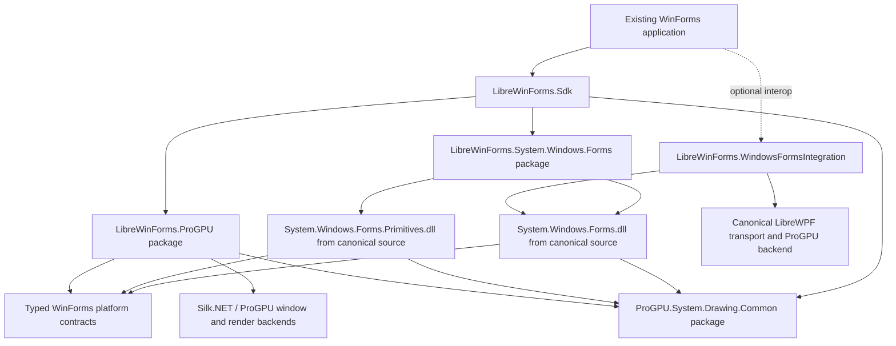

# Source-First Cross-Platform LibreWinForms Plan

## Decision

Remove `src/LibreWinForms.Portable` after its consumers, tests, and the few useful typed host contracts have moved to the source-first runtime.

The portable product must be built from the canonical WinForms sources already present in this repository:

- `src/System.Windows.Forms` produces the runtime assembly `System.Windows.Forms`;
- `src/System.Windows.Forms.Primitives` produces `System.Windows.Forms.Primitives`;
- the supporting Accessibility and private Windows assemblies are built from their canonical projects where they remain necessary;
- ProGPU's `System.Drawing.*` implementation supplies the portable drawing API and implementation;
- a new typed `LibreWinForms.ProGPU` backend supplies non-Windows windowing, input, composition, and local-OS services;
- `LibreWinForms.*` remains the public package branding, while framework assembly and namespace identities remain compatible with .NET WinForms.

This is the LibreWPF model applied to WinForms: modify the real managed framework implementation at explicit platform seams and package those assemblies. Do not grow a second WinForms-shaped object model.

The deletion is a cutover result, not the first migration step. Deleting the current directory before the canonical graph can build and run would discard working SharpDevelop coverage without producing a usable replacement.

## 2026-08-22 implementation checkpoint

The repository now has a shadow source-first build graph rather than only a design proposal:

- `external/ProGPU` is a real submodule pinned to a reviewed ProGPU source revision for this migration;
- `LibreWinFormsReferenceMode=Project` selects source projects for coordinated work, while the default package mode remains available for ordinary development;
- `LibreWinFormsUseProGpuSystemDrawing=true` builds the canonical `System.Windows.Forms.Primitives` and `System.Windows.Forms` projects against ProGPU's `System.Drawing.Common`, backend, scene, vector, and text projects;
- the opt-in restore graph excludes the repository's Microsoft drawing project, compiler resolution removes any stale Microsoft drawing reference, and the project-mode output gate copies the current submodule binary then rejects either a non-ProGPU strong-name token or a stale hash;
- the canonical sources use public `IDeviceContext`/`Graphics` APIs or explicit typed portable seams instead of private implementation probes;
- `packaging/LibreWinForms.System.Windows.Forms` now packs canonical implementation and reference assemblies under the existing package brand, declares ProGPU drawing as a dependency rather than embedding it, and is consumed from a fresh isolated NuGet cache by an ordinary `Form` subclass with warnings treated as errors;
- the ProGPU-backed build no longer inherits the upstream Windows-only assembly annotation, while the default Windows build retains it; and
- CI has a source-first shadow lane, and `eng/librewinforms-source-first.sh` keeps the canonical, ProGPU API/quality, and legacy comparison lanes visible together. The same lane packs, inspects, consumes, and uploads the canonical shadow package.

The verified source checkpoint `e181da7e32123d85807b32c93793a9b2b0dfcc31` pins ProGPU commit `bd1c836d04af5613c50f3d4dc846aabb38ff1574`, which extends the exact latest-main merge `142b1af7ca339e17cc0bf5dbee9fc2c20eacd6ef` with cross-font visible format-control representatives, mnemonic decoration, whole-line `LineLimit`, and slash-aware `EllipsisPath` behavior. The merge has exact parents `02096ecf9c99ba09d678dd7da3ad2bb6bc3457ac` (the advanced formatted-text source slice) and `ad05be151a8e844ccf0abe496a12b29124568e6b` (the current ProGPU `main`, versioned `0.1.0-preview.57`); every one of the 23 files brought in from that `main` advance was blob-hash verified against GitHub. Exact hosted validation passes the platform contracts (20/20), ProGPU host contracts (8/8), canonical lifecycle/retained-paint/input plus owned/nested-modal, multi-monitor, logical presentation-scale, and per-monitor-V2 DPI integration (7/7), and the complete ProGPU drawing quality suite (150/150). The hosted Linux lane provisions Mesa's software Vulkan adapter because those quality cases execute the production typed WebGPU recording/readback path. The canonical ProGPU-backed build remains at its reviewed 613-warning/zero-error baseline. Both the ordinary package-mode lane and the canonical source-first package/fresh-cache consumer lane pass. The canonical hosted package contains implementation/reference assets, declares `ProGPU.System.Drawing.Common` as a normal dependency, and does not embed ProGPU assemblies; the packed `System.Windows.Forms.dll` SHA-256 is `1ffde29684867c56440ca8c15a2a67a7e186184a65a44bbed86e09310f68e5ee`, the packed `LibreWinForms.Platform.dll` SHA-256 is `fe9e9f9c7d245d6628d855c72a4213dad35098b9d0d79cdeca6389af2c2f1c03`, and uploaded `canonical-source-first-package` artifact `9560747151` has SHA-256 digest `7882603226617485acf6bf43a8f38666f452b6a982ab45d696b431f65e3abc04`.

The current `CreateGraphics` source checkpoint `b9235eec56bf1a17b8d30e217f59c04e56ea9f76` pins ProGPU commit `4c958e64638d717417ce14e86ecbfc84786306c5`. Canonical portable `Control.CreateGraphics()` no longer calls `Graphics.FromHwnd`: it computes the control origin and ancestor-intersected client clip, then requests a normal `System.Drawing.Graphics` recorder through the typed paint service. A window recorder owns an isolated ProGPU `DrawingContext`, carries the target `WgpuContext` explicitly instead of relying on ambient thread state, and commits its retained commands exactly once when disposed. Worker-thread creation does not synchronously marshal to the UI thread; completion posts the finished command list for presentation. Presentation of those transient commands does not raise `OnPaint`, while the next ordinary invalidation clears and rebuilds the retained control tree, matching WinForms' nonpersistent `CreateGraphics` contract. Unparented logical controls receive a detached recorder for measurement and nonvisible drawing rather than a fake window object. Exact hosted workflow `32846039585` passes platform 20/20, ProGPU host 9/9, canonical lifecycle 8/8, ProGPU drawing 151/151, the unchanged 421-diagnostic API baseline with no breaking changes, the 613-warning/zero-error canonical ProGPU build, the 30-warning/zero-error source-project legacy comparison build, the ordinary package lane, and canonical pack/fresh-cache consumption. The hosted packed `System.Windows.Forms.dll` SHA-256 is `ea7d84f23b17b7a5774fb271a0c02bfb16d8d40be559402564e497444f2a0fc0`, the packed `LibreWinForms.Platform.dll` SHA-256 is `f772b8f59567ca2742240b2dda07a5aeb699655c23657aacba554b9f2cacafe6`, and canonical package artifact `9562683351` has SHA-256 digest `ceba0c0f602d5d41ee92fe0b7a368c4a6d3c935a02134b5d09a4192a6746182d`. ProGPU exact-head job `97794466158` passes the same 421-diagnostic gate, all 151 drawing tests, allocation gates, and benchmark capture; evidence artifact `9562334850` has SHA-256 digest `36bfe80243a65ecd1f8b97973b4244124917e7031863b529039a31aef7add557`.

The following synchronous-presentation candidate makes the existing portable `Control.Update()` route behaviorally meaningful. `ILibrePaintService.Present` and `ILibreWindow.PresentPendingPaint` now state that already-pending paint is processed on the owning dispatcher before returning and that a clean window is not implicitly invalidated. The ProGPU backend uses synchronous dispatcher marshaling when required and calls Silk.NET rendering immediately, with three bounded attempts for transient surface loss or timeout while preserving a queued retry if the surface remains unavailable. Ordinary `Invalidate` remains asynchronous and coalesced. The canonical headless gate proves that form and child paint callbacks finish before `Update()` returns and that a second clean `Update()` does not repaint; a direct ProGPU host case proves worker-thread completion on the dispatcher. Exact local Release shadow validation passes the default canonical build at zero warnings/errors, the ProGPU canonical build at 613 warnings/zero errors, platform 20/20, backend 10/10, lifecycle 8/8, drawing 151/151, the unchanged 421-diagnostic API gate with no breaking changes, and the frozen comparison build at 30 warnings/zero errors.

Release validation completed with zero errors for the default canonical `System.Windows.Forms` build, the ProGPU-backed canonical primitives build, and the ProGPU-backed canonical `System.Windows.Forms` build. The final canonical output's `System.Drawing.Common.dll` is byte-identical to the submodule build and the generated dependency manifest identifies `ProGPU.System.Drawing.Common`; build success alone is not accepted as payload evidence. ProGPU's pinned .NET 10.0.11 API gate passes its reviewed baseline at 55 missing types, 319 missing members, 47 other shape diagnostics, and 421 total diagnostics. The remaining count is tracked debt, not a parity claim. `Font`, `FontFamily`, and the complete managed font-collection group now use exact typed ProGPU catalog resolution, owned private file/memory faces, parsed OpenType metrics, canonical overload/base/interface shapes, independent snapshots, and explicit fallback identity rather than fabricated requested names over unrelated files. Warmed family metrics allocate zero bytes and the isolated ARM64 ShortRun median is 8.368 ns per read; HFONT/HDC/LOGFONT and native GDI pointer surfaces remain explicit Windows-adapter debt. Canonical image-recoloring paths now receive official `ColorMap`/`ImageAttributes` shapes and actually applied, defensively snapshotted remap/matrix state instead of silently ignored state; managed resolution, tag, frame, bounds, complete pixel/image-format identities, palette, property metadata, typed scan0 construction, caller-owned `LockBits`, packed/indexed/high-depth row conversion, functional `ConvertFormat` palette/alpha-threshold/dithering behavior, truthful managed codec discovery, owned encoder parameters, and functional PNG/BMP/JPEG saves with typed JPEG quality selection are present without GPU initialization, together with deterministic fixed and CPU-only optimal palette generation. The shared affine `Drawing2D.Matrix` contract now covers official composition, parallelogram, pivot, shear, inverse, point/vector, array/span, cloning, and lifecycle behavior while retaining the typed `Matrix3x2` renderer seam. The `Blend`, `ColorBlend`, and `LinearGradientBrush` group includes public ownership semantics, aspect-ratio-scaled angle construction, transforms, gamma/spread mapping, custom stops, and renderable falloff functions through the typed ProGPU vector brush. `HatchBrush` and all 53 official `HatchStyle` values now lower to immutable two-color 8x8 tile masks shared by managed composition, production WGSL, native scene construction, and archive serialization; lifecycle, negative-coordinate sampling, geometry/pixel parity, ownership, allocation, and performance gates cover the clean-room typed implementation, whose ARM64 ShortRun creation median is 12.172 ns at 64 B/op. The sealed `TextureBrush` group now includes every official constructor, independent image/attribute/clone ownership, mutable wrap and transform state, cropped and recolored snapshots, and exact tile/mirror/clamp pixels. Rectangle, ellipse, path, polygon, closed-curve, rounded-rectangle, and region fills share typed retained texture commands and clips with explicitly composed brush and graphics transforms; the four-tile record/release ShortRun median is 556.757 ns at 96 B/op. `GraphicsPath`, `PathData`, `PathPointType`, and `GraphicsPathIterator` now provide retained point/type construction, span export and iteration, shaped text outlines, cardinal curves, deep clone/composition, markers, analytic bounds, transforms, fill and outline hit-testing, widening, perspective/bilinear warping, reversal, and adaptive flattening without reflection or native GDI+ handles. Stroke expansion and path deformation are renderer-neutral typed `ProGPU.Vector` geometry with cap, join, miter, dash, homography, bilinear subdivision, transform, and flatness behavior. The canonical `Graphics` primitive group now adds 56 exact managed arc, Bézier, closed-curve, curve-range, rectangle/span, polygon fill-mode, pie, rounded-rectangle, and fill overloads. They lower through typed retained `GraphicsPath`/`ProGPU.Vector.PathGeometry` commands, preserve fill rules and validation, and remove transient arrays from span paths. Five focused command, fill-rule, pixel, validation, and warmed-allocation tests cover the slice; the ARM64 ShortRun `RecordCurveSpan` median is 209.644 ns at 792 B/op. The formatted-text group adds 16 exact string/span draw and measurement members and replaces prefix-width range approximation with shaped UTF-16 cluster regions across wrapped lines, alignment, clipping, and `NoClip`. Five focused span, cluster-range, validation-order, and allocation cases pass in-process; the ARM64 in-process ShortRun `MeasureSpan` median is 10.709 µs at 6,712 B/op. Text outlines reuse ProGPU's OpenType shaping, fallback, bidi/wrapping, style matching, and cached TrueType/CFF geometry through typed `ProGPU.Text.TextOutlineGeometry`; every performance-sensitive subsystem has allocation and BenchmarkDotNet gates.

The advanced formatted-text slices carry `StringFormat` direction, tab-stop, trailing-space, native-digit, no-font-fallback, visible format-control, mnemonic, line-limit, and path-trimming state through the same typed ProGPU text and retained-scene paths. Twelve additional focused cases raise the complete local drawing suite to 150/150 and the formatted-text focused class to 17/17. `DisplayFormatControl` proves that the preserved default ignorable records an outlined representative glyph: the typed shaper retains `.notdef` when it has geometry and otherwise selects an outlined square, dotted-circle, replacement, or question-mark glyph from the same face. `HotkeyPrefix.Show` records one brush-, transform-, clip-, face-, and cluster-aware underline and `Hide` only performs ampersand unescaping. A clipped default layout admits a partially visible final line, while `LineLimit` uses exact OpenType line metrics to retain only complete lines and report visible `charactersFitted`/`linesFilled` rather than shaping all source text and merely clipping it. `EllipsisPath` preserves as much of the final forward- or backslash-delimited segment as possible, then spends the remaining shaped width budget on the leading path; retained-tail mnemonics are remapped to their displayed cluster. The local API gate remains at the reviewed 55 missing types, 319 missing members, 47 other diagnostics, and 421 total with no stale or breaking suppressions. The post-LineLimit ARM64 .NET 10 in-process ShortRun recorded `MeasureSpan` at a 24.748 microsecond mean and 5.93 KB/op and `MeasureAdvancedFormatSpan` at a 7.525 microsecond mean and 4.96 KB/op; `MeasureEllipsisPathSpan` recorded an 88.79 microsecond mean and 70.02 KB/op under a 96 KB focused ceiling; the preceding mnemonic checkpoint recorded `RecordMnemonicString` at a 3.021 microsecond median and 2.02 KB/op. These three-iteration results are coarse managed-layout regression guards. Wrapped/vertical path trimming, vertical mnemonic decoration, and representative vertical/RTL pixel baselines remain explicit follow-up work.

This checkpoint intentionally does not delete `src/LibreWinForms.Portable`. The shadow package proves canonical payload and dependency selection, but the production SDK still selects the compatibility package. Runtime cutover still requires the remaining HDC/HRGN/HICON adapters, retained dirty-region/backing-store semantics, production SDK replacement, multi-dispatcher and real-platform modal coverage, representative control and input coverage, and SharpDevelop runtime gates. The compatibility lane is now a comparison and fallback lane; new generally useful APIs should land in canonical WinForms or ProGPU instead of expanding it.

The next runtime checkpoint has started with `src/LibreWinForms.Platform`, a small source-built contract assembly. It establishes a single-registration service set for dispatcher, timer, opaque typed handles, windows, normalized input, monitors, and paint scheduling. Its managed handle registry enforces kind/type-safe lookup and explicit release without exposing backend-native handles. The assembly contains no WinForms-shaped controls, runtime reflection, or ProGPU/Silk implementation types. Its runtime and reference assemblies are now required, hash-checked assets of the canonical source-first package.

`src/LibreWinForms.ProGPU` supplies the first concrete backend foundation. It includes an owning-thread dispatcher with nested loops and synchronous/asynchronous marshaling, dispatcher-delivered timers, typed Silk.NET top-level windows, ProGPU `SilkWindowController` integration, keyboard/text/pointer/focus normalization, close cancellation, explicit handle release, and dispatcher-safe coalesced paint scheduling. Silk keys are translated explicitly to the backend-neutral `LibreKey` contract instead of leaking Silk enum integers, and pointer/wheel events carry the current normalized keyboard modifiers. Each Silk window now owns a `WgpuContext`, `Compositor`, and retained `DrawingVisual`; it records typed paint frames and host-owned `CreateGraphics` sessions, acquires/reconfigures the WebGPU surface, and presents with bounded retry for transient surface loss/timeouts. The window contract now explicitly selects either 96-DPI logical managed coordinates with compositor scaling or managed device-pixel coordinates with a one-to-one compositor. DPI/content scale and framebuffer pixel scale are separate typed values: on Windows/X11 a 2x content scale can coexist with a 1x framebuffer ratio, while macOS/Wayland commonly report 2x for both. Logical conversion uses `framebufferScale / dpiScale`; device-pixel conversion uses only `framebufferScale`; font/layout autoscaling uses only DPI. The ProGPU adapter derives the live framebuffer ratio from window and framebuffer dimensions and obtains content DPI from the nearest typed GLFW monitor, with the existing native window fallback where supported. This prevents both Windows double-scaling and macOS under-scaling. Checked conversions reject invalid independent scales and coordinate modes. Headless tests cover registration, handle type/kind/lifetime rules, concurrent allocation, monitor selection, both Windows-style and macOS-style coordinate conversion, dispatch ordering, cross-thread send, cross-thread detached graphics creation, timer affinity, concrete service composition, and typed monitor mapping. Silk monitor enumeration uses the public windowing API, while the typed GLFW binding supplies monitor content scale and work area where GLFW is active. Scale falls back to the video-mode/bounds ratio and work area falls back to bounds when those backend calls are unavailable; compositor color depth remains explicitly reported as 32 bits. Framebuffer resize and monitor movement now distinguish content-DPI changes from framebuffer-only changes, preserve the selected logical or device-pixel size contract, notify canonical WinForms in stable order, and schedule a fresh retained frame. Real display-server presentation/input/monitor smokes on every target OS remain open.

The canonical lifecycle now selects those contracts under `LIBREWINFORMS_PORTABLE`. Canonical `Application.ThreadContext` and `WindowsFormsSynchronizationContext` use the registered dispatcher; `NativeWindow` maps top-level forms and logical child controls to opaque typed handles; and canonical `Control`/`Form` retain their public lifecycle while routing create, visibility, logical bounds in both directions, close, marshaled callbacks, invalidation/present scheduling, and destruction through the backend. Portable thread-affinity checks and managed window text no longer query KERNEL32/USER32. Portable bounds no longer query USER32 window-manager tracking metrics; canonical `MinimumSize`/`MaximumSize` constraints remain managed, while backend-native limits stay at the typed window boundary. Portable initialization no longer enters eager USER32/GDI DPI, message-registration, comctl32, or window-style paths.

Canonical ownership and modality now cross the same typed boundary. `ILibreWindow.Owner` maps only live opaque window handles to ProGPU's existing `SilkWindowController.SetParent`; invalid or self ownership is rejected without private-field discovery. A separate platform `Enabled` state lets `Application.ThreadWindows` suppress same-dispatcher owner and sibling input during modal loops without mutating the public managed `Control.Enabled` value. Nested modal loops snapshot and restore their immediate window set in order, cancel capture, preserve `DialogResult` and `Form.Modal`, derive implicit ownership from the active real top-level `Form`, and restore activation when each dialog exits. The portable path does not create a hidden Win32 taskbar-owner window or call `GetWindowLong`. Because themed common-control parts are not yet implemented, portable visual-style support reports false and the size grip follows the truthful classic managed path, drawn through ProGPU `Graphics` instead of an HDC.

Canonical `Screen` and the monitor-derived `SystemInformation` properties now use `ILibreMonitorService` in portable builds rather than USER32/GDI calls or fabricated `HMONITOR` values. The shared selection algorithm implements largest rectangular overlap and nearest-distance fallback, including points, negative coordinates, and empty-inventory failure. `AllScreens`, `PrimaryScreen`, working areas, device names, color depths, point/rectangle/control lookup, primary size, virtual desktop union, monitor count, and display-format comparison are connected. `Form.CenterToParent` and `CenterToScreen` use real managed owner bounds and the selected work area without `GetWindowLong`/`GetWindowRect`. A two-monitor canonical test covers a left-hand secondary monitor, distinct work areas/scales/color depths, system information, lookup, and both centering paths. The GLFW adapter now supplies real work area and content scale when available. Dynamic inventory change notification, non-GLFW work-area adapters, real monitor color-depth reporting, and a topology-aware mapping between native global monitor coordinates and device-pixel `Screen` coordinates on mixed-scale desktops remain work. Logical presentation mode deliberately keeps `DeviceDpi` at 96; opt-in `Application.SetHighDpiMode(PerMonitorV2)` selects device-pixel window/client coordinates instead.

### Mixed-scale global coordinate topology

[GLFW's window guide](https://www.glfw.org/docs/latest/window.html) deliberately distinguishes window/monitor screen-coordinate units from framebuffer pixels, and its [platform caveats](https://www.glfw.org/docs/latest/intro_guide.html#compat_guide) make those units platform-dependent: Windows and X11 keep screen coordinates one-to-one with pixels even when content DPI is greater than 1; Cocoa uses points and a separate backing-pixel scale; Wayland does not provide ordinary global window positioning. Therefore a correct global `Screen` device-pixel topology cannot be reconstructed by multiplying every monitor origin and size by its DPI. Doing that independently creates overlaps or gaps whenever adjacent monitors have different scales.

The proposed fix is a narrow typed desktop-coordinate adapter, not another WinForms object model:

1. keep the raw Silk/GLFW monitor rectangle for native window placement and nearest-native-monitor lookup;
2. obtain authoritative local display data from the OS adapter: Win32 physical desktop rectangles, or AppKit/[CoreGraphics global bounds](https://developer.apple.com/documentation/coregraphics/cgdisplaybounds%28_%3A%29) paired with backing mode/pixel extent; use compositor data where Wayland exposes it;
3. correlate native and local-pixel data by stable backend monitor identity and expose the pair through the monitor contract;
4. make the global-coordinate policy explicit per backend. Windows/X11 can retain native physical coordinates; Cocoa must preserve its authoritative point topology and apply backing conversion only to monitor-local offsets/sizes because no unique Windows-style global pixel origin exists; Wayland must report unsupported global placement where the compositor withholds it;
5. route canonical `Screen`, `SystemInformation.VirtualScreen`, startup placement, centering, and `Control.MousePosition` through that policy, while continuing to map client sizes and pointer coordinates with the live window framebuffer ratio; and
6. gate the implementation with left/right/above/negative-origin mixed-scale layouts plus real Windows, macOS, X11, and Wayland display-server smokes.

Until those local-OS pixel rectangles exist, the implementation keeps the internally consistent GLFW screen-coordinate topology and does not fabricate a pixel topology from DPI. This is an explicit remaining cutover gate: local window/client scaling is now correct, but mixed-scale global `Screen` device-pixel parity is not yet claimed.

A typed `ILibrePaintFrame` carries the normal `System.Drawing.Graphics` API without exposing ProGPU or Silk types. Canonical `Control` repaints the logical control tree back-to-front into a fresh retained frame, preserves per-control transforms and clips, and routes `OnPaintBackground`/`OnPaint` through the original `PaintEventArgs` and error-handling path. Portable opaque background fill uses ProGPU Graphics instead of the canonical GDI fast path. ProGPU `Graphics.FromProGpuDrawingContext` accepts explicit finite surface bounds so `VisibleClipBounds` behaves normally without an HDC or intermediate bitmap. ProGPU also resolves its packaged RID-specific `wgpu_native` asset before system-name fallback, preventing application startup from depending on an external loader-path override.

The GPU-independent headless integration gate calls unchanged `Application.Run(form)` and verifies ordered `HandleCreated`, `VisibleChanged`, asynchronously marshaled `Shown`, form and child layout, form bounds, full-client invalidation, synchronous pending-paint completion from `Update()`, no repaint from a clean `Update()`, both canonical Paint callbacks, clip and visible-surface bounds, exact retained solid-fill rectangles/RGBA values for the form and translated child, close cancellation/retry, `FormClosed`, and `HandleDestroyed` behavior, dispatcher termination, disposal, and zero leaked handles. It also verifies that canonical child `CreateGraphics()` exposes local visible bounds, records at the translated window location, commits on disposal, and does not commit a clip-only session; a separate nested-control case proves ancestor clipping without native HWND graphics. The gate drives normalized focus, pointer move/down/up/wheel, key down/text/key up, and focus loss through the real top-level `NativeWindow`; verifies logical child hit testing and client coordinates; and observes canonical `GotFocus`, mouse, click, wheel, `KeyDown`, `KeyPress`, `KeyUp`, and `LostFocus` events with portable `Focused`, `ContainsFocus`, `Capture`, `MouseButtons`, `MousePosition`, and `ModifierKeys` state. `ContainerControl.ActiveControl` focus activation now has a managed portable path rather than falling back to USER32. A second unchanged-API scenario covers non-modal and nested-modal ownership. A third validates monitor/screen/system-information and centering across two monitors. A fourth drives a 1x-to-2x logical presentation-scale change through the typed host, verifies full-surface invalidation, and proves that logical form bounds and virtualized 96-DPI `DeviceDpi` remain stable rather than double-scaling. A fifth opts into canonical `PerMonitorV2`, starts on a 2x monitor, verifies 192-DPI form/control autoscaling and device-pixel bounds, then drives a live 2x-to-1x transition and verifies `DpiChangedBeforeParent`, `Form.DpiChanged` with its suggested rectangle, `DpiChangedAfterParent`, 96-DPI bounds, and one repaint invalidation. The portable DPI path no longer exports unused `HFONT`/`HICON` handles or calls Win32 non-client geometry while doing this; those operations stay on the Windows build or await typed platform contracts. This proves the main-form lifecycle, initial canonical input crossing, same-dispatcher owned/nested-modal behavior, both logical and per-monitor-V2 scale routing, canonical paint frames, transient context-backed drawing, and dispatcher-synchronous pending-paint delivery on Linux without requiring a display adapter. Real framebuffer pixel validation remains part of the display-server presentation gate. Multi-dispatcher ownership, dynamic monitor inventory propagation, mixed-scale global monitor topology, system-aware/per-monitor-V1 semantics, region-aware dirty retention, typed window icon transport, real display presentation, representative stock-control rendering/input, keyboard command/dialog preprocessing, mnemonics/tab traversal, double-click/context-menu behavior, IME, and platform input/modal smokes are still required before Phase 3/4 exit.

The initial canonical crossing inventory makes the size of the next substitution explicit. `Control`, `Form`, `Application`, `Application.ThreadContext`, `Application.ComponentThreadContext`, and `NativeWindow` currently contain 246 direct `PInvoke`/User32/Kernel32 references (127, 73, 14, 14, 8, and 10 respectively). These counts are an implementation-routing inventory, not a claim that every occurrence needs a new service. Managed behavior stays in canonical source; related native operations are grouped at the focused service boundaries above.

## Why the current package is incomplete despite having the full source

The repository contains the upstream WinForms source tree, but the shipping portable package does not compile that tree. `src/LibreWinForms.Portable/LibreWinForms.System.Windows.Forms/LibreWinForms.System.Windows.Forms.csproj` compiles only its own `src/**/*.cs` files into an assembly named `System.Windows.Forms`. That compatibility source is approximately 26,000 lines and independently recreates part of the public object model.

The canonical project at `src/System.Windows.Forms/System.Windows.Forms.csproj` is a different build graph. It includes the complete upstream managed implementation, but it still assumes Windows in important dependencies and execution paths. In particular, `System.Windows.Forms.Primitives` currently references the repository's Win32-oriented `System.Drawing.Common` and `System.Private.Windows.GdiPlus` projects.

This explains the apparent contradiction:

1. The full source exists in the checkout.
2. The portable NuGet package builds another, much smaller source set.
3. Consumers see only the smaller assembly's API.
4. Adding missing properties to that compatibility assembly treats symptoms and increases the future deletion cost.

The companion [API compatibility gap analysis](api-compatibility-gap-analysis.md) records the measured consequences and proposed API-level fixes.

## Non-negotiable constraints

1. `System.Windows.Forms` and `WindowsFormsIntegration` remain runtime API identities. Consumers should not have to rename framework namespaces.
2. Public packages use `LibreWinForms.*` branding.
3. Upstream managed source is authoritative. Portable changes should be small platform substitutions that can be reviewed during upstream synchronization.
4. Runtime reflection, private-field scans, duck typing, and fake WinForms-shaped bridge objects are not product architecture.
5. Platform operations use narrow, typed contracts.
6. ProGPU `System.Drawing.*` is the portable drawing implementation. The Win32 GDI/GDI+ implementation remains available only to the Windows adapter when needed.
7. Standalone WinForms must not depend on WPF. WPF is involved only when an application explicitly uses `WindowsFormsIntegration`.
8. The Windows implementation must remain functional and should continue to use native Win32 semantics where that is the most compatible backend.
9. SharpDevelop is the initial integration driver, but no SharpDevelop-specific behavior belongs in the framework runtime.

## Target package and project graph



The drawing and backend arrows must not create a framework/backend assembly cycle. Use a small contract assembly or canonical-assembly contracts plus a registration point. The selected arrangement must permit the canonical WinForms assemblies to build without referencing the concrete ProGPU host.

### Proposed repository layout

```text
src/
  System.Windows.Forms/                 canonical upstream source plus portable seams
  System.Windows.Forms.Primitives/      canonical upstream source plus portable seams
  System.Private.Windows.Core/          shared or conditionally portable foundation
  System.Private.Windows.GdiPlus/       Windows-only implementation after portable decoupling
  LibreWinForms.Interop/                neutral typed contracts and DTOs, if a separate assembly is needed
  LibreWinForms.ProGPU/                 Silk.NET/ProGPU/local-OS backend
packaging/
  LibreWinForms.System.Windows.Forms/   package canonical outputs without changing assembly identities
  LibreWinForms.WindowsFormsIntegration/
  LibreWinForms.Sdk/
src/test/unit/
  System.Windows.Forms/                 canonical managed and API tests
  LibreWinForms.ProGPU.Tests/           backend contract and platform tests
src/test/integration/
  LibreWinForms.SdkSmoke/               unchanged-app and package-cache tests
```

`LibreWinForms.Interop` is optional as a physical assembly. It is justified only if it is needed to avoid a dependency cycle or to share backend-neutral handle/event DTOs. It must not contain public control substitutes.

## Assembly and package rules

| Concern | Required result |
| --- | --- |
| Package identity | `LibreWinForms.System.Windows.Forms` |
| Primary runtime assembly | canonical `System.Windows.Forms.dll` |
| Namespace identity | `System.Windows.Forms` |
| Reference assembly | generated from the canonical public surface |
| Strong name and version | compatible and verified against the selected .NET WinForms contract |
| Portable drawing | `ProGPU.System.Drawing.Common` and its `System.Drawing` facade strategy |
| Platform implementation | `LibreWinForms.ProGPU`, selected by SDK bootstrap or explicit host registration |
| Windows implementation | typed Win32 adapter using existing native paths |
| WPF interop | optional package, never required by standalone WinForms |

The packaging project should collect canonical project outputs. Do not turn the canonical project into another compatibility-package project, because keeping upstream build files close to upstream makes synchronization safer.

## Platform architecture

### Preserve the managed WinForms model

The following logic should continue to come from the canonical source wherever possible:

- control collections, layout, anchoring, docking, scaling, and validation;
- events, focus negotiation, command keys, mnemonics, and dialog behavior;
- data binding, currency management, component models, and property descriptors;
- `ToolStrip`, menus, `DataGridView`, tree/list models, and common control behavior;
- application contexts, form ownership, modal state, and thread contexts;
- designer, CodeDOM, resource, serialization, and design-time contracts;
- accessibility object models and automation peers above the OS provider seam.

Only operations that cross into a window system, OS service, or drawing implementation should be abstracted.

### Typed service families

Use focused interfaces rather than one unbounded platform object. LibreWPF's service model is a useful pattern, but WinForms contracts should reflect WinForms semantics.

| Service family | Responsibilities |
| --- | --- |
| application/thread | message loop, nested modal loop, work wake-up, thread context, shutdown |
| windowing | top-level creation, bounds, state, ownership, activation, visibility, decorations |
| handles | native/opaque handle allocation, typed lookup, lifetime, parent/owner relationships |
| input | keyboard, text/IME, pointer, wheel, focus, capture, command routing |
| dispatcher/timer | posts, sends, idle notification, WinForms timers, synchronization context |
| monitor/system | monitors, work areas, DPI, theme, colors, metrics, power/session settings |
| painting | invalidation, clip, paint scheduling, backing surfaces, present/composition |
| graphics | `CreateGraphics`, buffered graphics, text, image, region, cursor/icon interop |
| popup/menu | popup placement, menu loops, tooltips, context menus, capture dismissal |
| clipboard/dialog | clipboard formats, message/file/folder/color/font dialogs |
| drag/drop | typed data-object exchange, effects, enter/over/drop, local OS bridge |
| printing | printer enumeration, settings, print targets, preview, platform fallback |
| accessibility | UI Automation/AT-SPI/NSAccessibility provider connection |
| launcher | URI/file/process launch with explicit result and error semantics |

Contract implementations may be split by operating system, but the canonical managed code should select services through a stable registration/lookup mechanism. Unsupported capabilities should fail at the operation boundary with a documented exception or result; they must not remove the public API.

### Handle semantics

WinForms exposes `IntPtr Handle` and assumes handle identity in many internal algorithms. On Windows, the value remains the actual HWND. On non-Windows:

- allocate an opaque, process-local token for every object that requires WinForms handle identity;
- resolve it through a typed registry to a window, logical child, menu, or graphics target;
- never pass the token to Win32 APIs;
- distinguish opaque tokens from real native handles in internal types;
- preserve create/destroy ordering and handle-recreation notifications;
- expose actual Silk/native handles only through backend-internal typed structures.

Top-level forms and independent popups receive real platform windows or surfaces. Most child controls remain managed logical nodes rendered into a composited ProGPU surface. This matches WinForms' managed control model without requiring each child to masquerade as a native HWND on every OS.

### ProGPU `System.Drawing.*`

For the portable build:

1. Replace `System.Windows.Forms.Primitives`' direct reference to the repository `System.Drawing.Common` project with the source/project form of ProGPU `System.Drawing.Common`.
2. Remove the portable dependency on `System.Private.Windows.GdiPlus` after auditing and replacing every call site. Keep it in the Windows graph when native GDI+ behavior is required.
3. Route `Control.CreateGraphics`, paint-event `Graphics`, `BufferedGraphics`, `TextRenderer`, `ControlPaint`, image lists, icons/cursors, regions, and printing surfaces through ProGPU drawing primitives.
4. Ensure the SDK removes conflicting platform `System.Drawing.Common` references and resolves a single facade/type identity.
5. Add API compatibility gates for ProGPU `System.Drawing.Common`; WinForms compilation must not be used as the only drawing-coverage test.
6. Put missing generally useful drawing behavior in ProGPU, not private copies inside WinForms.

The portable graph must fail the build when both Microsoft/Win32 and ProGPU implementations of the same `System.Drawing` identity can be selected.

### WindowsFormsIntegration

The current portable `WindowsFormsIntegration` project combines WPF hosting, application hosting, input translation, and extensive control-specific drawing. Split those responsibilities:

- generic WinForms lifecycle, window, input, and painting behavior moves to canonical WinForms seams plus `LibreWinForms.ProGPU`;
- the WPF `WindowsFormsHost` behavior is based on the canonical LibreWPF `WindowsFormsIntegration` source and references the canonical WinForms assemblies;
- a small typed interop contract coordinates focus, airspace/surface composition, drag/drop, and property mapping;
- standalone WinForms applications never construct a WPF host;
- per-control drawing in `WindowsFormsHost` is removed as canonical controls gain their own normal paint paths.

This work requires a coordinated LibreWPF change, but the LibreWinForms package must not retain a duplicate framework implementation merely to avoid that coordination.

## Migration map for `src/LibreWinForms.Portable`

| Current content | Disposition |
| --- | --- |
| `LibreWinForms.System.Windows.Forms/src` | Delete after cutover. Port only useful typed seams and verified behavior; do not copy the compatibility object model. |
| application/thread/timer/dispatcher host interfaces | Rework into the typed canonical platform contract layer. Remove WPF-specific assumptions. |
| paint, drag/drop, coordinate, dialog, and window host interfaces | Split into focused backend-neutral contracts; implement in `LibreWinForms.ProGPU`. |
| `LibreWinForms.WindowsFormsIntegration` | Replace with canonical WFI source plus a thin typed LibreWPF/WinForms interop adapter. |
| `LibreWinForms.Sdk` | Move to `packaging/LibreWinForms.Sdk` and retarget it to canonical transport, ProGPU backend, and ProGPU drawing. |
| `LibreWinForms.System.Windows.Forms.Tests` | Move API/managed behavior tests to canonical unit suites; move backend tests to `LibreWinForms.ProGPU.Tests`. |
| `LibreWinForms.SdkSmoke` | Move to `src/test/integration/LibreWinForms.SdkSmoke`. Keep its unchanged-app and SharpDevelop scenarios. |
| portable `Directory.Build.*` files | Delete when their remaining settings have moved to normal repository infrastructure. |

Every migrated test must first be classified as one of:

- a standard WinForms contract test that should pass against canonical source;
- a backend-neutral platform contract test;
- a ProGPU/Silk.NET implementation test;
- a WPF interop test;
- a compatibility-only behavior that should be deleted rather than preserved.

## Staged execution plan

### Phase 0: freeze the compatibility lane and establish gates

- Declare this document the target architecture.
- Permit only critical fixes in `src/LibreWinForms.Portable`; do not add new public API implementations there.
- Check in the official `System.Windows.Forms` and `System.Drawing.Common` reference contracts used by ApiCompat, or make their acquisition deterministic.
- Run ApiCompat on every relevant build and publish machine-readable reports.
- Inventory Win32, COM/OLE, GDI/GDI+, User32, common-control, and registry call sites in canonical projects.
- Classify each call site as managed logic, portable service, Windows adapter, or unsupported capability.
- Record upstream commit provenance for every canonical source subtree.

Exit: no new compatibility surface can merge without an explicit exception, and the baseline reports are reproducible in CI.

### Phase 1: create the shadow source-first graph

- Add `LibreWinForms.ProGPU` and the minimal typed contract project, if required.
- Add a canonical-output packaging project for `LibreWinForms.System.Windows.Forms`.
- Move the SDK and smoke project out of `src/LibreWinForms.Portable` without yet switching production consumers.
- Add a validation graph, similar to LibreWPF's managed transport graph, with deterministic restore/build order.
- Build both the existing compatibility lane and the new source-first lane in CI.
- Ensure the source-first package contains the canonical assembly, reference assembly, symbols, and XML documentation.

Exit: the shadow package can be packed and inspected, even if some portable runtime operations still throw at typed boundaries.

### Phase 2: make the canonical assembly graph compile cross-platform

- Condition the XP theme manifest and other Windows-only build assets.
- Remove unconditional Win32 build dependencies from the portable configuration.
- Introduce the ProGPU drawing references and single-facade resolution.
- Make `System.Private.Windows.Core` and `System.Windows.Forms.Primitives` compile with portable service contracts.
- Isolate CsWin32-generated code into Windows-only items or adapters.
- Preserve the complete canonical public surface and generated reference assembly.
- Use explicit `#if` only at adapter/build edges; avoid spreading OS checks through managed control logic.

Exit: canonical `System.Windows.Forms` and its supporting graph compile and pass API shape checks on Windows, Linux, and macOS build agents.

### Phase 3: application, handle, window, and loop foundation

Current status: the unchanged main-form run/show/bounds/invalidate/close/shutdown path and same-dispatcher non-modal ownership plus nested modal loops are implemented and headless-tested through canonical source. Production Silk execution, multi-dispatcher ownership, modal focus/activation platform matrices, idle/exception coverage, and full operating-system validation remain open.

- Port `Application`, `ApplicationContext`, `ThreadContext`, `WindowsFormsSynchronizationContext`, `NativeWindow`, `Control`, `ContainerControl`, and `Form` through typed services.
- Implement opaque non-Windows handle allocation and lifecycle.
- Implement the Silk.NET top-level window host and ProGPU surface ownership.
- Implement dispatcher wake-up, idle, timers, nested modal loops, shutdown, and exception flow.
- Keep the existing Win32 behavior behind the Windows adapter.

Exit: an unchanged application can call `Application.Run(new Form())`, show/close owned and modal forms, and terminate cleanly on all three desktop operating systems.

### Phase 4: rendering and input foundation

Current status: canonical full-client and rectangular invalidation translate logical child coordinates to the top-level window and reach the typed paint scheduler; `Update()` synchronously flushes already-pending paint on the owning dispatcher without invalidating a clean window. The backend now owns a real ProGPU/WebGPU window surface and canonical `PaintEventArgs.Graphics` records form and logical-child painting into a retained frame with scale-aware presentation. Canonical `Control.CreateGraphics()` uses an ancestor-clipped, host-owned ProGPU recording session; disposal commits transient commands without `OnPaint`, and the next invalidation replaces them. The GPU-independent headless gate checks exact form, child-paint, and transient-graphics coordinates and RGBA values. A backend-neutral `LibreKey` contract and managed canonical dispatcher now cover initial focus, logical-tree pointer hit testing, capture/button/modifier state, move/down/up/click/wheel events, and key down/text/key up events. Typed monitor enumeration/selection, GLFW work-area/content-scale queries, canonical `Screen`, monitor-derived `SystemInformation`, form centering, framebuffer-resize repaint, and logical presentation-scale transitions are connected and headless-tested. Dynamic monitor inventory changes, canonical device-pixel DPI autoscaling, remaining system metrics, region invalidation, retained dirty-region/backing-store semantics, stock-control HDC substitutions, real display-server/pixel/input smokes, and the advanced input cases below remain open.

- Connect invalidation, layout-to-paint scheduling, clipping, backing stores, and presentation.
- Keep `PaintEventArgs.Graphics`, `CreateGraphics`, and synchronous `Update()` presentation on ProGPU `System.Drawing`; extend the retained surface with region-aware dirty preservation.
- Port text measurement/rendering, images, icons, cursors, regions, double buffering, and transparency behavior.
- Extend the initial keyboard/text/pointer/wheel/focus/capture bridge with IME composition, horizontal wheel, double-click/context-menu behavior, capture-loss cleanup, and real backend event smokes.
- Route command keys, dialog keys, tab navigation, mnemonics, and UI cues through portable-safe canonical preprocessing.
- Implement monitor, DPI, scaling, theme, and system metric services.
- Add golden-image tests only where semantic tests cannot express the requirement.

Exit: representative canonical controls render and accept input in a standalone WinForms window without WPF.

### Phase 5: controls and OS service waves

Port by dependency wave, not by copying current compatibility implementations:

1. base controls, labels, buttons, text, scrolling, panels, and containers;
2. menus, `ToolStrip`, context menus, popups, tooltips, and combo/list dropdowns;
3. tree/list/tab/image-list and common-control managed models;
4. data binding, grids, `DataGridView`, and property browsing;
5. clipboard, dialogs, launcher, drag/drop, and data formats;
6. printing and print preview;
7. accessibility providers for Windows UIA, Linux AT-SPI, and macOS accessibility.

Each wave must add contract tests, ProGPU backend tests, and unchanged application smokes before the next wave becomes release-critical.

Exit: the documented supported control and service matrix passes on all target systems, and unsupported operations preserve API presence with explicit behavior.

### Phase 6: designer, resources, and optional WPF interop

- Enable canonical ResX, CodeDOM, design host, serialization, toolbox, selection, and property-grid source.
- Preserve current SharpDevelop designer scenarios as regression tests against the canonical assembly.
- Replace the current portable WFI assembly with the canonical LibreWPF WFI source and thin interop adapter.
- Validate focus traversal, scaling, drag/drop, property mapping, and composition across WPF/WinForms boundaries.
- Remove control-specific WPF rendering fallbacks as canonical WinForms painting becomes authoritative.

Exit: SharpDevelop builds, launches, loads/saves a real WinForms design surface, edits resources, and exercises hosted WinForms controls through canonical assemblies.

### Phase 7: SDK and package cutover

- Change `LibreWinForms.Sdk` to select the canonical transport package, `LibreWinForms.ProGPU`, and ProGPU drawing.
- Remove all SDK references to projects under `src/LibreWinForms.Portable`.
- Generate or include a bootstrap that registers exactly one backend before WinForms application startup.
- Validate direct package references as well as SDK-based consumption.
- Test from an empty NuGet cache and inspect `project.assets.json` for drawing or framework conflicts.
- Publish a preview whose release notes explicitly identify the source-first runtime transition.

Exit: current smoke applications and SharpDevelop consume no compatibility assembly while retaining the expected package names and runtime type identities.

### Phase 8: delete `src/LibreWinForms.Portable`

Delete the entire directory in one focused change only after all deletion gates below pass. The same change should remove obsolete aliases, suppression files, build conditions, workflow branches, and documentation that describes the compatibility assembly as the active runtime.

Exit: repository builds, tests, packs, and runs without the directory in a clean checkout.

### Phase 9: harden upstream synchronization

- Keep portable changes concentrated in named partials, adapters, and narrowly edited call sites.
- Add an upstream synchronization report that distinguishes source imports from LibreWinForms modifications.
- Rebase ApiCompat contracts for each supported .NET release deliberately.
- Run Windows-native regression suites as well as cross-platform suites on every source update.
- Track temporary unsupported operations as capability issues, never by deleting public members.

## Deletion gates

All gates are required before removing `src/LibreWinForms.Portable`:

- [x] The shadow `LibreWinForms.System.Windows.Forms` package contains the byte-verified `System.Windows.Forms.dll` produced from `src/System.Windows.Forms` canonical source. Production SDK selection remains gated below.
- [ ] No build, package, workflow, test, or application project references `src/LibreWinForms.Portable`.
- [ ] No duplicate public `System.Windows.Forms` type definitions remain outside canonical sources.
- [ ] ApiCompat reports zero missing types and members against the selected official WinForms contract.
- [ ] API shape diagnostics are zero or have reviewed, time-bounded exceptions.
- [ ] ProGPU `System.Drawing.Common` passes its independent public API and WinForms-required behavior gates.
- [ ] A fresh-cache SDK smoke builds and runs an unchanged `Application.Run(new Form())` application.
- [ ] Windows, Linux, and macOS CI exercise window lifecycle, painting, input, timers, popups, dialogs, and shutdown.
- [ ] The Windows adapter passes upstream/native regression coverage.
- [ ] Standalone WinForms has no runtime dependency on LibreWPF.
- [ ] Optional `WindowsFormsIntegration` uses canonical WinForms and canonical LibreWPF assemblies.
- [ ] SharpDevelop build, workbench, FormsDesigner, ResX, menu/popup, property grid, and shutdown gates pass.
- [ ] Reflection/private-field/duck-probe audits pass.
- [ ] Assembly name, public key, version, type forwarding, and facade resolution tests pass.
- [ ] `rg -n "LibreWinForms\.Portable" --glob '!docs/**' .` returns no product references.
- [ ] All retained portable tests have a named destination and run from that destination.

## CI lanes

| Lane | Purpose |
| --- | --- |
| canonical build | build the real WinForms graph on Windows, Linux, and macOS |
| API compatibility | compare WinForms and ProGPU drawing outputs to official contracts |
| Windows regression | protect existing native Win32/GDI behavior |
| ProGPU backend | headless contract tests plus platform window/render/input tests |
| package identity | inspect assemblies, reference assemblies, strong names, and dependency closure |
| fresh-cache SDK | prove no local artifacts or framework references mask package errors |
| unchanged samples | compile and run ordinary `System.Windows.Forms` source |
| SharpDevelop | integration, designer, resources, menus, hosting, and clean shutdown |
| architecture audit | reject duplicate framework types, runtime reflection, and unapproved native calls |

## Proposed first implementation slice

The first pull request should establish structure rather than attempt to port every control:

1. Add `packaging/LibreWinForms.System.Windows.Forms` that packs canonical build outputs under the existing package identity.
2. Add the portable build property/configuration to the canonical graph.
3. Add a minimal typed platform registry and contracts for dispatcher, timer, window, handle, input, monitor, and paint services.
4. Add `src/LibreWinForms.ProGPU` with bootstrap and deliberately incomplete implementations that fail at typed operation boundaries.
5. Reference ProGPU `System.Drawing.Common` in the portable configuration and detect facade conflicts.
6. Make the canonical graph compile far enough to produce a complete reference assembly and ApiCompat report.
7. Move `LibreWinForms.Sdk` and the SDK smoke to their target directories without switching the default runtime.
8. Add the dual-lane CI graph and artifact inspection.

This slice creates the route to the destination while leaving the existing SharpDevelop lane available for comparison. The second slice should implement `Application`/`Form` lifecycle and show an empty standalone form; only then should control rendering migration begin.

## Implementation checkpoint: source and drawing gates

The first implementation checkpoint establishes these repository-owned paths:

- `external/ProGPU` tracks ProGPU `main` as an explicit submodule;
- `LibreWinFormsReferenceMode=Project` resolves drawing and ProGPU interop projects through `LibreWinFormsProGpuSourceRoot`, which selects the submodule by default and retains the historical sibling-checkout fallback;
- normal SDK consumers still default to `LibreWinFormsReferenceMode=Package`;
- `System.Windows.Forms.Primitives` has an opt-in `LibreWinFormsUseProGpuSystemDrawing=true` project edge that removes the repository Win32 `System.Drawing.Common` and `System.Private.Windows.GdiPlus` references and selects the ProGPU drawing project;
- `eng/librewinforms-source-first.sh` builds the canonical WinForms graph, runs the ProGPU drawing API/quality gate, and builds the current comparison lane from submodule source; and
- CI runs this source/submodule validation separately from the immutable package lane.

The canonical graph currently builds successfully on Linux with its existing Windows drawing dependency. The ProGPU substitution remains opt-in until the pinned drawing contract is sufficiently complete to compile the canonical consumers. This is an explicit, measurable dependency rather than a reason to add more compatibility controls.

## Proposed fixes for the missing-property problem

The permanent fix is not to manually add thousands of properties to the compatibility source. Apply these fixes in order:

1. Pack the canonical reference and implementation assemblies so the complete upstream public surface exists automatically.
2. Convert Windows-dependent property implementations to call typed platform services while leaving their signatures, attributes, defaults, and serialization metadata intact.
3. Use explicit unsupported behavior only when the underlying operation is not implemented; never omit the property or type.
4. Run API comparison against the official contract at build time, not as a release-time report.
5. Add behavior tests for high-risk properties: handle creation, parent/owner, bounds, DPI, font, colors, cursor, visibility, enabled state, data binding, layout, accessibility, and designer serialization.
6. Close missing ProGPU drawing APIs in ProGPU so canonical WinForms code can stay unchanged.
7. Delete compatibility implementations after their behavioral tests pass against canonical source.

## Major risks and controls

| Risk | Control |
| --- | --- |
| Canonical source compiles but assumes HWND message behavior | handle/message contract tests, opaque registry, and explicit Windows/non-Windows adapters |
| ProGPU drawing has the namespace but not required behavior | independent ApiCompat, rendering semantics tests, and WinForms call-site inventory |
| Drawing facade or strong-name conflict loads two type identities | package-closure validation and an SDK build error on ambiguous providers |
| Scattered OS conditions make upstream sync unmaintainable | adapter-edge conditions, portable partials, and a source-delta report |
| Native common controls have no cross-platform equivalent | preserve managed models and render equivalents through ProGPU; isolate Windows native acceleration |
| Modal loops, focus, capture, and popup dismissal regress | state-machine tests plus real platform input smokes |
| WPF hosting becomes the de facto standalone runtime | standalone samples must run without LibreWPF in the dependency graph |
| Cross-repository LibreWPF/ProGPU versions drift | one version manifest, coherent preview bundles, and fresh-cache restore tests |
| Designer/COM/OLE/accessibility/printing delay deletion | capability matrix, explicit owners, and separate gated waves rather than hidden shims |
| Performance regresses under managed composition | invalidation benchmarks, frame/copy counters, input latency tests, and native profiling |

## Definition of done

LibreWinForms is source-first when an ordinary WinForms application compiles against the canonical public API, loads a source-built `System.Windows.Forms.dll`, uses ProGPU `System.Drawing.*` and a typed ProGPU/Silk.NET platform backend on non-Windows, preserves native Win32 behavior on Windows, and does not depend on any copied compatibility implementation under `src/LibreWinForms.Portable`.

At that point, missing framework members are upstream synchronization or API-gate failures—not features to be rediscovered and reimplemented one property at a time.
